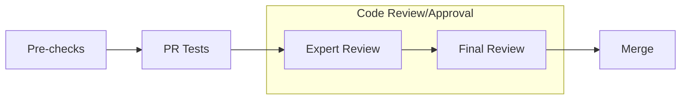

# What does this PR do ?
<!-- Add a one line overview of what this PR aims to accomplish. -->

:warning: For major changes (either in lines of code or in its impact), please make sure to first share discuss a design-doc with the team.  

## Contribution process

### Pre-checks

- [ ] I want this PR in a versioned release and have added the appropriate Milestone (e.g., `Core 0.8`)
- [ ] I have added relevant unit tests
- [ ] I have added relevant functional tests
- [ ] I have added proper typing to my code [Typing guidelines](https://docs.python.org/3/library/typing.html)
- [ ] I have added relevant documentation
- [ ] I have run the [autoformatter.sh](https://github.com/NVIDIA/Megatron-LM/blob/main/tools/autoformat.sh) on my PR

### Code review

The following process is enforced via the CODEOWNERS file for changes into `megatron/core`. For changes outside of `megatron/core`, it is up to the PR author whether or not to tag the Final Reviewer team.

For MRs into `main` branch

#### (Step 1): Add PR label `Expert Review`

#### (Step 2): Collect the expert reviewers reviews

1. Attach the `Expert Review` label when your PR is ready for review.
2. GitHub auto-assigns expert reviewers based on your changes. They will get notified and pick up your PR soon.

:warning: Only proceed to the next step once all reviewers have approved, merge-conflict are resolved and the CI is passing.  
Final Review might get declined if these requirements are not fulfilled.

#### (Step 3): Final Review

1. Add `Final Review` label
2. GitHub auto-assigns final reviewers based on your changes. They will get notified and pick up your PR soon.

#### (Optional Step 4): Cherry-pick into release branch

If this PR also needs to be merged into `core_r*` release branches, after this PR has been merged, select `Cherry-pick` to open a new PR into the release branch.

For MRs into `dev` branch

The proposed review process for `dev` branch is under active discussion.

MRs are mergable after one approval by either `eharper@nvidia.com` or `zijiey@nvidia.com`.

### Merging your PR

Any member of [core-adlr](https://github.com/orgs/teams/NVIDIA/core-adlr) and [`core-nemo`](https://github.com/orgs/teams/NVIDIA/core-nemo) will be able to merge your PR.
