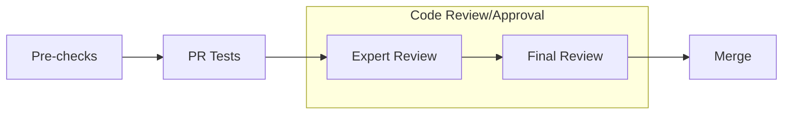

# What does this PR do ?
<!-- Add a one line overview of what this PR aims to accomplish. -->

:warning: For major changes (either in lines of code or in its impact), please make sure to first share discuss a design-doc with the team.  

## Contribution process

### Pre-checks

- [ ] I want this PR in a versioned release and have added the appropriate Milestone (e.g., `Core 0.8`)
- [ ] I have added relevant unit tests [Unittest guidelines](https://adlr.gitlab-master-pages.nvidia.com/megatron-lm-wiki/testing_guide/unit_tests/)
- [ ] I have added relevant functional tests [CI Test guidelines](https://adlr.gitlab-master-pages.nvidia.com/megatron-lm-wiki/testing_guide/functional_tests/)
- [ ] I have added proper typing to my code [Typing guidelines](https://docs.python.org/3/library/typing.html)
- [ ] I have added relevant documentation [Documentation guidelines](https://adlr.gitlab-master-pages.nvidia.com/megatron-lm-wiki/documentation_guide/)
- [ ] I have run the [autoformatter.sh](https://adlr.gitlab-master-pages.nvidia.com/megatron-lm-wiki/testing_guide/formatting/#autoformattersh) on my PR

### Code review

For MRs into `main` branch

#### (Step 1): Add PR label `Expert Review`

#### (Step 2): Assign expert reviewers

Assign the expert reviewers that correspond to the areas the PR touches (if no match, assign someone from `DEFAULT`):

- Model:
  - [ ] Bert: `aot@nvidia.com`  
  - [ ] GPT: `ksanthanam@nvidia.com`
  - [ ] MoE: `akhattar@nvidia.com`, `vkorthikanti@nvidia.com`, `ykarnati@nvidia.com`, `shiqingf@nvidia.com`, `xiny@nvidia.com`, `zijiey@nvidia.com`
  - [ ] Multimodal: `trintamaki@nvidia.com`
  - [ ] Retro: `lmcafee@nvidia.com`
  - [ ] T5: `huvu@nvidia.com`
- Distributed:
  - [ ] Distributed Checkpointing: `skierat@nvidia.com`, `mblaz@nvidia.com`, `dpykhtar@nvidia.com`
  - [ ] Distributed optimizer: `slym@nvidia.com`
- [ ] Inference: `vkorthikanti@nvidia.com`
- [ ] Quantization and Inference (QAT): `chenhany@nvidia.com`
- Parallelism:
  - [ ] Context Parallelism: `boxiangw@nvidia.com`, `xren@nvidia.com`
  - [ ] Pipeline Parallelism: `xren@nvidia.com`  
- Transformer: `ksanthanam@nvidia.com`
- Post-training: `chenhany@nvidia.com`, `aanoosheh@nvidia.com`, `kmorabia@nvidia.com`
- [ ] Datasets: `jkamalu@nvidia.com`
- [ ] Tests:  okoenig, donghyukc, pagaray, chtruong
- [ ] __DEFAULT__: shanmugamr jcasper eharper okoenig

:warning: Only proceed to the next step once all reviewers have approved, merge-conflict are resolved and the CI is passing.  
Final Review might get declined if these requirements are not fulfilled.

#### (Step 3): Final Review

1. Add `Final Review` label
2. Assign

- ADLR: `jcasper@nvidia.com` || `dnarayanan@nvidia.com` || `vkorthikanti@nvidia.com`
- NeMo: `eharper@nvidia.com` || `shanmugamr@nvidia.com` || `ansubramania@nvidia.com` || `yuya@nvidia.com`

#### (Optional Step 4): Cherry-pick into release branch

If this PR also needs to be merged into `core_r*` release branches, after this PR has been merged, select `Cherry-pick` to open a new PR into the release branch.

For MRs into `dev` branch

The proposed review process for `dev` branch is under active discussion.

MRs are mergable after one approval by either `eharper@nvidia.com` or `zijiey@nvidia.com`.

