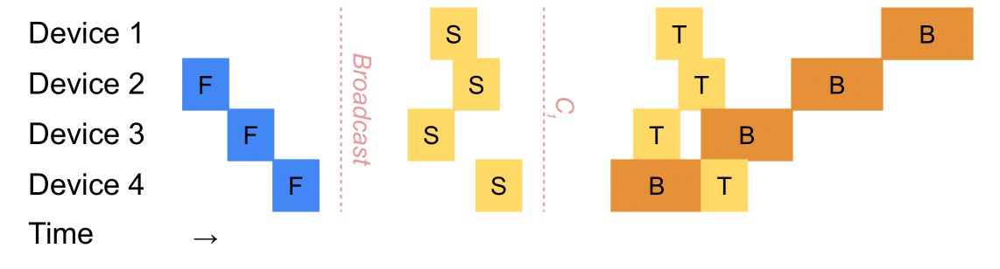
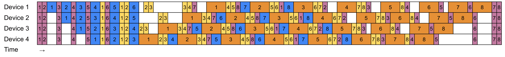
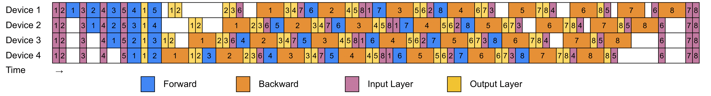
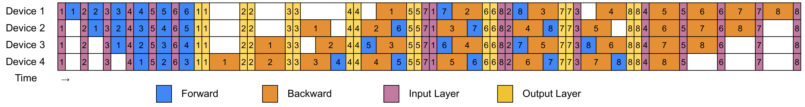
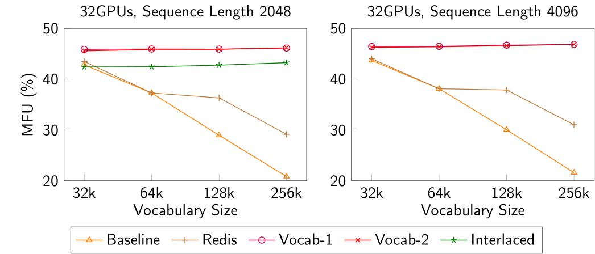
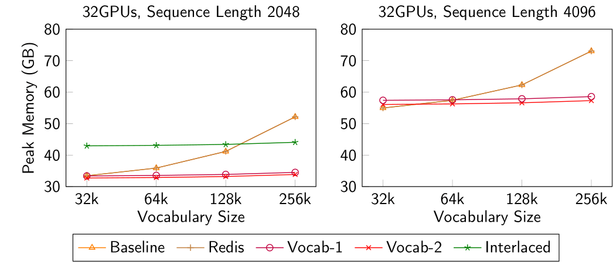

This repository is a fork of [Megatron-LM](https://github.com/NVIDIA/Megatron-LM/). The original README can be found [here](https://github.com/sail-sg/zero-bubble-pipeline-parallelism/blob/main/Megatron.md).

# Balancing Pipeline Parallelism with Vocabulary Parallelism

Vocabulary Parallelism is a novel technique that balances the computation and memory in pipeline parallelism.

Check out our paper at [arxiv (TODO)]().

**Quick Start**

Run `pretrain_gpt.sh` with `VOCAB_PARALLEL=1`. This script comes with a dataset with varying vocabulary sizes of 32k, 64k, 128k and 256k. Change the vocabulary size by setting `VOCAB_SIZE` to either `32k`, `64k`, `128k` or `256k`.

Alternatively, include the argument `--enable-vocab-parallel` when training with the GPT model. Vocabulary Parallelism is not yet supported for the other models.

## Methodology

Vocabulary Parallelism partitions the vocabulary layers evenly across pipeline devices and group the computation into two pipeline passes $S$ and $T$. We handle the all-reduce communication barriers $C_0$ and $C_1$ in separate streams to overlap with transformer layer computation.

## Schedules

We propose a generalizable method to integrate Vocabulary Parallelism with existing pipeline schedules. This repository supports Vocabulary Parallelism with non-interleaved 1F1B, with the following two variations:

- Vocabulary Parallelism with 1 all-reduce communication barrier (default)
  

- Vocabulary Parallelism with 2 all-reduce communication barriers (enable using `--disable-fb-fusion`)
  

An implementation of Vocabulary Parallelism on the *V-Half* schedule can be found at [this branch of the Zero Bubble Pipeline Parallelism repository](https://github.com/sail-sg/zero-bubble-pipeline-parallelism/tree/v-half-vocab).

For comparison, we also implement the interlaced pipeline ([Lin et al., 2024](https://www.usenix.org/conference/osdi24/presentation/lin-zhiqi)) which uses a tensor parallel style to handle the vocabulary layers.

- Interlaced Pipeline (enable using `--use-interlaced-schedule`)
  

**Comparison of Schedules**

|   | 1F1B | Vocab-1 | Vocab-2 | Interlaced |
| - | ---- | ------- | ------- | ---------- |
| Bubble Rate | $B$ | $B$ | $B$ | $B$ |
| Activation Memory (number of microbatches) | $p$ | $p + 2$ | $p + 1$ | $1.5p$ |
| Vocabulary | Imbalanced | Balanced | Balanced | Balanced |
| Overlapped All-Reduce Communication | N.A. | Yes | Yes | No |

$p$ is the number of pipeline stages.

## Evaluation

Vocabulary Parallelism resuls in a 5% to 51% improvement in throughput compared to naive approaches, meanwhile significantly reducing peak memory usage especially for large vocabulary scenarios.

