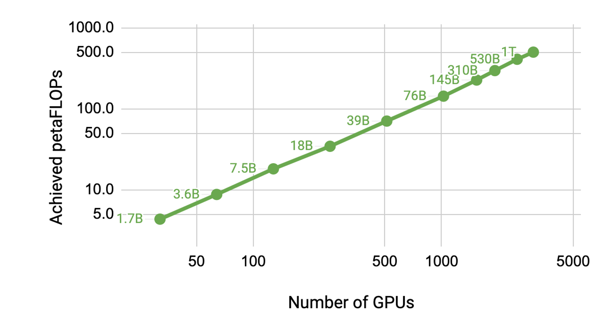

<div align="center">

Megatron: Megatron-LM & Megatron-Core
===========================
<h4>GPU optimized techniques for training transformer models at-scale</h4>

[](./setup.py)
[](./LICENSE)

<div align="left">

# Latest News
- **[2024/1 Announcement]** Nvidia has productized the core capabilities in **Megatron-LM** into [**Megatron-Core**](https://github.com/NVIDIA/Megatron-LM/tree/main/megatron/core) in this repository. Megatron-Core, a newly released open-source PyTorch-based library, expands upon Megatron-LM's GPU-optimized techniques with more cutting-edge innovations on system-level optimizations, featuring composable and modular APIs. Explore the [Megatron-Core intro](#megatron-core) for more details.


# Table of Contents
   * [Megatron Overview](#megatron-overview)
	   * [Megatron-LM](#megatron-lm)
      * [Megatron-Core](#megatron-core)
   * [Training Speed and Scalability](#training-speed-and-scalability)
   * [Setup](#setup)
      * [Downloading Checkpoints](#downloading-checkpoints)
   * [Usage](#usage)
   * [Training](#training)
      * [Data Preprocessing](#data-preprocessing)
      * [BERT Pretraining](#bert-pretraining)
      * [GPT Pretraining](#gpt-pretraining)
      * [T5 Pretraining](#t5-pretraining)
      * [Distributed Pretraining](#distributed-pretraining)
      * [Activation Checkpointing and Recomputation](#activation-checkpointing-and-recomputation)
      * [Distributed Optimizer](#distributed-optimizer)
      * [FlashAttention](#flashattention)
      * [GPT-3 Example](#gpt-3-example)
      * [Retro and InstructRetro](#retro-and-instructretro)
   * [Evaluation and Tasks](#evaluation-and-tasks)
      * [GPT Text Generation](#gpt-text-generation)
      * [GPT Evaluation](#gpt-evaluation)
         * [WikiText Perplexity Evaluation](#wikitext-perplexity-evaluation)
         * [LAMBADA Cloze Accuracy](#lambada-cloze-accuracy)
      * [BERT Task Evaluation](#bert-task-evaluation)
         * [RACE Evaluation](#race-evaluation)
         * [MNLI Evaluation](#mnli-evaluation)
      * [Llama-2 Inference and Finetuning](#llama-2-inference-and-finetuning)
   * [Datasets](#datasets)
      * [Collecting Wikipedia Training Data](#collecting-wikipedia-training-data)
      * [Collecting GPT Webtext Data](#collecting-gpt-webtext-data)
   * [Reproducibility](#reproducibility)
   * [Projects using Megatron](#projects-using-megatron)

# Megatron Overview
This repository comprises two essential components: **Megatron-LM** and **Megatron-Core**. Megatron-LM serves as a ressearch-oriented framework leveraging Megatron-Core for large language model (LLM) training. Megatron-Core, on the other hand, is a library of GPU optimized training techniques that comes with formal product support including versioned APIs and regular releases. You can use Megatron-Core alongside Megatron-LM or [Nvidia NeMo Framework](https://docs.nvidia.com/deeplearning/nemo/user-guide/docs/en/main/nlp/nemo_megatron/mcore_customization.html) for an end-to-end and cloud-native solution. Alternatively, you can integrate Megatron-Core's building blocks into your preferred training framework.

## Megatron-LM
First introduced in 2019, Megatron ([1](https://arxiv.org/pdf/1909.08053.pdf), [2](https://arxiv.org/pdf/2104.04473.pdf), and [3](https://arxiv.org/pdf/2205.05198)) sparked a wave of innovation in the AI community, enabling researchers and developers to utilize the underpinnings of this library to further LLM advancements. Today, many of the most popular LLM developer frameworks have been inspired by and built directly leveraging the open-source Megatron-LM library, spurring a wave of foundation models and AI startups. Some of the most popular LLM frameworks built on top of Megatron-LM include [Colossal-AI](https://github.com/hpcaitech/ColossalAI), [HuggingFace Accelerate](https://github.com/huggingface/accelerate), and [NVIDIA NeMo Framework](https://www.nvidia.com/en-us/ai-data-science/generative-ai/nemo-framework/). A list of projects that have directly used Megatron can be found [here](#projects-using-megatron). 

## Megatron-Core
Megatron-Core is a newly released open-source PyTorch-based library that further expands the collections of GPU optimized techniques inherited from Megatron-LM with more cutting-edge innovations on system-level optimizations. It abstracts them into composable and modular APIs, allowing full flexibility for developers and model researchers to train custom transformers at-scale on NVIDIA accelerated computing infrastructure. This library is compatible with all NVIDIA Tensor Core GPUs, including FP8 acceleration support for NVIDIA Hopper architectures.

Megatron-Core offers the core building blocks such as attention mechanisms, transformer blocks and layers, normalization layers, and embedding techniques. Additional functionality like activation recomputation, distributed checkpointing is also natively built-in to the library. The building blocks and functionality are all GPU optimized, and can be built with advanced parallelization strategies for optimal training speed and stability on NVIDIA Accelerated Computing Infrastructure. Another key component of the Megatron-Core library includes advanced model parallelism techniques  ([tensor](https://arxiv.org/pdf/1909.08053.pdf), [sequence](https://arxiv.org/pdf/2205.05198), and [pipeline](https://arxiv.org/pdf/2104.04473.pdf)). Currently, popular LLM model architectures based on Decoder (ex. [GPT](https://arxiv.org/abs/2005.14165), Llama), Encoder (ex. [BERT](https://arxiv.org/pdf/1810.04805.pdf)), Encoder-Decoder (ex. [T5](https://arxiv.org/abs/1910.10683)), Retrieval Enhanced Transformers (ex. RETRO), and Mixture of Experts (MoE) can easily be built with performance and efficiency at large compute scales. Developers can also use Megatron-Core's transformer blocks and functional APIs to build their own custom layers.


# Training Speed and Scalability
Our codebase is capable of efficiently training very large (hundreds of billions of parameters) language models with both model and data parallelism. To demonstrate how the code scales with multiple GPUs and model sizes, we consider GPT models from 1 billion all the way to 1 trillion parameters. All models use a vocabulary size of 51,200 and a sequence length of 2048. We vary hidden size, number of attention heads, and number of layers to arrive at a specific model size. As the model size increases, we also modestly increase the batch size. We leverage [NVIDIA's Selene supercomputer](https://www.top500.org/system/179842/) to perform scaling studies and use up to 3072 [A100](https://www.nvidia.com/en-us/data-center/a100/) GPUs for the largest model. Each cluster node has 8 NVIDIA 80GB A100 GPUs. The graph below shows that we scale nearly linear up to 1 trillion parameter models running on 3072 GPUs. Note that these results are from benchmark runs and these models were not trained to convergence; however, the FLOPs are measured for end-to-end training, i.e., includes all operations including data loading, optimization, and even logging.



The following table shows both model (MFU) and hardware (HFU) FLOPs utilization for select configurations up to 1T parameters (see [our paper](https://arxiv.org/pdf/2205.05198) for a description of how these are calculated). As the model size increases, we achieve better GPU utilization. For the one trillion parameter model, we reach a MFU and HFU of 56.3% and 57.0%, respectively. Note that these numbers are also measured on benchmark runs and in this case are measured using a data parallel size of one. Data parallelism introduces some overhead due to the gradient all-reduce required between the data parallel groups. However, for large transformer models, this overhead is not large and can almost entirely eliminated by overlapping the gradient all-reduce with backpropagation.

| Model Size | Model FLOPs Utilization | Hardware FLOPs Utilization |
| :---: | :---: | :---: |
| 22B   | 41.5% | 43.7% |
| 175B  | 51.4% | 52.8% |
| 530B  | 56.0% | 57.0% |
| 1T    | 56.3% | 57.0% |    

# Setup
We strongly recommend using the latest release of [NGC's PyTorch container](https://ngc.nvidia.com/catalog/containers/nvidia:pytorch) with DGX nodes. If you can't use this for some reason, use the latest pytorch, cuda, nccl, and NVIDIA [APEX](https://github.com/NVIDIA/apex#quick-start) releases.  Data preprocessing requires [NLTK](https://www.nltk.org/install.html), though this is not required for training, evaluation, or downstream tasks.

You can launch an instance of the PyTorch container and mount Megatron, your dataset, and checkpoints with the following Docker commands:
```
docker pull nvcr.io/nvidia/pytorch:xx.xx-py3
docker run --gpus all -it --rm -v /path/to/megatron:/workspace/megatron -v /path/to/dataset:/workspace/dataset -v /path/to/checkpoints:/workspace/checkpoints nvcr.io/nvidia/pytorch:xx.xx-py3
```

## Downloading Checkpoints
We have provided pretrained [BERT-345M](https://ngc.nvidia.com/catalog/models/nvidia:megatron_bert_345m) and [GPT-345M](https://ngc.nvidia.com/catalog/models/nvidia:megatron_lm_345m) checkpoints to evaluate or for finetuning downstream tasks. To access these checkpoints, first [sign up](https://ngc.nvidia.com/signup) for and [setup](https://ngc.nvidia.com/setup/installers/cli) the NVIDIA GPU Cloud (NGC) Registry CLI. Further documentation for downloading models can be found in the [NGC documentation](https://docs.nvidia.com/dgx/ngc-registry-cli-user-guide/index.html#topic_6_4_1).

Alternatively, you can directly download the checkpoints using:

<pre>
BERT-345M-uncased: wget --content-disposition https://api.ngc.nvidia.com/v2/models/nvidia/megatron_bert_345m/versions/v0.1_uncased/zip -O megatron_bert_345m_v0.1_uncased.zip
BERT-345M-cased: wget --content-disposition https://api.ngc.nvidia.com/v2/models/nvidia/megatron_bert_345m/versions/v0.1_cased/zip -O megatron_bert_345m_v0.1_cased.zip
GPT-345M: wget --content-disposition https://api.ngc.nvidia.com/v2/models/nvidia/megatron_lm_345m/versions/v0.0/zip -O megatron_lm_345m_v0.0.zip
</pre>

The models require vocabulary files to run. The BERT  WordPiece vocab file can be extracted from Google's pretrained BERT models: [uncased](https://s3.amazonaws.com/models.huggingface.co/bert/bert-large-uncased-vocab.txt), [cased](https://s3.amazonaws.com/models.huggingface.co/bert/bert-large-cased-vocab.txt). The GPT [vocab file](https://s3.amazonaws.com/models.huggingface.co/bert/gpt2-vocab.json) and [merge table](https://s3.amazonaws.com/models.huggingface.co/bert/gpt2-merges.txt) can be downloaded directly.

# Usage

After installation, there are several possible workflows. The most comprehensive is:
1. Data preprocessing
2. Pretraining
3. Finetuning (Optional for zero-shot tasks)
4. Downstream task evaluation or text generation

However, steps 1 and 2 can be replaced by using one of the pretrained models mentioned above.

We've provided several scripts for pretraining both BERT and GPT in the [`examples`](./examples) directory, as well as scripts for both zero-shot and fine-tuned downstream tasks including MNLI, RACE, WikiText103, and LAMBADA evaluation. There is also a script for GPT interactive text generation.

# Training
## Data Preprocessing
The training data requires preprocessing. First, place your training data in a loose json format, with one json containing a text sample per line. For example:
<pre>
{"src": "www.nvidia.com", "text": "The quick brown fox", "type": "Eng", "id": "0", "title": "First Part"}
{"src": "The Internet", "text": "jumps over the lazy dog", "type": "Eng", "id": "42", "title": "Second Part"}
</pre>

The name of the `text` field of the json can be changed by using the `--json-key` flag in [`preprocess_data.py`](./tools/preprocess_data.py) The other metadata are optional and are not used in training.

The loose json is then processed into a binary format for training. To convert the json into mmap format use `preprocess_data.py`. An example script to prepare data for BERT training is:
<pre>
python tools/preprocess_data.py \
       --input my-corpus.json \
       --output-prefix my-bert \
       --vocab-file bert-vocab.txt \
       --tokenizer-type BertWordPieceLowerCase \
       --split-sentences
</pre>

The output will be two files named, in this case, `my-bert_text_sentence.bin` and `my-bert_text_sentence.idx`. The `--data-path` specified in later BERT training is the full path and new filename, but without the file extension.

For T5 use the same preprocessing as BERT, perhaps renaming it to:
<pre>
       --output-prefix my-t5 \
</pre>

Some minor modifications are required for GPT data preprocessing, namely, the addition of a merge table, an end-of-document token, removal of sentence splitting, and a change to the tokenizer type:
<pre>
python tools/preprocess_data.py \
       --input my-corpus.json \
       --output-prefix my-gpt2 \
       --vocab-file gpt2-vocab.json \
       --tokenizer-type GPT2BPETokenizer \
       --merge-file gpt2-merges.txt \
       --append-eod
</pre>

Here the output files are named `my-gpt2_text_document.bin` and `my-gpt2_text_document.idx`. As before, in GPT training, use the longer name without the extension as `--data-path`.

Further command line arguments are described in the source file [`preprocess_data.py`](./tools/preprocess_data.py).

## BERT Pretraining


The [`examples/pretrain_bert.sh`](./examples/pretrain_bert.sh) script runs single GPU 345M parameter BERT pretraining. Debugging is the primary use for single GPU training, as the code base and command line arguments are optimized for highly distributed training. Most of the arguments are fairly self-explanatory. By default, the learning rate decays linearly over the training iterations starting at `--lr` to a minimum set by `--min-lr` over `--lr-decay-iters` iterations. The fraction of training iterations used for warmup is set by `--lr-warmup-fraction`. While this is single GPU training, the batch size specified by `--micro-batch-size` is a single forward-backward path batch-size and the code will perform gradient accumulation steps until it reaches `global-batch-size` which is the batch size per iteration. The data is partitioned into a 949:50:1 ratio for training/validation/test sets (default is 969:30:1). This partitioning happens on the fly, but is consistent across runs with the same random seed (1234 by default, or specified manually with `--seed`). We use `train-iters` as the training iterations requested. Alternatively, one can provide `--train-samples` which is total number of samples to train on. If this option is present, then instead of providing `--lr-decay-iters`, one will need to provide `--lr-decay-samples`.

The logging, checkpoint-saving, and evaluation interval options are specified. Note that the `--data-path` now includes the additional `_text_sentence` suffix added in preprocessing, but does not include the file extensions.

Further command line arguments are described in the source file [`arguments.py`](./megatron/arguments.py).

To run `examples/pretrain_bert.sh`, make any desired modifications including setting the environment variables for `CHECKPOINT_PATH`, `VOCAB_FILE`, and `DATA_PATH`. Make sure to set these variables to their paths in the container. Then launch the container with Megatron and necessary paths mounted (as explained in [Setup](#setup)) and run the example script.

## GPT Pretraining

The `examples/pretrain_gpt.sh` script runs single GPU 345M parameter GPT pretraining. As mentioned above, single GPU training is primarily intended for debugging purposes, as the code is optimized for distributed training.

It follows largely the same format as the previous BERT script with a few notable differences: the tokenization scheme used is BPE (which requires a merge table and a `json` vocabulary file) instead of WordPiece, the model architecture allows for longer sequences (note that the max position embedding must be greater than or equal to the maximum sequence length), and the `--lr-decay-style` has been set to cosine decay.  Note that the `--data-path` now includes the additional `_text_document` suffix added in preprocessing, but does not include the file extensions.

Further command line arguments are described in the source file [`arguments.py`](./megatron/arguments.py).

`examples/pretrain_gpt.sh` can be launched the same way as described for BERT. Set the env vars and make any other modifications, launch the container with appropriate mounts, and run the script.

## T5 Pretraining

Very similar to BERT and GPT, the `examples/pretrain_t5.sh` script runs single GPU "base" (~220M parameter) T5 pretraining. The primary difference from BERT and GPT is the addition of the following arguments to accommodate the T5 architecture:

* `--kv-channels` sets the inner dimension of the "key" and "value" matrices of all attention mechanisms in the model. For BERT and GPT this defaults to the hidden size divided by the number of attention heads, but can be configured for T5.

* `--ffn-hidden-size` sets the hidden size in the feed-forward networks within a transformer layer. For BERT and GPT this defaults to 4 times the transformer hidden size, but can be configured for T5.

* `--encoder-seq-length` and `--decoder-seq-length` set the sequence length for the encoder and decoder separately.

All of the other arguments remain as they were for BERT and GPT pretraining. Run this example with the same steps described above for the other scripts.

## Distributed Pretraining

The `examples/pretrain_{bert,gpt,t5}_distributed.sh` scripts use the PyTorch distributed launcher for distributed training. As such, multi-node training can be achieved by properly setting environment variables. See the official PyTorch [documentation](https://pytorch.org/docs/stable/elastic/run.html#launcher-api) for further description of these [environment variables](https://pytorch.org/docs/stable/distributed.html#environment-variable-initialization). By default, multi-node training uses the [nccl](https://developer.nvidia.com/nccl) distributed backend. A simple set of additional arguments and the use of the PyTorch distributed module with the `torchrun` elastic launcher (equivalent to `python -m torch.distributed.run`) are the only additional requirements to adopt distributed training. See any of `examples/pretrain_{bert,gpt,t5}_distributed.sh` for more details.

We use two types of parallelism: data and model parallelism. We facilitate two distributed data parallel implementations: a simple one of our own that performs gradient all-reduce at the end of back propagation step, and Torch's distributed data parallel wrapper that overlaps gradient reduction with back propagation computation. To switch between these two options use `--DDP-impl local` or `--DDP-impl torch`, respectively. As expected, Torch distributed data parallelism is more efficient at larger model sizes. For example, for the 8.3 billion parameters model running on 512 GPUs, the scaling increases from 60% to 76% when Torch's distributed data parallel is used. However, the overlapping method requires more memory and for some configurations (e.g., 2.5 billion parameters using 2-way model parallel and 1.2 billion parameters with no model parallel) can make the overall training slower as a result. We empirically found that using a smaller model in those cases improves the training time.

Second, we developed a simple and efficient two-dimensional model-parallel approach. To use the first dimension, tensor model parallelism (splitting execution of a single transformer module over multiple GPUs, see Section 3 of [our paper](https://arxiv.org/pdf/1909.08053.pdf)), add the `--tensor-model-parallel-size` flag to specify the number of GPUs among which to split the model, along with the arguments passed to the distributed launcher as mentioned above. To use the second dimension, sequence parallelism, specify `--sequence-parallel`, which also requires tensor model parallelism to be enabled because it splits across the same GPUs (more details in Section 4.2.2 of [our paper](https://arxiv.org/pdf/2205.05198.pdf)).

To use pipeline model parallelism (sharding the transformer modules into stages with an equal number of transformer modules on each stage, and then pipelining execution by breaking the batch into smaller microbatches, see Section 2.2 of [our paper](https://arxiv.org/pdf/2104.04473.pdf)), use the `--pipeline-model-parallel-size` flag to specify the number of stages to split the model into (e.g., splitting a model with 24 transformer layers across 4 stages would mean each stage gets 6 transformer layers each).

<!-- The number of microbatches in a per-pipeline minibatch is controlled by the `--num-microbatches-in-minibatch` argument. With `WORLD_SIZE` GPUs, `TENSOR_MP_SIZE` tensor-model-parallel size, `PIPELINE_MP_SIZE` pipeline-model-parallel-size, `WORLD_SIZE`/(`TENSOR_MP_SIZE` * `PIPELINE_MP_SIZE`) GPUs will be used for data parallelism. The default values for `--tensor-model-parallel-size` and `--pipeline-model-parallel-size` is 1, which will not implement either form of model parallelism. -->

We have examples of how to use these two different forms of model parallelism the example scripts ending in `distributed_with_mp.sh`:

Other than these minor changes, the distributed training is identical to the training on a single GPU.

The interleaved pipelining schedule (more details in Section 2.2.2 of [our paper](https://arxiv.org/pdf/2104.04473.pdf)) can be enabled using the `--num-layers-per-virtual-pipeline-stage` argument, which controls the number of transformer layers in a virtual stage (by default with the non-interleaved schedule, each GPU will execute a single virtual stage with `NUM_LAYERS / PIPELINE_MP_SIZE` transformer layers). The total number of layers in the transformer model should be divisible by this argument value. Additionally, the number of microbatches in the pipeline (computed as `GLOBAL_BATCH_SIZE / (DATA_PARALLEL_SIZE * MICRO_BATCH_SIZE)`) should be divisible by the `PIPELINE_MP_SIZE` when using this schedule (this condition is checked in an assertion in the code). The interleaved schedule is not supported for pipelines with 2 stages (`PIPELINE_MP_SIZE=2`).

## Activation Checkpointing and Recomputation

To reduce GPU memory usage when training a large model, we support various forms of activation checkpointing and recomputation. Instead of all activations being stored in memory to be used during backprop, as was traditionally the case in deep learning models, only activations at certain "checkpoints" in the model are retained (or stored) in memory, and the other activations are recomputed on-the-fly when needed for backprop. Note that this kind of checkpointing, *activation* checkpointing, is very different from the checkpointing of model parameters and optimizer state, which is mentioned elsewhere.

We support two levels of recompute granularity: `selective` and `full`. Selective recomputation is the default and is recommended in almost all cases. This mode retains in memory the activations that take less memory storage space and are more expensive to recompute and recomputes the activations that take more memory storage space but are relatively inexpensive to recompute. See [our paper](https://arxiv.org/pdf/2205.05198) for details. You should find that this mode maximizes performance while minimizing the memory required to store activations. To enable selective activation recompute simply use `--recompute-activations`.

For cases where memory is very limited, `full` recompute saves just the inputs to a transformer layer, or a group, or block, of transformer layers, and recomputes everything else. To enable full activation recompute use `--recompute-granularity full`. When using `full` activation recompute, there are two methods: `uniform` and `block`, chosen using the `--recompute-method` argument.

* The `uniform` method uniformly divides the transformer layers into groups of layers (each group of size `--recompute-num-layers`) and stores the input activations of each group in memory. The baseline group size is 1 and, in this case, the input activation of each transformer layer is stored. When the GPU memory is insufficient, increasing the number of layers per group reduces the memory usage, enabling a bigger model to be trained. For example, when `--recompute-num-layers` is set to 4, only the input activation of each group of 4 transformer layers is stored.

* The `block` method recomputes the input activations of a specific number (given by `--recompute-num-layers`) of individual transformer layers per pipeline stage and stores the input activations of the remaining layers in the pipeline stage. Reducing `--recompute-num-layers` results in storing the input activations to more transformer layers, which reduces the activation recomputation required in the backprop, thus improving training performance while increasing memory usage. For example, when we specify 5 layers to recompute of 8 layers per pipeline stage, the input activations of only the first 5 transformer layers are recomputed in the backprop step while the input activations for the final 3 layers are stored. `--recompute-num-layers` can be incrementally increased until the amount of memory storage space required is just small enough to fit in the available memory, thereby both maximally utilizing memory and maximizing performance.


## Distributed Optimizer

Usage: `--use-distributed-optimizer`. Compatible with all model and data types.

The distributed optimizer is a memory savings technique, whereby the optimizer state is evenly distributed across data parallel ranks (versus the traditional method of replicating the optimizer state across data parallel ranks). As described in [ZeRO: Memory Optimizations Toward Training Trillion Parameter Models](https://arxiv.org/abs/1910.02054), our implementation distributes all optimizer state that does not overlap with the model state. For example, when using fp16 model params, the distributed optimizer maintains its own separate copy of fp32 main params & grads, which are distributed across DP ranks. When using bf16 model params, however, the distributed optimizer's fp32 main grads are the same as the model's fp32 grads, and so the grads in this case are not distributed (although the fp32 main params are still distributed, as they are separate from the bf16 model params).

Theoretical memory savings vary depending on the combination of the model's param dtype and grad dtype. In our implementation, the theoretical number of bytes per parameter is (where 'd' is the data parallel size):

| | Non-distributed optim | Distributed optim |
|-|-|-|
| fp16 param, fp16 grads | 20 | 4 + 16/d |
| bf16 param, fp32 grads | 18 | 6 + 12/d |
| fp32 param, fp32 grads | 16 | 8 + 8/d |

## FlashAttention

Usage: `--use-flash-attn`. Support attention head dimensions at most 128.

[FlashAttention](https://github.com/HazyResearch/flash-attention) is a fast and
memory-efficient algorithm to compute exact attention. It speeds up model
training and reduces memory requirement.

To install FlashAttention:
```sh
pip install flash-attn
```

## GPT-3 Example

In `examples/pretrain_gpt3_175B.sh` we have provided an example of how to configure Megatron to train [GPT-3](https://arxiv.org/abs/2005.14165) with 175 billion parameters on 1024 GPUs. The script is designed for [slurm](https://slurm.schedmd.com/documentation.html) with [pyxis](https://github.com/NVIDIA/pyxis) plugin but can be easily adopted to any other scheduler. It uses 8-way tensor parallelism and 16-way pipeline parallelism. With options `global-batch-size 1536` and `rampup-batch-size 16 16 5859375`, the training will start with global batch size 16 and linearly increase the global batch size to 1536 over 5,859,375 samples with incremental steps 16. The training dataset can be either a single set or a multiple datasets combined with a set of weights.

With full global batch size of 1536 on 1024 A100 GPUs, each iteration takes around 32 seconds resulting in 138 teraFLOPs per GPU which is 44% of the theoretical peak FLOPs.


## Retro and InstructRetro


Retro [(Borgeaud et al., 2022)](https://arxiv.org/abs/2112.04426) is an autoregressive decoder-only language model (LM) pretrained with retrieval-augmentation. 
Retro features practical scalability to support large-scale pretraining from scratch by retrieving from trillions of tokens.
Pretraining with retrieval provides a more efficient storage mechanism of factual knowledge, when compared to storing factual knowledge implicitly within the network's parameters, thus largely reducing model parameters while achieving lower perplexity than standard GPT. 
Retro also provides the flexibility to update the
knowledge stored in LMs [(Wang et al., 2023a)](https://arxiv.org/abs/2304.06762)
by updating the retrieval database without training LMs again.

InstructRetro [(Wang et al., 2023b)](https://arxiv.org/abs/2310.07713) further scales up the size of Retro to 48B, featuring the largest LLM pretrained with retrieval (as of December 2023). 
The obtained foundation model, Retro 48B, largely outperforms the GPT counterpart in terms of perplexity.
With instruction tuning on Retro, InstructRetro demonstrates significant improvement over the instruction tuned GPT on downstream tasks in the zero-shot setting. Specifically, the average improvement of InstructRetro is 7% over its GPT counterpart across 8 short-form QA tasks, and 10% over GPT across 4 challenging long-form QA tasks. We also find that one can ablate the encoder from InstructRetro architecture and directly use the InstructRetro decoder backbone as GPT, while achieving comparable results.

In this repo, we provide an end-to-end reproduction guide to implement Retro and InstructRetro, covering
- **Retrieval database construction**, which supports billions or even trillions of tokens as a large-scale retrieval database. 
- **Pretraining with retrieval**, which supports pretraining from scratch and pretraining from a pretrained GPT model (Retro-fitting).      
- **Instruction tuning**, where we provide an open-source instruction tuning dataset and the training recipe for instruction tuning on Retro.
- **Downstream task evaluation**, where we provide the text generation and evaluation scripts for zero-shot question answering tasks.

Please see [tools/retro/README.md](tools/retro/README.md) for a detailed overview.

<!--
## REALM Pipeline
We are working on implementing the [REALM](https://arxiv.org/pdf/2002.08909.pdf) system. The following sections (will) reflect the three stages of training it. For now it's just the ICT code.
Loosely, they are pretraining the retriever modules, then jointly training the language model and the retriever, and then finetuning a question answering head on the language model with fixed retriever.

### Inverse Cloze Task (ICT) Pretraining
1. Have a corpus in loose JSON format with the intention of creating a collection of fixed-size blocks of text as the fundamental units of data. For a corpus like Wikipedia, this will mean multiple sentences per block but also multiple blocks per document.
Run `tools/preprocess_data.py` to construct one or more indexed datasets with the `--split-sentences` argument to make sentences the basic unit. For the original REALM system, we construct two datasets, one with the title of every document, and another with the body.
Refer to the following script
<pre>
python preprocess_data.py \
    --input /path/to/corpus.json \
    --json-keys text title \
    --split-sentences \
    --tokenizer-type BertWordPieceLowerCase \
    --vocab-file /path/to/vocab.txt \
    --output-prefix corpus_indexed \
    --workers 5  # works well for 10 CPU cores. Scale up accordingly.
</pre>

2. Use a custom samples mapping function in place of `megatron/data/realm_dataset_utils.get_block_samples_mapping` if required. To do this, you will need to implement a new function in C++ inside of `megatron/data/helpers.cpp`. The samples mapping data structure is used to select the data that will constitute every training sample in advance of the training loop.
 The samples mapping is responsible for holding all of the required metadata needed to construct the sample from one or more indexed datasets. In REALM, the samples mapping contains the start and end sentence indices, as well as the document index (to find the correct title for a body) and a unique ID for every block.
3. Pretrain a BERT language model using `pretrain_bert.py`, with the sequence length equal to the block size in token ids. This model should be trained on the same indexed dataset that is used to supply the blocks for the information retrieval task.
In REALM, this is an uncased bert base model trained with the standard hyperparameters.
4. Use `pretrain_ict.py` to train an `ICTBertModel` which uses two BERT-based encoders to encode queries and blocks to perform retrieval with.
The script below trains the ICT model from REALM. It references a pretrained BERT model (step 3) in the `--bert-load` argument. The batch size used in the paper is 4096, so this would need to be run with data parallel world size 32.
<pre>
python pretrain_ict.py \
    --num-layers 12 \
    --num-attention-heads 12 \
    --hidden-size 768 \
    --batch-size 128 \
    --seq-length 256 \
    --max-position-embeddings 256 \
    --ict-head-size 128 \
    --train-iters 100000 \
    --bert-load /path/to/pretrained_bert \
    --load checkpoints \
    --save checkpoints \
    --data-path /path/to/indexed_dataset \
    --titles-data-path /path/to/titles_indexed_dataset \
    --vocab-file /path/to/vocab.txt \
    --lr 0.0001 \
    --num-workers 2 \
    --lr-decay-style linear \
    --weight-decay 1e-2 \
    --clip-grad 1.0 \
    --lr-warmup-fraction .01 \
    --save-interval 3000 \
    --query-in-block-prob 0.1 \
    --fp16

</pre>

### Building an Index of Block Embeddings
After having trained an ICT model, you can now embed an entire dataset of blocks by creating a `BlockData` structure. After that has been saved, you can load it
and wrap it with a `FaissMIPSIndex` to do fast similarity search which is key in the learned information retrieval pipeline. The initial index can be built with the following script, meant to be run in an interactive session. It can leverage multiple GPUs on multiple nodes to index large datasets much more quickly.

<pre>
python tools/create_doc_index.py \
    --num-layers 12 \
    --hidden-size 768 \
    --ict-head-size 128 \
    --num-attention-heads 12 \
    --batch-size 128 \
    --seq-length 256 \
    --max-position-embeddings 256 \
    --ict-load /path/to/pretrained_ict \
    --data-path /path/to/indexed_dataset \
    --titles-data-path /path/to/titles_indexed_dataset \
    --block-data-path embedded_blocks.pkl \
    --indexer-log-interval 1000 \
    --indexer-batch-size 128 \
    --vocab-file /path/to/vocab.txt \
    --num-workers 2 \
    --fp16
</pre>

-->

# Evaluation and Tasks

We provide several command line arguments, detailed in the scripts listed below, to handle various zero-shot and fine-tuned downstream tasks. However, you can also finetune your model from a pretrained checkpoint on other corpora as desired. To do so, simply add the `--finetune` flag and adjust the input files and training parameters within the original training script. The iteration count will be reset to zero, and the optimizer and internal state will be reinitialized. If the fine-tuning is interrupted for any reason, be sure to remove the `--finetune` flag before continuing, otherwise the training will start again from the beginning.

Because evaluation requires substantially less memory than training, it may be advantageous to merge a model trained in parallel for use on fewer GPUs in downstream tasks. The following script accomplishes this. This example reads in a GPT model with 4-way tensor and 4-way pipeline model parallelism and writes out a model with 2-way tensor and 2-way pipeline model parallelism.

<pre>
python tools/checkpoint/util.py \
        --model-type GPT \
        --load-dir checkpoints/gpt3_tp4_pp4 \
        --save-dir checkpoints/gpt3_tp2_pp2 \
        --target-tensor-parallel-size 2 \
        --target-pipeline-parallel-size 2

</pre>

Several downstream tasks are described for both GPT and BERT models below. They can be run in distributed and model parallel modes with the same changes used in the training scripts.

## GPT Text Generation

We have included a simple REST server to use for text generation in `tools/run_text_generation_server.py`. You run it much like you would start a pretraining job, specifying an appropriate pretrained checkpoint. There are also few optional parameters: `temperature`, `top-k`and `top-p`. See `--help` or the source file for more information. See [examples/run_text_generation_server_345M.sh](examples/run_text_generation_server_345M.sh) for an example of how to run the server.

Once the server is running you can use `tools/text_generation_cli.py` to query it, it takes one argument which is the host the server is running on.

<pre>
tools/text_generation_cli.py localhost:5000
</pre>

You can also use CURL or any other tools to query the server directly:

<pre>
curl 'http://localhost:5000/api' -X 'PUT' -H 'Content-Type: application/json; charset=UTF-8'  -d '{"prompts":["Hello world"], "tokens_to_generate":1}'
</pre>

See [megatron/text_generation_server.py](megatron/text_generation_server.py) for more API options.

### Detoxify GPT via Self-generation
We include an example in `examples/detxoify_lm/` to detoxify language models by leveraging the generative power of language models.

See [examples/detxoify_lm/README.md](examples/detxoify_lm/README.md) for step-by-step tutorials on how to perform domain-adaptive training and detoxify LM using self-generated corpus.


## GPT Evaluation
We include example scripts for GPT evaluation on WikiText perplexity evaluation and LAMBADA Cloze accuracy.

### WikiText Perplexity Evaluation
For even comparison with prior works, we evaluate perplexity on the word-level [WikiText-103 test dataset](https://s3.amazonaws.com/research.metamind.io/wikitext/wikitext-103-v1.zip), and appropriately compute perplexity given the change in tokens when using our subword tokenizer.

We use the following command to run WikiText-103 evaluation on a 345M parameter model.
<pre>
TASK="WIKITEXT103"

VALID_DATA=&#60;wikitext path&#62;.txt
VOCAB_FILE=gpt2-vocab.json
MERGE_FILE=gpt2-merges.txt
CHECKPOINT_PATH=checkpoints/gpt2_345m

COMMON_TASK_ARGS="--num-layers 24 \
                  --hidden-size 1024 \
                  --num-attention-heads 16 \
                  --seq-length 1024 \
                  --max-position-embeddings 1024 \
                  --fp16 \
                  --vocab-file $VOCAB_FILE"

python tasks/main.py \
       --task $TASK \
       $COMMON_TASK_ARGS \
       --valid-data $VALID_DATA \
       --tokenizer-type GPT2BPETokenizer \
       --merge-file $MERGE_FILE \
       --load $CHECKPOINT_PATH \
       --micro-batch-size 8 \
       --log-interval 10 \
       --no-load-optim \
       --no-load-rng
</pre>


### LAMBADA Cloze Accuracy
To compute LAMBADA cloze accuracy (the accuracy of predicting the last token given the preceding tokens) we utilize a detokenized, processed version of the [LAMBADA dataset](https://github.com/cybertronai/bflm/blob/master/lambada_test.jsonl).

We use the following command to run LAMBADA evaluation on a 345M parameter model. Note that the `--strict-lambada` flag should be used to require whole word matching. Ensure that `lambada` is part of the file path.

<pre>
TASK="LAMBADA"

VALID_DATA=&#60;lambada path&#62;.json
VOCAB_FILE=gpt2-vocab.json
MERGE_FILE=gpt2-merges.txt
CHECKPOINT_PATH=checkpoints/gpt2_345m
COMMON_TASK_ARGS=&#60;same as those in <a href="#wikitext-perplexity-evaluation">WikiText Perplexity Evaluation</a> above&#62;

python tasks/main.py \
       --task $TASK \
       $COMMON_TASK_ARGS \
       --valid-data $VALID_DATA \
       --tokenizer-type GPT2BPETokenizer \
       --strict-lambada \
       --merge-file $MERGE_FILE \
       --load $CHECKPOINT_PATH \
       --micro-batch-size 8 \
       --log-interval 10 \
       --no-load-optim \
       --no-load-rng
</pre>

Further command line arguments are described in the source file [`main.py`](./tasks/main.py)

## BERT Task Evaluation
### RACE Evaluation
The following script finetunes the BERT model for evaluation on the [RACE dataset](http://www.cs.cmu.edu/~glai1/data/race/). The `TRAIN_DATA` and `VALID_DATA` directory contain the RACE dataset as separate `.txt` files. Note that for RACE, the batch size is the number of RACE query's to evaluate. Since each RACE query has four samples, the effective batch size passed through the model will be four times the batch size specified on the command line.

<pre>
TRAIN_DATA="data/RACE/train/middle"
VALID_DATA="data/RACE/dev/middle \
            data/RACE/dev/high"
VOCAB_FILE=bert-vocab.txt
PRETRAINED_CHECKPOINT=checkpoints/bert_345m
CHECKPOINT_PATH=checkpoints/bert_345m_race
COMMON_TASK_ARGS="--num-layers 24 \
                  --hidden-size 1024 \
                  --num-attention-heads 16 \
                  --seq-length 512 \
                  --max-position-embeddings 512 \
                  --fp16 \
                  --vocab-file $VOCAB_FILE"

COMMON_TASK_ARGS_EXT="--train-data $TRAIN_DATA \
                      --valid-data $VALID_DATA \
                      --pretrained-checkpoint $PRETRAINED_CHECKPOINT \
                      --save-interval 10000 \
                      --save $CHECKPOINT_PATH \
                      --log-interval 100 \
                      --eval-interval 1000 \
                      --eval-iters 10 \
                      --weight-decay 1.0e-1"

python tasks/main.py \
       --task RACE \
       $COMMON_TASK_ARGS \
       $COMMON_TASK_ARGS_EXT \
       --tokenizer-type BertWordPieceLowerCase \
       --epochs 3 \
       --micro-batch-size 4 \
       --lr 1.0e-5 \
       --lr-warmup-fraction 0.06
</pre>

### MNLI Evaluation
The following script finetunes the BERT model for evaluation with the [MultiNLI sentence pair corpus](https://www.nyu.edu/projects/bowman/multinli/). Because the matching tasks are quite similar, the script can be quickly tweaked to work with the [Quora Question Pairs](https://www.kaggle.com/quora/question-pairs-dataset) (QQP) dataset as well.

<pre>

TRAIN_DATA="data/glue_data/MNLI/train.tsv"
VALID_DATA="data/glue_data/MNLI/dev_matched.tsv \
            data/glue_data/MNLI/dev_mismatched.tsv"
PRETRAINED_CHECKPOINT=checkpoints/bert_345m
VOCAB_FILE=bert-vocab.txt
CHECKPOINT_PATH=checkpoints/bert_345m_mnli
COMMON_TASK_ARGS=&#60;same as those in <a href="#race-evaluation">RACE Evaluation</a> above&#62;
COMMON_TASK_ARGS_EXT=&#60;same as those in <a href="#race-evaluation">RACE Evaluation</a> above&#62;

python tasks/main.py \
       --task MNLI \
       $COMMON_TASK_ARGS \
       $COMMON_TASK_ARGS_EXT \
       --tokenizer-type BertWordPieceLowerCase \
       --epochs 5 \
       --micro-batch-size 8 \
       --lr 5.0e-5 \
       --lr-warmup-fraction 0.065
</pre>

## Llama-2 Inference and Finetuning

The Llama-2 [family of models](https://ai.meta.com/llama/) are an open-source set of pretrained & finetuned (for chat) models that have achieved strong results across a wide set of benchmarks. At the time of release, Llama-2 models achieved among the best results for open-source models, and were competitive with the closed-source GPT-3.5 model (see https://arxiv.org/pdf/2307.09288.pdf).

The Llama-2 checkpoints can be loaded into Megatron for inference and finetuning. See documentation [here](docs/llama2.md).

# Model Optimization and Deployment
Megatron-Core (MCore) `GPTModel` family supports advanced quantization algorithms and high-performance deployment through TensorRT-LLM.

## Quantization and TensorRT-LLM Deployment
See [Megatron Model Optimization and Deployment](examples/modelopt/README.md) for `llama2` and `nemotron3` examples.

# Datasets
We do not host any datasets for GPT or BERT training, however, we detail their collection so that our results may be reproduced.

## Collecting Wikipedia Training Data
We recommend following the Wikipedia data extraction process specified by Google research: "the recommended pre-processing is to download [the latest dump](https://dumps.wikimedia.org/enwiki/latest/enwiki-latest-pages-articles.xml.bz2), extract the text with [WikiExtractor.py](https://github.com/attardi/wikiextractor), and then apply any necessary cleanup to convert it into plain text."

We recommend using the `--json` argument when using WikiExtractor, which will dump the Wikipedia data into loose json format (one json object per line), making it more manageable on the file system and also readily consumable by our codebase. We recommend further preprocessing this json dataset with nltk punctuation standardization. For BERT training, use the `--split-sentences` flag to `preprocess_data.py` as described [above](#data-preprocessing) to include sentence breaks in the produced index. If you'd like to use Wikipedia data for GPT training you should still clean it with nltk/spacy/ftfy, but do not use the `--split-sentences` flag.

## Collecting GPT Webtext Data
We utilize the publicly available [OpenWebText](https://github.com/eukaryote31/openwebtext) library from [jcpeterson](https://github.com/jcpeterson/openwebtext) and [eukaryote31's](https://github.com/eukaryote31/openwebtext) work to download urls. We then filter, clean, and deduplicate all downloaded content according to the procedure described in our [openwebtext](./tools/openwebtext) directory. For reddit URLs corresponding to content up to October 2018 we arrived at approximately 37GB of content.

# Reproducibility
Megatron training is intended to be bitwise reproducible. This means that the same training config run twice in the same HW and SW environment should produce identical model checkpoints, losses and accuracy metric values (iteration time metrics may vary).

There are currently two known Megatron optimizations that break reproducibility whilst still producing almost identical training runs. The following workarounds should be applied in cases where reproducibility is required:
1. When training using `--bf16`, reproducbility is only obtained when the checkpointing and resume schedule of training is identical. If the checkpointing schedule will change, i.e. checkpointing and resume will occur at different iterations, the option `--no-bias-gelu-fusion` should be used.
2. Flash attention is nondeterministic. If reproducibility is required do not use `--use-flash-attn`.

These sources of nondeterminism are under active investigation. If you observe nondeterminism in Megatron training under other circumstances please open an issue.

## Projects Using Megatron
Below are some of the projects where we have directly used Megatron:
* [BERT and GPT Studies Using Megatron](https://arxiv.org/pdf/1909.08053.pdf)
* [BioMegatron: Larger Biomedical Domain Language Model](https://www.aclweb.org/anthology/2020.emnlp-main.379.pdf)
* [End-to-End Training of Neural Retrievers for Open-Domain Question Answering](https://arxiv.org/abs/2101.00408)
* [Large Scale Multi-Actor Generative Dialog Modeling](https://www.aclweb.org/anthology/2020.acl-main.8.pdf)
* [Local Knowledge Powered Conversational Agents](https://arxiv.org/abs/2010.10150)
* [MEGATRON-CNTRL: Controllable Story Generation with External Knowledge Using Large-Scale Language Models](https://www.aclweb.org/anthology/2020.emnlp-main.226.pdf)
* [RACE Reading Comprehension Dataset Leaderboard](http://www.qizhexie.com/data/RACE_leaderboard.html)
* [Training Question Answering Models From Synthetic Data](https://www.aclweb.org/anthology/2020.emnlp-main.468.pdf)
* [Few-shot Instruction Prompts for Pretrained Language Models to Detect Social Biases](https://arxiv.org/abs/2112.07868)
* [Exploring the Limits of Domain-Adaptive Training for Detoxifying Large-Scale Language Models](https://arxiv.org/abs/2202.04173)
* [Using DeepSpeed and Megatron to Train Megatron-Turing NLG 530B, A Large-Scale Generative Language Model](https://arxiv.org/abs/2201.11990)
* [Multi-Stage Prompting for Knowledgeable Dialogue Generation](https://arxiv.org/abs/2203.08745)
* [Evaluating Parameter Efficient Learning for Generation](https://aclanthology.org/2022.emnlp-main.319.pdf)
* [Exploring the Limits of Domain-Adaptive Training for Detoxifying Large-Scale Language Models](https://arxiv.org/abs/2202.04173)
* [Shall We Pretrain Autoregressive Language Models with Retrieval? A Comprehensive Study](https://arxiv.org/abs/2304.06762)
* [InstructRetro: Instruction Tuning post Retrieval-Augmented Pretraining](https://arxiv.org/abs/2310.07713)
