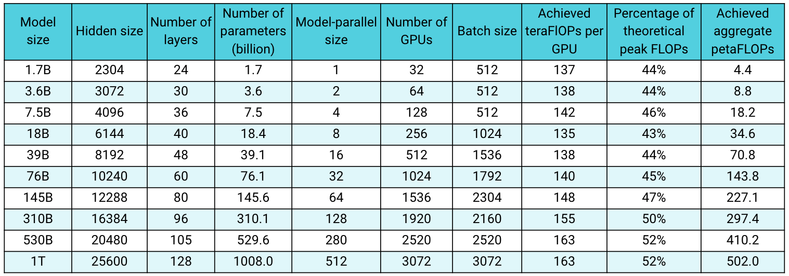

Megatron ([1](https://arxiv.org/pdf/1909.08053.pdf) and [2](https://arxiv.org/pdf/2104.04473.pdf)) is a large, powerful transformer developed by the Applied Deep Learning Research team at NVIDIA. This repository is for ongoing research on training large transformer language models at scale. We developed efficient, model-parallel (tensor and pipeline), and multi-node pre-training oftransformer based models such as [GPT](https://arxiv.org/abs/2005.14165), [BERT](https://arxiv.org/pdf/1810.04805.pdf), and [T5](https://arxiv.org/abs/1910.10683) using mixed precision.

Below are some of the projects where we have directly used Megatron:
* [BERT and GPT Studies Using Megatron](https://arxiv.org/pdf/1909.08053.pdf)
* [BioMegatron: Larger Biomedical Domain Language Model](https://www.aclweb.org/anthology/2020.emnlp-main.379.pdf)
* [End-to-End Training of Neural Retrievers for Open-Domain Question Answering](https://arxiv.org/abs/2101.00408)
* [Large Scale Multi-Actor Generative Dialog Modeling](https://www.aclweb.org/anthology/2020.acl-main.8.pdf)
* [Local Knowledge Powered Conversational Agents](https://arxiv.org/abs/2010.10150)
* [MEGATRON-CNTRL: Controllable Story Generation with External Knowledge Using Large-Scale Language Models](https://www.aclweb.org/anthology/2020.emnlp-main.226.pdf)
* [RACE Reading Comprehension Dataset Leaderboard](http://www.qizhexie.com/data/RACE_leaderboard.html)
* [Scaling Language Model Training to a Trillion Parameters Using Megatron](https://arxiv.org/pdf/2104.04473.pdf)
* [Training Question Answering Models From Synthetic Data](https://www.aclweb.org/anthology/2020.emnlp-main.468.pdf)

Our codebase is capable of efficiently training very large (hundreds of billions of parameters) language models with both model and data parallelism. To demonstrate how the code scales with multiple GPUs and model sizes, we consider GPT models from 1 billion all the way to 1 trillion parameters. All models use a vocabulary size of 51,200 and a sequence length of 2048. We vary hidden size, number of attention heads, and number of layers to arrive at a specifc model size. As the model size increases, we also modestly increase the batch size. We leverage [NVIDIA's Selene supercomputer](https://www.top500.org/system/179842/) to perform scaling studies and use up to 3072 [A100](https://www.nvidia.com/en-us/data-center/a100/) GPUs for the largest model. The table below shows the model configurations along with the achieved FLOPs (both per GPU and aggregate over all GPUs). Note that the FLOPs are measured for end-to-end training, i.e., includes all operations including data loading, optimization, and even logging.

All the cases from 1 billion to 1 trillion parameters achieve more than 43% half precision utilization, which is high for an end-to-end application. We observe that initially the utilization remains constant but as hidden size increases for larger models, utilization starts increasing and reaches 52% for the largest model. We also note that achieved aggregate petaFLOPs across all GPUs increases almost linearly with number of GPUs, demonstrating good weak scaling.

# Contents
   * [Contents](#contents)
   * [Setup](#setup)
      * [Downloading Checkpoints](#downloading-checkpoints)
   * [Usage](#usage)
   * [Training](#training)
      * [Data Preprocessing](#data-preprocessing)
      * [BERT Pretraining](#bert-pretraining)
      * [GPT Pretraining](#gpt-pretraining)
      * [GPT Pretraining](#gpt-pretraining)
      * [T5 Pretraining](#t5-pretraining)
      * [Distributed Pretraining](#distributed-pretraining)
      * [GPT-3 Example](#gpt-3-example)
   * [Evaluation and Tasks](#evaluation-and-tasks)
      * [GPT Text Generation](#gpt-text-generation)
      * [GPT Evaluation](#gpt-evaluation)
         * [WikiText Perplexity Evaluation](#wikitext-perplexity-evaluation)
         * [LAMBADA Cloze Accuracy](#lambada-cloze-accuracy)
      * [BERT Task Evaluation](#bert-task-evaluation)
         * [RACE Evaluation](#race-evaluation)
         * [MNLI Evaluation](#mnli-evaluation)
   * [Datasets](#datasets)
      * [Collecting Wikipedia Training Data](#collecting-wikipedia-training-data)
      * [Collecting GPT Webtext Data](#collecting-gpt-webtext-data)

# Setup
We have tested Megatron with [NGC's PyTorch container](https://ngc.nvidia.com/catalog/containers/nvidia:pytorch) version 20.12, which uses python 3.8, pytorch 1.8, cuda 11.1, and nccl 2.8.3.

To use this repository, please install the latest supported versions of PyTorch with GPU support (python 3.8, pytorch 1.8, cuda 11.1, and nccl 2.8.3 and above) and NVIDIA [APEX](https://github.com/NVIDIA/apex#quick-start). We strongly recommend using one of [NGC's recent PyTorch containers](https://ngc.nvidia.com/catalog/containers/nvidia:pytorch) (the latest compatible version at time of publication can be pulled with `docker pull nvcr.io/nvidia/pytorch:20.12-py3`). Data preprocessing requires [NLTK](https://www.nltk.org/install.html), though this is not required for training, evaluation, or downstream tasks.

## Downloading Checkpoints
We have provided pretrained [BERT-345M](https://ngc.nvidia.com/catalog/models/nvidia:megatron_bert_345m) and [GPT-345M](https://ngc.nvidia.com/catalog/models/nvidia:megatron_lm_345m) checkpoints for use to evaluate or finetuning downstream tasks. To access these checkpoints, first [sign up](https://ngc.nvidia.com/signup) for and [setup](https://ngc.nvidia.com/setup/installers/cli) the NVIDIA GPU Cloud (NGC) Registry CLI. Further documentation for downloading models can be found in the [NGC documentation](https://docs.nvidia.com/dgx/ngc-registry-cli-user-guide/index.html#topic_6_4_1).

Alternatively, you can directly download the checkpoints using:

<pre>
BERT-345M-uncased: wget --content-disposition https://api.ngc.nvidia.com/v2/models/nvidia/megatron_bert_345m/versions/v0.1_uncased/zip -O megatron_bert_345m_v0.1_uncased.zip
BERT-345M-cased: wget --content-disposition https://api.ngc.nvidia.com/v2/models/nvidia/megatron_bert_345m/versions/v0.1_cased/zip -O megatron_bert_345m_v0.1_cased.zip
GPT-345M: wget --content-disposition https://api.ngc.nvidia.com/v2/models/nvidia/megatron_lm_345m/versions/v0.0/zip -O megatron_lm_345m_v0.0.zip
</pre>

The models require vocabulary files to run. The BERT  WordPiece vocab file can be extracted from Google's pretrained BERT models: [uncased](https://s3.amazonaws.com/models.huggingface.co/bert/bert-large-uncased-vocab.txt), [cased](https://s3.amazonaws.com/models.huggingface.co/bert/bert-large-cased-vocab.txt). The GPT [vocab file](https://s3.amazonaws.com/models.huggingface.co/bert/gpt2-vocab.json) and [merge table](https://s3.amazonaws.com/models.huggingface.co/bert/gpt2-merges.txt) can be downloaded directly.

# Usage

After installation, there are several possible workflows. The most comprehensive is:
1. Data preprocessing
2. Pretraining
3. Finetuning (Optional for zero-shot tasks)
4. Downstream task evaluation or text generation

However, steps 1 and 2 can be replaced by using one of the pretrained models mentioned above.

We've provided several scripts for pretraining both BERT and GPT in [`examples`](./examples) directory, as well as scripts for both zero-shot and fine-tuned downstream tasks including MNLI, RACE, WikiText103, and LAMBADA evaluation. There is also a script for GPT interactive text generation.

# Training
## Data Preprocessing
The training data requires preprocessing. First, place your training data in a loose json format, with one json containing a text sample per line. For example:
<pre>
{"src": "www.nvidia.com", "text": "The quick brown fox", "type": "Eng", "id": "0", "title": "First Part"}
{"src": "The Internet", "text": "jumps over the lazy dog", "type": "Eng", "id": "42", "title": "Second Part"}
</pre>

The name of the `text` field of the json can be changed by using the `--json-key` flag in [`preprocess_data.py`](./tools/preprocess_data.py) The other metadata are optional and are not used in training.

The loose json is then processed into a binary format for training. To convert the json into mmap, cached index file, or the lazy loader format use `preprocess_data.py`. Set the `--dataset-impl` flag to `mmap`, `cached`, or `lazy`, respectively (default is `mmap`). An example script to prepare data for BERT training is:
<pre>
python tools/preprocess_data.py \
       --input my-corpus.json \
       --output-prefix my-bert \
       --vocab bert-vocab.txt \
       --dataset-impl mmap \
       --tokenizer-type BertWordPieceLowerCase \
       --split-sentences
</pre>

The output will be two files named, in this case, `my-bert_text_sentence.bin` and `my-bert_text_sentence.idx`. The `--data-path` specified in later BERT training is the full path and new filename, but without the file extension.

For T5 use the same preprocessing as BERT, perhaps renaming it to:
<pre>
       --output-prefix my-t5 \
</pre>

Some minor modifications are required for GPT data preprocessing, namely, the addition of a merge table, an end-of-document token, removal of sentence splitting, and a change to the tokenizer type:
<pre>
python tools/preprocess_data.py \
       --input my-corpus.json \
       --output-prefix my-gpt2 \
       --vocab gpt2-vocab.json \
       --dataset-impl mmap \
       --tokenizer-type GPT2BPETokenizer \
       --merge-file gpt2-merges.txt \
       --append-eod
</pre>

Here the output files are named `my-gpt2_text_document.bin` and `my-gpt2_text_document.idx`. As before, in GPT training, use the longer name without the extension as `--data-path`.

Further command line arguments are described in the source file [`preprocess_data.py`](./tools/preprocess_data.py).

## BERT Pretraining

The `examples/pretrain_bert.sh` script runs single GPU 345M parameter BERT pretraining. Debugging is the primary use for single GPU training, as the code base and command line arguments are optimized for highly distributed training. Most of the arguments are fairly self-explanatory. By default, the learning rate decays linearly over the training iterations starting at `--lr` to a minimum set by `--min-lr` over `--lr-decay-iters` iterations. The fraction of training iterations used for warmup is set by `--lr-warmup-fraction`. While this is single GPU training, the batch size specified by `--micro-batch-size` is a single forward-backward path batch-size and the code will perform gradient accumulation steps until it reaches `global-batch-size` which is the batch size per iteration. The data is partitioned into a 949:50:1 ratio for training/validation/test sets (default is 969:30:1). This partitioning happens on the fly, but is consistent across runs with the same random seed (1234 by default, or specified manually with `--seed`). We use `train-iters` as the training iterations requested. Alternatively, one can provide `--train-samples` which is total number of samples to train on. If this option is present, then instead of providing `--lr-decay-iters`, one will need to provide `--lr-decay-samples`.

The logging, checkpoint-saving, and evaluation intervals are specified. Checkpointing the activations facilitates the training of larger models and/or batches. Note that the `--data-path` now includes the additional `_text_sentence` suffix added in preprocessing, but does not include the file extensions.

<pre>
CHECKPOINT_PATH=checkpoints/bert_345m
VOCAB_FILE=bert-vocab.txt
DATA_PATH=my-bert_text_sentence

BERT_ARGS="--num-layers 24 \
           --hidden-size 1024 \
           --num-attention-heads 16 \
           --seq-length 512 \
           --max-position-embeddings 512 \
           --lr 0.0001 \
           --lr-decay-iters 990000 \
           --train-iters 2000000 \
           --min-lr 0.00001 \
           --lr-warmup-fraction 0.01 \
	   --micro-batch-size 4 \
           --global-batch-size 8 \
           --vocab-file $VOCAB_FILE \
           --split 949,50,1 \
           --fp16"

OUTPUT_ARGS="--log-interval 10 \
             --save-interval 500 \
             --eval-interval 100 \
             --eval-iters 10 \
             --activations-checkpoint-method uniform"

python pretrain_bert.py \
       $BERT_ARGS \
       $OUTPUT_ARGS \
       --save $CHECKPOINT_PATH \
       --load $CHECKPOINT_PATH \
       --data-path $DATA_PATH
</pre>

Further command line arguments are described in the source file [`arguments.py`](./megatron/arguments.py).

## GPT Pretraining

The `examples/pretrain_gpt.sh` script runs single GPU 345M parameter GPT pretraining. As mentioned above, single GPU training is primarily intended for debugging purposes, as the code is optimized for distributed training.

It follows largely the same format as the previous BERT script with a few notable differences: the tokenization scheme used is BPE (which requires a merge table and a `json` vocabulary file) instead of WordPiece, the model architecture allows for longer sequences (note that the max position embedding must be greater than or equal to the maximum sequence length), and the `--lr-decay-style` has been set to cosine decay.  Note that the `--data-path` now includes the additional `_text_document` suffix added in preprocessing, but does not include the file extensions.

<pre>
CHECKPOINT_PATH=checkpoints/gpt2_345m
VOCAB_FILE=gpt2-vocab.json
MERGE_FILE=gpt2-merges.txt
DATA_PATH=my-gpt2_text_document

GPT_ARGS="--num-layers 24 \
          --hidden-size 1024 \
          --num-attention-heads 16 \
          --seq-length 1024 \
          --max-position-embeddings 1024 \
          --micro-batch-size 4 \
          --global-batch-size 8 \
          --lr 0.00015 \
          --train-iters 500000 \
          --lr-decay-iters 320000 \
          --lr-decay-style cosine \
          --vocab-file $VOCAB_FILE \
          --merge-file $MERGE_FILE \
          --lr-warmup-fraction .01 \
          --fp16"

OUTPUT_ARGS=&#60;same as those in <a href="#bert-pretraining">BERT pretraining</a> above&#62;

python pretrain_gpt.py \
       $GPT_ARGS \
       $OUTPUT_ARGS \
       --save $CHECKPOINT_PATH \
       --load $CHECKPOINT_PATH \
       --data-path $DATA_PATH \
</pre>

Further command line arguments are described in the source file [`arguments.py`](./megatron/arguments.py).

## T5 Pretraining

Very similar to BERT and GPT, the `examples/pretrain_t5.sh` script runs single GPU "base" (~220M parameter) T5 pretraining. The primary difference from BERT and GPT is the addition of the following arguments to accomodate the T5 architecture:

* `--kv-channels` sets the inner dimension of the "key" and "value" matrices of all attention mechanisms in the model. For BERT and GPT this defaults to the hidden size divided by the number of attention heads, but can be configured for T5.

* `--ffn-hidden-size` sets the hidden size in the feed-forward networks within a transformer layer. For BERT and GPT this defaults to 4 times the transformer hidden size, but can be configured for T5.

* `--encoder-seq-length` and `--decoder-seq-length` set the sequence length for the encoder and decoder separately.

All of the other arguments remain as they were for BERT and GPT pretraining.

<pre>
CHECKPOINT_PATH=checkpoints/t5_base
VOCAB_FILE=t5-vocab.txt
DATA_PATH=my-t5_text_sentence

T5_ARGS="--num-layers 24 \
         --hidden-size 1024 \
         --num-attention-heads 16 \
         --kv-channels 64 \
         --ffn-hidden-size 3072 \
         --encoder-seq-length 512 \
         --decoder-seq-length 128 \
         --max-position-embeddings 512 \
         --lr 0.0001 \
         --lr-decay-iters 990000 \
         --train-iters 2000000 \
         --min-lr 0.00001 \
         --lr-warmup-fraction 0.01 \
         --micro-batch-size 16 \
         --global-batch-size 2048 \
         --vocab-file $VOCAB_FILE \
         --vocab-extra-ids 100 \
         --split 949,50,1 \
         --fp16"

OUTPUT_ARGS=&#60;same as those in <a href="#bert-pretraining">BERT pretraining</a> above&#62;

python pretrain_t5.py \
       $T5_ARGS \
       $OUTPUT_ARGS \
       --save $CHECKPOINT_PATH \
       --load $CHECKPOINT_PATH \
       --data-path $DATA_PATH
</pre>

## Distributed Pretraining

The `examples/pretrain_{bert,gpt,t5}_distributed.sh` scripts use the PyTorch distributed launcher for distributed training. As such, multi-node training can be achieved by properly setting environment variables and using `init_method='env://'` in the launcher. See the official PyTorch [documentation](https://pytorch.org/docs/stable/distributed.html#launch-utility) for further description of these [environment variables](https://pytorch.org/docs/stable/distributed.html#environment-variable-initialization). By default, multi-node training uses the [nccl](https://developer.nvidia.com/nccl) distributed backend. A simple set of additional arguments and the use of the PyTorch distributed module with the Python flag `-m torch.distributed.launch`, detailed below, are the only additional requirements to adopt distributed training.

We use two types of parallelism: data and model parallelism. We facilitate two distributed data parallel implementations: a simple one of our own that performs gradient all-reduce at the end of back propagation step, and Torch's distributed data parallel wrapper that overlaps gradient reduction with back propagation computation. To switch between these two options use `--DDP-impl local` or `--DDP-impl torch`, respectively. As expected, Torch distributed data parallelism is more efficient at larger model sizes. For example, for the 8.3 billion parameters model running on 512 GPUs, the scaling increases from 60% to 76% when Torch's distributed data parallel is used. However, the overlapping method requires more memory and for some configurations (e.g., 2.5 billion parameters using 2-way model parallel and 1.2 billion parameters with no model parallel) can make the overall training slower as a result. We empirically found that using a smaller model in those cases improves the training time.

Second, we developed a simple and efficient two-dimensional model-parallel approach. To use tensor model parallelism (splitting execution of a single transformer module over multiple GPUs), add the `--tensor-model-parallel-size` flag to specify the number of GPUs among which to split the model, along with the arguments passed to the distributed launcher as mentioned above. To use pipeline model parallelism (sharding the transformer modules into stages with an equal number of transformer modules on each stage, and then pipelining execution by breaking the batch into smaller microbatches), use the `--pipeline-model-parallel-size` flag to specify the number of stages to split the model into (e.g., splitting a model with 24 transformer layers across 4 stages would mean each stage gets 6 transformer layers each).

<!-- The number of microbatches in a per-pipeline minibatch is controlled by the `--num-microbatches-in-minibatch` argument. With `WORLD_SIZE` GPUs, `TENSOR_MP_SIZE` tensor-model-parallel size, `PIPELINE_MP_SIZE` pipeline-model-parallel-size, `WORLD_SIZE`/(`TENSOR_MP_SIZE` * `PIPELINE_MP_SIZE`) GPUs will be used for data parallelism. The default values for `--tensor-model-parallel-size` and `--pipeline-model-parallel-size` is 1, which will not implement either form of model parallelism. -->

We have examples of how to use these two different forms of model parallelism the example scripts ending in `distributed_with_mp.sh`, note that pipeline parallelism is not currently supported in the T5 model:

Other than these minor changes, the distributed training is identical to the training on a single GPU.

Distributed training:
<pre>
WORLD_SIZE=8
TENSOR_MP_SIZE=2
PIPELINE_MP_SIZE=2

DISTRIBUTED_ARGS="--nproc_per_node $WORLD_SIZE \
                  --nnodes 1 \
                  --node_rank 0 \
                  --master_addr localhost \
                  --master_port 6000"

CHECKPOINT_PATH=&#60;same as above&#62;
VOCAB_FILE=&#60;same as above&#62;
DATA_PATH=&#60;same as above&#62;
MODEL_ARGS=&#60;same as above&#62;
OUTPUT_ARGS=&#60;same as above&#62;

python -m torch.distributed.launch $DISTRIBUTED_ARGS ./pretrain_<model>.py \
                $MODEL_ARGS \
                $OUTPUT_ARGS \
                --save $CHECKPOINT_PATH \
                --load $CHECKPOINT_PATH \
                --data-path $DATA_PATH \
                --tensor-model-parallel-size $TENSOR_MP_SIZE \
                --pipeline-model-parallel-size $PIPELINE_MP_SIZE \
                --DDP-impl torch
</pre>

The interleaved pipelining schedule (more details in Section 2.2.2 of [our paper](https://arxiv.org/pdf/2104.04473.pdf)) can be enabled using the `--num-layers-per-virtual-pipeline-stage` argument, which controls the number of transformer layers in a virtual stage (by default with the non-interleaved schedule, each GPU will execute a single virtual stage with `NUM_LAYERS / PIPELINE_MP_SIZE` transformer layers). The total number of layers in the transformer model should be divisible by this argument value. Additionally, the number of microbatches in the pipeline (computed as `GLOBAL_BATCH_SIZE / (DATA_PARALLEL_SIZE * MICRO_BATCH_SIZE)`) should be divisible by the `PIPELINE_MP_SIZE` when using this schedule (this condition is checked in an assertion in the code). The interleaved schedule is not supported for pipelines with 2 stages (`PIPELINE_MP_SIZE=2`).

## Activation Checkpointing and Recomputation

To reduce GPU memory usage so deploy a large model to a training system, we support activation checkpointing and recomputation. We use a Transformer layer as the unit of checkpointing because the activation size bloats in the middle of a Transformer layer so checkpointing the input of a Transformer layer is storage-efficient. We support two activation checkpointing methods: `uniform` and `block`.

Uniform method uniformly divides the Transformer layers into groups of layers and stores the input activations of each group in the memory. The baseline group size is 1 and, in this case, the input activation of each Transformer layer is checkpointed. When the GPU memory is insufficient, increasing the number of layers per group reduces the memory usage thus enables running a bigger model. For example, when using the number of layers per group of 4, the input activation of each group of 4 Transformer layers is checkpointed.

Block method checkpoints the input activations of a set number of individual Transformer layers per pipeline stage and do the rest of layers without any checkpointing. This method can be used to skip checkpointing some Transformer layers until the GPU memory is fully used, which is applicable only when there is unused GPU memory. Checkpointing fewer transformer layers avoids unnecessary activation recomputation in the backprop thus improves training performance. For example, when we specify 5 layers to checkpoint of 8 layers per pipeline stage, the input activations of only the first 5 Transformer layers are checkpointed and activation recomputation for the rest 3 layers is not needed in the backprop.

## GPT-3 Example

In `examples/pretrain_gpt3_175B.sh` we have provided an example of how to configure Megatron to run [GPT-3](https://arxiv.org/abs/2005.14165) with 175 billion parameters on 1024 GPUs. The script is designed for [slurm](https://slurm.schedmd.com/documentation.html) with [pyxis](https://github.com/NVIDIA/pyxis) plugin but can be easily adopted to any other scheduler. It uses 8-way and 16-way tensor and pipeline parallelism, respectively. With options `global-batch-size 1536` and `rampup-batch-size 16 16 5859375`, the training will start with global batch size 16 and linearly increase the global batch size to 1536 over 5,859,375 samples with incrmeental steps 16. The training dataset can be either a single set or a multiple datasets combined with a set of weights.

With full global batch size of 1536 on 1024 A100 GPUs, each iteration takes around 32 seconds resulting in 138 teraFLOPs per GPU which is 44% of the theoretical peak FLOPs.

<!--
## REALM Pipeline
We are working on implementing the [REALM](https://arxiv.org/pdf/2002.08909.pdf) system. The following sections (will) reflect the three stages of training it. For now it's just the ICT code.
Loosely, they are pretraining the retriever modules, then jointly training the language model and the retriever, and then finetuning a question answering head on the language model with fixed retriever.

### Inverse Cloze Task (ICT) Pretraining
1. Have a corpus in loose JSON format with the intention of creating a collection of fixed-size blocks of text as the fundamental units of data. For a corpus like Wikipedia, this will mean multiple sentences per block but also multiple blocks per document.
Run `tools/preprocess_data.py` to construct one or more indexed datasets with the `--split-sentences` argument to make sentences the basic unit. For the original REALM system, we construct two datasets, one with the title of every document, and another with the body.
Refer to the following script
<pre>
python preprocess_data.py \
    --input /path/to/corpus.json \
    --json-keys text title \
    --split-sentences \
    --tokenizer-type BertWordPieceLowerCase \
    --vocab-file /path/to/vocab.txt \
    --output-prefix corpus_indexed \
    --workers 5  # works well for 10 CPU cores. Scale up accordingly.
</pre>

2. Use a custom samples mapping function in place of `megatron/data/realm_dataset_utils.get_block_samples_mapping` if required. To do this, you will need to implement a new function in C++ inside of `megatron/data/helpers.cpp`. The samples mapping data structure is used to select the data that will constitute every training sample in advance of the training loop.
 The samples mapping is responsible for holding all of the required metadata needed to construct the sample from one or more indexed datasets. In REALM, the samples mapping contains the start and end sentence indices, as well as the document index (to find the correct title for a body) and a unique ID for every block.
3. Pretrain a BERT language model using `pretrain_bert.py`, with the sequence length equal to the block size in token ids. This model should be trained on the same indexed dataset that is used to supply the blocks for the information retrieval task.
In REALM, this is an uncased bert base model trained with the standard hyperparameters.
4. Use `pretrain_ict.py` to train an `ICTBertModel` which uses two BERT-based encoders to encode queries and blocks to perform retrieval with.
The script below trains the ICT model from REALM. It refrences a pretrained BERT model (step 3) in the `--bert-load` argument. The batch size used in the paper is 4096, so this would need to be run with data parallel world size 32.
<pre>
python pretrain_ict.py \
    --num-layers 12 \
    --num-attention-heads 12 \
    --hidden-size 768 \
    --batch-size 128 \
    --seq-length 256 \
    --max-position-embeddings 256 \
    --ict-head-size 128 \
    --train-iters 100000 \
    --activations-checkpoint-method uniform \
    --bert-load /path/to/pretrained_bert \
    --load checkpoints \
    --save checkpoints \
    --data-path /path/to/indexed_dataset \
    --titles-data-path /path/to/titles_indexed_dataset \
    --vocab-file /path/to/vocab.txt \
    --lr 0.0001 \
    --num-workers 2 \
    --lr-decay-style linear \
    --weight-decay 1e-2 \
    --clip-grad 1.0 \
    --lr-warmup-fraction .01 \
    --save-interval 3000 \
    --query-in-block-prob 0.1 \
    --fp16

</pre>

### Building an Index of Block Embeddings
After having trained an ICT model, you can now embed an entire dataset of blocks by creating a `BlockData` structure. After that has been saved, you can load it
and wrap it with a `FaissMIPSIndex` to do fast similarity search which is key in the learned information retrieval pipeline. The initial index can be built with the following script, meant to be run in an interactive session. It can leverage multiple GPUs on multiple nodes to index large datasets much more quickly.

<pre>
python tools/create_doc_index.py \
    --num-layers 12 \
    --hidden-size 768 \
    --ict-head-size 128 \
    --num-attention-heads 12 \
    --batch-size 128 \
    --activations-checkpoint-method uniform \
    --seq-length 256 \
    --max-position-embeddings 256 \
    --ict-load /path/to/pretrained_ict \
    --data-path /path/to/indexed_dataset \
    --titles-data-path /path/to/titles_indexed_dataset \
    --block-data-path embedded_blocks.pkl \
    --indexer-log-interval 1000 \
    --indexer-batch-size 128 \
    --vocab-file /path/to/vocab.txt \
    --num-workers 2 \
    --fp16
</pre>

-->

# Evaluation and Tasks

We provide several command line arguments, detailed in the scripts listed below, to handle various zero-shot and fine-tuned downstream tasks. However, you can also finetune your model from a pretrained checkpoint on other corpora as desired. To do so, simply add the `--finetune` flag and adjust the input files and training parameters within the original training script. The iteration count will be reset to zero, and the optimizer and internal state will be reinitialized. If the fine-tuning is interrupted for any reason, be sure to remove the `--finetune` flag before continuing, otherwise the training will start again from the beginning.

Because evaluation requires substantially less memory than training, it may be advantageous to merge a model trained in parallel for use on a single GPU in downstream tasks. The following script accomplishes this. Currently only tensor model parallelism is supported on input and pipeline model parallelsim on the output. This example reads in a model with 2-way tensor model parallelism and writes out a model with 2-way pipeline model parallelism.

<pre>
TENSOR_MODEL_PARALLEL_SIZE=2
TARGET_PIPELINE_MODEL_PARALLEL_SIZE=2

VOCAB_FILE=bert-vocab.txt
CHECKPOINT_PATH=checkpoints/bert_345m

WORLD_SIZE=$TENSOR_MODEL_PARALLEL_SIZE python tools/merge_mp_partitions.py \
        --model-type BERT \
        --tensor-model-parallel-size $TENSOR_MODEL_PARALLEL_SIZE \
        --pipeline-model-parallel-size 1 \
        --target-pipeline-model-parallel-size $TARGET_PIPELINE_MODEL_PARALLEL_SIZE \
        --tokenizer-type BertWordPieceLowerCase \
        --vocab-file $VOCAB_FILE \
        --num-layers 24 \
        --hidden-size 1024 \
        --num-attention-heads 16 \
        --seq-length 512 \
        --max-position-embeddings 512 \
        --load $CHECKPOINT_PATH
        --save $CHECKPOINT_PATH/merged

</pre>

Several downstream tasks are described for both GPT and BERT models below. They can be run in distributed and model parallel modes with the same changes used in the training scripts.

## GPT Text Generation
`bash examples/generate_text.sh`

We generate text samples using largely the GPT pretraining script. Few changes need to make, such as we need to provide the path to the pretrained checkpoint, the length of the output samples, whether to generate texts unconditionally (`--num-samples` to denote how many samples to generate) or conditional (need to pass `--sample-input-file <filename>` where each line of the file will be used as the conditional texts). There are few optional parameters to play, e.g. `top-k`, `top-p`, or `greedy` (set top-k and top-p to 0) sampling..

<pre>
CHECKPOINT_PATH=checkpoints/gpt2_345m
VOCAB_FILE=gpt2-vocab.json
MERGE_FILE=gpt2-merges.txt
GPT_ARGS=&#60;same as those in <a href="#gpt-pretraining">GPT pretraining</a> above&#62;

MAX_OUTPUT_SEQUENCE_LENGTH=1024
TEMPERATURE=1.0
TOP_P=0.9
NUMBER_OF_SAMPLES=2
OUTPUT_FILE=samples.json

python tools/generate_samples_gpt.py \
       $GPT_ARGS \
       --load $CHECKPOINT_PATH \
       --out-seq-length $MAX_OUTPUT_SEQUENCE_LENGTH \
       --temperature $TEMPERATURE \
       --genfile $OUTPUT_FILE \
       --num-samples $NUMBER_OF_SAMPLES \
       --top_p $TOP_P \
       --recompute
</pre>

## GPT Evaluation
We include example scripts for GPT evaluation on WikiText perplexity evaluation and LAMBADA Cloze accuracy.

### WikiText Perplexity Evaluation
For even comparison with prior works, we evaluate perplexity on the word-level [WikiText-103 test dataset](https://s3.amazonaws.com/research.metamind.io/wikitext/wikitext-103-v1.zip), and appropriately compute perplexity given the change in tokens when using our subword tokenizer.

We use the following command to run WikiText-103 evaluation on a 345M parameter model.
<pre>
TASK="WIKITEXT103"

VALID_DATA=&#60;wikitext path&#62;.txt
VOCAB_FILE=gpt2-vocab.json
MERGE_FILE=gpt2-merges.txt
CHECKPOINT_PATH=checkpoints/gpt2_345m

COMMON_TASK_ARGS="--num-layers 24 \
                  --hidden-size 1024 \
                  --num-attention-heads 16 \
                  --seq-length 1024 \
                  --max-position-embeddings 1024 \
                  --fp16 \
                  --vocab-file $VOCAB_FILE"

python tasks/main.py \
       --task $TASK \
       $COMMON_TASK_ARGS \
       --valid-data $VALID_DATA \
       --tokenizer-type GPT2BPETokenizer \
       --merge-file $MERGE_FILE \
       --load $CHECKPOINT_PATH \
       --micro-batch-size 8 \
       --activations-checkpoint-method uniform \
       --log-interval 10 \
       --no-load-optim \
       --no-load-rng
</pre>

### LAMBADA Cloze Accuracy
To compute LAMBADA cloze accuracy (the accuracy of predicting the last token given the preceeding tokens) we utilize a detokenized, processed version of the [LAMBADA dataset](https://github.com/cybertronai/bflm/blob/master/lambada_test.jsonl).

We use the following command to run LAMBADA evaluation on a 345M parameter model. Note that the `--strict-lambada` flag should be used to require whole word matching. Make that `lambada` is part of the file path.

<pre>
TASK="LAMBADA"

VALID_DATA=&#60;lambada path&#62;.json
VOCAB_FILE=gpt2-vocab.json
MERGE_FILE=gpt2-merges.txt
CHECKPOINT_PATH=checkpoints/gpt2_345m
COMMON_TASK_ARGS=&#60;same as those in <a href="#wikitext-perplexity-evaluation">WikiText Perplexity Evaluation</a> above&#62;

python tasks/main.py \
       --task $TASK \
       $COMMON_TASK_ARGS \
       --valid-data $VALID_DATA \
       --tokenizer-type GPT2BPETokenizer \
       --strict-lambada \
       --merge-file $MERGE_FILE \
       --load $CHECKPOINT_PATH \
       --micro-batch-size 8 \
       --activations-checkpoint-method uniform \
       --log-interval 10 \
       --no-load-optim \
       --no-load-rng
</pre>

Further command line arguments are described in the source file [`main.py`](./tasks/main.py)

## BERT Task Evaluation
### RACE Evaluation
The following script finetunes the BERT model for evaluation on the [RACE dataset](http://www.cs.cmu.edu/~glai1/data/race/). The `TRAIN_DATA` and `VALID_DATA` directory contain the RACE dataset as separate `.txt` files. Note that for RACE, the batch size is the number of RACE query's to evaluate. Since each RACE query has four samples, the effective batch size passed through the model will be four times the batch size specified on the command line.

<pre>
TRAIN_DATA="data/RACE/train/middle"
VALID_DATA="data/RACE/dev/middle \
            data/RACE/dev/high"
VOCAB_FILE=bert-vocab.txt
PRETRAINED_CHECKPOINT=checkpoints/bert_345m
CHECKPOINT_PATH=checkpoints/bert_345m_race
COMMON_TASK_ARGS="--num-layers 24 \
                  --hidden-size 1024 \
                  --num-attention-heads 16 \
                  --seq-length 512 \
                  --max-position-embeddings 512 \
                  --fp16 \
                  --vocab-file $VOCAB_FILE"

COMMON_TASK_ARGS_EXT="--train-data $TRAIN_DATA \
                      --valid-data $VALID_DATA \
                      --pretrained-checkpoint $PRETRAINED_CHECKPOINT \
                      --activations-checkpoint-method uniform \
                      --save-interval 10000 \
                      --save $CHECKPOINT_PATH \
                      --log-interval 100 \
                      --eval-interval 1000 \
                      --eval-iters 10 \
                      --weight-decay 1.0e-1"

python tasks/main.py \
       --task RACE \
       $COMMON_TASK_ARGS \
       $COMMON_TASK_ARGS_EXT \
       --tokenizer-type BertWordPieceLowerCase \
       --epochs 3 \
       --micro-batch-size 4 \
       --lr 1.0e-5 \
       --lr-warmup-fraction 0.06
</pre>

### MNLI Evaluation
The following script finetunes the BERT model for evaluation with the [MultiNLI sentence pair corpus](https://www.nyu.edu/projects/bowman/multinli/). Because the matching tasks are quite similar, the script can be quickly tweaked to work with the [Quora Question Pairs](https://www.kaggle.com/quora/question-pairs-dataset) (QQP) dataset as well.

<pre>

TRAIN_DATA="data/glue_data/MNLI/train.tsv"
VALID_DATA="data/glue_data/MNLI/dev_matched.tsv \
            data/glue_data/MNLI/dev_mismatched.tsv"
PRETRAINED_CHECKPOINT=checkpoints/bert_345m
VOCAB_FILE=bert-vocab.txt
CHECKPOINT_PATH=checkpoints/bert_345m_mnli
COMMON_TASK_ARGS=&#60;same as those in <a href="#race-evaluation">RACE Evaluation</a> above&#62;
COMMON_TASK_ARGS_EXT=&#60;same as those in <a href="#race-evaluation">RACE Evaluation</a> above&#62;

python tasks/main.py \
       --task MNLI \
       $COMMON_TASK_ARGS \
       $COMMON_TASK_ARGS_EXT \
       --tokenizer-type BertWordPieceLowerCase \
       --epochs 5 \
       --micro-batch-size 8 \
       --lr 5.0e-5 \
       --lr-warmup-fraction 0.065
</pre>

# Datasets
We do not host any datasets for GPT or BERT training, however, we detail their collection so that our results may be reproduced.

## Collecting Wikipedia Training Data
We recommend following the Wikipedia data extraction process specified by Google research: "the recommended pre-processing is to download [the latest dump](https://dumps.wikimedia.org/enwiki/latest/enwiki-latest-pages-articles.xml.bz2), extract the text with [WikiExtractor.py](https://github.com/attardi/wikiextractor), and then apply any necessary cleanup to convert it into plain text."

We recommend using the `--json` argument when using WikiExtractor, which will dump the Wikipedia data into loose json format (one json per line), making it more manageable on the file system and also readily consumable by our codebase. We recommend further preprocessing this json dataset by nltk punctuation standardization. For BERT training, use the `--split-sentences` flag to `preprocess_data.py` as described [above](#data-preprocessing) to include sentence breaks in the produced index. If you'd like to use Wikipedia data for GPT training you should still clean it with nltk/spacy/ftfy, but do not use the `--split-sentences` flag.

## Collecting GPT Webtext Data
We utilize the publicly available [OpenWebText](https://github.com/eukaryote31/openwebtext) library from [jcpeterson](https://github.com/jcpeterson/openwebtext) and [eukaryote31's](https://github.com/eukaryote31/openwebtext) work to download urls. We then filtered, cleaned, and deduplicated all downloaded content according to the procedure described in our [openwebtext](./tools/openwebtext) directory. For reddit URLs corresponding to content up to October 2018 we arrived at approximately 37GB of content.
