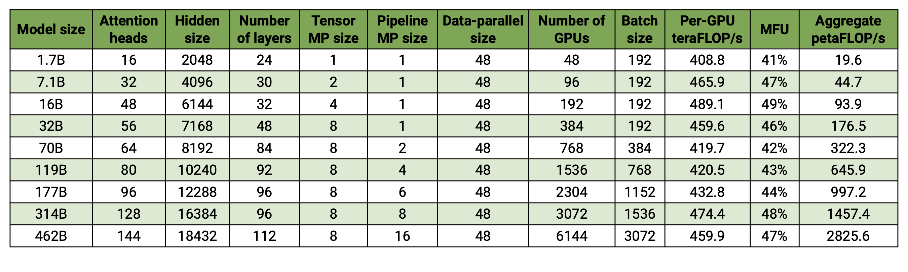
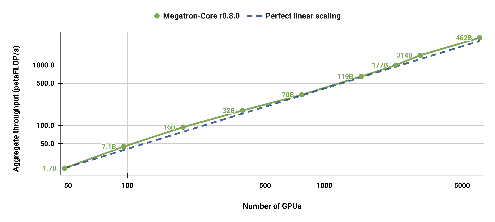
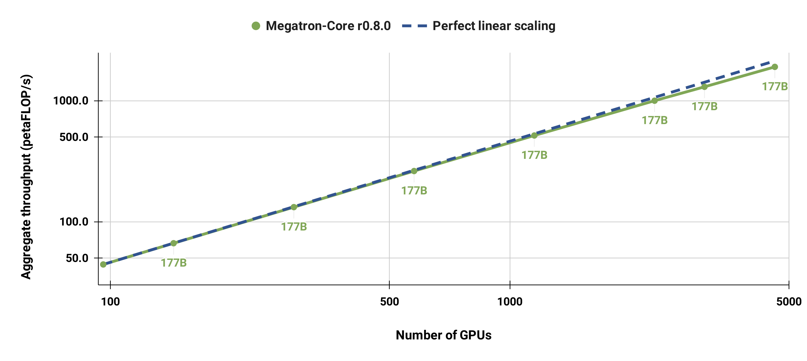

<div align="center">

Megatron-LM and Megatron Core
=============================

<h4>GPU-optimized library for training transformer models at scale</h4>

[](https://docs.nvidia.com/megatron-core/developer-guide/latest/index.html)
[](./CHANGELOG.md)
[](./LICENSE)

<div align="left">

## About

This repository contains two components: **Megatron-LM** and **Megatron Core**.

**Megatron-LM** is a reference example that includes Megatron Core plus pre-configured training scripts. Best for research teams, learning distributed training, and quick experimentation.

**Megatron Core** is a composable library with GPU-optimized building blocks for custom training frameworks. It provides transformer building blocks, advanced parallelism strategies (TP, PP, DP, EP, CP), mixed precision support (FP16, BF16, FP8, FP4), and model architectures. Best for framework developers and ML engineers building custom training pipelines.

**[Megatron Bridge](https://github.com/NVIDIA-NeMo/Megatron-Bridge)** provides bidirectional Hugging Face ↔ Megatron checkpoint conversion with production-ready recipes.

## Getting Started

**Install from PyPI:**

```bash
uv pip install megatron-core
```

**Or clone and install from source:**

```bash
git clone https://github.com/NVIDIA/Megatron-LM.git
cd Megatron-LM
uv pip install -e .
```

> **Note:** Building from source can use a lot of memory. If the build runs out of memory, limit parallel compilation jobs by setting `MAX_JOBS` (e.g. `MAX_JOBS=4 uv pip install -e .`).

For NGC container setup and all installation options, see the **[Installation Guide](https://docs.nvidia.com/megatron-core/developer-guide/latest/get-started/install.html)**.

- **[Your First Training Run](https://docs.nvidia.com/megatron-core/developer-guide/latest/get-started/quickstart.html)** - End-to-end training examples with data preparation
- **[Parallelism Strategies](https://docs.nvidia.com/megatron-core/developer-guide/latest/user-guide/parallelism-guide.html)** - Scale training across GPUs with TP, PP, DP, EP, and CP
- **[Contribution Guide](https://docs.nvidia.com/megatron-core/developer-guide/latest/developer/contribute.html)** - How to contribute to Megatron Core

# Latest News

- **[2026/03]** **[Scalable Training of Mixture-of-Experts Models with Megatron Core](https://arxiv.org/abs/2603.07685)** - Technical report on scaling MoE training with integrated optimizations for memory, communication, and computation.
- **[2026/03]** **[Implementing Falcon-H1 Hybrid Architecture in Megatron Core](https://developer.nvidia.com/blog/implementing-falcon-h1-hybrid-architecture-in-nvidia-megatron-core/)** - Technology Innovation Institute (TII) contributes Falcon-H1 hybrid transformer-Mamba architecture and BitNet ternary quantization support to Megatron Core.
- **[2026/03]** **[Megatron Core Roadmap](https://github.com/NVIDIA/Megatron-LM/issues/4003)** - Roadmap for upcoming Megatron Core features and improvements.
- **[2026/03]** **Deprecating Python 3.10 support:** We're officially dropping Python 3.10 support with the upcoming 0.17.0 release. Downstream applications must raise their lower boundary to 3.12 to stay compatible with MCore.
- **[2026/01]** **[Dynamic Context Parallelism](https://developer.nvidia.com/blog/speeding-up-variable-length-training-with-dynamic-context-parallelism-and-nvidia-megatron-core/)** - Up to 1.48x speedup for variable-length sequence training with adaptive CP sizing.
- **[2025/12]** **Megatron Core development has moved to GitHub!** All development and CI now happens in the open. We welcome community contributions.
- **[2025/10]** **[Megatron Dev Branch](https://github.com/NVIDIA/Megatron-LM/tree/dev)** - early access branch with experimental features.
- **[2025/10]** **[Megatron Bridge](https://github.com/NVIDIA-NeMo/Megatron-Bridge)** - Bidirectional converter for interoperability between Hugging Face and Megatron checkpoints, featuring production-ready recipes for popular models.
- **[2025/08]** **[MoE Q3-Q4 2025 Roadmap](https://github.com/NVIDIA/Megatron-LM/issues/1729)** - Comprehensive roadmap for MoE features including DeepSeek-V3, Qwen3, advanced parallelism strategies, FP8 optimizations, and Blackwell performance enhancements.
- **[2025/08]** **[GPT-OSS Model](https://github.com/NVIDIA/Megatron-LM/issues/1739)** - Advanced features including YaRN RoPE scaling, attention sinks, and custom activation functions are being integrated into Megatron Core.
- **[2025/06]** **[Megatron MoE Model Zoo](https://github.com/yanring/Megatron-MoE-ModelZoo)** - Best practices and optimized configurations for training DeepSeek-V3, Mixtral, and Qwen3 MoE models with performance benchmarking and checkpoint conversion tools.

[Previous News](docs/discussions/README.md#previous-news)

# Project Structure

```
Megatron-LM/
├── megatron/
│   ├── core/                    # Megatron Core (kernels, parallelism, building blocks)
│   │   ├── models/              # Transformer models
│   │   ├── transformer/         # Transformer building blocks
│   │   ├── tensor_parallel/     # Tensor parallelism
│   │   ├── pipeline_parallel/   # Pipeline parallelism
│   │   ├── distributed/         # Distributed training (FSDP, DDP)
│   │   ├── optimizer/           # Optimizers
│   │   ├── datasets/            # Dataset loaders
│   │   ├── inference/           # Inference engines and server
│   │   └── export/              # Model export (e.g. TensorRT-LLM)
│   ├── training/                # Training scripts
│   ├── legacy/                  # Legacy components
│   ├── post_training/           # Post-training (quantization, distillation, pruning, etc.)
│   └── rl/                      # Reinforcement learning (RLHF, etc.)
├── examples/                    # Ready-to-use training examples
├── tools/                       # Utility tools
├── tests/                       # Comprehensive test suite
└── docs/                        # Documentation
```

# Performance Benchmarking

For our latest performance benchmarking results, please refer to [NVIDIA Megatron Bridge Performance Summary](https://docs.nvidia.com/nemo/megatron-bridge/latest/performance-summary.html).

Our codebase efficiently trains models from 2B to 462B parameters across thousands of GPUs, achieving up to **47% Model FLOP Utilization (MFU)** on H100 clusters.



**Benchmark Configuration:**

- **Vocabulary size**: 131,072 tokens
- **Sequence length**: 4096 tokens
- **Model scaling**: Varied hidden size, attention heads, and layers to achieve target parameter counts
- **Communication optimizations**: Fine-grained overlapping with DP (`--overlap-grad-reduce`, `--overlap-param-gather`), TP (`--tp-comm-overlap`), and PP (enabled by default)

**Key Results:**

- **6144 H100 GPUs**: Successfully benchmarked 462B parameter model training
- **Superlinear scaling**: MFU increases from 41% to 47-48% with model size
- **End-to-end measurement**: Throughputs include all operations (data loading, optimizer steps, communication, logging)
- **Production ready**: Full training pipeline with checkpointing and fault tolerance
- *Note: Performance results measured without training to convergence*

## Weak Scaling Results

Our weak scaled results show superlinear scaling (MFU increases from 41% for the smallest model considered to 47-48% for the largest models); this is because larger GEMMs have higher arithmetic intensity and are consequently more efficient to execute.



## Strong Scaling Results

We also strong scaled the standard GPT-3 model (our version has slightly more than 175 billion parameters due to larger vocabulary size) from 96 H100 GPUs to 4608 GPUs, using the same batch size of 1152 sequences throughout. Communication becomes more exposed at larger scale, leading to a reduction in MFU from 47% to 42%.



# Roadmaps

- **[MoE Roadmap](https://github.com/NVIDIA/Megatron-LM/issues/1729)** - DeepSeek-V3, Qwen3, advanced parallelism, FP8 optimizations, and Blackwell enhancements

# Resources

## Getting Help

- 📖 **[Documentation](https://docs.nvidia.com/megatron-core/developer-guide/latest/index.html)** - Official documentation
- 🐛 **[Issues](https://github.com/NVIDIA/Megatron-LM/issues)** - Bug reports and feature requests

## Contributing

We ❤️ contributions! Ways to contribute:

- 🐛 **Report bugs** - Help us improve reliability
- 💡 **Suggest features** - Shape the future of Megatron Core
- 📝 **Improve docs** - Make Megatron Core more accessible
- 🔧 **Submit PRs** - Contribute code improvements

**→ [Contributing Guide](https://docs.nvidia.com/megatron-core/developer-guide/latest/developer/contribute.html)**

## Citation

If you use Megatron in your research or project, we appreciate that you use the following citations:

```bibtex
@article{megatron-lm,
  title={Megatron-LM: Training Multi-Billion Parameter Language Models Using Model Parallelism},
  author={Shoeybi, Mohammad and Patwary, Mostofa and Puri, Raul and LeGresley, Patrick and Casper, Jared and Catanzaro, Bryan},
  journal={arXiv preprint arXiv:1909.08053},
  year={2019}
}
```
