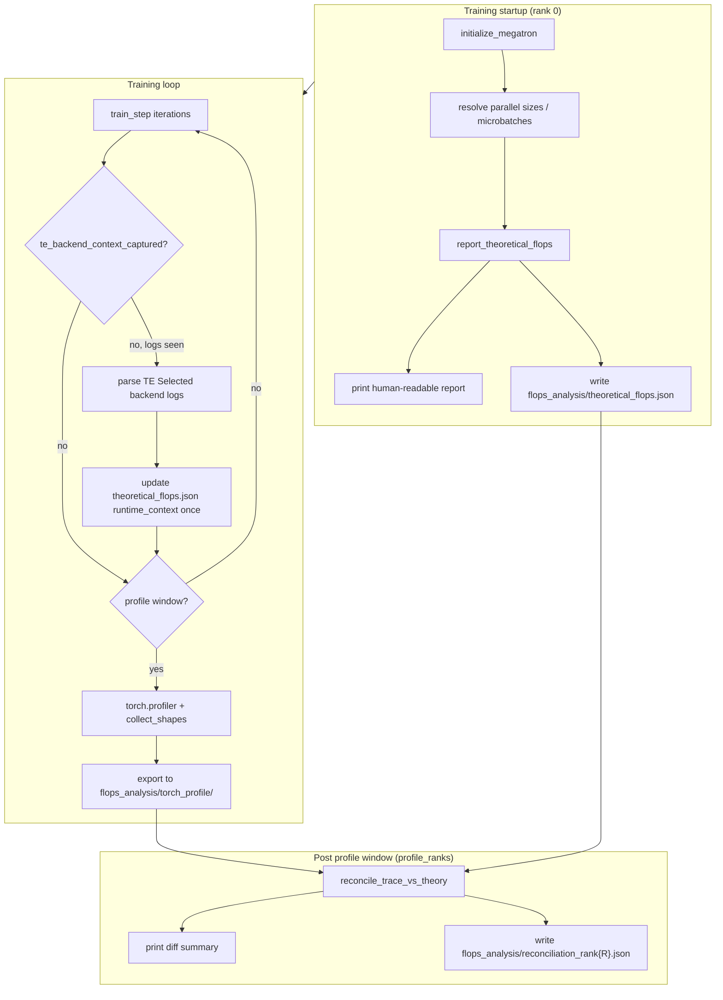

# Theoretical FLOPs Report + Runtime Trace Reconciliation

**Status:** Draft / preliminary design  
**Author:** (internal working doc)  
**Last updated:** 2026-07-06 (rev. 7 — Phase A scope, TE env timing, capture flag, reconciliation per-rank)

This document describes a plan to add **operator-level theoretical FLOPs reporting**
integrated into the Megatron training loop (Option B), together with **runtime trace
capture** via the **built-in PyTorch Profiler** so measured kernel activity can be
compared against the analytical model.

**Environment assumptions:**

- Target servers do **not** have Nsight Systems (`nsys`). All trace capture and
  reconciliation use Megatron's existing `--use-pytorch-profiler` path only.
- Target servers do **not** need Codex CLI, Cursor, or any agent runtime. Implementation
  and iteration happen **locally**; the server is used only for **manual** phase **C**
  smoke validation (§6.1, §11.1).

---

## 1. Motivation

Megatron already computes **aggregate** theoretical FLOPs via
`num_floating_point_operations()` in `megatron/training/training.py`, and prints
**throughput** when `--log-throughput` is set. It also has a standalone memory
estimator (`tools/report_theoretical_memory.py`).

What is **missing** is a report like:

```
### THEORETICAL FLOPS REPORT START ###
  grouped layers / pseudo-layers:
    attention | q_down_projection | gemm | precision=fp8
      shape=(m,n,k)=(4096, 1536, 7168)
      per_layer_tflops=4156.154
  submodule -> operator -> precision share:
    moe_routed_experts | grouped_gemm | fp8: 48.39%
### THEORETICAL FLOPS REPORT END ###
```

That style of output is valuable for:

- Capacity planning (which operators dominate FLOPs at a given parallel config)
- Kernel-shape debugging before/after parallelism changes
- **Reconciliation** against real profiler traces (did we actually run the GEMMs we think we ran?)

Option B (training-integrated) is preferred over a standalone offline tool because:

1. Theoretical report uses the **same resolved `args`** as the live run (DP size, microbatch
   count, padded vocab, MoE layout, THD token stats, etc.).
2. Profiler windows (`--profile-step-start/end`) can capture traces on the **same steps**
   the analytical model describes.
3. Post-run comparison can flag drift (fusion, recompute, CP/TP splits, padding).

---

## 2. What is Reconciliation?

**Reconciliation** is the automatic **diff between the analytical model and a real
profiler trace** — not a second training run.

| Input | Source | Contents |
|-------|--------|----------|
| **Theory** | Startup report | Per-operator `shape`, `tflops`, `precision` derived from CLI args |
| **Trace** | PyTorch Profiler export | Actual `aten::mm` / TE `gemm` events and recorded tensor shapes in the profile window |

After the profile window ends, the reconciler:

1. **Shape-matches** theoretical GEMM entries against trace events (within tolerance).
2. **Reports coverage** — which theoretical ops have no trace counterpart (often due to TE
   fusion) and which trace ops are unexpected.
3. **Compares FLOPs budgets** — sum of `2×m×n×k` from trace GEMMs vs analytical GEMM total;
   optionally cross-checks `--log-throughput` measured TFLOP/s/GPU.

Reconciliation is **optional** (M2). M1 delivers only the startup theoretical report.
Without `--profile --use-pytorch-profiler`, no trace is captured and reconciliation is skipped.

---

## 3. Goals and non-goals

### Goals (milestones)

| Milestone | Deliverable |
|-----------|-------------|
| **M1** | Print startup theoretical FLOPs report (dense GQA transformer) from training args |
| **M1** | `--report-theoretical-flops` CLI flag; report on rank 0 after `initialize_megatron` |
| **M1** | `reference_total` matches `num_floating_point_operations()` via **integer** FLOPs sum |
| **M1** | Write `theoretical_flops.json` under `--theoretical-flops-output-dir` |
| **M1** | Per-operator shape rules: CP → `m`; TP → `n`/`k`; SP → `m` only when seq-sharded |
| **M2** | PyTorch Profiler exports Chrome trace directly to `flops_analysis/torch_profile/` |
| **M2** | Auto-compare trace GEMM shapes vs analytical shapes (per profile window) |
| **M2** | Write `reconciliation_rank{R}.json` (+ optional summary) + human-readable diff |
| **M1/M2** | Record Megatron `attention_backend` + TE **resolved** dot-product-attention backend in report |
| **M1/M2** | Phase **A** unit tests + fixtures pass locally before server smoke (§11) |
| **M2** | `scripts/run_theoretical_flops_trace_8gpu_smoke.sh` (and optional SLURM wrapper) for server manual smoke |
| **M3** | MLA, MoE grouped GEMM, MTP, THD packed sequences |
| **M3** | Per-PP-stage layer filtering (only operators on this rank) |

### Non-goals (initially)

- Nsight Systems (`nsys`) integration or SQLite trace parsing
- Replacing TensorBoard / Chrome trace viewer as the primary profiler UI
- Exact FLOPs from hardware counters (use analytical + trace **shape** match instead)
- CUDA-graph-captured kernel name stability guarantees
- Supporting every experimental attention variant on day one
- `--experimental` feature gate (feature is opt-in via `--report-theoretical-flops` only)
- Implementing test code or feature code in this doc revision (§11 is **plan only**)

---

## 4. Architecture overview



### Output directory layout

All artifacts go under a single **independent** directory (default `./flops_analysis/`).
`--tensorboard-dir` may point to a subdirectory for TB scalars but is **not** the trace
export root when `--report-theoretical-flops` is enabled.

```
flops_analysis/
├── theoretical_flops.json       # written at startup (rank 0)
├── tensorboard/                 # optional; --tensorboard-dir ./flops_analysis/tensorboard
├── torch_profile/
│   └── rank-0.json.gz           # written directly by trace_handler (no copy step)
└── reconciliation_rank{R}.json  # one per --profile-ranks entry (rank 0 may also write summary)
```

### Profiler export path (implementation change)

Today Megatron hardcodes the pytorch profiler export directory:

```3555:3558:megatron/training/training.py
        def trace_handler(p):
            profile_dir = Path(f"{args.tensorboard_dir}/../torch_profile")
            profile_dir.mkdir(parents=True, exist_ok=True)
            p.export_chrome_trace(f"{profile_dir}/rank-{torch.distributed.get_rank()}.json.gz")
```

**When `--report-theoretical-flops` is set**, change `trace_handler` to export directly to:

```
{theoretical_flops_output_dir}/torch_profile/rank-{rank}.json.gz
```

When the flag is off, keep the existing `{tensorboard_dir}/../torch_profile/` behavior.

Do **not** rely on copying traces post-hoc. Until this code change lands, smoke tests must
pass `--tensorboard-dir ./flops_analysis/tensorboard` so traces land under
`flops_analysis/torch_profile/` via the legacy path.

### New modules (proposed)

| File | Role |
|------|------|
| `megatron/training/theoretical_flops_usage.py` | Build `OpFlopEntry` list, format report, JSON export |
| `megatron/training/trace_reconciliation.py` | Parse Chrome trace, match operators, compute diffs |
| `megatron/training/config/training_config.py` | Add `report_theoretical_flops`, `theoretical_flops_output_dir` |
| `scripts/run_theoretical_flops_trace_8gpu_smoke.sh` | Server manual smoke: M1-only or M1+M2 (§6.1); no agent required |
| `scripts/run_theoretical_flops_trace_slurm.slurm` | Optional SLURM wrapper around the smoke script (`skills/mcore-run-on-slurm`) |

### Integration point (Option B)

Primary hook in `megatron/training/training.py` → `pretrain()`:

```
initialize_megatron(...)
args = get_args()
if args.report_theoretical_flops:
    report_theoretical_flops(args, num_microbatches=get_num_microbatches(), verbose=True)
    write_theoretical_flops_json(args, output_dir=args.theoretical_flops_output_dir)
```

Secondary hook after the **first successful train step** whose forward emits TE
`DotProductAttention` backend-selection logs (rank 0, when `capture_te_attention_backend`):

```
# Do not key off bare `iteration == 1` — use a one-shot flag:
if args.report_theoretical_flops and not te_backend_context_captured:
    if update_te_attention_runtime_context_from_logs(...):  # parses "Selected backend"
        te_backend_context_captured = True
        rewrite_theoretical_flops_json(...)  # fills te_selected_backend once
```

Trigger: **after the first forward that emits TE backend selection logs**, not a fixed
iteration number (warmup, skipped steps, or resume can shift when iter 1 runs).

Secondary hook after profiler stops (end of profile window):

```
if args.report_theoretical_flops and args.reconcile_trace_after_profile and prof stopped:
    reconcile_trace_vs_theory(
        args,
        trace_path=f"{args.theoretical_flops_output_dir}/torch_profile/rank-{rank}.json.gz",
        theoretical_path=f"{args.theoretical_flops_output_dir}/theoretical_flops.json",
        output_path=f"{args.theoretical_flops_output_dir}/reconciliation_rank{rank}.json",
    )
    # torch.distributed.barrier() if len(profile_ranks) > 1
```

Profiler `trace_handler` change in the same file (train loop setup, ~line 3555).

The first report runs at **startup** (before the first train step) so it is available
even if training aborts immediately.

---

## 5. Theoretical FLOPs model

### 5.1 Reuse existing math

`num_floating_point_operations()` already encodes FLOPs for:

- Dense GQA / MHA self-attention (token-linear + L² core attention)
- MLA (`--multi-latent-attention`)
- MoE routed + shared experts
- MTP preamble / extra layers
- Hybrid Mamba/GDN patterns
- THD: `total_real_tokens_in_batch`, `seqlen_squared_sum_in_batch`

**Design rule:** the new reporter must not fork formulas. Extract shared helpers from
`training.py` into `theoretical_flops_usage.py` (or a shared `flops_model.py`) so
`reference_total` and per-operator sums stay consistent.

### 5.2 Per-operator entry schema

```python
@dataclass
class OpFlopEntry:
    group: str           # e.g. "transformer_layer:dense:gqa"
    submodule: str       # "attention" | "mlp" | "moe_routed_experts" | "output_head"
    operator: str        # "qkv_projection" | "fc1" | "(gqa)core_attn(sbhd)"
    op_type: str         # "gemm" | "grouped_gemm" | "core_attention" | "elementwise"
    precision: str       # "fp8" | "bf16" | "fp32"
    shape: str           # human-readable; see §5.3
    count: int           # fbw * nbs [* terms]
    per_call_flops: int  # FLOPs for one invocation at this count multiplier
    global_flops: int    # integer contribution to full global batch (used for validation)
    per_layer_tflops: float  # display only; derived from global_flops / num_layers / 1e12
    global_tflops: float     # display only; global_flops / 1e12
```

Report aggregates use `global_tflops` / `per_layer_tflops` for human-readable output.
**Validation must use integer `global_flops` only** — do not re-sum floats and compare
against `reference_total`; TFLOP formatting introduces spurious `relative_error`.

### 5.3 Shape conventions

Align with the reference log semantics:

```
shape scope: per-rank local operator call, first dimension shown as micro_batch_size*local_seq
flops/share scope: global aggregated theoretical FLOPs
```

**Token dimension `m` (GEMM row count)**

Do **not** unconditionally divide by TP. TP typically shards hidden/head dimensions (`n`,
`k`), not the token batch dimension.

```
local_seq = seq_length / CP                              # CP shards sequence
m_base    = micro_batch_size * local_seq

# Default: no sequence parallel, or GEMM before SP scatter
m = m_base

# Only when sequence_parallel=True AND this operator sits after an SP scatter
# (e.g. RowParallelLinear following attention with SP enabled):
m = m_base / TP
```

Each `OpFlopEntry` should record whether `sequence_sharded: bool` so reconciliation knows
which `m` rule applies.

For standard BSHD with `CP=1, TP=1, sequence_parallel=False`:

```
m = micro_batch_size * seq_length
micro_batch_size_merged_in_shape = micro_batch_size   # per GPU
```

For THD packed sequences (M3):

```
m_base = total_real_tokens_local / CP    # from cu_seqlens on this rank
# then apply SP rule as above if applicable
```

**Hidden/head dimensions (`n`, `k`) — TP splits**

TP divides model-parallel dimensions per operator. Examples:

| Operator | TP effect on shape |
|----------|-------------------|
| GQA QKV (column-parallel) | `k` or output cols split: `q_size/TP`, etc. |
| GQA output proj (row-parallel) | `n = hidden` (input split), `k = q_size/TP` |
| SwiGLU fc1 (column-parallel) | `n = 2 * ffn_hidden / TP` |
| SwiGLU fc2 (row-parallel) | `k = ffn_hidden / TP` |
| MLA q_down | `n = q_lora_rank` (usually not TP-split) |
| MoE routed fc1 (grouped) | `ETP` splits expert tensor parallel dims |

Column/row dimensions follow Megatron module definitions:

| Operator | (m, n, k) |
|----------|-----------|
| GQA QKV (unfused) | `(m, (q_size + 2*kv_size) / TP, hidden)` or split into 3 GEMMs |
| GQA output proj | `(m, hidden, q_size / TP)` where `q_size = num_heads * kv_channels` |
| SwiGLU fc1 | `(m, 2 * ffn_hidden / TP, hidden)` |
| SwiGLU fc2 | `(m, hidden, ffn_hidden / TP)` |
| MLA q_down | `(m, q_lora_rank, hidden)` |
| MoE routed fc1 (grouped) | `groups(~m,n,k)=E/EP(~m*topk/E, 2*ffn/ETP, hidden)` |

**Core attention (non-GEMM)**

```
(mbs, local_seq, h, qk_d, v_d) (causal)
```

With `CP>1`, `local_seq = seq_length / CP`. Core-attention FLOPs scale with
`local_seq²` per rank (aggregated globally via CP).

FLOPs (per layer, per fwd+bwd):

```
fbw * nbs * mbs * local_seq² * h * (qk_d + v_d)
```

(`num_floating_point_operations()` already folds causal `/2` and FMA `*2` into this
coefficient.)

**Count multiplier**

```
fbw = 3   # forward + wgrad + dgrad
nbs = global_batch_size / (micro_batch_size * data_parallel_size)
count = fbw * nbs [* terms]   # terms=2 when fwd+bwd counted separately in elementwise ops
```

### 5.4 Precision assignment (analytical)

| Op kind | Default precision |
|---------|-------------------|
| GEMM / grouped GEMM under `--fp8-format` + Hopper+ | `fp8` |
| GEMM on Ampere (A100) even with `--fp8-format` in args | `bf16` (runtime falls back; report reflects **effective** precision) |
| Core attention, norms, logits | `bf16` unless explicit FP8 attention enabled |

The reporter should call the same capability probes used in tests
(`transformer_engine.pytorch.fp8.check_fp8_support()`) when available, else assume bf16
on sm_80.

### 5.5 Validation invariant

At end of report, reconcile with **integer arithmetic**:

```
reference_total = num_floating_point_operations(args, global_batch_size, ...)   # int
computed_total  = sum(entry.global_flops for entry in entries)                  # int
assert computed_total == reference_total
```

Display `relative_error` only when converting to TFLOPs for logging; the gate for
correctness is **exact integer equality**. If a float-derived check is kept for
diagnostics, use integer sums as the source of truth — not `sum(global_tflops) * 1e12`.

### 5.6 TE attention backend (Megatron `auto` → runtime selection)

Megatron + Transformer Engine (TE) training typically uses `--transformer-impl
transformer_engine` with default `attention_backend=auto` (`TransformerConfig` and
`LanguageModule._set_attention_backend()`). **`auto` does not pin a single backend** —
it enables all three TE toggles and lets TE pick at runtime:

```139:142:megatron/core/models/common/language_module/language_module.py
        elif self.config.attention_backend == AttnBackend.auto:
            check_and_set_env_variable("NVTE_FLASH_ATTN", 1, AttnBackend.auto)
            check_and_set_env_variable("NVTE_FUSED_ATTN", 1, AttnBackend.auto)
            check_and_set_env_variable("NVTE_UNFUSED_ATTN", 1, AttnBackend.auto)
```

The actual kernel may be **FlashAttention**, **cuDNN FusedAttention** (with sub-backend
0/1), or **UnfusedDotProductAttention**, depending on GPU arch, head dim, mask type, dtype,
sequence length, etc. This affects which ops appear in Chrome traces and whether
`core_attention` FLOPs match fused vs unfused analytical entries — so it must be recorded
in the report and per-rank reconciliation JSON.

#### Debug env vars (required for resolution)

Set **before** TE `DotProductAttention` first initializes / first forward (export in shell
or recipe `ENV_VARS` — **preferred on server**):

```bash
export NVTE_DEBUG=1
export NVTE_DEBUG_LEVEL=2
```

If `capture_te_attention_backend` auto-sets these via CLI, it must do so **before**
`initialize_megatron` finishes and **before** model construction / first forward — env vars
read at TE module init are not retroactive. Server smoke scripts should still **explicitly
export** `NVTE_DEBUG*` even when auto-set exists.

Per [TE attention docs](https://docs.nvidia.com/deeplearning/transformer-engine/user-guide/examples/attention/attention.html),
`NVTE_DEBUG=1` enables TE debug checks/logging; `NVTE_DEBUG_LEVEL=2` emits DEBUG-level
`DotProductAttention` messages including backend availability and selection rationale.
Level 1 is enough for `Selected backend = ...`; level 2 is preferred for reconciliation
debugging (why backends were disabled).

#### What to capture in `theoretical_flops.json`

Add a top-level `runtime_context` object (startup + updated after first TE attention):

```python
@dataclass
class TeAttentionRuntimeContext:
    attention_backend_cli: str          # e.g. "auto" from --attention-backend
    transformer_impl: str               # e.g. "transformer_engine"
    nvte_flash_attn: str                # env after LanguageModule init
    nvte_fused_attn: str
    nvte_unfused_attn: str
    nvte_debug: str
    nvte_debug_level: str
    # Filled after first DotProductAttention forward on rank 0 (parse TE logs):
    te_available_backends: str | None   # e.g. "{FlashAttention=True, FusedAttention=True (sub-backend 1), ...}"
    te_selected_backend: str | None     # e.g. "FlashAttention" | "FusedAttention" | "UnfusedDotProductAttention"
    te_fused_sub_backend: int | None    # if FusedAttention selected
    capture_step: int | None            # train-loop step when selection was observed (informational)
    git_commit: str | None              # `git rev-parse HEAD` at report time (optional)
    git_dirty: bool | None              # `git diff --quiet` inverse (optional)
```

`git_commit` / `git_dirty` help trace server smoke results back to the synced worktree.
Populate at startup on rank 0 (best-effort; omit if not a git checkout).

Human-readable report block (append after startup report, refresh after TE backend capture):

```
### TE ATTENTION BACKEND ###
  cli: --attention-backend auto  (--transformer-impl transformer_engine)
  allowed (NVTE_*): FLASH=1 FUSED=1 UNFUSED=1
  debug: NVTE_DEBUG=1 NVTE_DEBUG_LEVEL=2
  resolved (first TE forward, rank 0):
    available: {FlashAttention=True, FusedAttention=True (sub-backend 1), UnfusedDotProductAttention=True}
    selected:  FusedAttention (sub-backend 1)
### TE ATTENTION BACKEND END ###
```

#### Implementation hooks

1. **Startup (rank 0):** after `initialize_megatron`, read `args.attention_backend`,
   `args.transformer_impl`, and `NVTE_*` / `NVTE_DEBUG*` from `os.environ`; optionally
   record `git_commit` / `git_dirty`; write `runtime_context` with
   `te_selected_backend=null`.
2. **First TE backend capture:** after the first successful train step whose forward emits
   `Available backends` / `Selected backend` log lines, parse on rank 0; set
   `te_backend_context_captured=True` and update JSON **once** (do not rely on
   `iteration == 1` alone).
3. **M2 reconciliation:** copy `te_selected_backend` into per-rank reconciliation JSON;
   if trace shows fused attention kernels but theory assumed flash-style `core_attention`,
   add a warning in the diff summary.

Optional CLI: `--capture-te-attention-backend` (default **True** when
`--report-theoretical-flops` is set) auto-exports `NVTE_DEBUG=1` and
`NVTE_DEBUG_LEVEL=2` if not already set — **must run before model build / first forward**
(earliest: argparse / `pretrain()` entry, before `initialize_megatron` completes model
construction). Rank 0 warns that log volume increases. Server scripts still export
`NVTE_DEBUG*` explicitly.

Analytical `core_attention` entries should annotate `te_backend_assumption: "unfused"`
vs `"fused"` when known; default to `"unknown"` until `te_selected_backend` is captured.

---

## 6. Runtime trace capture (PyTorch Profiler only)

Megatron profiling flags used by this plan (`megatron/training/config/common_config.py`):

| Flag | Required? | Purpose |
|------|-----------|---------|
| `--profile` | Yes (for reconciliation) | Enable profiling window in the train loop |
| `--use-pytorch-profiler` | **Yes** | Use built-in `torch.profiler`; produces Chrome JSON trace |
| `--pytorch-profiler-collect-shapes` | **Yes** | Record tensor shapes in trace (needed for shape matching) |
| `--profile-step-start` / `--profile-step-end` | Yes | Iteration window |
| `--profile-ranks` | Recommended | Restrict to rank 0 (or a few ranks) to keep traces small |
| `--log-throughput` | Optional | Cross-check measured TFLOP/s/GPU in reconciliation summary |
| `--tensorboard-dir` | Recommended | TB scalars; legacy trace fallback path before M2 code change |

**TE attention backend debug** (recommended whenever `--transformer-impl transformer_engine`):

| Env var | Value | Purpose |
|---------|-------|---------|
| `NVTE_DEBUG` | `1` | Enable TE verbose debug / backend selection logging |
| `NVTE_DEBUG_LEVEL` | `2` | DEBUG-level `DotProductAttention` messages (selection + disable reasons) |

**Not used** on target environment: `--record-shapes` (CUDA profiler NVTX path),
`--nvtx-ranges`, outer `nsys profile` wrapper.

### `--profile` without `--use-pytorch-profiler`

`--profile` alone does **not** call the `nsys` binary. It enters the CUDA profiler /
NVTX path (`cudaProfilerStart` + `emit_nvtx`) — see `training.py` ~line 3611. That
produces **no PyTorch Chrome JSON trace**, so reconciliation cannot run. It is only
useful when an **external** profiler (e.g. nsys) wraps the process and consumes the
CUDA profiler API. For this plan, always pass **both** `--profile` and
`--use-pytorch-profiler`.

### 6.1 Runnable smoke recipes (8× A100)

**Do not run these on the server during implementation.** Complete M1/M2 code and phase **A**
tests locally first (§11.1), then sync the verified commit to the server and run the packaged
script manually.

Use `--num-layers 4` first (per-layer shapes identical to 28-layer model; per-layer FLOPs
scale linearly with `num_layers`, while total FLOPs also include a fixed logits/output-head
term). After smoke passes, change to `--num-layers 28`.

#### Server entrypoint (planned scripts)

Inline commands below are the **source of truth** for
`scripts/run_theoretical_flops_trace_8gpu_smoke.sh`. On the server:

```bash
cd /path/to/Megatron-LM
uv sync --extra training --extra dev   # once per worktree / after dependency changes
bash scripts/run_theoretical_flops_trace_8gpu_smoke.sh m1    # theoretical report only
bash scripts/run_theoretical_flops_trace_8gpu_smoke.sh m1m2  # report + trace + reconciliation
```

Script interface (planned):

| Argument | Mode | `--train-iters` | Profiler |
|----------|------|-----------------|----------|
| `m1` (default) | M1 only | `2` | off |
| `m1m2` | M1 + M2 | `6` | `--profile --use-pytorch-profiler` |

**Preflight (planned):** before `torch.distributed.run`, verify
`uv run python pretrain_gpt.py --help` contains `--report-theoretical-flops` so a wrong
synced commit fails fast instead of wasting queue time on 8 GPUs.

Optional SLURM: `scripts/run_theoretical_flops_trace_slurm.slurm` wraps the same script via
`srun` + `torch.distributed.run` (see `skills/mcore-run-on-slurm/SKILL.md`). Single-node
8-GPU smoke uses `--nnodes 1 --nproc-per-node 8`; multi-node only if the cluster requires it.

**Code sync:** server must run the **same commit** validated locally (git branch/push,
`git format-patch`, `rsync`, or equivalent). Record the commit SHA in smoke notes or
`flops_analysis/theoretical_flops.json` `runtime_context` when convenient.

#### Inline recipes (reference for the script body)

**M1 only** (theoretical report, no trace):

```bash
export NVTE_DEBUG=1
export NVTE_DEBUG_LEVEL=2

uv run python -m torch.distributed.run \
  --nproc-per-node 8 \
  --nnodes 1 \
  --node-rank 0 \
  --master-addr "${MASTER_ADDR:-127.0.0.1}" \
  --master-port "${MASTER_PORT:-29500}" \
  pretrain_gpt.py \
  --use-mcore-models \
  --transformer-impl transformer_engine \
  --report-theoretical-flops \
  --theoretical-flops-output-dir ./flops_analysis \
  --tensorboard-dir ./flops_analysis/tensorboard \
  --tensor-model-parallel-size 1 \
  --pipeline-model-parallel-size 1 \
  --context-parallel-size 1 \
  --num-layers 4 \
  --hidden-size 2048 \
  --ffn-hidden-size 6144 \
  --num-attention-heads 16 \
  --group-query-attention \
  --num-query-groups 8 \
  --kv-channels 128 \
  --seq-length 4096 \
  --max-position-embeddings 4096 \
  --position-embedding-type rope \
  --swiglu \
  --normalization RMSNorm \
  --disable-bias-linear \
  --micro-batch-size 2 \
  --global-batch-size 16 \
  --mock-data \
  --tokenizer-type NullTokenizer \
  --vocab-size 32000 \
  --bf16 \
  --lr 1.0e-4 \
  --min-lr 1.0e-5 \
  --lr-decay-style cosine \
  --weight-decay 0.1 \
  --clip-grad 1.0 \
  --log-interval 1 \
  --eval-interval 1000 \
  --eval-iters 0 \
  --train-iters 2
```

**M1 + M2** (theoretical report + trace + reconciliation):

```bash
export NVTE_DEBUG=1
export NVTE_DEBUG_LEVEL=2

uv run python -m torch.distributed.run \
  --nproc-per-node 8 \
  --nnodes 1 \
  --node-rank 0 \
  --master-addr "${MASTER_ADDR:-127.0.0.1}" \
  --master-port "${MASTER_PORT:-29500}" \
  pretrain_gpt.py \
  --use-mcore-models \
  --transformer-impl transformer_engine \
  --report-theoretical-flops \
  --theoretical-flops-output-dir ./flops_analysis \
  --tensorboard-dir ./flops_analysis/tensorboard \
  --tensor-model-parallel-size 1 \
  --pipeline-model-parallel-size 1 \
  --context-parallel-size 1 \
  --num-layers 4 \
  --hidden-size 2048 \
  --ffn-hidden-size 6144 \
  --num-attention-heads 16 \
  --group-query-attention \
  --num-query-groups 8 \
  --kv-channels 128 \
  --seq-length 4096 \
  --max-position-embeddings 4096 \
  --position-embedding-type rope \
  --swiglu \
  --normalization RMSNorm \
  --disable-bias-linear \
  --micro-batch-size 2 \
  --global-batch-size 16 \
  --mock-data \
  --tokenizer-type NullTokenizer \
  --vocab-size 32000 \
  --bf16 \
  --lr 1.0e-4 \
  --min-lr 1.0e-5 \
  --lr-decay-style cosine \
  --weight-decay 0.1 \
  --clip-grad 1.0 \
  --log-throughput \
  --log-interval 1 \
  --eval-interval 1000 \
  --eval-iters 0 \
  --profile \
  --use-pytorch-profiler \
  --pytorch-profiler-collect-shapes \
  --profile-step-start 2 \
  --profile-step-end 4 \
  --profile-ranks 0 \
  --train-iters 6
```

Notes:

- `--transformer-impl transformer_engine` required for TE `DotProductAttention` backend
  selection (`auto` default). Omit `NVTE_DEBUG*` only if you do not need resolved backend
  in the report.
- `--bf16` on A100; analytical report marks GEMMs as bf16.
- `--tensorboard-dir ./flops_analysis/tensorboard` ensures legacy trace path lands under
  `flops_analysis/torch_profile/` until `trace_handler` is redirected (§4).
- `--profile-ranks 0` limits trace size; reconciliation runs on exported ranks only.
- Both `--profile` and `--use-pytorch-profiler` are required for M2.

### 6.2 Artifacts

| Artifact | Producer | Location |
|----------|----------|----------|
| `theoretical_flops.json` | new reporter | `flops_analysis/` |
| `torch_profile/rank-*.json.gz` | pytorch profiler `trace_handler` | `flops_analysis/torch_profile/` |
| `reconciliation_rank{R}.json` | new reconciler (per profile rank) | `flops_analysis/` |
| `reconciliation.json` | optional rank-0 summary aggregator | `flops_analysis/` |

---

## 7. Trace reconciliation algorithm (M2)

### 7.1 Matching strategy

Profiler events do not map 1:1 to analytical operator names. Reconciliation uses a
**two-tier matcher** (PyTorch Profiler / Chrome trace only):

1. **Shape match (primary):** `aten::mm`, `aten::addmm`, TE `gemm`, `GroupedGemm` events
   with recorded `(m,n,k)` within tolerance of analytical entries on this rank. Respect
   each entry's `sequence_sharded` flag when comparing `m`.
2. **Total GEMM FLOPs budget (fallback):** sum `2mnk` from all GEMMs in the window vs
   sum of analytical GEMM `global_flops` for layers on this PP rank.

### 7.2 Per-rank scope

On PP>1, each rank only executes a subset of layers. Reconciliation must filter
theoretical entries:

```
layers_on_rank = pipeline_layout.layers_for_rank(pp_rank)
```

Analytical `m` uses `m_base = micro_batch_size * (seq_length / CP)` and divides by TP
only when `sequence_sharded=True` for that operator.

**Resolved:** reconciliation runs on each rank listed in `--profile-ranks` (typically
just rank 0). Each profiled rank writes **only its own**
`reconciliation_rank{R}.json` (never overwrite another rank's file). Rank 0 may also
emit a summary `reconciliation.json` aggregating per-rank results. When multiple ranks
profile in one job, call `torch.distributed.barrier()` before and after reconciliation
file writes so ranks do not race on shared directory creation.

### 7.3 Diff output (example)

```
### TRACE RECONCILIATION START ###
  profile window: iterations [2, 4), rank 0
  trace source: flops_analysis/torch_profile/rank-0.json.gz
  te_attention_selected: FusedAttention (sub-backend 1)   # from runtime_context
  analytical gemm operators: 12
  trace gemm events (unique shapes): 10
  matched: 9, unmatched_analytical: 3, unmatched_trace: 1

  unmatched_analytical:
    mlp | fc1 | (8192, 12288, 2048) — no trace event with shape within 1% tol
      hint: may be fused via TE gemm+activation kernel

  flops budget:
    analytical_gemm_tflops:  412.5
    trace_estimated_tflops:  398.1  (-3.5%)
    analytical_total_tflops: 502.0
    measured_throughput_tflops_per_gpu: 41.2 (from --log-throughput)
### TRACE RECONCILIATION END ###
```

### 7.4 Known mismatch sources (document, don't "fix" silently)

- TE operator fusion (bias+GEMM+activation) — most common cause of `unmatched_analytical`
- Gradient accumulation fusion (`--cross-entropy-loss-fusion`, `--overlap-*`)
- FP8 block scaling kernels vs analytical bf16/fp8 labeling
- CUDA graphs collapsing multiple ops
- PP warmup/cooldown microbatches in the profile window
- THD: analytical uses real token counts; trace may still show padded buffers
- Incorrect `m` formula (unconditional `/ TP`) — causes systematic shape mismatch
- TE `attention_backend=auto` without `NVTE_DEBUG` — report shows allowed backends but not
  which kernel actually ran; reconciliation may mis-attribute fused vs flash attention

---

## 8. CLI additions (proposed)

```python
report_theoretical_flops: bool = False
"""Print operator-level theoretical FLOPs report at startup."""

theoretical_flops_output_dir: str = "./flops_analysis"
"""Directory for theoretical_flops.json, torch_profile/, and reconciliation.json."""

theoretical_flops_verbose: bool = False
"""Print per-operator lines (default: summary + grouped layers only)."""

capture_te_attention_backend: bool = True
"""When --report-theoretical-flops: set NVTE_DEBUG=1 / NVTE_DEBUG_LEVEL=2 if unset
(before model build / first forward), parse TE DotProductAttention logs after the first
forward that emits backend selection, record te_selected_backend once via
te_backend_context_captured."""

reconcile_trace_after_profile: bool = True
"""When profiling ends, compare trace shapes against theoretical model.
Requires --profile --use-pytorch-profiler --pytorch-profiler-collect-shapes."""
```

No `--experimental` gate. The feature is off by default and enabled explicitly with
`--report-theoretical-flops`.

Existing profiler flags reused unchanged: `--profile`, `--use-pytorch-profiler`,
`--pytorch-profiler-collect-shapes`, `--profile-step-start/end`, `--profile-ranks`.

---

## 9. Implementation milestones

Milestones are **acceptance-criteria checklists**, not calendar estimates. Implementation
proceeds **locally** M1 → M2 → M3 (agent or human); phase **C** server smoke is manual
after sync (§11.1). Each milestone is independently testable.

### M1 — Theoretical report (dense GQA)

- [ ] Add config fields + argparse wiring
- [ ] Create `theoretical_flops_usage.py` with report header/footer formatting
- [ ] Hook `report_theoretical_flops()` in `pretrain()` after `initialize_megatron`
- [ ] Write `theoretical_flops.json` with integer `global_flops` per entry
- [ ] Shape rules: CP → `local_seq`; TP → `n`/`k`; SP → `m` only when `sequence_sharded`
- [ ] `runtime_context` in JSON: CLI `attention_backend`, `NVTE_*` env, optional
      `git_commit`/`git_dirty`, resolved `te_selected_backend` after first TE forward
      (`te_backend_context_captured`; `NVTE_DEBUG=1`, `NVTE_DEBUG_LEVEL=2`)
- [ ] Unit test: dense GQA, `sum(global_flops) == num_floating_point_operations(...)`
- [ ] Unit test: `TP=2, sequence_parallel=True` — `m` halved only for SP-sharded ops;
      `n`/`k` split for column/row parallel GEMMs
- [ ] Unit test: offline report via `allow_no_cuda` (§11.2)
- [ ] Unit test: golden fixture `dense_gqa_tp1_expected.json` (§11.3)
- [ ] Unit test: regression vs `test_num_floating_point_operations.py` args (§11.4)
- [ ] Add `scripts/run_theoretical_flops_trace_8gpu_smoke.sh` with `--help` preflight (§6.1) — **authored locally**
- [ ] Runnable smoke (§6.1, `--num-layers 4`) — **server only (phase C), manual**

### M2 — Trace + reconciliation

- [ ] Redirect `trace_handler` to `{theoretical_flops_output_dir}/torch_profile/` when
      `--report-theoretical-flops` is set
- [ ] Unit test: `trace_handler` export path selection (mock args, no profiler run) (§11.5)
- [ ] Chrome trace parser (pytorch profiler `json.gz` export)
- [ ] Shape tolerance matcher + diff report + `reconciliation_rank{R}.json` per profile
      rank (+ optional rank-0 `reconciliation.json` summary; barrier if multi-rank)
- [ ] Hook after `prof.stop()` in training loop
- [ ] Unit test: synthetic Chrome trace + fixture `mock_chrome_trace_rank0.json.gz` (§11.3)
- [ ] Unit test: TE fusion unmatched_analytical documented case (§11.6)
- [ ] Optional `scripts/run_theoretical_flops_trace_slurm.slurm` (§6.1)
- [ ] 8×A100 smoke (§6.1 `m1m2`) — **server only (phase C), manual**

### M3 — Advanced architectures (as needed)

- [ ] MLA operator breakdown (q_down/up, kv_down/up, rope, core_attn)
- [ ] MoE grouped GEMM (`num_experts`, `EP`, `ETP`, `topk`)
- [ ] MTP preamble + extra transformer layer
- [ ] THD: consume `seqlen_squared_sum` / `total_real_tokens` from training accumulators
- [ ] Per-PP-stage filtering via `pipeline_model_parallel_layout`

---

## 10. Example analytical output (dense GQA target)

Configuration (smoke uses `num_layers=4`; shapes below are per-layer, independent of
layer count):

```
TP=1, PP=1, CP=1, DP=8, MBS=2, GBS=16, SEQ=4096
hidden=2048, ffn=6144, heads=16, GQA groups=8, kv_channels=128, bf16
sequence_parallel=False
```

Expected dominant GEMM shapes (per rank):

```
m_base = 2 * 4096 = 8192
m = m_base   # TP=1, no SP

attention | qkv_projection | gemm | bf16
  shape=(m,n,k)=(8192, 4096, 2048)   # Q(2048) + K(1024) + V(1024)

attention | output_projection | gemm | bf16
  shape=(8192, 2048, 2048)

attention | (gqa)core_attn(sbhd) | core_attention | bf16
  shape=(mbs=2, seq=4096, h=16, kv_d=128, v_d=128) (causal)

mlp | fc1 | gemm | bf16
  shape=(8192, 12288, 2048)   # 2 * 6144; n would be /TP if TP>1

mlp | fc2 | gemm | bf16
  shape=(8192, 2048, 6144)    # k would be /TP if TP>1
```

This is the **M1** target before MoE/MLA complexity.

---

## 11. Testing strategy

**Status:** planned only — no test files exist yet. Tests below must be written **before
or alongside** feature code (test-first for M1/M2) so local development can catch
formula/shape/parse regressions without 8-GPU hardware.

Follow `skills/mcore-testing/SKILL.md` when promoting to CI.

### 11.1 Phased validation (local → server)

| Phase | Hardware | Where | What it catches |
|-------|----------|-------|-----------------|
| **A — local CPU-compatible targeted pytest** | 0 GPU | **Local, always** | Formula drift, shape rules, JSON schema, TE log parse, mock reconciliation |
| **B — 1-GPU smoke** | 1 GPU (optional) | Local if CUDA available | Hook crashes, `theoretical_flops.json` written, `te_selected_backend` filled after first TE forward |
| **C — 8-GPU smoke** | 8×A100 | **Server, manual** | End-to-end DP=8, real Chrome trace, TE fusion heuristics, §6.1 scripts |

Phase **A** tests are **pure unit / offline** cases. They must **not** require CUDA init,
real `torch.distributed` process groups, or a live `torch.profiler` run. Megatron's
`tests/unit_tests/` tree is often launched via `torch.distributed.run` and assumes GPU —
**do not run the full unit test suite** for phase **A**. Run only the **new** targeted
files, e.g.:

```bash
CUDA_VISIBLE_DEVICES="" uv run pytest \
  tests/unit_tests/test_theoretical_flops_usage.py \
  tests/unit_tests/test_te_attention_runtime_context.py \
  tests/unit_tests/test_trace_reconciliation.py \
  tests/unit_tests/test_trace_handler_export_path.py \
  -v
```

`test_theoretical_flops_offline_no_cuda` is the one exception that may call
`initialize_megatron(allow_no_cuda=True, skip_mpu_initialization=True)` — it must not
initialize real distributed groups or touch CUDA.

**Responsibility split**

| Must complete locally | Server only (no agent) |
|-----------------------|-------------------------|
| M1/M2 implementation (flags, `theoretical_flops_usage.py`, `trace_reconciliation.py`, profiler path, JSON) | Real TE `auto` backend selection under full config |
| Static checks (`ruff`, `isort`, phase **A** targeted pytest) | PyTorch profiler Chrome trace at DP=8 |
| Golden fixtures + mock trace parser tests | Kernel shape reconciliation on real traces |
| `scripts/run_theoretical_flops_trace_8gpu_smoke.sh` (+ optional SLURM wrapper) | Trace size / profiler overhead at scale |
| Phase **B** if a local GPU exists | Run `bash scripts/run_theoretical_flops_trace_8gpu_smoke.sh …` on verified commit |

**Implementation order:** complete phase **A** for M1 before merging; add M2 phase **A**
before server sync; run **B** locally when a GPU is available; defer **C** until a human
runs the smoke script on the server. Phase **A** tests exist to **reduce wasted GPU time**
on the server — they are not a requirement to run everything on 8 GPUs.

**No local GPU:** run phase **A** only (targeted pytest command above, or equivalent
markers). Do **not** assume `pytest tests/unit_tests/` works without GPUs. Phase **B**
requires `torch.distributed.run --nproc-per-node 1` when exercising the real train loop.

**Server has no Codex CLI:** expected. Sync code (git / patch / rsync), `uv sync`, then
execute the smoke shell script by hand. Do **not** move the implementation/edit loop to the
server.

Phase **B** minimal command (not a substitute for §6.1):

```bash
export NVTE_DEBUG=1 NVTE_DEBUG_LEVEL=2
uv run python -m torch.distributed.run --nproc-per-node 1 pretrain_gpt.py \
  --use-mcore-models --transformer-impl transformer_engine \
  --report-theoretical-flops --theoretical-flops-output-dir ./flops_analysis \
  --num-layers 2 --micro-batch-size 1 --global-batch-size 1 \
  --mock-data --tokenizer-type NullTokenizer --vocab-size 32000 \
  --bf16 --train-iters 1 --seq-length 512 --hidden-size 256 \
  --num-attention-heads 4 --ffn-hidden-size 1024 --lr 1e-4 --lr-decay-style constant
```

### 11.2 Unit test inventory

| Test file / case | Phase | GPU? | Checks |
|------------------|-------|------|--------|
| `test_theoretical_flops_dense_gqa_total` | A | No | `sum(entry.global_flops) == num_floating_point_operations(...)` (integer `==`) |
| `test_theoretical_flops_shapes_tp2_sp` | A | No | `n`/`k` split per TP; `m` halved **only** when `sequence_sharded=True` |
| `test_theoretical_flops_shapes_cp2` | A | No | `local_seq = seq_length / CP`; `m_base` scales accordingly |
| `test_theoretical_flops_json_roundtrip` | A | No | JSON has `global_flops` (int), `runtime_context`, `entries[]`; round-trip load |
| `test_te_attention_runtime_context_parse` | A | No | Fixture log → `te_selected_backend`, `te_fused_sub_backend` |
| `test_theoretical_flops_offline_no_cuda` | A | No | `initialize_megatron(allow_no_cuda=True, skip_mpu_initialization=True)` + report exits 0 |
| `test_theoretical_flops_regression_num_fp_ops` | A | No | Same `SimpleNamespace` args as `test_num_floating_point_operations.py` |
| `test_theoretical_flops_golden_dense_gqa_tp1` | A | No | Output matches fixture `dense_gqa_tp1_expected.json` (shapes + per-op `global_flops`) |
| `test_trace_handler_export_path` | A | No | Mock `args`: flag on → `{theoretical_flops_output_dir}/torch_profile/`; flag off → legacy path |
| `test_trace_reconciliation_mock_profile` | A | No | Fixture `mock_chrome_trace_rank0.json.gz` shape-matches analytical entries |
| `test_trace_reconciliation_te_fusion_unmatched` | A | No | Analytical fc1 present, trace has fused kernel only → `unmatched_analytical` + hint |
| `test_theoretical_flops_1gpu_smoke` | B | 1 | Optional integration: `flops_analysis/theoretical_flops.json` exists after 1 iter |
| CI functional (optional) | C | 8 | §6.1 M1+M2 recipe; artifacts under `flops_analysis/` |

Suggested layout (phase **A** runs **only** these new files, not all of `tests/unit_tests/`):

```
tests/unit_tests/
├── test_theoretical_flops_usage.py      # M1: totals, shapes, JSON, golden, regression
├── test_te_attention_runtime_context.py # TE log parse
├── test_trace_reconciliation.py         # M2: mock trace, fusion case
├── test_trace_handler_export_path.py    # M2: path selection (may merge into above)
└── fixtures/theoretical_flops/
    ├── dense_gqa_tp1_expected.json
    ├── mock_chrome_trace_rank0.json.gz
    └── te_dot_product_attention_debug.log
```

### 11.3 Golden fixtures (`tests/unit_tests/fixtures/theoretical_flops/`)

Checked-in fixtures pin expected outputs so refactors do not silently drift.

**`dense_gqa_tp1_expected.json`** — canonical M1 config:

```
TP=1, CP=1, PP=1, DP=8 (implicit in nbs), MBS=2, GBS=16, SEQ=4096
hidden=2048, ffn=6144, heads=16, GQA groups=8, kv_channels=128, layers=4, bf16
sequence_parallel=False, attention_backend=auto
```

Contains:

- `reference_total_flops` (int) — must equal `num_floating_point_operations(...)`
- `entries[]` with `operator`, `shape`, `global_flops`, `sequence_sharded`
- `runtime_context` stub (`te_selected_backend: null` at startup)

**`mock_chrome_trace_rank0.json.gz`** — minimal Chrome trace with `aten::mm` / TE `gemm`
events and `args` shape metadata matching `dense_gqa_tp1` dominant GEMMs (fc1/fc2/qkv).

**`te_dot_product_attention_debug.log`** — excerpt with lines like:

```
DEBUG:DotProductAttention:Available backends = {FlashAttention=..., FusedAttention=...}
DEBUG:DotProductAttention:Selected backend = FusedAttention
```

Used by `test_te_attention_runtime_context_parse` without running TE forward.

### 11.4 Regression anchor (`test_num_floating_point_operations.py`)

The reporter must not fork FLOPs math. Add `test_theoretical_flops_regression_num_fp_ops`
that:

1. Reuses `_make_gpt_args()` / hybrid args from `tests/unit_tests/test_num_floating_point_operations.py`
2. For each parametrized case in that file, asserts
   `sum(global_flops) == num_floating_point_operations(args, batch_size)`
3. Fails if `training.py::num_floating_point_operations` changes without updating the reporter

This is the **strongest local guard** against total-FLOPs drift.

### 11.5 Offline report test (zero GPU)

Mirror `tools/report_theoretical_memory.py`:

```python
initialize_megatron(allow_no_cuda=True, skip_mpu_initialization=True)
# parse minimal CLI, call report_theoretical_flops + write JSON
```

Validates argparse wiring and startup report path without `torchrun`. Optional
`tools/report_theoretical_flops.py` thin wrapper shares the same code path under test.

### 11.6 `trace_handler` path test (no profiler run)

Unit-test the path-selection logic extracted from `training.py` (~line 3555):

| `report_theoretical_flops` | `theoretical_flops_output_dir` | Expected `profile_dir` |
|----------------------------|--------------------------------|------------------------|
| `False` | any | `{tensorboard_dir}/../torch_profile` |
| `True` | `./flops_analysis` | `./flops_analysis/torch_profile` |

No `torch.profiler.profile` invocation required.

### 11.7 Acceptance criteria (per milestone)

**M1 done when (phase A green):**

- [ ] All M1 rows in §11.2 pass locally with the phase **A** targeted pytest command (§11.1)
- [ ] `relative_error` not used for gating; integer `computed_total == reference_total`
- [ ] Golden fixture committed and passing

**M2 done when (phase A green + phase C on server):**

- [ ] Mock trace reconciliation passes including at least one `unmatched_analytical` fusion case
- [ ] `trace_handler` path test passes
- [ ] Phase C (manual): `bash scripts/run_theoretical_flops_trace_8gpu_smoke.sh m1m2` produces
      `reconciliation_rank0.json` (and optional summary `reconciliation.json`) on rank 0

**M3:** extend fixtures + tests per architecture (MLA/MoE/THD); phase C only.

### 11.8 What local tests cannot catch (defer to server)

- Real TE backend selection under full model config (phase B partial, phase C full)
- TE operator fusion causing systematic shape mismatch — tune heuristics on real traces
- Multi-rank PP>1 per-stage operator filtering
- Profiler overhead / trace size at scale

Document known `unmatched_analytical` from fusion as **expected** in phase C first run;
adjust matcher tolerance or analytical labels, not silence failures.

---

## 12. Risks and resolved decisions

### Risks

1. **Formula extraction refactor:** moving logic out of `num_floating_point_operations()` touches a hot path used for throughput logging — must keep behavior identical.
2. **TE fused kernels:** reconciliation will show systematic `unmatched_analytical` for fused ops; document as expected.
3. **FP8 on A100:** reporter must query effective precision (bf16 fallback on sm_80).
4. **PP layout asymmetry:** flexible layouts need layer→rank mapping from `megatron/core/pipeline_parallel/`.
5. **`--profile` without `--use-pytorch-profiler`:** CUDA profiler / NVTX only; no Chrome JSON — reconciliation impossible.
6. **Float TFLOP round-trip:** summing `global_tflops` floats to validate totals will false-fail; use integer `global_flops`.
7. **TE `auto` backend opaque:** without `NVTE_DEBUG=1` + `NVTE_DEBUG_LEVEL=2`, startup report cannot record which attention kernel ran.

### Resolved decisions

| Question | Decision |
|----------|----------|
| Profiler backend | **PyTorch Profiler only** (`--use-pytorch-profiler`); no nsys |
| Trace export path | **Direct** to `{theoretical_flops_output_dir}/torch_profile/` when flag set |
| `m` vs TP | **Do not** divide `m` by TP unless `sequence_parallel` + op is seq-sharded |
| `m` vs CP | **Divide** `local_seq` by CP |
| FLOPs validation | **Integer** `sum(global_flops)` vs `num_floating_point_operations` |
| Test-first delivery | **Phase A targeted pytest** before server; M1/M2 not merged without local tests |
| Where to implement | **Local only**; server = manual phase **C** validation on synced commit |
| Server agent / CLI | **Not required**; human runs `scripts/run_theoretical_flops_trace_8gpu_smoke.sh` |
| Reconciliation output | Per profile rank: `reconciliation_rank{R}.json`; barrier if multi-rank; optional rank-0 summary |
| TE backend capture | `te_backend_context_captured` one-shot flag; not bare `iteration == 1` |
| TE debug env timing | `NVTE_DEBUG*` before first TE init/forward; CLI auto-set earliest pre-model-build; server export preferred |
| Output directory | **Independent** `--theoretical-flops-output-dir` (default `./flops_analysis/`) |
| Reconciliation ranks | Run on each rank in `--profile-ranks` (default: rank 0 only) |
| Smoke layers | Start with `--num-layers 4`; scale to 28 after pass |
| TE backend in report | `NVTE_DEBUG=1`, `NVTE_DEBUG_LEVEL=2`; parse `Selected backend` after first TE forward |
| Runtime provenance | Optional `git_commit` / `git_dirty` in `runtime_context` |
| Smoke preflight | Script checks `pretrain_gpt.py --help` for `--report-theoretical-flops` before launch |
| Experimental gate | **None**; opt-in via `--report-theoretical-flops` |

---

## 13. Related code references

| Component | Path |
|-----------|------|
| Aggregate FLOPs | `megatron/training/training.py::num_floating_point_operations` |
| FLOPs unit tests (regression anchor) | `tests/unit_tests/test_num_floating_point_operations.py` |
| Test fixtures (planned) | `tests/unit_tests/fixtures/theoretical_flops/` |
| Theoretical memory (offline template) | `megatron/training/theoretical_memory_usage.py`, `tools/report_theoretical_memory.py` |
| 8-GPU smoke script (planned) | `scripts/run_theoretical_flops_trace_8gpu_smoke.sh` |
| SLURM smoke wrapper (optional) | `scripts/run_theoretical_flops_trace_slurm.slurm` |
| PyTorch profiler wiring | `megatron/training/training.py` (~line 3555 `trace_handler`, ~line 3611 CUDA profiler branch) |
| TE attention backend (`auto`) | `megatron/core/models/common/language_module/language_module.py::_set_attention_backend` |
| TE debug env vars | [TE envvars](https://docs.nvidia.com/deeplearning/transformer-engine/user-guide/envvars.html), [attention example](https://docs.nvidia.com/deeplearning/transformer-engine/user-guide/examples/attention/attention.html) |
| Sequence parallel disable at TP=1 | `megatron/training/arguments.py` (~line 1348) |
| Parallel size resolution | `megatron/training/arguments.py` (`data_parallel_size = world_size // (TP*PP*CP)`) |

---

## 14. Next steps

1. **Write phase A tests** (§11.2–11.7) and golden fixtures **before** M1 implementation.
2. Implement **M1** behind `--report-theoretical-flops`; gate on integer `global_flops` tests.
3. Run phase **B** locally if 1 GPU available (§11.1); otherwise skip until server.
4. Implement **M2**; add mock-trace + `trace_handler` path tests before reconciliation hooks.
5. **Locally** add `scripts/run_theoretical_flops_trace_8gpu_smoke.sh` (and optional SLURM
   wrapper) embedding §6.1 commands; include `--help` preflight; verify script syntax without 8 GPUs.
6. **Sync** the green commit to the server (git branch, patch, or rsync — same SHA).
7. **On server (manual):** `uv sync` if needed, then phase **C** —
   `bash scripts/run_theoretical_flops_trace_8gpu_smoke.sh m1`, then `m1m2`.
8. Scale to `--num-layers 28`; iterate reconciliation on real traces before **M3** (MLA/MoE).
