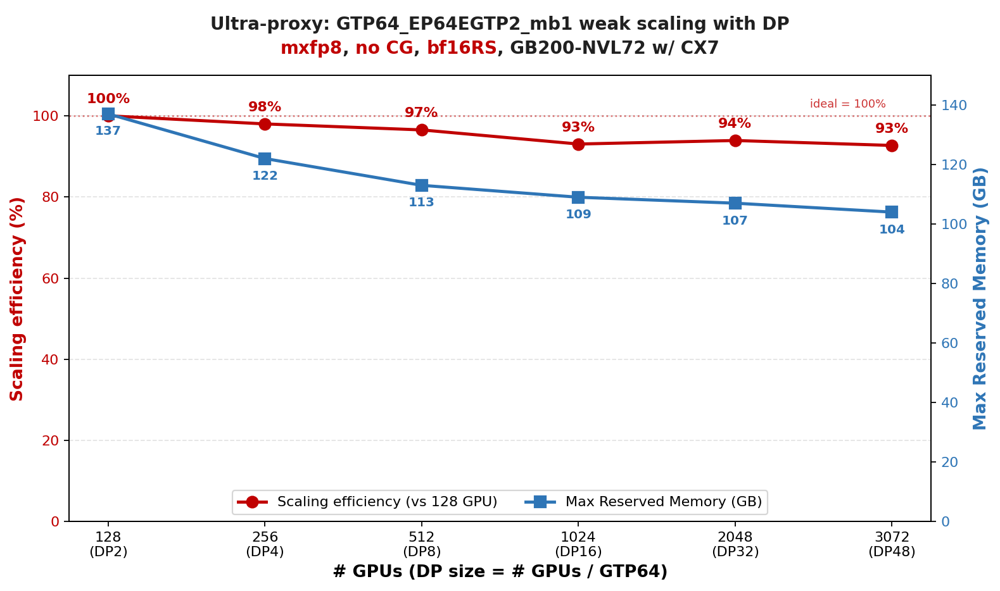
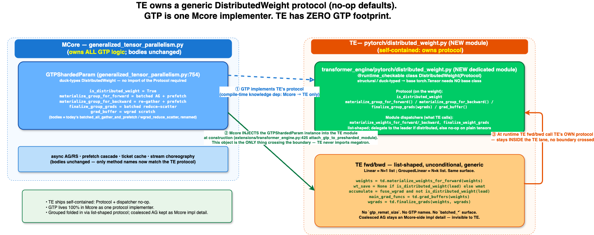
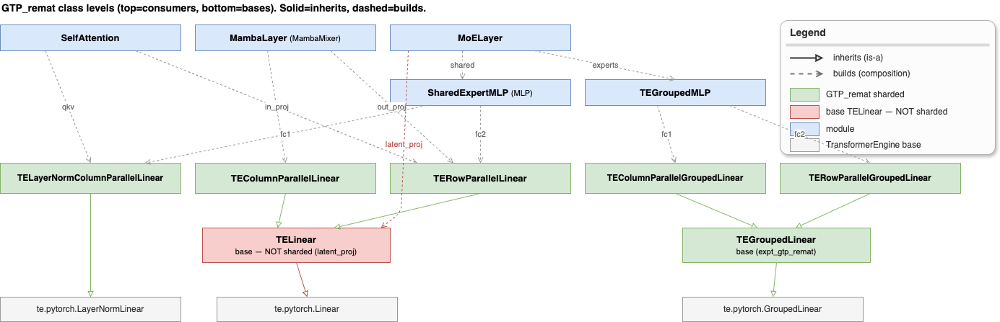
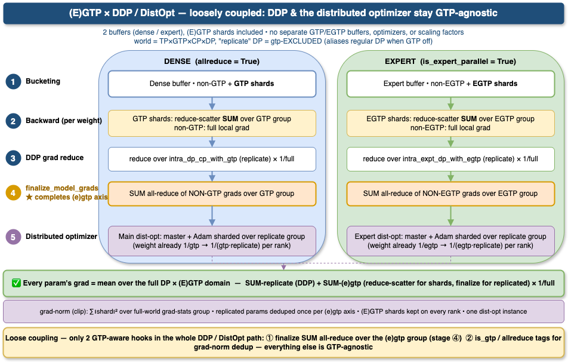
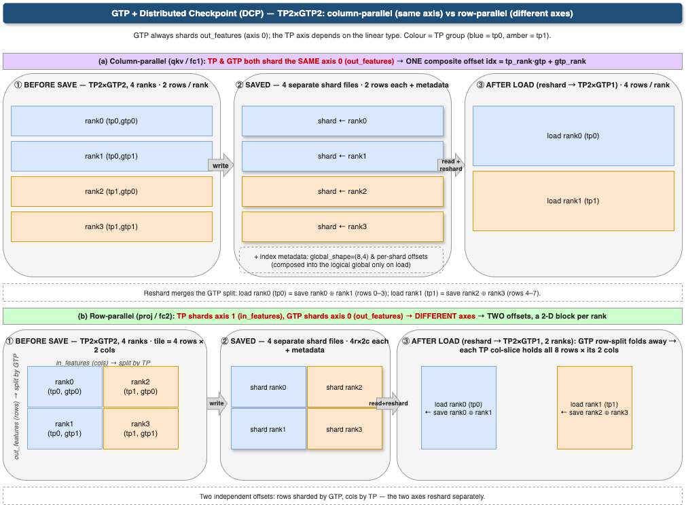
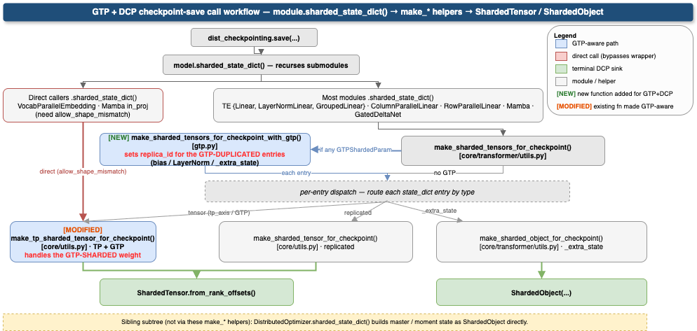
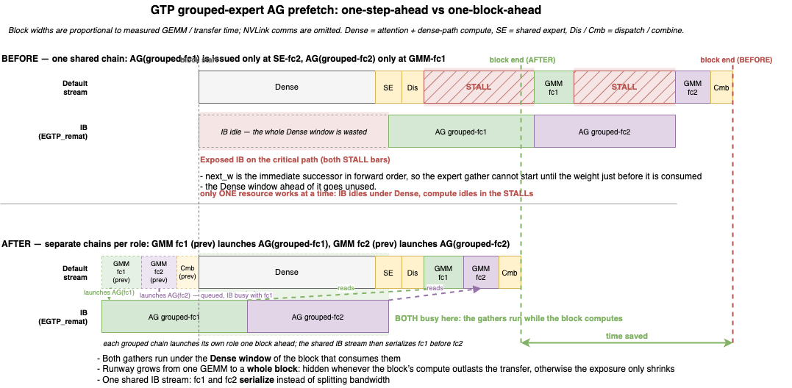

# Generalized Tensor Parallelism (GTP)

> ⚠️ **Experimental.** GTP is an experimental feature and its API, configuration, and behavior may change in future versions without notice.

> 📦 **Requires TransformerEngine >= 2.19** (GTP support is merged into TE main). On an older TE, GTP is disabled at import (`HAVE_GTP = False`) and enabling it raises an `ImportError` — please install TransformerEngine >= 2.19.

**Generalized Tensor Parallelism (GTP)** is a lightweight, high-performance, memory-efficient distributed-training strategy implemented jointly in Megatron-LM and TransformerEngine. It **shards weight tensors across a GTP process group and reconstructs them on demand via asynchronous all-gather**, so larger models fit in the same memory without sacrificing throughput — the communication is overlapped with computation rather than added to it.

GTP splits the weight-parallel domain into two orthogonal sub-axes — **`GTP = TP × GTP_remat`** — so every rank stores `1/(TP × GTP_remat)` of each linear weight, together with the matching slice of its gradient and optimizer state.

**GTP_remat is an implementation of ZeRO-3**, and obeys the same contract: shard the weight (plus grad and optimizer state), all-gather it just before it is needed, use it, free it, reduce-scatter the gradient on the way back. What distinguishes it from the familiar ZeRO-3 / FSDP implementations is *where* it shards and *how finely* it materializes:

- **It shards along a model-parallel axis, not the data-parallel one.** `GTP_remat` is a sub-axis of the weight-parallel grid that sits *on top of* TP — the `TP` slice stays sharded through the GEMM, and only the `GTP_remat` slice is rebuilt. It therefore composes with TP instead of competing with it for the same weight dimension.
- **It materializes one weight at a time, not a bucket.** Each `GTPShardedParam` gathers, computes and frees on its own schedule, which is what makes the per-weight prefetch chain (§3.4) and the low-precision gather (§1.3) possible — see the FSDP contrast in §1.1.

| slice | stored | at GEMM time |
|---|---|---|
| **`TP`** | `1/TP` of the weight, permanently | **stays sharded** — ordinary tensor parallelism; the output is TP-sharded |
| **`GTP_remat`** | `1/GTP_remat` of the TP slice, permanently | **rematerialized**: all-gathered across the `GTP_remat` group just before the GEMM, so the GEMM sees the full TP slice; freed afterwards, and the wgrad is reduce-scattered back on the way out |

Both `GTP_remat` collectives are prefetched one step ahead, so they overlap the previous layer's compute in forward *and* backward — the gather is off the critical path, not merely asynchronous. Note the two cuts do not always fall on the same axis of the weight (§1.4).

**Turning it on.** The `GTP_remat` degree is `gtp_weight_remat_size`, derived from `--tensor-parallel-num-weight-shards` (= `tensor_model_parallel_size × gtp_weight_remat_size`). At **`gtp_weight_remat_size = 1` GTP is inactive and the path is byte-identical to plain TP + DP**, so it is safe to leave in the code path. It composes orthogonally with TP / SP / EP / DDP / CUDA Graphs.

**Scope of this document**: a high-level summary of GTP_remat — design intent, public CLI surface, and Megatron-LM ↔ TransformerEngine integration touchpoints.

**Source**: core sharding and collective implementation in `megatron/core/tensor_parallel/generalized_tensor_parallelism.py`, CUDA-graph lifecycle support in `megatron/core/tensor_parallel/gtp_cuda_graphs.py`, and the public surface re-exported from `megatron/core/tensor_parallel/gtp_api.py`. Low-precision tensor primitives (FP8 / MXFP8 / NVFP4) stay in TransformerEngine and are imported by the implementation module.

**Outline:**

- [Generalized Tensor Parallelism (GTP)](#generalized-tensor-parallelism-gtp)
  - [1. Features](#1-features)
    - [1.1 Fine-grained, per-weight materialization \& gradient reduction](#11-fine-grained-per-weight-materialization--gradient-reduction)
    - [1.2 CUDA graph compatibility](#12-cuda-graph-compatibility)
    - [1.3 Low-precision gather (native FP8 / NVFP4 param)](#13-low-precision-gather-native-fp8--nvfp4-param)
      - [Per-microbatch schedule](#per-microbatch-schedule)
      - [Communication volume breakdown](#communication-volume-breakdown)
      - [GTP + NVFP4 (native NVFP4 param)](#gtp--nvfp4-native-nvfp4-param)
    - [1.4 Composability with TP / SP / EP / DDP](#14-composability-with-tp--sp--ep--ddp)
    - [1.5 Opt-in, minimally invasive integration](#15-opt-in-minimally-invasive-integration)
    - [1.6 Optimizer-agnostic (Adam + Muon)](#16-optimizer-agnostic-adam--muon)
    - [1.7 Scaling](#17-scaling)
    - [1.8 Native distributed checkpointing (DCP)](#18-native-distributed-checkpointing-dcp)
  - [2. Usage](#2-usage)
    - [2.1 Knob summary](#21-knob-summary)
    - [2.2 Required flags](#22-required-flags)
    - [2.3 High-priority streams (Blackwell and later)](#23-high-priority-streams-blackwell-and-later)
    - [2.4 Minimal end-to-end example](#24-minimal-end-to-end-example)
    - [2.5 Tuning knobs](#25-tuning-knobs)
    - [2.6 FP32-accumulation wgrad reduce-scatter (optional)](#26-fp32-accumulation-wgrad-reduce-scatter-optional)
    - [2.7 NCCL symmetric-memory wgrad reduce-scatter (optional)](#27-nccl-symmetric-memory-wgrad-reduce-scatter-optional)
  - [3. Implementation details](#3-implementation-details)
    - [3.1 GTP\_remat architecture (Mcore ↔ TE integration)](#31-gtp_remat-architecture-mcore--te-integration)
      - [What the flags do under the hood](#what-the-flags-do-under-the-hood)
      - [Class hierarchy: which linears shard](#class-hierarchy-which-linears-shard)
      - [Buffer / memory management](#buffer--memory-management)
      - [Overlap design summary](#overlap-design-summary)
        - [wgrad-before-dgrad schedule  *(deferred to a follow-up MR)*](#wgrad-before-dgrad-schedule--deferred-to-a-follow-up-mr)
        - [Recompute-forward prefetch chain  *(GTP\_remat + activation recompute)*](#recompute-forward-prefetch-chain--gtp_remat--activation-recompute)
    - [3.2 DDP buckets with (E)GTP\_remat](#32-ddp-buckets-with-egtp_remat)
      - [Ordering invariants](#ordering-invariants)
      - [Why this design works](#why-this-design-works)
      - [Bucketing and gradient scaling](#bucketing-and-gradient-scaling)
    - [3.3 Distributed checkpointing (DCP)](#33-distributed-checkpointing-dcp)
    - [3.4 Prefetch-chain construction and its design assumptions](#34-prefetch-chain-construction-and-its-design-assumptions)
      - [Grouped-expert chains (one-block-ahead)](#grouped-expert-chains-one-block-ahead)
    - [3.5 GTP\_remat + Multi-Token Prediction (MTP)](#35-gtp_remat--multi-token-prediction-mtp)
      - [What MTP does to the chain](#what-mtp-does-to-the-chain)
      - [How the chain supports it](#how-the-chain-supports-it)
      - [Configuration traps](#configuration-traps)
    - [3.6 CUDA graph integration](#36-cuda-graph-integration)
      - [Cross-graph backward reduce-scatter overlap](#cross-graph-backward-reduce-scatter-overlap)
  - [4. Testing](#4-testing)

---

## 1. Features

### 1.1 Fine-grained, per-weight materialization & gradient reduction

Each weight is sharded 1/N across a GTP_remat group along `out_features`, stored as a `GTPShardedParam` subclass of `nn.Parameter`. Materialization and gradient reduction are both **per-weight, per-call** — not per-model or per-module:

- **Independent state per param**: each has its own AG state (`state`) and RS state (`rs_state`) machines, both cycling `NONE → ASYNC_WAIT → DATA_READY → NONE` and tracked separately so fwd and bwd async ops don't interfere.
- **Prefetch chain for AG** (doubly-linked `prev_w` / `next_w`): during fwd, each weight's `all_gather_and_prefetch` issues async AG for `next_w`; during bwd, `all_gather_and_prefetch_bwd` issues async AG for `prev_w`. Layer *i*'s AG overlaps with layer *i−1*'s GEMM. For an L-layer model, L−1 all-gathers are fully hidden behind compute. When activation recompute is enabled, a **third** chain prefetches the recompute-forward gathers during backward — see §3.1 *Recompute-forward prefetch chain*. One GEMM of runway covers a gather that stays inside the NVLink domain, but **not one that leaves it** — the case for MoE routed-expert weights, which also dominate the bytes gathered per block; those get their own *one-block-ahead* chains — see §3.4 *Grouped-expert chains*.
- **Deferred RS finalize for wgrad**: `wgrad_reduce_scatter` on param *i* launches an **async** reduce-scatter (handle stashed in `_wgrad_rs_handle`) and returns `None` to autograd — the wgrad is NOT finalized into `main_grad` yet. Finalization is **deferred one step**: the next bwd step (param *i−1*'s `wgrad_reduce_scatter`) calls `self.next_w._wait_reduce_scatter()` + `_finalize_wgrad()`, which waits on the stashed handle, accumulates the reduced wgrad into `main_grad`, and fires the DDP `register_grad_ready` hook. The chain's head (first-in-fwd, last-in-bwd) uses a synchronous RS since nothing follows it. This one-step deferral is what lets layer *i*'s RS overlap with layer *i−1*'s bwd GEMMs.
- **Cold start only**: every weight's very first AG is synchronous (`DATA_READY_SYNC`, no prefetch has run yet); the async prefetch chain kicks in from the second forward onward.

Contrast with FSDP: FSDP gathers at module-group granularity in full precision with PyTorch-managed lifecycle. GTP_remat works at individual-weight granularity, in quantized form, with its own explicit ticket-based buffer pool and a one-step-deferred RS finalizer.

> **FSDP can't shrink into GTP_remat because FSDP's overlap is bucket-grained by design** — bucket granularity exists *to avoid* paying NCCL launch latency on tiny params (LayerNorm γ/β, biases, Mamba `dt_bias`/`D`/`A_log`) and *to avoid* the per-weight scheduling state that GTP_remat relies on (per-param prefetch chain, ticket-based buffer cache, stream choreography). Removing buckets doesn't make FSDP faster; it makes FSDP into GTP_remat, with all the engineering that entails — selective wrapping (only large GEMM weights), per-weight prefetch chain, per-param buffer ticket, and explicit AG/RS stream choreography on a side stream so external drains have something meaningful to wait on.

### 1.2 CUDA graph compatibility

CG compatibility is designed-in from day one, not retrofitted. The entire sync / buffer / chain architecture is shaped around making **captured fwd/bwd replays produce identical bit-for-bit behavior** — without the usual capture-vs-eager pitfalls that force other weight-sharding schemes to either disable CG or require special handling.

- **Chains never cross-link across the capture axis** (`GTPChain.GRAPHED` / `GTPChain.UNGRAPHED`, plus the eager-only grouped-expert chains of §3.4). `prev_w` / `next_w` only connect same-chain params, so a captured traversal never reaches into eager Python and vice-versa.
- **`torch.cuda.Event(external=True)`** for `ag_event` / `rs_event` — the events survive CG capture boundaries and can be waited on from replay-time streams.
- **Idempotent ticket cache**: `GTPWeightCache.get(ticket)` keeps `slot.buf` set even after `release()`, so replays read the same buffer address as capture. `clear()` drops buffers while keeping tickets valid → supports CG re-capture with lazy re-allocation.
- **Allocate-in-pool at creation** (`set_cuda_graph_mempool` + `cuda_graph_pool_allocation`): GRAPHED-chain AG/RS buffers and quantized weight storage are allocated **directly into the CG memory pool** at first creation (during warmup, before capture), so no CUDA allocations happen inside the captured graph and no post-hoc reallocation/clone is needed. UNGRAPHED buffers stay in regular allocator memory.
- **Lazy, one-shot chain linking**: `prefetch_initialized` is flipped during the first fwd (warmup), so the chain-construction Python side-effects never execute inside a captured graph. The link table is buffered and flushed atomically at the second forward.
- **DDP hook manual triggering**: `register_grad_accum_hook` stores the DDP hook on the param; `_CudagraphReplayNode.backward` calls it manually after replay (since `AccumulateGrad` hooks are silenced by replay). This is also how the `assert self.grad_reduce_handle is not None` failure from partial-CG + overlap-grad-reduce is resolved.
- **Warmup is side-effect-free on `main_grad`**: GTP_remat accumulates wgrad into `main_grad` *inside* the backward (the fusion path returns wgrads as graph outputs instead). Graph capture only *records* ops; it never runs them. But `create_fwd_graph` runs an **eager** warmup fwd+bwd before capturing. That warmup backward executes GTP_remat's `main_grad.add_`. Its deferred cascade adds into a cross-graph `next_w` (another module) from a **stale RS ticket** — the prior backward's wgrad. And `create_cudagraphs()` runs *after* `finalize_model_grads`. So this overwrites the finalized (reduced + per-token-scaled) grads and spikes the step's grad norm. **Fix**: `create_fwd_graph` snapshots the grads its warmup touches — own params + cross-graph `next_w` — via `_backup_grads_before_capture`, then restores them after capture. The bwd graph has no warmup, so it needs none. Bounded to one module's grads.
- **Graph-owned two-stage backward drain**: Stage 1 drains only the all-gathers issued by the current graph and records `bwd_completion_event`, allowing the next backward graph to start. Stage 2 drains that graph's reduce-scatters, accumulates the result into `main_grad`, and releases its persistent wgrad-ring slots. See [§3.6](#cross-graph-backward-reduce-scatter-overlap).
- **Side-stream registration**: the `(GRAPHED, gtp_remat_group)` ag/rs streams are materialized at runner init (`_register_gtp_side_streams`) so they are captured before the first forward.

### 1.3 Low-precision gather (native FP8 / NVFP4 param)

Wire bandwidth scales with the **quantized** size, not BF16 size — GTP_remat composes with low-precision training rather than fighting it. The shard is stored as a native **MXFP8**, native **NVFP4**, or **BF16** weight, gathered with the following mechanics:

- **Native MXFP8 param — `mxfp8` + `--fp8-param-gather` (always paired, see §2.1).** The shard **is** a native `MXFP8Tensor` (§3.1); the optimizer writes FP32 master → FP8 once per step (off the forward critical path), and the forward **all-gathers the FP8 shard directly** — no per-microbatch quantize, no cast. The rowwise (fwd) / columnwise (bwd) view comes from a *separate* gather-quantizer copy (`_gtp_gather_quantizer`), leaving the param's own quantizer for the optimizer's write path.
- **Native NVFP4 param — `--fp4-param-gather` (required).** Same shape as MXFP8: the shard **is** a native `NVFP4Tensor`, all-gathered as packed 4-bit (`kFloat4E2M1`) and optimizer-maintained, no per-microbatch quantize. See the *GTP + NVFP4* subsection below.
- **BF16 (no FP8/NVFP4 params).** The BF16 shard is all-gathered as-is.
- **Coalesced NCCL**: `grouped_gather_along_first_dim` uses `torch.distributed._coalescing_manager` to batch E experts' AGs into a single NCCL op.
- **Padding**: shards are allocated **already padded** so each rank's dim0 stays `pad_for_alignment`-divisible (MXFP8: 32). Column-parallel pads the per-TP slice (`out_features / tp_size`) to a multiple of `pad_for_alignment × gtp_remat_size` so it survives TE's TP split aligned; row-parallel / Megatron-local pad the TP-local tensor directly (§3.1). Padding lands contiguous at the tail, so stripping is one trailing slice (`tensor[:-pad_length]`).

#### Per-microbatch schedule

```
Steady-state fwd (MXFP8 native FP8 param / BF16):
    default: ──GEMM(W_0)───────────────────GEMM(W_1)───────────────────GEMM(W_2)──...
    ag_str:                       [AG_issue W_1]            [AG_issue W_2]
                              (no per-microbatch quantize: the FP8 shard is
                               maintained by the optimizer; BF16 gathers as-is)

Steady-state bwd (MXFP8 / BF16):
    default: ──bwd GEMMs(W_i)──...
    ag_str:               [AG_issue W_{i-1}]
                          (columnwise view of the same FP8 shard; no quant)
```

For the native-FP8 (MXFP8), native-NVFP4, and BF16 paths the forward all-gather is a **single** NCCL op per weight on the GTP_remat ncclStream, with no per-microbatch quantize or GTP_remat-group amax on the critical path (the standard DP-group FP8 amax allreduce in `reduce_and_update_fp8_tensors` is unchanged by GTP_remat). Only the `dist.all_gather` issue is wrapped in `with torch.cuda.stream(ag_stream)`; the NCCL kernel runs on c10d's private ncclStream and overlaps with the next GEMM until it reaches its wait.

#### Communication volume breakdown

Per-microbatch per-weight comm budget (assuming bf16 wgrad reduce-scatter):

| Format | Block | Data B/elem | Scale_inv B/elem | Per-elem | Fwd AR(amax)                   | Fwd AG | Bwd AG | Wgrad RS (bf16) | Total B/elem | vs BF16        |
|--------|-------|-------------|------------------|----------|--------------------------------|--------|--------|-----------------|--------------|----------------|
| BF16   | n/a   | 2.0000      | —                | 2.0000   | —                              | 2.0000 | 2.0000 | 2.0000          | 6.0000       | 1.00× (baseline) |
| MXFP8  | 32    | 1.0000      | 1/32 = 0.0313    | 1.0313   | — (microscale, no global amax) | 1.0313 | 1.0313 | 2.0000          | 4.0626       | 0.68× (–32%)   |
| NVFP4  | 16    | 0.5000      | 1/16 = 0.0625    | 0.5625   | — (scale set at opt-step quantize) | 0.5625 | 0.5625 | 2.0000          | 3.1250       | 0.52× (–48%)   |

How to read the columns:
- `Per-elem` = `Data B/elem + Scale_inv B/elem` — wire cost of one quantized weight buffer (data + scale_inv together).
- `Fwd AG` and `Bwd AG` each carry the quantized buffer once, so they equal `Per-elem`. Bwd all-gathers the same FP8 shard (columnwise view) — no re-quantize, no AR(amax).
- `Wgrad RS (bf16)` = 2.0 B/elem — gradient is reduce-scattered in bf16 regardless of weight precision.
- `Fwd AR(amax)` — none per microbatch for either native format: MXFP8 is microscale-only, and native NVFP4 carries its block scales in the gathered buffer with the per-tensor scale set at the optimizer-step quantize (not per forward).
- `Total B/elem` = `Fwd AG + Bwd AG + Wgrad RS` — there is no per-microbatch amax AR to add.

Gathering the pre-quantized weight attacks AG only: the AG portion shrinks ~72% from BF16 → NVFP4, but RS is untouched, so the wgrad RS becomes the dominant comm path in NVFP4 (~64% of the budget at bf16 RS, ~78% at fp32 RS).

#### GTP + NVFP4 (native NVFP4 param)

NVFP4 GTP_remat keeps each shard as a native `NVFP4Tensor` and all-gathers it as packed 4-bit (`kFloat4E2M1`) — the native-param path, mirroring native MXFP8: the distributed optimizer writes the NVFP4 shard directly once per step and the forward all-gathers it with no per-microbatch quantize.

- **`--fp4-param-gather` is mandatory.** Without it NVFP4 GTP falls back to a BF16 all-gather that trips TE's scaling-mode assert (`DELAYED` vs `NVFP4`); `validate_args` enforces it and raises early.
- **Mixed-precision models (per-layer quant config).** A model may assign recipes per layer — e.g. NVFP4 default, MXFP8 for `mixer.out_proj`, BF16 for attention (`linear_qkv`/`linear_proj`) and latent MLPs. NVFP4 params gather natively as above. **MXFP8 params cannot be native-param-gathered** — the DDP param buffer has no MXFP8 storage remap (`replace_raw_data` is unimplemented for `MXFP8Tensor`, unlike NVFP4's packed-rowwise remap), so they are all-gathered in **BF16** and re-quantized with the layer's **own MXFP8 quantizer** inside the TE backward dgrad path (not the global delayed recipe). BF16-recipe layers gather BF16 unchanged.

### 1.4 Composability with TP / SP / EP / DDP

- **TP** (intra-layer): orthogonal axis — GTP_remat shards `out_features` regardless of TP's parallel mode (column or row). 2D grid naturally formed via `tp_group × gtp_remat_group`.

> ⚠️ **The two cuts are not always on the same axis.** `GTP_remat` **always** slices `out_features` (dim 0) of the TP-local weight — independent of TP's `partition_dim`:
>
> | linear | TP cuts | `GTP_remat` cuts | |
> |---|---|---|---|
> | **column-parallel** (`linear_qkv`, `linear_fc1`) | `out_features` | `out_features` | same axis → `out_features/(TP × GTP_remat)` |
> | **row-parallel** (`linear_proj`, `linear_fc2`) | `in_features` | `out_features` | **perpendicular** → `in_features/TP` × `out_features/GTP_remat` |
> | **duplicated** (`fc1_latent_proj`, `fc2_latent_proj`) | none (weight replicated across TP) | `out_features` | GTP_remat only → `out_features/GTP_remat`; full output reconstructed via AG. Requires `--gtp-remat-opt-in-modules moe_latent_proj`. |

- **SP** (sequence-parallel): transparent — GTP_remat operates at weight dim, SP at sequence dim.
- **EP** (MoE): `GroupedLinear` with GTP_remat → each routed expert sharded across `EXPERT_GTP_WEIGHT_REMAT_GROUP`, independent of EP. MoE AllToAll (HybridEP/NVLink) runs independently of GTP_remat AG/RS (NCCL/IB).
- **DDP**: GTP_remat bypasses autograd's grad accumulator (async RS returns `None`; `_finalize_wgrad` accumulates directly into `main_grad`). DDP registers its grad-ready hook on GTP_remat params via `register_grad_accum_hook` (not autograd's `AccumulateGrad`); GTP_remat invokes it from `_finalize_wgrad` (eager path) and `_CudagraphReplayNode.backward` (captured path) **after** the wgrad lands in `main_grad`, so a bucket's DDP reduce-scatter runs strictly after every GTP_remat param's `{RS → main_grad add}` — never over a stale `main_grad` — and DDP↔GTP_remat NIC deadlock at IB scale is avoided. See §3.2.

### 1.5 Opt-in, minimally invasive integration

- **TE is GTP-agnostic.** Mcore builds the plain TE linear with an already-sharded `out_features` and attaches a `GTPShardedParam` *after* construction; TE dispatches through its generic **`DistributedWeight` protocol** (gates on `is_distributed_weight`) and takes no GTP argument, so there is no framework-level refactor and callers never thread a group (§3.1).
- **Opt-in by linear *class*; sharding stays per-*weight*.** Which linears participate is decided per TE class at construction — no `gtp_remat_group` is threaded through upper-level modules. Small tensors (LayerNorm γ/β, biases, Mamba SSM params, MoE router) always stay full; MoE latent-proj MLPs default to full but can be opted in via `--gtp-remat-opt-in-modules moe_latent_proj` when the projection size is large enough. See §3.1 [Class hierarchy](#class-hierarchy-which-linears-shard) for the full per-class breakdown.
- **Off is a byte-for-byte no-op.** When the resolved group is `None`/size-1, `_gtp_pre_init` leaves `out_features` unsharded and `_gtp_attach_post_init` short-circuits (as does `wrap_module_params_gtp` for Megatron-local linears); when `gtp_weight_remat_size == 1` the `layers.py` GTP_remat path is skipped entirely.
- **Chain setup is one pass.** `classify_gtp_chains(model)` walks `named_parameters()` once at init and sets `chain_id` on every `GTPShardedParam` from the current `cuda_graph_modules` (§3.4).
- **Knobs.** `GTPRematConfig.{pad_for_alignment, weight_prefetch, check_param_states}`, plus the debug-name tagger `tag_gtp_params_with_names` for readable link-table output.

### 1.6 Optimizer-agnostic (Adam + Muon)

GTP_remat runs under both the standard **Adam** `DistributedOptimizer` and **Muon** (the `LayerWiseDistributedOptimizer`), DCP save/load included:

- **Adam** shards optimizer state over the gtp_remat/egtp_remat-excluded replicate group, like any GTP_remat run (§3.2).
- **Muon** keeps matrix params *whole* (Newton–Schulz needs the full 2D weight). A GTP_remat-replicated whole param (e.g. MoE router, latent-proj MLPs by default) then lands on one checkpoint key shared by all GTP_remat peers, so the LayerWise optimizer folds `gtp_rank` into its `replica_id` — exactly one peer writes (the optimizer-state analog of the model-side fold in §3.3).
- **Native-FP8 optimizer-state matching (Muon path).** The save-side dequantize (§3.3) hands DCP a *fresh* BF16 tensor, which breaks the id-based optimizer-param → model-`ShardedTensor` match for every native-FP8 GTP_remat weight. The dequantized copy carries a `_gtp_dequant_src` backlink to the live FP8 param, and `_backfill_gtp_sharded_param_map` reuses the model's **own** entry (backlink first, tagged-name second) — preserving its full offsets (expert axes included) and `replica_id`. Only truly-unmatched params (the SSM `in_proj` weights, gathered+split factories) take the per-shard rebuild, which refuses expert-parallel params rather than emit EP-colliding shards.

Neither path adds a GTP_remat-specific checkpoint format or call site.

### 1.7 Scaling

Effective per-GPU weight size = `W / (TP × GTP_remat)`. Example: TP=4 + GTP_remat=8 with NVFP4 → 32× weight-memory reduction and 128× wire-bandwidth reduction vs full BF16 replication, before data parallelism.

**Weak scaling.** GTP_remat fixes the shard width and grows the job by adding data-parallel replicas (DP = #GPUs / GTP_remat), so per-GPU compute stays constant while only the DP gradient reduction widens with scale.

The best GTP_remat size is model- and cluster-dependent — driven by weight sizes, per-GPU memory headroom, and which collectives can be kept on fast links — so there is no single recommended value. The example below runs on **GB200 NVL72** (a 72-GPU NVLink domain) and uses **GTP64**, which places communication as:

- **NVLink-local:** the *dense-layer* (Mamba / attention / shared-expert) GTP_remat weight all-gather + wgrad reduce-scatter, **and** the `EP64` all-to-all dispatch/combine — all kept inside one ≤72-GPU NVLink domain (EP64 ≤ NVL72).
- **Inter-node (IB / CX7):** the DP gradient reduction **plus** the `EGTP2` expert-weight all-gather / wgrad reduce-scatter, whose 2 shards land on different NVLink domains and so cross nodes.

On an Ultra-proxy hybrid Mamba-MoE model (**~280B parameters**; `GTP64 · EP64 · EGTP2`, mb1, MXFP8, BF16 reduce-scatter, no CUDA graph), scaling efficiency holds **≥93 % of the single-domain (128-GPU / DP2) baseline out to 3072 GPUs (DP48)**, while max reserved memory *decreases* with scale (137 → 104 GB) as the distributed optimizer shards optimizer/grad state across more DP replicas.

> **Takeaway:** near-flat weak scaling — **≥93 % efficiency from 128 → 3072 GPUs**, with per-GPU memory shrinking as DP grows.



### 1.8 Native distributed checkpointing (DCP)

**GTP_remat + DCP is straightforward:**
- Reuses the existing checkpoint stack rather than adding a parallel one. GTP_remat-sharded weights *and* distributed-optimizer state save/load through the standard PyTorch / Mcore `torch_dist` sharded checkpoint, with **no GTP_remat-specific format or call path** and a tiny code footprint (one new helper + one helper made GTP_remat-aware).
- Checkpoints **reshard freely** across different `(TP, GTP_remat, EGTP_remat, DP, PP)` topologies — including a different GTP_remat/EGTP_remat size — with no offline conversion.

See [§3.3 Distributed checkpointing (DCP)](#33-distributed-checkpointing-dcp) for details.

---

## 2. Usage

GTP_remat is enabled through two CLI flags on Megatron's training launcher; everything else (process-group construction, parameter slicing, prefetch chain wiring, optimizer routing) is automatic once the flags are set.

### 2.1 Knob summary

The table below covers every GTP-related CLI flag and Python knob. "Required" means GTP either silently breaks or `arguments.py` asserts without it; "Recommended" means it should almost always be set in a real training run; "Optional" means it is off by default and tunable.

| Flag / knob | Kind | When to set | Default | Details |
|---|---|---|---|---|
| `--tensor-parallel-num-weight-shards` | **Required** | Always, to activate dense GTP | — | Total TP×GTP_remat shards per dense weight; GTP_remat degree = value ÷ TP. Must be ≥ TP and divisible by it. [§2.2](#22-required-flags) |
| `--expert-tensor-parallel-num-weight-shards` | **Required** | MoE models (to shard routed-expert weights) | — | Total ETP×EGTP_remat shards per expert weight; EGTP_remat degree = value ÷ ETP. Independent of dense axis. [§2.2](#22-required-flags) |
| `--gtp-remat-reduce-scatter-with-fp32-accumulation` | **Optional** | BF16 wgrads **and** GTP_remat axis ≥ 4 | off | Replaces the ring RS with an all-to-all + local FP32 sum to eliminate per-hop rounding error. Auto-bypassed at axis size ≤ 2. [§2.6](#26-fp32-accumulation-wgrad-reduce-scatter-optional) |
| `--gtp-remat-opt-in-modules` | **Optional** | MoE models with large `--moe-latent-size` | `[]` | Space-separated list of module tokens to opt in to GTP_remat sharding. Currently supported: `moe_latent_proj` (shards `fc1_latent_proj` / `fc2_latent_proj`; only beneficial when the latent size is large enough to amortize the all-gather). [§1.5](#15-opt-in-minimally-invasive-integration) |
| `--fp8-param-gather` | **Required** | GTP + `--fp8-recipe mxfp8` | off | Gathers native MXFP8 shard directly; without it the grad-buffer reuse path is unavailable and `arguments.py` asserts. Always paired with `--reuse-grad-buf-for-mxfp8-param-ag`. [§1.3](#13-low-precision-gather-native-fp8--nvfp4-param) |
| `--reuse-grad-buf-for-mxfp8-param-ag` | **Required** | GTP + `--fp8-recipe mxfp8` | off | Reuses the grad buffer for the MXFP8 all-gather (MXFP8 cannot map into the contiguous param buffer). Must accompany `--fp8-param-gather`. [§1.3](#13-low-precision-gather-native-fp8--nvfp4-param) |
| `--fp4-param-gather` | **Required** | GTP + `--fp4-format` | off | Gathers native NVFP4 shard directly; without it NVFP4 weights fall back to a BF16 gather that fails the backward GEMM. [§1.3 → GTP + NVFP4](#gtp--nvfp4-native-nvfp4-param) |
| `--high-priority-stream-groups ep gtp_remat expt_gtp_remat tp` | **Recommended** | Blackwell (GB200/GB300) and later | — | Gives GTP_remat comm streams the SM priority needed for AG/RS overlap with compute. Also export `CUDA_GRAPHS_USE_NODE_PRIORITY=1` when using CUDA graphs. [§2.3](#23-high-priority-streams-blackwell-and-later) |

**Python-only tuning knobs** (via `update_gtp_config`; rarely need changing):

| Knob | Default | Purpose |
|---|---|---|
| `pad_for_alignment` | auto (16 NVFP4, 32 MXFP8, 16 BF16) | Shard alignment; auto-set by `training.py` based on quantization recipe. |
| `weight_prefetch` | `True` | Disable only to debug the synchronous cold-start path. |
| `async_reduction` | `True` | Async wgrad reduce-scatter; disable for easier debugging. |
| `calculate_per_token_loss` | `False` | Must mirror `config.calculate_per_token_loss` (SUM vs MEAN RS). |
| `graph_wgrad_ring_size` | `2` | Persistent wgrad ring slots per scheduling domain (§3.6). Increase if capture rejects same-key writers. |

### 2.2 Required flags

```bash
# Total number of shards each dense weight (attention, mamba, MLP linears) is split into along
# out_features, across the tensor-parallel + GTP_remat axes. Must be >= --tensor-model-parallel-size and
# divisible by it. The GTP_remat degree is derived as num_weight_shards / tensor_model_parallel_size
# (e.g. TP=1 + num_weight_shards=2 -> GTP_remat=2; TP=2 + num_weight_shards=8 -> GTP_remat=4).
--tensor-parallel-num-weight-shards <num_weight_shards>

# Total number of shards each MoE routed-expert weight is split into along out_features, across the
# expert-tensor-parallel + expert-GTP_remat axes. Must be >= --expert-tensor-parallel-size and divisible
# by it. The expert-GTP_remat degree is derived as num_weight_shards / expert_tensor_parallel_size.
# Independent from --tensor-parallel-num-weight-shards; can be left unset for non-MoE models.
--expert-tensor-parallel-num-weight-shards <num_weight_shards>
```

> The (dense / expert) GTP_remat degree is exposed **only** through
> `--tensor-parallel-num-weight-shards` / `--expert-tensor-parallel-num-weight-shards`. The internal
> `gtp_weight_remat_size` / `expert_gtp_weight_remat_size` config fields are derived from them and
> have no CLI flag.

**Low precision (MXFP8).** GTP_remat + `--fp8-recipe mxfp8` **requires** both `--fp8-param-gather`
and `--reuse-grad-buf-for-mxfp8-param-ag` (`arguments.py` asserts this) — the weight is a native FP8
param, and since MXFP8 cannot map into the contiguous param buffer (`replace_raw_data` unsupported)
the all-gather reuses the grad buffer. Mechanism: §1.3, §3.1.

**Low precision (NVFP4).** GTP_remat + `--fp4-format` **requires** `--fp4-param-gather`
(`arguments.py` asserts this) — without it NVFP4 weights fall back to a BF16 gather that fails the
backward GEMM. Mechanism and mixed-recipe (MXFP8-override) handling: §1.3 → *GTP + NVFP4*.

### 2.3 High-priority streams (Blackwell and later)

Required on GB200 / GB300 so the GTP_remat comm streams get the SM priority needed for AG/RS overlap with compute:

```bash
--high-priority-stream-groups ep gtp_remat expt_gtp_remat tp
```

The launcher also exports `CUDA_GRAPHS_USE_NODE_PRIORITY=1` so captured CUDA graphs respect the inherited stream priority.

### 2.4 Minimal end-to-end example

```bash
# 4 ranks, TP=2 + GTP_remat=2 across out_features, BF16 weights.
# TP=2 + num-weight-shards=4 -> GTP_remat = 4 / 2 = 2.
torchrun --nproc-per-node 4 pretrain_gpt.py \
    --tensor-model-parallel-size 2 \
    --pipeline-model-parallel-size 1 \
    --tensor-parallel-num-weight-shards 4 \
    --expert-tensor-parallel-num-weight-shards 1 \
    --high-priority-stream-groups ep gtp_remat expt_gtp_remat \
    --bf16 \
    --num-layers 12 --hidden-size 1024 --num-attention-heads 16 \
    --seq-length 1024 --max-position-embeddings 1024 \
    --micro-batch-size 1 --global-batch-size 4 \
    --train-iters 10 \
    --use-mcore-models \
    --transformer-impl transformer_engine \
    --tokenizer-type NullTokenizer --vocab-size 32000 \
    --data-path <data> --split 99,1,0
```

At iter-0 you'll see one rank-0 log line confirming the active config:

```
GTP_remat enabled. GTPRematConfig(pad_for_alignment=16, check_param_states=False,
  weight_prefetch=True, async_reduction=True, calculate_per_token_loss=False,
  reduce_scatter_with_fp32_accumulation=False, graph_wgrad_ring_size=2)
```

### 2.5 Tuning knobs

Set via `from megatron.core.tensor_parallel.generalized_tensor_parallelism import GTP_CONFIG, update_gtp_config`:

```python
update_gtp_config(
    pad_for_alignment=16,         # NVFP4: 16, MXFP8: 32, BF16: any; auto-set in training.py
    weight_prefetch=True,         # Disable to debug the cold-start path
    async_reduction=True,         # Whether to perform GTP_remat gradient reduction asynchronously
    calculate_per_token_loss=False,  # Mirror config.calculate_per_token_loss (SUM vs MEAN RS)
    reduce_scatter_with_fp32_accumulation=False,  # wgrad RS: BF16 all-to-all + FP32 sum (§2.6)
    graph_wgrad_ring_size=2,      # Persistent wgrad slots per graph scheduling domain
)
```

`training.py` auto-tunes `pad_for_alignment` based on the quantization recipe (`--fp4`, `--fp8-recipe=mxfp8`, etc.) before model construction. The other knobs are usually left at defaults.

GTP backward reduce-scatter overlap across local CUDA-graph boundaries is enabled automatically. The ownership and ordering protocol is described in [§3.6](#cross-graph-backward-reduce-scatter-overlap).

> **CUDA-graph warmup under GTP_remat.** When CUDA graphs are enabled, GTP_remat forces a minimum of **2** per-graph warmup steps regardless of `--cuda-graph-warmup-steps` (e.g. a user-set `0` is bumped to `2`): the first warmup builds the weight-prefetch chain and the second exercises the prefetch path before capture.

### 2.6 FP32-accumulation wgrad reduce-scatter (optional)

```bash
--gtp-remat-reduce-scatter-with-fp32-accumulation      # default: off
```

**A ring reduce-scatter rounds the partial sum at every one of its `N-1` hops, so BF16 gradient error compounds with the axis size (≈`√N` for gradient-like data, worse when contributions share a sign). This flag replaces it with an all-to-all plus one local FP32 sum, eliminating that accumulation error for the same bytes on the wire.**

| | |
|---|---|
| **Use when** | wgrads are BF16 (the default) **and** the gtp_remat axis is ≥ 4 |
| **Skip when** | `--accumulate-allreduce-grads-in-fp32` is set, which already makes the wire and the accumulation FP32; or the axis is ≤ 2, where it is auto-bypassed |
| **Gain** | the `N-1` intermediate roundings disappear, leaving only the final downcast — so the error stops growing with the axis, and the benefit grows with it |
| **Cost** | one unsharded-wgrad-sized scratch buffer per in-flight reduce-scatter, plus a local FP32 sum and downcast at `wait()` time |

Implemented in `megatron/core/distributed/reduce_scatter_with_fp32_accumulation.py`. This is the
gtp_remat-axis analogue of `--ddp-reduce-scatter-with-fp32-accumulation` and **independent of
it** — a different collective over a different process group, so enable either, both, or neither.

**Behaviour notes**

- **The mean stays a pre-scale.** Both paths apply `1/gtp_remat` to the wgrad before the
  collective (§3.2 table); under `calculate_per_token_loss` the axis SUMs and no factor
  applies either way.
- **Auto-bypass at axis size ≤ 2.** The gate reads the per-chain group, so each axis decides
  independently: a `GTP_remat=8 × EGTP_remat=2` run gets FP32 accumulation on the dense weights
  and the plain reduce-scatter on the experts. A group with a registered symmetric pool (§2.7)
  also bypasses — the pool takes precedence.
- **Scratch lifetime.** The buffer comes from GTP's wgrad pool rather than a fresh `empty_like`,
  and is returned only once the handle is waited — it is the *input* to the deferred FP32 sum.
- **Batched (grouped / routed-expert) path.** The all-to-alls share one `ncclGroupStart/End` via
  `_coalescing_manager`, but the manager cannot serve as the handle: it waits only the NCCL work
  it collects, while each fp32-accum handle still owes a local FP32 sum. The sums are deferred
  behind it in one composite handle — which is why the all-to-alls are issued with
  `async_op=True`: for this primitive that flag defers the sum, it does not merely return a
  handle. (DDP's own flag sidesteps all this by asserting a single bucket.)

### 2.7 NCCL symmetric-memory wgrad reduce-scatter (optional)

```bash
--gtp-nccl-ub        # dense gtp_remat group          default: off
--egtp-nccl-ub       # routed-expert egtp_remat group  default: off
```

**Allocates the wgrad reduce-scatter send buffers from an NCCL-window-registered memory pool on the gtp_remat / egtp_remat group, so NCCL runs the reduce-scatter as a single symmetric device kernel — NVLS multimem within an NVLink domain, rail kernels when the group spans domains — instead of a ring.** Only the send side needs registration; the sharded output lands in the ordinary `main_grad`.

| | |
|---|---|
| **Use when** | NVLS-capable systems (NVSwitch, NCCL with symmetric-kernel support) where the gtp_remat wgrad reduce-scatter is exposed |
| **Skip when** | `--disable-symmetric-registration` is set (asserted incompatible) |
| **Gain** | in-switch reduction: fewer SMs and lower latency per reduce-scatter |
| **Cost** | a persistent registered pool of unsharded-wgrad-sized buffers per group, plus a one-time registration warmup; deregistered at shutdown |

**Behaviour notes**

- **Zero-copy producers.** Wgrads are written straight into the registered buffer — TE modules
  via the `DistributedWeight.grad_buffer` protocol, Megatron-native linears via an `out=` matmul
  (when the wgrad dtype matches `main_grad`). The untied embedding's wgrad is materialized by
  `F.embedding`'s own backward and pays one copy into the buffer.
- **FP32-accumulation interplay.** A registered pool takes precedence over §2.6 on its group:
  NCCL symmetric reduce-scatters provide equivalent numerics with better performance, so the
  group keeps the symmetric reduce-scatter and the fp32-accum all-to-all applies only to axes
  without a pool. E.g. `--gtp-nccl-ub` + §2.6 gives a symmetric dense-GTP reduce-scatter and
  the fp32-accum all-to-all on the EGTP axis.
- **Independent of `--use-nccl-ub`.** That flag registers DP-group (DDP bucket) buffers; these
  flags cover the gtp_remat axes only. Enable either, both, or neither.

---

## 3. Implementation details

### 3.1 GTP_remat architecture (Mcore ↔ TE integration)



**Ownership.** TE owns the linear primitives (`Linear` / `LayerNormLinear` / `LayerNormMLP` / `GroupedLinear`), the low-precision tensor types (FP8 / MXFP8 / NVFP4), and a generic **`DistributedWeight` protocol** (`transformer_engine/pytorch/distributed_weight.py`). Megatron owns **all** GTP_remat logic — sharding, the prefetch chain, the buffer cache, the AG/RS state machines, and DDP integration. **TE never names GTP.**

**The bridge** — three touch points, nothing more:

- **Construction.** Mcore pre-shards `out_features` (`_gtp_pre_init`) so plain TE builds *this rank's shard* directly; GTP is attached *after* build (`_gtp_attach_post_init`). TE takes no GTP argument.
- **Runtime.** TE's fwd/bwd gate on `is_distributed_weight(weight)` and call the generic list-shaped dispatchers (`materialize_weight_for_forward` / `materialize_weight_for_backward`, `finalize_weight_grads`). `GTPShardedParam` implements the protocol (`materialize_group_for_forward`/`_backward`, `finalize_group_grads`, `grad_buffer`); the concrete collectives (`all_gather_and_prefetch`, `wgrad_reduce_scatter`) live only in Megatron. A plain tensor is a no-op.
- **Streams.** `_register_gtp_side_streams` / drain calls synchronize TE's GEMMs with the side stream that owns the AG/RS NCCL ops.

**One init path, all precisions.** Since `out_features` is pre-sharded, TE builds the shard directly — native `MXFP8Tensor` (`--fp8-param-gather`), native `NVFP4Tensor` (`--fp4-param-gather`), or BF16 — **with no full weight ever materialized**. `attach_gtp_to_presharded_module` then turns it into a `GTPShardedParam`: a native quantized shard is reclassed in place to `GTP_<QuantTensorClass>` (stays buffer-resident on the quantized dist-opt path); a BF16 shard is re-registered (no slice — already shard-sized). The optimizer maintains the shard end-to-end, gathered each forward with **no per-microbatch re-quantize** (§1.3).

> **Per-GTP-rank init.** Each rank draws its *own* shard, so GTP weights need *distinct* random values per GTP_remat peer (else the gather would be `gtp_remat_size` identical blocks). `model_parallel_cuda_manual_seed` adds `gtp-remat-rng` / `egtp-remat-rng` trackers (offset per peer) that `_gtp_pre_init` routes init through; replicated params keep the shared trackers. Added only when the axis is active, so non-GTP runs keep a byte-identical tracker set.

> **Megatron-local linears** (`ColumnParallelLinear` etc. in `tensor_parallel/layers.py`) still build the full weight and slice post-init via `wrap_module_params_gtp` — unchanged.

#### What the flags do under the hood

The `--*-num-weight-shards` flags flow through five stages, from process groups to the prefetch chain:

1. **Process groups.** `initialize_model_parallel(...)` treats GTP_remat/EGTP_remat as **first-class orthogonal axes** (`world = TP·GTP_remat·CP·DP`; experts `= ETP·EP·EGTP_remat·PP·expert_dp`), building `_GTP_WEIGHT_REMAT_GROUP` and `_EXPERT_GTP_WEIGHT_REMAT_GROUP` (sizes = `num-weight-shards / TP` and `/ ETP`). **DP and gtp_remat stay orthogonal:** `get_data_parallel_group()` is the replicate axis (DDP + optimizer shard over it); `with_gtp_remat=True` gives the combined DP × gtp_remat axis for data distribution.

   > **Batch-size arithmetic.** `args.data_parallel_size` is the **replicate degree only** — gtp_remat is *divided out* of it (folded into `total_model_size` at `arguments.py:446`). But data is distributed over the **full DP × gtp_remat axis**, so each gtp_remat peer consumes a *distinct* microbatch and the global sample count is `micro_batch_size × data_parallel_size × gtp_weight_remat_size × num_microbatches`. The training loop therefore **re-applies `gtp_weight_remat_size`** to close the gap: *multiplied back in* for the LR-scheduler `increment` and the logged `batch_size`, *divided back out* to recover `eval_num_microbatches`. Without this it would read as a double-count — it is not.

2. **Per-class sharding.** `extensions/transformer_engine.py` decides *per linear class* whether to shard, so **no `gtp_remat_group` is threaded through the module APIs** (attention, Mamba, MLP, embedding, MTP). Dense wrappers resolve the group via `utils.get_gtp_weight_remat_group(...)`; `TEGroupedLinear` uses `pg_collection.expt_gtp_remat`. Group `None`/size-1 → left full; otherwise `_gtp_pre_init` pre-shards `out_features` and `_gtp_attach_post_init` makes the shard a **`GTPShardedParam`** (the `DistributedWeight` implementer; native FP8/NVFP4 by reclass, BF16 by re-register). Base `te.Linear` (MoE latent projections) receives a group only when `--gtp-remat-opt-in-modules moe_latent_proj` is set; otherwise it stays full → see [Class hierarchy](#class-hierarchy-which-linears-shard).

3. **Gradients (DDP).** GTP_remat shards are ordinary DDP params in the usual dense/expert buffers, reduced over the **replicate** group. The gtp_remat axis is completed separately: **GTP shards by their reduce-scatter, replicated params by an all-reduce** in `finalize_model_grads` (mean-vs-sum per `calculate_per_token_loss`) → see §3.2.

4. **Optimizer.** State is sharded over the same replicate group; **global-norm clipping** reduces over the dist-opt grad-stats group spanning the full world (incl. gtp_remat/egtp_remat), counting replicated params **once per axis** to avoid over-counting.

5. **Prefetch chains.** `classify_gtp_chains(model)` runs once after build (`get_model`) and wires each `GTPShardedParam` into a **`GRAPHED`/`UNGRAPHED`** chain from `cuda_graph_modules` → see [§3.4 Prefetch-chain construction](#34-prefetch-chain-construction-and-its-design-assumptions).

#### Class hierarchy: which linears shard

The figure visualizes the per-class split from the list above: green = resolves a GTP_remat group and shards, red = base `TELinear` (MoE latent projections, full by default; opt-in via `--gtp-remat-opt-in-modules moe_latent_proj`). Dashed arrows are *builds* (module → leaf); solid arrows are *inherits* (leaf → TE primitive).



#### Buffer / memory management

Two distinct pools with explicit lifecycle rules:

- **`GTPWeightCache`** (AG/RS output buffers) — ticket-based, keyed on `(shape, dtype, fwd, expert_idx, reduce_scatter)`, plus a `("recompute", parity)` suffix for recompute-chain gathers. Same-shape buffers across layers are shared, **except between chain neighbours** — one-step-ahead keeps the predecessor and the current weight live at once, so `_ensure_no_shared_buffer_with` folds a parity bit into the key when the two would collide, at the cost of one extra buffer for the second of the pair. The caller names which chain to guard, because the chains disagree on who a weight's neighbour is: on the fwd chain the check is normally inert (neighbours are different roles, hence different shapes) and fires only when CG capture leaves two same-shaped weights adjacent — embedding + output_layer alone in the `UNGRAPHED` chain — whereas on a recompute chain same-shape adjacency is the norm. Tickets persistent; buffer allocated lazily on first `get()`; addresses stable across iterations for CG replay.
- **`_wgrad_buf_pool`** (wgrad-GEMM output recycling) — holds the **full, unsharded** wgrad-GEMM output buffer (shape `_unsharded_shape`, dtype `main_grad.dtype` — fp32 when `grad_reduce_in_fp32`, else bf16). The TE backward writes the wgrad into it via `main_grad_func = weight.grad_buffer` (a `DistributedWeight` protocol method backed by `get_wgrad_tensor`; it is a *scratch*, distinct from the sharded `param.main_grad`); the protocol's `finalize_group_grads` (backed by `wgrad_reduce_scatter`) then reduce-scatters it down to the shard and the buffer is returned here. This is a full-weight-shaped fp32/bf16 transient — one of the larger per-weight buffers — and is **precision-independent** (wgrad is always computed in high precision), so it is identical in BF16 vs MXFP8 runs. Buffers are tagged `_from_gtp_wgrad_pool=True` at `_wgrad_pool_get`; `_wgrad_pool_put` no-ops on foreign buffers (fresh allocs from Megatron `layers.py` or aten F.embedding bwd) → caching allocator handles those, so the pool never accumulates untagged buffers.

#### Overlap design summary

```
fwd:  AG(W_{i+1}) ∥ GEMM(W_i)                              ∥ CG replay of captured layers
bwd:  AG(W_{i-1}) ∥ dgrad(W_i) → wgrad(W_i) ∥ RS(wgrad_i)  ∥ [finalize wgrad_{i+1} + DDP hook]
```

GTP_remat runs up to **three** independent prefetch chains, all following one rule — *prefetch the weight the next consume will need*:

| # | when | consume | prefetch (overlap) | AG direction | slot |
|---|------|---------|--------------------|--------------|------|
| 1 | fwd | weight `i` | `next_w` = i+1 ‖ `GEMM_i` | rowwise (`fwd=True`) | `_prefetch_handle` |
| 2 | bwd dgrad | weight `i` | `prev_w` = i−1 ‖ `Dgrad_i` | columnwise (`fwd=False`) | `_prefetch_handle` |
| 3 | bwd recompute | weight `i` | `_recompute_next` = i+1 ‖ `recompute_GEMM_i` | rowwise (`fwd=True`) | `_recompute_prefetch_handle` + `_ag_ticket_recompute` (separate) |
| 1b | fwd (MoE, eager) | expert weight `i` | same role in MoE block i+1 ‖ *whole block i* | rowwise (`fwd=True`) | `_prefetch_handle` |

Row 1b is chain 1 applied to a *homogeneous* chain: routed-expert `fc1`/`fc2` link across consecutive MoE blocks, so the runway is a full block rather than one GEMM (§3.4 *Grouped-expert chains*).

Chain 3 exists only when activation recompute is on. It mirrors chain 1 (rowwise, prefetch `next`) but runs *during* backward, so it overlaps chain 2 in time on the same weight — hence its **own** slot. fwd (1) and bwd-dgrad (2) never overlap in time, so they safely share `_prefetch_handle`. See *Recompute-forward prefetch chain* below.

At bwd step *i* the step is launching *RS of wgrad_i* while finalizing the *previous* iter's wgrad (`wgrad_{i+1}` in bwd order = the next-one-over in fwd order). That one-step deferral is what makes the RS run concurrent with the next layer's dgrad/wgrad GEMMs instead of blocking after every layer.

Communication never blocks compute except at the very first layer of each direction (cold start) and at enforced serialization points (CG/eager drains, finalize-grads barrier).

##### wgrad-before-dgrad schedule  *(deferred to a follow-up MR)*

Current behavior: backward always runs dgrad GEMM, then wgrad GEMM, then issues the GTP_remat wgrad RS — the RS overlaps with the *next* layer's bwd GEMMs (the one-step deferral above).

A future MR will add an opt-in wgrad-before-dgrad schedule on `_Linear` / `_LayerNormLinear` so the GTP_remat wgrad RS NCCL overlaps with the dgrad GEMM of the **same** layer (best for the GTP_remat + no-TP case).

##### Recompute-forward prefetch chain  *(GTP_remat + activation recompute)*

When a GTP_remat-sharded module is in `--recompute-modules` (e.g. `shared_experts`), its forward is **re-run during backward** to regenerate activations. That recompute-forward must all-gather each weight **rowwise** again — a *third* gather lifecycle, concurrent with the in-flight **columnwise** dgrad gather of the *same* weight. Since both share one `GTPShardedParam`, the recompute path gets its **own** prefetch slot (`_recompute_prefetch_handle` / `_recompute_ag_event`) so it never clobbers the dgrad lifecycle's `state` / `_prefetch_handle` / `ag_event`, and its **own** buffer ticket (`_ag_ticket_recompute`) with a parity of its own. Reusing `_ag_ticket_fwd` is unsafe twice over: a fwd prefetch may still be in flight in that buffer, and the fwd parity is decided against `prev_w` — a different neighbour. Without its own parity, consecutive recompute nodes share one buffer and the one-ahead prefetch overwrites the weight still being read: silent wrong activations, then NaN.

The recompute weights form a **separate** linked list (`_recompute_next`), **self-populated** on the first backward from the weights actually re-gathered while `in_fp8_activation_recompute_phase()` is true — membership is *observed*, not configured (no tagging, so it tracks exactly what each checkpointed module re-gathers). Each recompute-forward consume prefetches the next recompute weight, so every gather **except the global-first** overlaps preceding recompute / dgrad / wgrad compute:

```
recompute-fwd of shared_experts  (per layer: GEMM fc1 → SReLU → GEMM fc2, then dgrad+wgrad)

  Before (on-demand):
    default: AG(fc1)─GEMM fc1─SReLU─AG(fc2)─GEMM fc2─dgrad─wgrad─...   every AG exposed
  After (recompute chain):
    default:         GEMM fc1─SReLU─GEMM fc2─dgrad─wgrad─GEMM fc1'─... back-to-back
    ag_str:  AG(fc1)        [AG fc2]        [AG fc1' (next layer)]     only AG(fc1) exposed
```

`AG(fc2)` is issued at `fc1`'s consume (overlaps GEMM fc1 + SReLU); `AG(fc1')` for the next layer is issued at `fc2`'s consume, so it overlaps the **whole** layer's `dgrad + wgrad` window. The cross-layer link is what hides every region head except the very first.

Under **full-iteration CUDA graphs** the recompute-forward is captured; `wait_async_comms(GRAPHED)` drains the recompute handle too (sets `_recompute_already_drained`) so the captured consumer skips its cross-graph wait — the same producer-drain pattern as the fwd/bwd chains.

> **When *not* to recompute a GTP_remat weight.** Recompute on a GTP_remat-sharded weight adds this extra rowwise gather. For MLP-like blocks at short context (`SeqLen ≤ 2 × HiddenSize`), GTP_remat-sharding the weight saves *more* memory than recomputing its activations, so the better trade is to keep such modules GTP_remat-sharded and **out** of `--recompute-modules` (offload their activations if needed) — avoiding the third gather entirely. Build the recompute chain only for modules that genuinely need both.

### 3.2 DDP buckets with (E)GTP_remat



**(E)GTP_remat is *super loosely coupled* to DDP and the distributed optimizer — they stay completely GTP_remat-agnostic.** GTP_remat is just another sub-axis of the rank grid (`world = TP×GTP_remat×CP×DP`); a GTP_remat-sharded weight rides the *exact same* code path as an ordinary param. There are **no** GTP_remat/EGTP_remat-specific buffers, optimizers, gradient-scaling factors, or bucket groups. The entire DDP/DistOpt stack touches GTP_remat in only **three** narrow places:

1. **finalize all-reduce** (`_allreduce_replicated_grads_over_gtp_remat_group`) — completes the gtp_remat axis for *replicated* (non-GTP_remat) params (SUM under `calculate_per_token_loss`, AVG otherwise; see §3.2 table); a no-op when GTP_remat is inactive.
2. **`is_gtp_weight_remat` / `allreduce` tags** propagated onto the optimizer's master shards — consumed only by the grad-norm dedup filter.
3. **grad-ready hook routing** (`DistributedDataParallel.__init__`) — for a GTP_remat param, DDP registers its backward post-hook via GTP_remat's `register_grad_accum_hook` instead of autograd's `AccumulateGrad`. GTP_remat fires it from `_handle_megatron_grad_accum` **after** the per-param `{wgrad RS → main_grad add}`. This enforces the invariant below; a no-op (plain autograd path) when GTP_remat is inactive.

#### Ordering invariants

> **Ordering invariant (gradients).** A bucket's DDP gradient reduction (the reduce-scatter / all-to-all + local fp32 accumulation) runs **strictly after every GTP_remat param in that bucket has finished `{GTP_remat wgrad RS → main_grad add}`**. `register_grad_ready` only fires the bucket collective once *all* its params are ready, and for GTP_remat params "ready" is signalled by GTP_remat after the add — never by autograd's `AccumulateGrad`, which (because the wgrad RS is async and its `main_grad` accumulation is deferred to a later backward node) can fire **before** the add and would make the bucket reduce read a stale/empty `main_grad` (notably under `reduce_scatter_with_fp32_accumulation`).

**Parameter publication under `--overlap-param-gather`.** DDP publishes a bucket group *lazily*: its parameter all-gather (and post-gather quantize, `_post_param_sync`) is drained from the forward pre-hook of a module owning one of that bucket's parameters. GTP_remat consumes weights *ahead* of that module (§3.4), so when the consumed weight and the prefetch target sit in different bucket groups, the target may not be published yet. GTP_remat therefore asks for it first, at the top of `_all_gather_weight`:

```text
time -------------------------------------------------------------------------->
compute      pre-hook(fc0) -> GEMM(w0) -> [stall] -------> pre-hook(fc1): no-op
                                | ensure_params_ready(w1)
                                v
DDP AG       +---------------- AG(bucket B1) --->| quantize
GTP ag_strm                                      +-- AG(w1) reads FRESH --> GEMM(w1)
```

The request goes through a **backend-agnostic** hook:

- **Contract** (`megatron/core/utils.py`): a backend attaches a zero-argument callable under `PARAM_READY_CALLBACK_ATTR`; a consumer reading `param.data` outside the owning module's pre-hook calls `ensure_params_ready(params)` first. Unmarked params no-op, so the contract is open to FSDP or any other backend.
- **Neither side names the other**: DDP registers one `_BucketParamReadyCallback` per bucket group (weakly held), knowing nothing of GTP_remat; GTP_remat calls `ensure_params_ready`, knowing nothing of DDP.
- **Forward only**: backward re-reads what forward published, and recompute runs *inside* backward, where publishing could gather into the buffer that aliases grads under `--reuse-grad-buf-for-mxfp8-param-ag`.
- **Cost**: publishing early can *start* an undispatched gather and chain-dispatch the next bucket, draining it about one block earlier than the pre-hook would — so that bucket loses some gather/compute overlap. Negligible when the gather was already dispatched early, as `--align-param-gather` and `--overlap-param-gather-with-optimizer-step` do.
- **Not covered — CUDA-graph capture**: no collective may be issued during capture, so the callback no-ops and the captured gather carries no dependency on DDP's. A consumer that captures its reads must publish before launching.

#### Why this design works

Everything else — bucketing, the reduce-scatter/all-reduce schedule and its overlap, master-state sharding, grad clipping, the checkpoint format — is unchanged and unaware of GTP_remat.

- **Free reuse of a mature stack.** GTP_remat inherits DDP's bucketing + comm/compute overlap, the distributed optimizer's fp32-master + Adam-moment sharding, grad-norm/clip, and the existing checkpoint format — no parallel re-implementation to write or maintain (contrast FSDP, which replaces all of these).
- **Orthogonal composability.** Because GTP_remat is a rank-grid sub-axis cut along `out_features` (dim 0, whichever axis TP used), it composes with TP/EP/CP/PP and the DistOpt the same way TP does — no special nesting logic.
- **Zero-cost when off.** With GTP_remat disabled the gtp_remat axis is size-1 and the hooks become no-ops, so non-GTP_remat runs hit byte-identical behavior — GTP_remat can be toggled without forking the DDP/optimizer code paths.
- **Small, auditable surface.** These three hooks are the whole integration contract, which is what makes the correctness argument below tractable.

#### Bucketing and gradient scaling

DDP groups parameters into **two buffers** by `is_expert_parallel` (MoE tag) — a dense buffer and an expert buffer. GTP_remat/EGTP_remat shards are **merged into** these buffers like ordinary params (no separate GTP_remat/EGTP_remat buckets): they reduce over the replicate group (the default `intra_dp_cp_group` / `intra_expt_dp_group`).

The DP collective only covers the replicate axis; the gtp_remat axis is completed separately, and **how both axes are scaled depends on the loss normalization** (`config.calculate_per_token_loss`). In all cases each gtp_remat contribution is summed exactly once:

| | `calculate_per_token_loss=False` (default) | `calculate_per_token_loss=True` |
|---|---|---|
| DDP pre-scale (`gradient_scaling_factor`) | `1/replicate` (= `1/dp_cp_group.size()`) | `1.0` (no pre-scale) |
| gtp_remat reduce-scatter (sharded weights) | **MEAN** (pre-scale wgrad by `1/gtp_remat`) | **SUM** (plain reduce-scatter) |
| finalize over gtp_remat (replicated params) | **AVG** all-reduce | **SUM** all-reduce |
| final normalization | net grad = full `(replicate × gtp_remat)` **mean** | grads summed over all axes, then `÷ total_global_tokens` in `finalize_model_grads` |

- **Default (mean) path** decouples gradient scaling from the gtp_remat degree: the DP `1/replicate` mean × the reduce-scatter `1/gtp_remat` mean (sharded weights) — or × the finalize AVG (replicated params) — equals the exact full mean, independent of the gtp_remat axis size.
- **`--gtp-remat-reduce-scatter-with-fp32-accumulation` swaps the collective, not the scaling**
  — this table applies unchanged (§2.6).
- **Per-token-loss path** must SUM over gtp_remat (like the DP axis): `total_global_tokens` already counts the gtp_remat peers' distinct tokens, so the single `÷ total_global_tokens` does all normalization. A `1/gtp_remat` mean here would shrink every gtp_remat gradient by `1/gtp_remat` (grad-norm mismatch + divergence), so the reduce-scatter mean and finalize AVG are both gated on `not calculate_per_token_loss`.

> **`average_in_collective` must be off (the default).** The default-path scaling is a *pre-scale* applied before a SUM collective. `average_in_collective=True` instead uses NCCL AVG over the collective's own (replicate) group, which interacts incorrectly with the gtp_remat completion. Asserted via `ProcessGroupCollection.is_gtp_remat_active` in both `arguments.py` (training) and `DistributedDataParallel.__init__` (direct megatron-core users). (Independently, `calculate_per_token_loss` already forbids `average_in_collective`.)

**Buffer caching.** The per-buffer lists are concatenated once at init into a single flat view for fast iteration in the grad-reduction hot path.

> **Single distopt instance with GTP_remat.** GTP_remat currently requires `num_distributed_optimizer_instances == 1` (asserted in `parallel_state.py`): partial-distopt sharding of the data domain would need gtp_remat-aware sizing. The dist-opt grad-stats group is therefore the full world.

### 3.3 Distributed checkpointing (DCP)



GTP_remat supports **PyTorch / Mcore sharded distributed checkpointing** (`--ckpt-format torch_dist`, the `megatron.core.dist_checkpointing` `ShardedTensor` / `ShardedObject` format) for **both model weights and distributed-optimizer state**. Checkpoints are **fully resharding-capable**: a checkpoint saved at one `(TP, GTP_remat, EGTP_remat, DP, PP)` topology can be loaded at a *different* one — including a different GTP_remat/EGTP_remat size — without an offline conversion step.

Consistent with §3.2, GTP_remat stays *loosely coupled* to the checkpoint stack: there is **no GTP_remat-specific checkpoint format or call path**. The shared `make_sharded_tensors_for_checkpoint` helper became GTP_remat-aware and **delegates internally** to a GTP_remat variant only when the `state_dict` actually contains a `GTPShardedParam` (a no-op otherwise), so call sites are unchanged and non-GTP_remat runs are byte-identical.

**Save-side call workflow.** The diagram below traces the save path — from `model.sharded_state_dict()` through the `make_*` helpers down to the terminal `ShardedTensor` / `ShardedObject` sinks. The GTP_remat footprint is deliberately tiny: exactly **one new function** (`make_sharded_tensors_for_checkpoint_with_gtp_remat`, in `gtp.py`, which sets `replica_id` for the GTP_remat-*duplicated* entries) plus **one modified function** (the per-tensor `make_tp_sharded_tensor_for_checkpoint` in `core/utils.py`, made GTP_remat-aware in place to emit the GTP_remat-*sharded* offsets). Every other helper is untouched.



**How a GTP_remat weight is described to DCP.** GTP_remat always shards `out_features` (axis 0). The helper layers that GTP_remat split onto the existing TP offsets in the `ShardedTensor`, so the global tensor DCP sees is the *full, unsharded* weight:

| Weight kind | TP axis | Emitted axis-0 offset | Other axis |
|-------------|---------|------------------------|------------|
| Column-parallel (qkv, fc1) | 0 (same as GTP_remat) | composite `(tp_rank·gtp_remat + gtp_rank, tp·gtp_remat)` | — |
| Row-parallel (proj, fc2) | 1 | GTP_remat-only `(gtp_rank, gtp_remat)` | TP offset on axis 1 |
| No TP (GTP_remat-only) | – | `(gtp_rank, gtp_remat)` | — |

Because the offsets reconstruct the global shape, the checkpoint is independent of the save-time grid. On load, DCP reads each rank's `[offset : offset+local]` slice from that global and re-tiles it onto the new grid — e.g. `TP1×GTP2`, `TP2×GTP4`, or a DP change.

**replica_id.** GTP_remat peers hold *distinct* shards (not replicas), so they're disambiguated by their offsets; `replica_id`'s DP coordinate is the GTP_remat-*excluded* replicate rank (one elected writer per shard, per replicate group). **Replicated** tensors that live alongside GTP_remat weights (LayerNorm γ/β, biases, `_extra_state` objects) would otherwise collide across GTP_remat peers, so the helper folds `gtp_rank` into their `replica_id` — exactly one peer is then elected DCP writer per key.

**`_extra_state`.** This is TransformerEngine's per-module **FP8 calibration state** — for delayed-scaling recipes it holds the `recipe`, the forward/backward `scale` tensors and `amax_history` buffers, plus picklable `extra_fp8_variables`; for BF16 (non-FP8) runs it is an empty tensor. Because it is a pickled byte blob rather than a tensor with a meaningful shape, it is emitted as a `ShardedObject` (via `make_sharded_object_for_checkpoint`), not a `ShardedTensor`. Its amax/scale statistics are *per-tensor globals* for the **full** weight (amax is reduced across the FP8 group), so every GTP_remat peer carries an identical copy — which is exactly why it takes the replicated path above, with `gtp_rank` folded into its `replica_id`.

**Alignment padding & cross-topology reshard.** When `_gtp_slice_one_param` pads `out_features` to a multiple of `gtp_remat_size · pad_for_alignment`, the saved global describes the *padded* shape, so the helper sets `allow_shape_mismatch=True`. DCP then tolerates a load-side topology whose alignment yields a different padded size — the unpadded data overlaps and the tail pad rows are zeros GTP_remat recomputes.

> Note: the SSM `in_proj` weights — Mamba's (`mamba_mixer.py`, split `[z|x|B|C|dt]`) and gated-delta-product's (`gated_delta_product.py`, split householder-major into `z|V*|K*|Q|b*|a`) — are a special case: each **all-gathers its GTP_remat shards** back to the logical TP-local size and strips the pad *before* saving, so its global is topology-independent and needs no `allow_shape_mismatch`. This is required, not just tidier: the split-chunk boundaries do not line up with the GTP_remat slice boundaries, so a raw shard cannot be split at all. The checkpoint therefore matches a non-GTP_remat run byte-for-byte.
>
> On **load**, the split factory's `merge_fn` is wrapped to invert this: it cats the chunks back to the unpadded TP-local width, re-pads with zeros up to `gtp_remat_local_size · gtp_remat_size`, and slices by the GTP_remat rank — mirroring `_gtp_slice_one_param` so the tensor lands in the live shard's layout. `gtp_remat_size == 1` skips both the gather and the pad/slice.

**Optimizer state.** The distributed optimizer's master/moment `ShardedObject`s are keyed by `dp_group_idx`. Under GTP_remat/EGTP_remat each peer owns a *different* master shard (the optimizer shards over the gtp_remat/egtp_remat-**excluded** replicate group), so the index is taken from the gtp_remat/egtp_remat-**merged** model-parallel group (`mp_group` for dense, `expt_tp_pp_with_egtp_remat_group` for expert) — giving every peer a distinct key while replicate-group ranks remain true replicas under that key.

**Pre-save forced param-sync.** Before a save (and around any `disable_forward_pre_hook(param_sync=True)`, e.g. pre-eval), the training loop force-syncs DDP params. `force_param_sync` / `disable_forward_pre_hook` first call `optimizer.prepare_model_params_for_param_sync()`, which copies the FP32 masters into the DDP param buffer, so the sync's `_post_param_sync` copy-back re-quantizes each native-FP8 weight — GTP_remat shards included — from up-to-date masters instead of stale grad scratch under `--reuse-grad-buf-for-mxfp8-param-ag`. The copy-back therefore writes the correct MXFP8 shard, so the forced sync leaves GTP_remat's self-gathered weight intact and does not perturb the next iteration's loss — no GTP-specific preservation is needed.

### 3.4 Prefetch-chain construction and its design assumptions

The prefetch chains (§3.1) are **not configured — they are observed at runtime and stored in process-global state**, which imposes assumptions on the weights that every feature combined with GTP_remat must be checked against.

**Construction (two steps).**

1. **Classification (once, at build).** `classify_gtp_chains(model)` runs in `training.py`'s `get_model` after the model is built. It walks `named_parameters()` and, for each `GTPShardedParam`, sets `chain_id` (via `_classify_param_chain`, from the active `cuda_graph_modules`) and the dense vs. expert chain. Membership is fixed from here on; re-classifying an already-linked param into a different chain is rejected.

   Routed grouped experts are the exception: their `fc1`/`fc2` weights get their own homogeneous chains for a deeper prefetch — see [Grouped-expert chains](#grouped-expert-chains-one-block-ahead) below.

2. **Linking (lazily, on the first forward).** The doubly-linked list (`prev_w` / `next_w`) is built the **first time each weight is materialized** inside `all_gather_and_prefetch`: a class-level per-chain cursor (`GTPShardedParam._chain_state[chain_id]["last_weight"]`) records the previously-seen weight, and the current weight links itself after it. The chain therefore **encodes the forward execution order of the first step** and replays it every step after to predict the next weight to prefetch. The recompute chain (`_recompute_next`) self-populates the same way, from the weights re-gathered while `in_fp8_activation_recompute_phase()` is true.

A weight can be kept **out** of a chain by setting `weight.prefetch_initialized = True` (and `_need_weight_prefetch = False`) before its first materialization, which skips registration entirely. Nothing does this today: `embedding` and `output_layer` are ordinary `UNGRAPHED` chain members (they are the head and the tail — see the link table GTP logs on the first backward), and only run outside the CUDA-graph boundary. The hook remains available as the fallback for any weight that cannot satisfy the assumptions below.

**Why this needs careful consideration.** Because `_chain_state` is a *class attribute* and `prev_w`/`next_w` are strong references between `GTPShardedParam` instances, the chain **holds the weights alive for the life of the process** and **assumes the first step's behavior is representative of every step**. Neither is free:

| Assumption | What breaks it | Symptom |
|---|---|---|
| **Stable object identity** — `prev_w`/`next_w` point at fixed Python objects | Replacing a weight object at runtime (re-wrapping, checkpoint load that rebinds `.data`, optimizer param swap, resharding) | Chain gathers/prefetches the stale object → wrong weight in the GEMM |
| **Deterministic, fixed forward order** — the observed order is replayed every step | Data-dependent control flow: conditional layers, early exit, MoE routing that skips experts, reordered visitation | Predicted `next_w` is wrong → stale-buffer read or missed prefetch |
| **Single, non-reentrant pass** — one global `last_weight` cursor + per-weight in-flight handles | Two models in one process, an extra autograd graph, unexpected microbatch interleaving | Corrupted cursor / async handles |
| **Fixed, single membership** — `chain_id` and graphed-vs-eager decided once | A weight whose CG scope or dense/expert context changes between steps | Unrepresentable in one linear slot |
| **One consume per weight per step** — a linear list gives each weight one slot, so one pass of the chain issues one all-gather and expects one backward per weight | A weight used at two points in one forward (MTP's shared embedding / output_layer and its replayed layer, tied I/O embeddings) | Forward: the extra consumes get no all-gather of their own. Backward: the weight is reached out of chain order and its reduce-scatters overlap. Both supported since §3.5 — anything else in this shape must be checked against it |
| **Build-once, run-forever lifetime** — strong refs never released | Building/tearing down GTP models in-process (successive UTs, model re-init, multi-model drivers) | Leaks all GTP params/buffers; a new model's chain can cross-link onto a previous model's stale params |
| **The prefetched weight is already updated** — the chain gathers a weight before the module that owns it runs | DDP's `overlap_param_gather`: `_make_forward_pre_hook` waits `finish_param_sync` only for the module about to execute, and GTP never calls it, so a prefetch reaching into a bucket whose all-gather has not landed is unordered against it | Gathers the pre-update weight. Widens with prefetch depth — one-block-ahead grouped chains reach furthest. `overlap_param_gather=False` removes it, at the cost of that overlap |

**Mitigations.**

- `reset_gtp_state()` clears the class-level cursors before an in-process rebuild (call it once before `classify_gtp_chains`) — but it does *not* drop `prev_w`/`next_w` links already held by live weights.
- `prefetch_initialized = True` keeps a weight out of the chain — but it is opt-*out* by convention; a new weight that forgets it silently joins.

**Rule of thumb:** any change that creates/replaces params at runtime, makes forward order data-dependent, runs GTP_remat concurrently, or builds multiple GTP models per process must be checked against the table above. When in doubt, exclude the affected weights so they fall back to synchronous, chain-free all-gather.

#### Grouped-expert chains (one-block-ahead)

*Problem.* A chain gives every all-gather exactly **one consume-step of runway** — layer *i*'s AG hides behind layer *i−1*'s GEMM — which suffices only while the transfer stays inside the NVLink domain. Routed-expert weights fail that test twice over: by **volume**, a block gathers `2 × num_experts / EP` expert weights — NCCL-coalesced into just **two** all-gathers, one per role — so those two transfers carry most of the block's bytes; by **distance**, `EGTP_remat` is the group that leaves the NVLink domain. The expert transfer therefore stays partly exposed in **every** MoE block, and the exposure grows as expert count rises and per-GEMM time falls.

*Design.* When MoE is *not* captured, `linear_fc1` and `linear_fc2` each get their own homogeneous chain (`GTP_remat_grouped_fc1_ungraphed` / `GTP_remat_grouped_fc2_ungraphed`) instead of sharing the general `UNGRAPHED` chain. A homogeneous chain links the **same weight role of consecutive MoE blocks**, so `next_w` points a whole block ahead rather than one GEMM ahead. The roles stay in *separate* chains deliberately: merging them would link `layer_N.fc1 → layer_N.fc2 → layer_{N+1}.fc1 → …`, so `fc1` would prefetch the **same block's** `fc2` — one GEMM of runway again — and only `fc2` would reach across the block boundary.

*Result.* The win is **resource overlap**, not faster compute and not a faster network:

- **Runway** — an expert gather now hides behind the entire preceding **MoE block** instead of a single GEMM.
- **Utilization** — the interconnect works under the dense window where it used to idle, and the GPU no longer stalls waiting on the gather: both are busy at once.
- **Cost** — one extra buffer per weight role (see *mandatory double buffering* below). No extra collectives, no change to the math.
- **Bound** — same transfers, same GEMMs, only a different schedule, so the recovered time is exactly the transfer that used to sit on the critical path.

The figure below puts both schedules on one time axis, aligned at *block start* (**top:** shared chain, **bottom:** per-role chains). **Shaded bands** mark which resource is idle — red where one side waits, green where both are busy; **dashed arrows** trace each gather from the GEMM that launches it to the GEMM that consumes it; the **arrow at the right** is the recovered time, equal to the two hatched `STALL` bars above it.



Three consequences:
- **One shared stream.** `_stream_key` collapses the fc1/fc2 role, so both chains resolve to a single AG stream and their all-gathers serialize instead of splitting interconnect bandwidth. The capture-axis suffix is preserved, so eager and captured ops still never share a stream.
- **Mandatory double buffering** — this is what makes the deeper prefetch *safe*, and it is not optional:
  - the weight cache keys **one buffer per `(shape, dtype, expert_idx)`**, which assumes at most one same-key weight is live;
  - one-block-ahead makes block *N* and block *N+1* weights **live at the same time** — same key, two tensors in flight;
  - fix: a chain-position **parity (0,1,0,1…)** is folded into the cache key, so consecutive blocks alternate between **exactly two** buffers (counter cleared by `reset_gtp_state()`);
  - without it the prefetch would **overwrite the weight the running GEMM is still reading** — a silent-correctness bug, not a crash;
  - the hazard is not exclusive to grouped chains — *any* chain whose neighbours share a key has it. Grouped chains are same-key throughout, so they take the blanket counter; others take the narrower `_ensure_no_shared_buffer_with` check, which allocates only where the collision is real (see *Buffer / memory management*).
- **Eager only** — the optimization disables itself under CUDA-graph capture:
  - `_classify_param_chain` evaluates `graphed = _FULL_ITERATION or ("moe" in cuda_graph_modules)` **before** the split, and returns the plain `GRAPHED` chain when it is true;
  - so with `--cuda-graph-impl full_iteration` **every** param is `GRAPHED` — expert weights included — and they keep the ordinary one-step-ahead prefetch;
  - why it must: `cuda_graphs.py` drains with `wait_async_comms(GTPChain.GRAPHED.value)`, matching the id **literally**, so a weight in `GTP_remat_grouped_fc1_ungraphed` would never be joined at the graph boundary — a **correctness** hazard, not just a lost overlap;
  - lifting it would mean draining by chain-id *prefix* (`_chain_is_grouped`) or registering the grouped streams before capture — neither is done today.

### 3.5 GTP_remat + Multi-Token Prediction (MTP)

**The one thing to know:** MTP consumes `embedding` and `output_layer` **`1 + mtp_num_layers` times per forward**, not once. Everything below follows from that.

#### What MTP does to the chain

Two independent violations of the *one consume per weight per step* assumption in §3.4:

- **Shared weights.** Each MTP layer re-embeds its shifted input with the main `embedding`, and every prediction head (main + one per depth) runs the main `output_layer`.
- **A replayed layer.** With `--mtp-use-repeated-layer` a *single* MTP layer object is built and applied `mtp_num_layers` times (`MultiTokenPredictionBlock.forward` indexes `self.layers[0]` every iteration), so its weights — grouped experts included — are consumed once per depth.

**The chain has one node per weight, but the model has several consumes.** Linking happens on a weight's *first* materialization, so a re-consumed weight is skipped rather than relinked. An L6 + 2-depth chain reads `embedding → decoder.0..5 → mtp.0.eh_proj → mtp.0 attn/shared-experts → mtp.1 … → output_layer`, with MTP's routed experts on the grouped `fc1`/`fc2` chains — 19 nodes, but 36 consumption events.

**Both directions follow consumption events, not chain nodes.** `embedding` and `output_layer` each contribute `mtp_num_layers` extra events; under `--mtp-use-repeated-layer` every weight of the replayed layer does too. A weight is therefore reached far from its chain position, and anything that assumed "one visit per weight, in chain order" fails.

#### How the chain supports it

The chain stays a plain linear list — one slot per weight, no branching. MTP is absorbed by three rules:

- **Every consume needs its own all-gather.** A weight is gathered by its chain *neighbour* — predecessor in forward, successor in backward — so one pass of the chain issues exactly one gather per node. Consumes past the first have none of their own, and the prefetched path would hand the GEMM whatever the shared buffer last held. They fall back to an on-demand gather instead: correct, at the cost of that consume's comm/compute overlap.

- **Per-consume gradients accumulate.** Every consume produces its own wgrad and its own reduce-scatter, and the weight's `main_grad` ends up holding their sum — which is its true gradient. A weight keeps only one reduce-scatter in flight at a time, so an outstanding one is completed and accumulated before the next begins.

- **The deferred finalize is conditional.** Normally a weight finalizes its chain *successor's* reduce-scatter, hiding that latency behind the next backward. Once backward stops following chain order, the successor may not have started one yet, so the finalize runs only when something is actually in flight.

The first rule always applies. The other two apply only under `async_reduction`; with it off, every wgrad reduce-scatters and accumulates inline.

> Both hazards are **silent**. A stale gather keeps the loss finite and merely wrong, and a dropped reduce-scatter trains on an incomplete gradient — neither raises. The state guard that would catch the first (`check_param_states`) is off outside debug builds.

Link tables are logged from the first backward all-gather — the earliest point at which every chain is complete, and one that is still reached if backward later fails.

#### Configuration traps

- **One `/` segment per depth, all identical.** `MEM*EM/*E/*E` = 6-layer decoder + 2 MTP depths. `MEM*EM/*E*E` = *one* depth whose MTP layer is 4 layers deep — a different model.
- **The pattern silently overrides `--mtp-num-layers`** to the number of `/`-separated segments (`arguments.py`, warning `"conflicts with MTP depth count"`). If a run appears to execute fewer MTP layers than requested, this is almost always why — **trust the arg dump, not the flag**.
- `--mtp-use-repeated-layer` is generated from the `TransformerConfig` dataclass, so it never appears as a literal string in `arguments.py`. At `mtp_num_layers=1` it is a no-op: the loop runs once either way and the parameter set is identical.


### 3.6 CUDA graph integration

GTP supports both **full-iteration CUDA graphs** and **local/partial CUDA graphs**. The common integration keeps graph and eager chains separate, builds lazy prefetch links during warmup, materializes side streams before capture, and preserves stable addresses for captured communication buffers. Full-iteration capture has no boundary between individual layer graphs. Local capture divides the model into independently replayed graph runners, so communication at a runner boundary requires an explicit completion protocol. The features below describe CUDA-graph-specific GTP optimizations and the ownership rules required to make them safe.

#### Cross-graph backward reduce-scatter overlap

*Problem.* A local backward graph may launch GTP all-gathers and wgrad reduce-scatters on side streams. The conservative completion boundary drains both kinds of communication before releasing the next graph. This is correct, but it serializes the current graph's RS tail with otherwise independent compute in the next graph. Releasing the next graph earlier introduces two ownership requirements: each graph must drain only its own communication, and an RS input must remain alive until NCCL has stopped reading it even if another graph has started.

*Without cross-graph overlap.* The conservative backward schedule drains communication in two stages:

```text
Stage 1: graph-owned AG handles -> wait graph-owned AG streams
Stage 2: graph-owned RS handles -> finalize main_grad -> wait graph-owned RS streams
```

`bwd_completion_event` is recorded after Stage 2. The next graph therefore starts after the current graph's AG, RS, and `main_grad` finalization have completed. Because the RS input lifetime cannot extend into the next graph, no persistent cross-graph wgrad ring is required.

```text
time -------------------------------------------------------------------------------->

runner i       wgrad GEMM -> launch RS_i -> Stage 1: drain AG -> Stage 2: wait RS_i
RS stream                    +---------------- RS_i -----------------> add main_grad_i
runner i stream                                                        -> completion_i
main stream                                                             wait completion_i
                                                                         -> runner i-1
```

*Design.* Cross-graph overlap keeps the same two drain stages but moves `bwd_completion_event` between them. Stage 1 establishes that the graph's all-gathers are complete, which is sufficient to release the next graph. Stage 2 remains ordered after the event and drains RS before finalizing `main_grad`. This creates a compute window for the RS tail without changing the collective or gradient math.

*With cross-graph overlap.* The main stream may launch the next backward graph while the current graph's RS and `main_grad` finalization continue. Fixed-address ring slots and replay-time events protect each RS input for the longer lifetime.

```text
time ------------------------------------------------------------------------------------>

runner i       wait ready[S0] -> wgrad_i writes S0 -> Stage 1 -> completion_i
RS stream                                      +------ RS_i(S0) ------> ready[S0] -> add_i
main stream                                                     +-> launch runner i-1
runner i-1                                                         wait ready[S1]
                                                                   wgrad_i-1 writes S1
RS stream                                                          +--- RS_i-1(S1) ---> ready[S1]
main stream                                                                        +-> runner i-2
runner i-2                                                                            wait ready[S0]

                  S0 and S1 are allocated before capture, outside the shared graph pool.
```

The two modes differ only in release timing and the storage required to make early release safe:

| Property | Without cross-graph overlap | With cross-graph overlap |
|---|---|---|
| `bwd_completion_event` | After Stage 2 | Between Stage 1 and Stage 2 |
| RS overlap with the next graph | No | Yes |
| Persistent wgrad ring | Not required | Required |
| Additional persistent memory | None for the ring | Bounded by `graph_wgrad_ring_size` |

*Implementation.* Cross-graph overlap is implemented by the following cooperating mechanisms:

1. **Capture-local communication ownership.** `track_gtp_capture_comms()` creates one `GTPCaptureCommState` per backward capture. `register_capture_comm()` records the exact params, AG streams, and RS streams touched by that graph. Both drain stages pass `capture_comms.params` to `wait_async_comms()`, so a graph drains only communication it owns.
2. **Two-stage completion protocol.** Stage 1 calls `wait_async_comms(..., skip_rs=True)` and joins graph-owned AG streams before recording `bwd_completion_event`. Stage 2 drains graph-owned RS handles, accumulates reduced wgrads into `main_grad`, and joins the RS streams.
3. **Persistent wgrad-ring allocation.** `initialize_graph_wgrad_rings()` runs after DDP creates `main_grad` and before graph capture. `allocate_graph_wgrad_rings()` allocates fixed-address tensors outside the shared graph pool. Slots are keyed by communication domain, unsharded shape, padded shape, dtype, and expert index. The default ring size is two.
4. **Actual RS-input ownership.** `_prepare_wgrad_reduce_scatter_inputs()` registers the ring slot selected as the actual NCCL input. If one graph maps multiple parameters to the same slot, capture fails with a request to increase `graph_wgrad_ring_size`.
5. **Replay fencing.** Before replay writes a slot, the graph runner waits for its `ready_event`. The RS stream publishes that event only after NCCL has stopped reading the slot. Different slots may remain live concurrently; reuse of an occupied slot waits.
6. **Final gradient fence.** `wait_for_gtp_grad_reduction_on_current_stream()` joins GTP side streams and graph-runner streams before DDP or the optimizer consumes `main_grad`.

*Result and cost.* The ring owns the padded RS input. The wgrad GEMM writes the logical prefix, the alignment tail remains zero, and a non-ring producer is copied into the logical view before reduce-scatter. The bounded memory cost is up to `graph_wgrad_ring_size` full unsharded wgrad buffers for each matching scheduling/shape domain, rather than one buffer per layer. The default ring size of two is sufficient when each graph has one same-key writer: one slot may remain an in-flight RS input while the next graph writes the other, and reuse waits on the older slot's `ready_event`. A larger ring is needed only when one graph contains multiple same-key writers whose reduce-scatter inputs can be live together. Capture rejects unsafe same-slot reuse instead of silently aliasing it.

The feature applies only to **local/partial CUDA graphs** and is enabled automatically. Full-iteration CUDA graphs do not use this feature because their backward execution has no local graph boundary.

## 4. Testing

**Whenever you add or change a GTP_remat/EGTP_remat feature, run the GTP_remat unit-test suite below as a sanity check before opening a PR.** These tests exercise the full TE↔Mcore path (weight gather/RS, DDP, distributed optimizer, finalize, grad-norm) and catch silent-correctness regressions that don't surface as crashes.

```bash
# 4 GPUs. GTP_remat requires TransformerEngine >= 2.19.
torchrun --nproc-per-node 4 -m pytest tests/unit_tests/generalized_tensor_parallel/ -v
```

| Test file | What it guards |
|-----------|----------------|
| `test_gtp_basics.py` | Core GTP_remat shard/gather, cache ownership, wgrad ring, and DDP bucket alignment. Also pins TE's recompute-phase flag as dtype-agnostic (true under BF16, not just FP8), which the forward-only readiness gate in §3.2 relies on. |
| `test_attention_gtp.py` | GTP_remat on attention linears, loss parity vs no-GTP_remat. |
| `test_mamba_gtp.py` | GTP_remat on Mamba projection weights. |
| `test_tp_gtp.py` | GTP_remat composed with tensor parallelism (`tp_group × gtp_remat_group`). |
| `test_moe_egtp.py` | EGTP_remat on MoE routed-expert weights. |
| `test_gtp_loss_correctness.py` | End-to-end: GTP_remat per-step loss trajectory matches a no-GTP_remat baseline. |
| `test_gtp_grad_correctness.py` | Gradient + dist-opt + grad-norm numeric parity vs a DP baseline at replicate (DP) > 1. Also the fp32-accumulation reduce-scatter (§2.6): gtp_remat-axis and DDP-axis parity, plus the size-2 bypass. |
| `test_gtp_cudagraph_grad.py` | Capture-step grad-norm guard (§1.2): `_backup_grads_before_capture`/`_restore_grads_after_capture` keep a graph capture from clobbering finalized `main_grad` (own params + cross-graph `next_w`, incl. routed-expert `weight_list`). |
| `test_gtp_partial_cg.py` | Four-layer partial-CG loss and eager-vs-replay grad-norm parity with two-slot ring reuse across independently replayed graphs (§3.5). |
| `test_gtp_dcp.py` | DCP sharding metadata (§3.3): TP×GTP_remat offsets, pad reshard, `replica_id`, native-FP8 save/load. Also the SSM `in_proj` gather+split: the gated-delta-product mixer's factory build/merge at MXFP8 alignment, and a full DCP save→load roundtrip of that mixer. |
| `test_gtp_muon_dcp.py` | Muon optimizer-state DCP roundtrip (§1.6): `replica_id` fold + native-FP8 backfill matching. |
| `test_gtp_recompute_chain.py` | Recompute-chain buffers (§3.1): adjacent nodes never share a gather buffer, dense and grouped, plus dgrad/wgrad parity vs no-recompute. |
| `test_gtp_mtp.py` | GTP_remat + MTP shared weights (§3.5), 14 cases over `mtp_use_repeated_layer` × dense/MoE. Both MTP hazards are silent, so each needs its own guard: the async reduce-scatter path is compared numerically against the sync path on an identical model/sharding/batch, and all-gathers issued are tallied against consumes to catch a consume reading a buffer nothing gathered into. |
| `test_gtp_fp8_param_gather.py` | Native-FP8 GTP_remat (§1.3): fp8-vs-BF16 loss parity (TP1/TP2, MoE), post-save-spike guard. |
| `test_gtp_ddp_param_sync_race.py` | Parameter-readiness ordering (§3.2): GTP_remat's ahead-of-consume prefetch must not read a bucket DDP has not published. Structural and numerical (stale-value) guards on the default one-weight-ahead chain, the grouped-expert one-block-ahead chain, and the recompute exclusion. |
| `test_gtp_custom_pgs.py` | `pg_collection` plumbing: a custom `gtp_remat` group (permuted ranks, same size) must give the same fwd/bwd results as the MPU groups — catches modules reading `parallel_state` instead of the collection passed to them. |

The fp32-accumulation primitive itself is covered outside this suite, by `tests/unit_tests/distributed/test_reduce_scatter_with_fp32_accumulation.py`, which does not require GTP_remat.

The parameter-readiness contract itself (§3.2) is likewise covered outside this suite, by `tests/unit_tests/distributed/test_param_readiness.py` — CPU-only, no GPU or GTP_remat required. It pins the branches the 4-GPU test does not exercise: `align_param_gather`, pre-hooks removed mid-sequence, and a collected DDP or bucket group.

All tests require ≥ 4 GPUs and TransformerEngine >= 2.19; they self-skip when those are unavailable. A green run (skips for unmet hardware/config are acceptable) is the minimum bar for any GTP_remat change.
