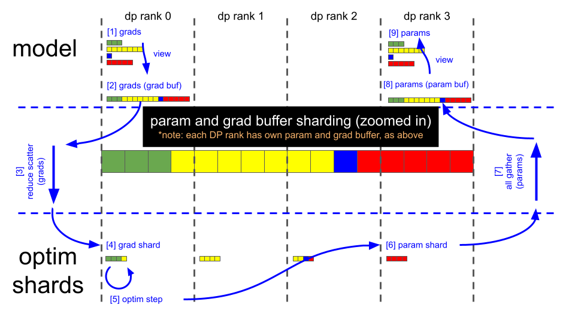
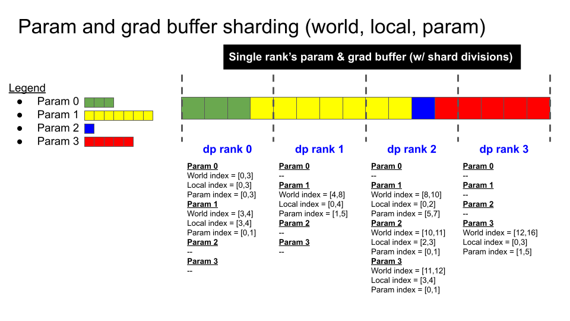

# Distributed Optimizer

The motivation for the distributed optimizer is to save memory by distributing the optimizer state evenly across data parallel ranks (https://arxiv.org/abs/1910.02054), versus the naive method of replicating the optimizer state across data parallel ranks.

Theoretical memory savings vary depending on the combination of the datatype of the model's parameters (`param_dtype`) and main gradients accumulated across data-parallel replicas (`grad_dtype`). We always use `fp32` main parameters for optimizer steps. In the current implementation, the theoretical number of bytes per parameter is (where d is the data parallel size):

|        | Non-distributed optim | Distributed optim |
| ------ | ------ | ------ |
| `fp16` parameters, `fp16` gradients | 20 | 4 + 16/d |
| `bf16` parameters, `fp32` gradients    | 18 | 6 + 12/d |
| `fp32` parameters, `fp32` gradients       | 16 | 8 + 8/d  |

Our implementation of the distributed optimizer uses contiguous buffers for parameters and main gradients; model gradients are copied over to the main gradients as soon as they are fully computed.

The figures below illustrate the distributed optimizer's sharding scheme, and the key steps of the distributed optimizer's parameter update:

## Data flow

## Sharding scheme

## Key steps

_(note: using illustrations above, assuming `bf16` model weights, `bf16` model gradients that are computed by the backward pass and `fp32` main gradients that are also used for optimizer steps; we always use `fp32` main weights for optimizer steps)_

- Backward pass finishes (gradient buffer holds 16 `fp32` gradient elements).
- Call reduce-scatter on each DP rank.
- Each DP rank now has 4 elements within the gradient buffer that are fully reduced (remaining 12 elements are garbage).
  - DP rank 0 has gradient values for elements [0:4].
  - DP rank 1 has gradient values for elements [4:8].
  - DP rank 2 has gradient values for elements [8:12].
  - DP rank 3 has gradient values for elements [12:16].
- Optimizer.step().
- Each DP rank copies its 4 `fp32` main parameter elements into the corresponding `bf16` parameter buffer (each element is cast from fp32 to fp16).
- Call all-gather on each DP rank.
- The parameter buffer now contains all 16, fully updated, `bf16` model parameter elements. Parameters in PyTorch modules already point to the appropriate locations in this parameter buffer, and thus forward passes are ready to run after the all-gather completes.
- At this point, the gradient buffer is also ready to be zero'd for the next iteration.
