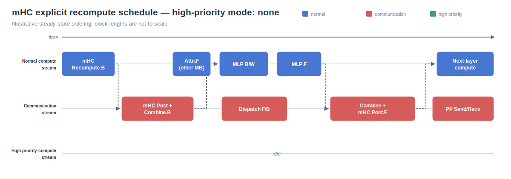
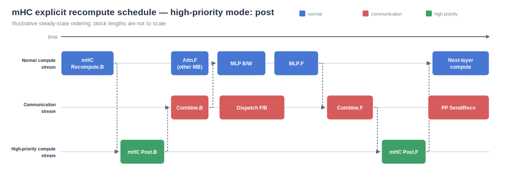
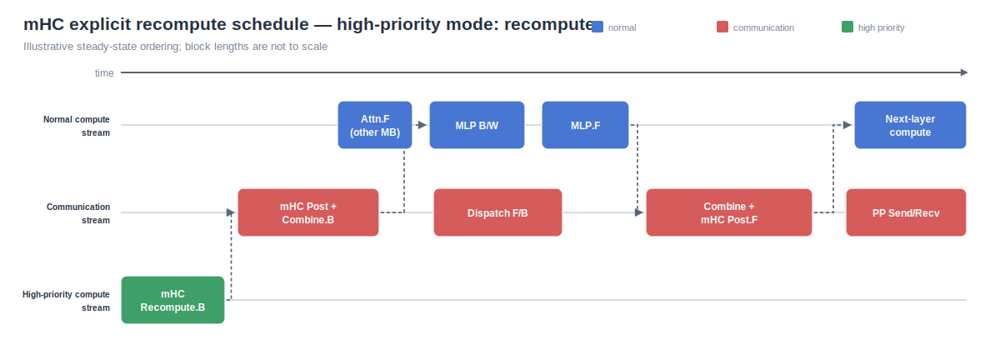
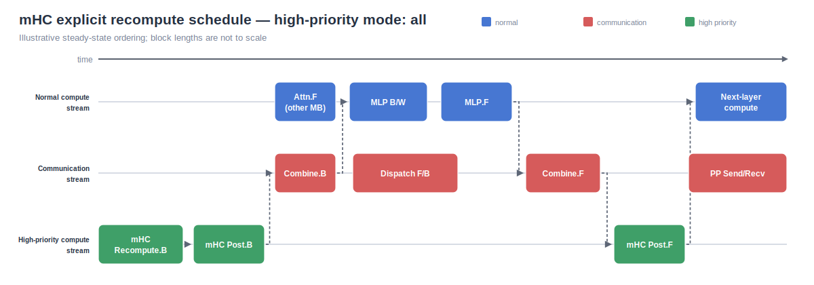

<!---
   Copyright (c) 2026, NVIDIA CORPORATION. All rights reserved.
   NVIDIA CORPORATION and its licensors retain all intellectual property
   and proprietary rights in and to this software, related documentation
   and any modifications thereto. Any use, reproduction, disclosure or
   distribution of this software and related documentation without an express
   license agreement from NVIDIA CORPORATION is strictly prohibited.
-->

# Profiling mHC Recompute and High-Priority Streams

The fine-grained MoE schedule represents explicit mHC recompute as a scheduler
node. It makes MoE mHC post-processing a separate scheduler node only when
that work is assigned to the dedicated high-priority compute stream by
`--mhc-high-priority-stream-mode`:

| Mode | MoE mHC Post F/B | mHC recompute |
| --- | --- | --- |
| `none` | Combined with Combine (communication) | Normal compute |
| `post` | Separate high priority node | Normal compute |
| `recompute` | Combined with Combine (communication) | High priority |
| `all` | Separate high priority node | High priority |

`none` is the default. A non-`none` mode requires mHC and fine-grained expert
parallel overlap. Modes containing recompute also require selective mHC
recompute. The high-priority stream is shared by all mHC work assigned to it;
`all` does not create separate post and recompute streams.

The `post` choice applies to the schedulable MoE post-combine segment. Without
that choice (`none` or `recompute`), the same post-processing runs inside the
Combine callable and its forward and backward kernels stay on the
communication stream. In a mixed dense/MoE block, dense-layer MLP
post-processing and attention-side mHC work remain in their existing
normal-compute nodes. Explicit group recompute still replays every managed mHC
checkpoint in the group.

CUDA stream priority is a scheduling hint. It can let a ready, short mHC kernel
claim newly available execution resources before normal-priority work, but it
does not preempt a kernel that is already running. It also does not create a
dependency. The scheduler's CUDA events provide the dependencies described
below.

Explicit mHC replay in the overlap scheduler is eager-only, so configurations
that combine overlap, selective mHC recompute, and `cuda_graph_impl != none`
are rejected. The existing incompatibility with fine-grained activation
offloading of `attn_norm` or `mlp_norm` also remains; other supported offload
modules are unchanged.

## Expected ordering

With a separate post node (`post` or `all`), backward observes this
producer-to-consumer order within a recompute group:

```text
mHC Recompute.B -> mHC Post.B -> Combine.B -> MLP.B
```

The corresponding forward dependency is:

```text
MLP.F -> Combine.F -> mHC Post.F -> next-layer compute
```

When post is combined (`none` or `recompute`), the dependencies instead are:

```text
mHC Recompute.B -> (mHC Post + Combine).B -> MLP.B
MLP.F -> (Combine + mHC Post).F -> next-layer compute
```

An arrow can cross streams, but the consumer must wait for the producer's
event. Communication from other microbatches may overlap the mHC nodes. The
communication stream intentionally contains the mHC post kernels in the
combined modes; in the separate modes, those kernels run only on the
high-priority compute stream.

The following figures use the mHC paper's horizontal timeline convention.
Blue is normal compute, red is communication, and green is high-priority
compute. Durations are illustrative rather than proportional to measured
kernel time.

### `none`



### `post`



### `recompute`



### `all`



The four figures are also available as a landscape, four-page
[PDF](../images/mhc_overlap/mhc_high_priority_modes.pdf). Regenerate every
format from the same source with:

```bash
python tools/generate_mhc_schedule_diagrams.py
```

The generator uses only the Python standard library.

## Nsight Systems matrix

`tools/profile_mhc_overlap.py` runs the same mock-data model and seed for each
mode. Its model is deliberately compact, but still uses TP1, PP2, VPP2, EP4,
selective mHC recompute, and fine-grained expert communication overlap.
Profiling starts at step 5 and stops after step 8 by default. The launcher sets
`CUDA_DEVICE_MAX_CONNECTIONS=32`, as required by expert-parallel overlap.

Inspect the exact commands before allocating GPUs:

```bash
uv run python tools/profile_mhc_overlap.py --preset h100-nccl --dry-run
```

On one 8-GPU H100 node, capture all four modes with NCCL All-to-All:

```bash
uv run python tools/profile_mhc_overlap.py \
  --preset h100-nccl \
  --output-dir artifacts/mhc_overlap_nsys
```

For the two-node GB200 preset, launch one copy of the wrapper per node from a
worktree and output path shared by both nodes. The wrapper reads
`SLURM_NODEID` automatically and uses four local GPUs:

```bash
export MASTER_ADDR=$(scontrol show hostnames "$SLURM_JOB_NODELIST" | head -n1)
export MASTER_PORT=${MASTER_PORT:-29500}
srun --nodes=2 --ntasks=2 --ntasks-per-node=1 \
  uv run python tools/profile_mhc_overlap.py \
    --preset gb200-flex \
    --master-addr "$MASTER_ADDR" \
    --output-dir artifacts/mhc_overlap_nsys
```

The GB200 preset uses the Flex dispatcher with DeepEP by default. Select
HybridEP either on the command line or through the environment:

```bash
MHC_FLEX_BACKEND=hybridep srun --nodes=2 --ntasks=2 --ntasks-per-node=1 \
  uv run python tools/profile_mhc_overlap.py \
    --preset gb200-flex \
    --master-addr "$MASTER_ADDR"
```

Rank 0 is profiled by default. With a multi-node allocation,
`--profile-node-leaders` captures global ranks 0 and 4 and writes one report
per node. `--profile-ranks` accepts an explicit global-rank list. Nodes that do
not contain a selected rank still participate in training but are not wrapped
in nsys.

Useful matrix controls include:

```bash
# A subset of stream modes.
uv run python tools/profile_mhc_overlap.py --modes post all --preset h100-nccl

# Add a fifth run: mHC mode=all and a high-priority A2A stream.
uv run python tools/profile_mhc_overlap.py \
  --preset h100-nccl \
  --include-comm-priority-case

# Also sample hardware metrics when the host permits it (higher overhead).
uv run python tools/profile_mhc_overlap.py \
  --preset h100-nccl \
  --gpu-metrics-devices all

# Override model-shape or batch arguments after '--'. Scheduler, distributed-topology,
# and profiling controls must use the wrapper's named options and are rejected here.
uv run python tools/profile_mhc_overlap.py \
  --preset h100-nccl --modes recompute -- \
  --seq-length 2048 --max-position-embeddings 2048 --global-batch-size 32
```

Output stems are deterministic:

```text
<preset>_<backend>_<mode>_node<rank>.nsys-rep
<preset>_<backend>_<mode>_node<rank>_cuda_gpu_kern_sum.csv
<preset>_<backend>_<mode>_node<rank>_nvtx_gpu_proj_sum.csv
```

The optional priority-conflict run uses `<mode>_comm_high`. Existing reports
are overwritten so repeated matrices do not silently create numbered files.

## Reading the trace

Use the stable scheduler ranges to find the relevant work. The standalone post
ranges exist only in `post` and `all`; in `none` and `recompute`, find those
kernels inside `moe_combine forward` and `moe_combine backward`:

```text
mhc/post/layer_<N>/F
mhc/post/layer_<N>/B
mhc/recompute/group_<N>/B
```

Recompute group indices are zero-based within each decoder or MTP block.

For every mode, check these points in the GUI or exported reports:

1. Recompute kernels appear on the lane selected by the table above. Post
   kernels appear inside Combine on the communication stream for
   `none/recompute`, and in separate high-priority ranges for `post/all`.
2. The mode-specific forward and backward ordering documented above is
   preserved even when dependencies cross streams.
3. In combined modes, mHC post kernels are enclosed by the Combine range and
   no standalone post range exists. In separate modes, the communication
   stream contains dispatch, combine, and pipeline communication but no mHC
   post kernels.
4. Compare exposed A2A/PP communication, normal-compute idle gaps, and the
   delay from a high-priority range becoming ready to its first kernel launch.
5. Compare steady-state iteration duration, then inspect concurrent kernels
   for SM, L2, or HBM contention. A shorter green wait is not a win if it makes
   the red communication interval or the whole step longer.

When `--high-priority-a2a-comm-stream` and mHC high priority are both enabled,
do not infer an ordering between the two high-priority streams. Only explicit
events and collective ordering are correctness constraints; measured hardware
contention determines the performance result.
