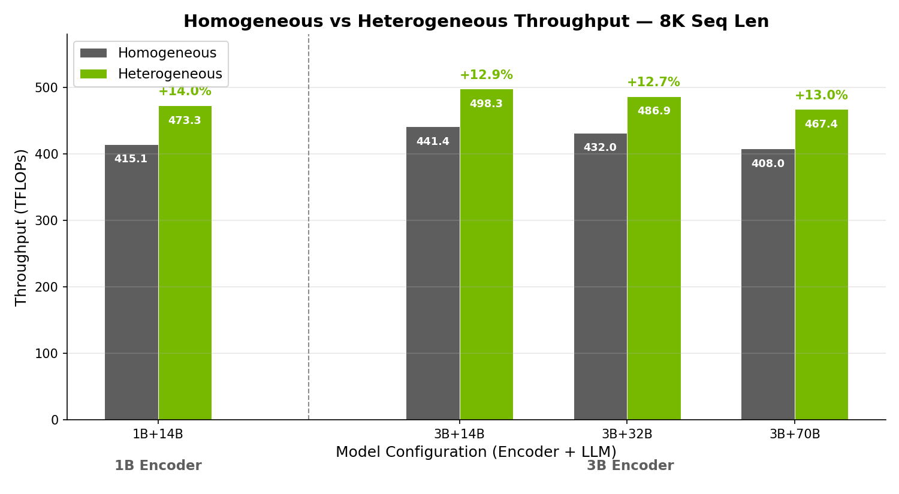
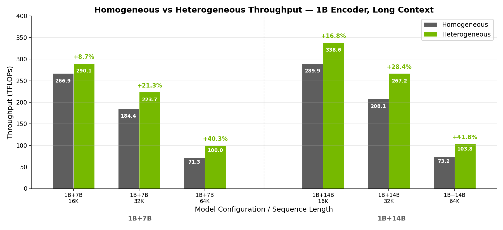

# Agentic Heterogeneous Parallelism for Megatron Multimodal Training

We used a Claude Code agent team to discover how to train colocated multimodal models faster in Megatron — by independently parallelizing the vision encoder and LLM. Two goals: throughput gains, and a study of where agents help on systems research and where they need a human. In roughly one day on H100 (BF16) at 16–64 GPUs the team found three optimization chains — encoder TP=1, encoder activation recompute as a throughput lever, and colocated LLM pipeline parallelism with encoder parameter offload — that deliver +12.7% to +14.0% TFLOPs/GPU at 8K sequence length and up to +41.8% at 64K with context parallelism, over each configuration's strongest homogeneous baseline. A human then spent about three days verifying the strongest results and catching unfair comparisons before they propagated. The operating model — narrow agent roles, explicit fairness rules, single ownership of side effects, and human verification at the comparison boundary — is portable; the Megatron-specific knobs are not.

## Table of Contents

- [The Problem](#the-problem)
- [The Agent Team](#the-agent-team)
- [The Experiment Loop](#the-experiment-loop)
- [What the Agents Discovered](#what-the-agents-discovered)
- [Results: Throughput Evidence](#results-throughput-evidence)
- [Failure Modes and Human Verification](#failure-modes-and-human-verification)
- [The Operating Model](#the-operating-model)
- [Adapting This for Other Workloads](#adapting-this-for-other-workloads)

## The Problem

In a colocated multimodal model the vision encoder and LLM run on the same GPUs but have different shapes. The encoder is small and dense, with high vision-token density and a relatively short per-image sequence. The LLM is large and sequence-dominated. A shared TP/DP/PP either pushes the encoder onto the LLM's high TP — wasting bandwidth on small encoder tensors and inflating TP all-reduce cost relative to encoder compute — or pushes the LLM onto a low TP and runs into memory walls.

Heterogeneous parallelism, where the encoder and LLM each pick their own TP/DP/CP/PP, removes that constraint. The cost is a configuration space — encoder/LLM size pairs, world sizes, sequence lengths, recompute and offload settings, distributed-optimizer instance counts, pipeline balancing — large enough that hand-sweeping is impractical. We wanted to see what agent teams can achieve when given a definitive goal and infra for running and verifying experiments. The agents team ran hundreds of experiments across 6 model configurations at 1–128 GPUs in a single day — compressing over a week of manual experimentation.


## The Agent Team

The team had four roles, running on Claude Code, with strict communication and side-effect rules:

```
                    user
                     |
                     v
                [team-lead]  scopes campaigns, vetoes results
                     |
        +------------+------------+
        |                         |
        v                         v
 [campaign-manager] <-------> [systems-expert]
   config gen, logging   advise   parallelism advisor
        |                         (no execution)
        |
        v
     [runner]                 the only agent that touches
   submit, poll, collect      the cluster
```

- **Team lead** is the user's only interface. It scopes a campaign, picks model pairs and node counts, intervenes when the team is stuck, and vetoes results that fail fairness checks. It is the team's skeptic: every result is challenged before it is logged as a finding.
- **Campaign manager** owns the experiment loop. It generates fully materialized YAML configs, states a hypothesis before each run, hands the config to the runner, and logs every result to a `timeline.md` / `leaderboard.md` / `learnings.md` file set. It does not read source code; it does not run cluster commands; it does not decide parallelism strategy from first principles.
- **Systems expert** is the parallelism advisor. It reasons about TP/DP/PP, recompute, offload, and communication tradeoffs. It reads source code. It explicitly does not submit jobs, generate configs, or write campaign logs.
- **Runner** is the only agent with cluster side effects. It submits jobs, polls for the results JSON, copies artifacts back, and diagnoses failures (scan all rank stderr, find the earliest non-NCCL traceback, classify OOM / shape mismatch / import error / NCCL). It does not decide what to run; the campaign manager hands it a config.

The communication rules are strict. The user talks only to the team lead. The runner takes orders only from the campaign manager. The systems expert advises but never executes. The campaign manager orchestrates but never reads source. Each role's prompt has explicit "what you do not do" rules, which we found to be more load-bearing than the "what you do" lists. The reusable pattern is single ownership of every side effect — only one role can submit a job, only one role can write a campaign log, only one role talks to the user.

## The Experiment Loop

Each iteration of the loop is six steps:

1. The campaign manager picks the next configuration to try, in consultation with the systems expert.
2. It generates a fully materialized YAML — model + parallelism + batch + optimization stack — and validates it before submission (valid tp/dp/cp/pp, head-count divisibility, image-token math etc. ).
3. It states the hypothesis explicitly: what it expects to change and why.
4. The runner submits the job, polls for the result artifact (not just SLURM state — the result JSON usually appears before the job exits), and returns structured metrics (TFLOPs/GPU, peak memory, per-microbatch forward+backward time).
5. The campaign manager logs the result immediately to `timeline.md`, updates `leaderboard.md` (grouped by global batch size), and adds a confirmed / disproven / hypothesis entry to `learnings.md`.
6. The systems expert analyzes the data and recommends the next knob to turn.

Fairness rules are baked into the loop, not bolted on afterwards. Every comparison uses the same world size and the same global batch size (`GBS = mbs × llm_dp × nmb`). The optimization stack — sequence parallel on the LLM, Transformer Engine fusions, `tp_comm_overlap`, distributed-optimizer instance count, recompute (per module), offload (per module) — must match across compared rows. Two runs are comparable only when the stack matches; per-microbatch forward+backward time is the GBS-independent metric. Heterogeneous configurations are compared against each configuration's strongest homogeneous baseline, defined as the lowest TP that fits both modules at the target world size with the same optimization stack — not the easiest baseline, the strongest one.

## What the Agents Explored

The team identified three optimization chains that hold across the model configurations tested. None of them was given as a prior; the team found them and the systems expert promoted them to confirmed strategies after they survived multiple campaigns.

**Encoder TP=1 eliminates encoder communication.** Encoder TP all-reduce volume scales with `hidden × seq × mbs × (TP-1)/TP`. Setting encoder TP=1 zeroes that term. The encoder tensors are small enough that sharding them across TP ranks is a net loss: you spend bandwidth synchronizing partial results that fit comfortably on one rank. Once the team established this on one configuration, every subsequent campaign started with encoder TP=1 as the default and only deviated when memory pressure forced encoder TP=2 (the 1B+14B 32K and 64K rows in Table 2).

**Encoder activation recompute is a throughput lever, not a memory lever.** The team initially explored encoder recompute for memory savings — the standard textbook reason. The interesting finding was that recompute helps even when memory is not the binding constraint, because the freed memory lets the LLM drop one TP step. A lower LLM TP shrinks the dominant TP all-reduce, and the throughput win from removing that communication exceeds the cost of recomputing encoder activations. The 1B+14B, 3B+14B, 3B+32B, and 3B+70B 8K rows in Table 1 all run encoder TP=1 with offload precisely so the LLM can drop to a lower TP than the homogeneous baseline supports.

**Colocated LLM PP plus encoder param offload outperforms pure TP scaling.** With LLM PP > 1 and encoder parameters offloaded during the LLM pipeline phase, peak memory drops enough to drop LLM TP further. The 3B+32B row (LLM PP=2) runs LLM TP=4 instead of TP=8; the 3B+70B row uses LLM PP=2 with LLM TP=8 unchanged but recovers memory headroom; the 1B+14B 16K row (LLM PP=2, LLM TP=2 instead of TP=4) is the long-context analogue. The systems expert promoted this to a confirmed strategy after it held in two campaigns and reused it in the next four.

The team did not rediscover these chains from scratch for each model. The `learnings.md` file persisted across campaigns, and confirmed strategies became the starting point for new model pairs. This compounding is the reason a one-day campaign covered configurations that would otherwise have taken multiple weeks of manual sweeping.

## Results: Throughput Evidence

All measurements are H100 (BF16). World sizes range from 16 to 64 GPUs (2 to 8 nodes, 8 GPUs per node). Encoder sequence length is 1024 (768 for the 3B+70B row); LLM sequence lengths are 8K, 16K, 32K, and 64K, with context parallelism applied at 16K and above.

### Standard sequence length (8K)

Across four encoder–LLM pairs at 8K (all at 64 GPUs), heterogeneous parallelism gives +12.7% to +14.0% TFLOPs/GPU over the strongest homogeneous baseline. The gain holds across encoder size (1B, 3B) and LLM size (14B through 70B).



Figure 1. TFLOPs/GPU at 8K sequence length on H100 (BF16). Each heterogeneous run is compared against the strongest homogeneous baseline at the same world size and global batch size. Values for 1B+14B and 3B+14B are at the highest vision token fraction tested per configuration.

| Encoder | LLM   | World | GBS | Homo TP/DP/PP | Hetero Enc TP/DP/PP | Hetero LLM TP/DP/PP | Homo TFLOPs/GPU | Hetero TFLOPs/GPU |    Δ    | Mem Homo (GB) | Mem Hetero (GB) | Iter Homo (ms) | Iter Hetero (ms) |
| ------- | ----- | ----: | --: | ------------- | ------------------- | ------------------- | --------------: | ----------------: | ------: | ------------: | --------------: | -------------: | ---------------: |
| 1B      | 14B   |    64 | 256 | 4/16/1        | 1/64/1              | 2/16/2              |           415.1 |             473.3 | +14.0%  |          57.6 |            58.2 |           7746 |             6785 |
| 3B      | 14B   |    64 | 256 | 4/16/1        | 1/64/1              | 2/16/2              |           441.4 |             498.3 | +12.9%  |          60.1 |            58.3 |           8083 |             7169 |
| 3B      | 32B   |    64 | 128 | 4/16/1        | 1/64/1              | 4/8/2               |           432.0 |             486.9 | +12.7%  |          69.4 |            55.9 |          14385 |            12787 |
| 3B      | 70B   |    64 | 128 | 8/4/1         | 1/64/1              | 8/4/2               |           408.0 |             467.4 | +13.0%  |          56.3 |            62.9 |          16573 |            14074 |

Table 1. 8K results. Heterogeneous configurations all run encoder TP=1 with encoder parameter offload during the LLM pipeline phase (all four rows have LLM PP=2). Vision token fractions per row: 90% / 88% / 75% / 75%. Iter time is per-microbatch forward+backward in milliseconds.

### Long context with context parallelism

At 16K, 32K, and 64K LLM sequence lengths with context parallelism, the gain grows with sequence length. The largest measured gains are +40.3% (1B+7B, 64K) and +41.8% (1B+14B, 64K). In a homogeneous baseline, applying context parallelism duplicates the encoder's work across CP ranks, since the encoder does not need CP. Heterogeneous parallelism keeps encoder CP=1 and applies CP only to the LLM.



Figure 2. TFLOPs/GPU at 16K, 32K, and 64K LLM sequence length on H100 (BF16), 1B encoder paired with 7B and 14B LLMs. Encoder sequence 1024 tokens; vision token fraction 75% across all rows. CP applied only to the LLM in heterogeneous runs.

| Encoder | LLM | Seq | World | GBS | Homo TP/DP/CP/PP | Hetero Enc TP/DP/CP/PP | Hetero LLM TP/DP/CP/PP | Homo TFLOPs/GPU | Hetero TFLOPs/GPU |    Δ    | Mem Homo (GB) | Mem Hetero (GB) | Iter Homo (ms) | Iter Hetero (ms) |
| ------- | --- | --: | ----: | --: | ---------------- | ---------------------- | ---------------------- | --------------: | ----------------: | ------: | ------------: | --------------: | -------------: | ---------------: |
| 1B      | 7B  | 16K |    16 |   8 | 2/4/2/1          | 1/16/1/1               | 2/4/2/1                |           266.9 |             290.1 |  +8.7%  |          59.6 |            52.2 |           1354 |             1245 |
| 1B      | 7B  | 32K |    16 |   4 | 2/2/4/1          | 1/16/1/1               | 2/2/4/1                |           184.4 |             223.7 | +21.3%  |          75.6 |            52.7 |           1985 |             1631 |
| 1B      | 7B  | 64K |    32 |   4 | 4/1/8/1          | 1/32/1/1               | 2/2/8/1                |            71.3 |             100.0 | +40.3%  |          68.9 |            50.3 |           2569 |             3717 |
| 1B      | 14B | 16K |    64 | 128 | 4/8/2/1          | 1/64/1/1               | 2/8/2/2                |           289.9 |             338.6 | +16.8%  |          51.0 |            60.5 |          11062 |             9458 |
| 1B      | 14B | 32K |    64 | 128 | 8/4/2/1          | 2/32/1/1               | 4/8/2/1                |           208.1 |             267.2 | +28.4%  |          49.9 |            66.9 |          31013 |            24130 |
| 1B      | 14B | 64K |    64 |   4 | 8/1/8/1          | 2/32/1/1               | 4/2/8/1                |            73.2 |             103.8 | +41.8%  |          60.5 |            46.4 |           2659 |             3790 |

Table 2. Long-context results. CP appears as the third value in the TP/DP/CP/PP grouping. Encoder CP is fixed at 1 in all heterogeneous runs.

Note the 1B+7B 64K and 1B+14B 64K rows: heterogeneous TFLOPs/GPU is higher even though the per-microbatch wall time is longer. The heterogeneous configurations run the LLM at a lower TP than the homogeneous baseline can fit (TP=2 vs TP=4 for 1B+7B; TP=4 vs TP=8 for 1B+14B), so each microbatch does more useful work per GPU and less communication. The TFLOPs/GPU metric reflects useful FLOPs per second; per-microbatch latency is a different question.

## Failure Modes and Human Verification

The agents were not unsupervised. Three failure modes recurred and required human intervention. Documenting them is the credibility part of this article: any methodology that claims agents can do systems research without these guardrails is overselling.

**Propagating baseline bias.** In one campaign the agents enabled sequence parallel for the heterogeneous configuration but left it off in the homogeneous baseline. The measured gain was inflated. Worse, the bias propagated: subsequent campaigns inherited the flawed baseline as the comparison target, and the inflated number compounded for several iterations before a human reviewer caught the optimization-stack mismatch. The affected branch was retracted in `learnings.md` and the relevant experiments were re-run with matched stacks. This is the failure mode the campaign manager's fairness rules were designed to prevent — the rules were under-specified at the time, the agents found the gap, and the only way to catch it was a human reading the leaderboard with a skeptical eye.

**Over-generalized rules.** The agents concluded at one point that LLM activation recompute was required whenever LLM PP > 1. This is true for some configurations and not others — it depends on memory headroom, microbatch size, and the recompute cost relative to communication savings. The systems expert had recorded the rule as a confirmed strategy after two corroborating campaigns; the third campaign produced a counterexample, and the rule was downgraded to "depends on configuration" in `learnings.md`. The pattern is generic: a rule that holds across two campaigns is a hypothesis, not a law. The team needed a human review point where confirmed findings were re-evaluated against new evidence, otherwise the knowledge base would calcify around early observations.

**The 80/20 ceiling.** The agents reached approximately 80% of measured peak per configuration without intervention. The remaining 20% required human iteration over the subtle interactions between micro batch size, number of microbatches, sharding strategy, free-memory headroom, and distributed-optimizer instance count. These are knobs where the agents could state a hypothesis but the search was too high-dimensional and the per-iteration signal too noisy for them to converge in the time budget. We did not try to push the agents further: the right division of labor was for the agents to surface the strongest candidate per configuration and for a human to do the last-mile tuning.

Roughly one day of agent exploration produced the candidate configurations behind Tables 1 and 2; about three additional days of human verification produced the final numbers.

## The Operating Model

The takeaway from the case study is the operating model: autonomous exploration with human guardrails. The agents narrow the search space and surface structural insights. The human enforces comparison rigor, catches unfair baselines before they propagate, and closes the last 20% of throughput that the agents cannot. Neither half works alone. Pure-agent runs produce results that look impressive but do not survive review. Pure-human exploration covers a fraction of the search space in the same time budget.

The model has two preconditions. First, every comparison must have an explicit fairness rule that an agent can check (same world size, same GBS, same optimization stack). Without that, agents will produce inflated numbers and propagate them. Second, a human reviewer must read the leaderboard with a skeptical eye and challenge results before they become priors. The team lead role exists to do this on the agent side, but the human is the final check — the agents internalize the rules, but a human re-reads them against the data periodically.

## Adapting This for Other Workloads

The role decomposition used here is workload-agnostic. The Megatron-specific knobs — encoder TP, recompute, offload, pipeline balancing — are illustrative; the structure of the agent team and the operating model are the part to take away.

The reusable patterns:

- **One agent owns each side effect.** Only the runner submits cluster jobs; only the campaign manager writes campaign logs. Side effects are not shared across roles, even when it would be expedient.
- **Narrow context per agent.** The runner sees job IDs, status, and output artifacts — not parallelism strategy. The systems expert reads source code and reasons about tradeoffs — but never submits a job. Context that does not match the role's responsibility is a source of agent confusion.
- **The team lead is a skeptic.** Validate same-GBS, same-precision, same-optimization-stack equivalence before any result is logged as a finding.
- **Stop course-correcting; restart.** When an agent goes down a wrong path — flawed assumptions, compounding errors, biased baselines — terminate the session and start fresh.
- **Confirmed, disproven, hypothesis.** The `learnings.md` schema with three sections (confirmed / disproven / hypothesis) makes the knowledge base auditable. A "confirmed" rule that produces a counterexample gets demoted to "depends on configuration" rather than silently failing.
