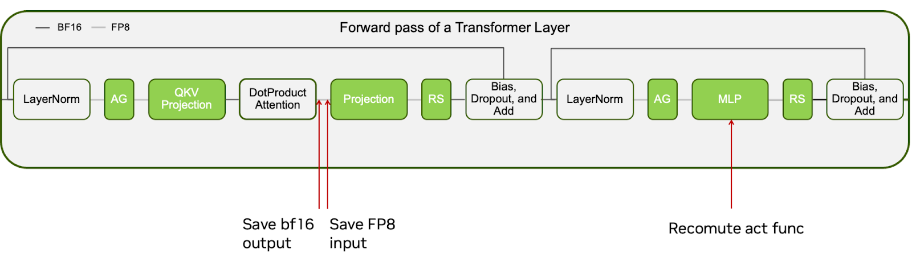
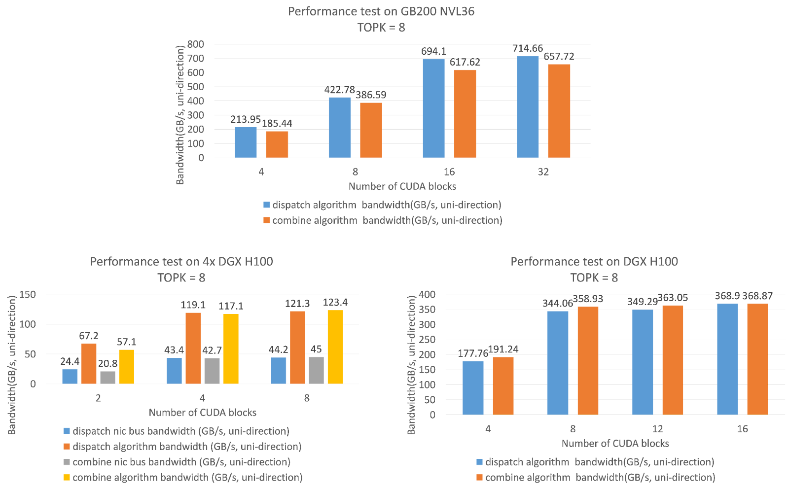
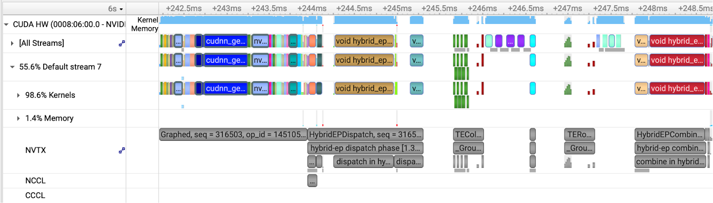

# **Optimizing DeepSeek-V3 Training Performance on NVIDIA GB200 NVL72**

**Authors:** Xin Yao (@yaox12), Hongxiao Bai (@hxbai), Yaobin Zhang (@buptzyb), Tong Liu (@Autumn1998), Fan Yu (@HWZealot), Kunlun Li (@kunlunl), Zhongbo Zhu (@zhongbozhu), Zijie Yan (@yanring)

---

This guide describes how we used Megatron Core (MCore) and Transformer Engine (TE) to pre-train the DeepSeek-V3 model with MXFP8 precision on 256 GB200 GPUs. We will detail the step-by-step process of optimizing performance to **970 TFLOPS/GPU**, which is a **2.55x** speedup compared to the estimated 380 TFLOPS on H100/H800 (refer to the estimation in this article \[[1](https://zhuanlan.zhihu.com/p/16480858047)\] in Chinese). The related features have been or will be open-sourced to the [Megatron Core](https://github.com/NVIDIA/Megatron-LM) and [Transformer Engine](https://github.com/NVIDIA/TransformerEngine) repositories.

## **0. Methodology**

To optimize the pre-training performance of a model, our methodology is generally as follows:

1. Find a performance baseline. This baseline is usually the best performance that the current software stack can achieve on a given hardware platform and training precision by adjusting model parallelism, recomputation, and other configurations.  
2. Use performance analysis tools such as [Nsight Systems](https://developer.nvidia.com/nsight-systems) (Nsys) or [PyTorch Profiler](https://docs.pytorch.org/tutorials/recipes/recipes/profiler_recipe.html) to capture a profile file (also called a timeline or trace) and analyze it to find performance bottlenecks. For example, are there significant exposed communications, kernels with a significantly high proportion, or whether the GPU kernel layout is dense? We usually prefer to use Nsys because, with the help of NVTX, it provides a clearer display of CUDA API and GPU kernel execution.   
3. Optimize for performance bottlenecks. Then repeat steps 1-3 until the performance expectations are met.

## **1. Baseline**

DeepSeek-V3 innovatively uses FP8 mixed precision for pre-training, which saves memory and improves training speed without sacrificing model accuracy. We refer to the FP8 recipe used by DeepSeek-V3, where activations are quantized at a 1x128 granularity and weights are quantized at a 128x128 granularity, as the blockwise scaling recipe. MCore (v0.13+) and TE (v2.3+) also support it.

On the Blackwell platform, thanks to the native support of the fifth-generation Tensor Core for the MXFP8 format, we adopted the MXFP8 recipe, a more fine-grained quantization scheme for training. Both activations and weights are quantized at a 1x32 granularity, and E8M0 is used as the format for the scaling factor.

Here, we will briefly introduce the difference in implementation between MXFP8 GEMM on the Blackwell platform and Blockwise FP8 GEMM on the Hopper platform. On the Hopper platform, since the Tensor Core itself does not support multiplication with a scale, after the matrix multiplication of each tile, it is necessary to multiply by the scale and accumulate the result with the CUDA Core. This also determines that on the Hopper platform, 1x128 is almost the finest quantization granularity available. If a finer granularity was used for quantization, the GEMM performance would suffer a great loss. On the other hand, since the Blackwell platform natively supports MXFP8, the dequantization process in GEMM (i.e., multiplying by the scale) is completed inside the Tensor Core, so the CUDA Core is not involved throughout the process, which can achieve better performance and support finer-grained quantization (1x32).

When we started optimizing DeepSeek-V3 on the GB200 NVL72 platform with MCore, our baseline already included the following features:

1. **MXFP8 recipe**, where the fprop/wgrad/dgrad inputs of all linear layers in the model are quantized at a 1x32 granularity, while Scaled Dot Product Attention (SDPA)/Embedding/LM Head/Router/Loss/Optimizer, etc., remain at their original high precision. For details on the FP8 recipe, please refer to our presentation at the NVIDIA AI Open Day in June 2025 (Video \[[2](https://www.bilibili.com/video/BV1mpMwz9Ey5/)\] in Chinese) and GTC 2025 (Video \[[3](https://www.nvidia.com/en-us/on-demand/session/gtc25-s72778/)\] in English). The option to enable this in MCore is `--fp8-recipe mxfp8 --fp8-format e4m3`.  
2. **Multi-head Latent Attention (MLA) kernels** on the Blackwell platform, provided by cuDNN 9.11.  
3. **MXFP8 Grouped GEMM**, implemented using multi-stream \+ cuBLAS. The advantage of this implementation is that we can support various quantization schemes at the fastest speed: as long as the single GEMM is ready, we can have a Grouped GEMM implementation with good performance. Our multi-stream \+ cuBLAS solution can achieve 2,672 TFLOP/s (flush L2) on the shape K=7,168, N=2,048, which is basically equivalent to a highly optimized Grouped GEMM \[[4](https://cursor.com/cn/blog/kernels)\]. We will continue to optimize the performance of Grouped GEMM. The option to enable this in MCore is `--moe-grouped-gemm`.  
4. **Kernel fusions**, such as:  
   1. Yarn RoPE fusion, enabled by default.  
   2. Permute fusion, the option to enable this in MCore is `--moe-permute-fusion`.  
   3. Cross-entropy loss fusion, the option to enable this in MCore is `--cross-entropy-loss-fusion`.  
5. **Flexible Pipeline Parallelism (PP) layout**, making PP more balanced. The corresponding option in MCore is `--pipeline-model-parallel-layout [layout]`.  
6. **Primary weights in FP8**. FP8 mixed-precision training supports two weight schemes:  
   1. Dual precision weights (default): Maintains both BF16 and FP8 weight copies. Simple implementation but uses more memory than BF16 training alone.  
   2. FP8 only weights: Stores only FP8 weights, saving memory and enables FP8 AllGather of the updated parameters for per-tensor and blockwise FP8 recipes when using Distributed Optimizer (ZeRO-1). Complex implementation requiring recipe-specific handling. The option to enable this in MCore is `--fp8-param-gather`.  
7. **BF16 optimizer states**. According to the technical report, DeepSeek-v3 uses BF16 for optimizer states. This feature is orthogonal to the training precision, and it can be used for both BF16 and FP8 training. The options to enable this in MCore are `--use-precision-aware-optimizer --main-grads-dtype fp32 --main-params-dtype fp32 --exp-avg-dtype bf16 --exp-avg-sq-dtype bf16`.  
8. **Fine-grained recompute**. By recomputing some modules with smaller computational workload but larger memory occupation, a large amount of memory is saved at a small recomputation cost, thereby minimizing model parallel sizes. In our baseline version, fine-grained recompute only supports BF16, and FP8 training is currently not supported. The options to enable this in MCore are `--recompute-granularity selective --recompute-modules [modules]`.  
9. **Token dispatcher** supports both NCCL AlltoAll and DeepEP backends. However, at the time we tested the baseline performance, DeepEP did not support the Multi-Node NVLink (MNNVL) of GB200, so we could only use the NCCL AlltoAll backend. The option to use the AlltoAll dispatcher in MCore is `--moe-token-dispatcher-type alltoall`.

On the above software stack, using the parallel configuration of TP1/PP8/VPP4/EP32/MBS1/GBS2048 on 256 GB200s, enabling recomputation of the MLP part of the dense layers (i.e., the first three layers of DeepSeek-v3) and the MLA up projection (`--recompute-modules mlp up_proj`), with the PP layout as `--pipeline-model-parallel-layout Et|(tt|)*30L` (a total of 32 stages, where the first stage is Embedding \+ 1 transformer layer, the last stage is Loss, and the middle 30 stages are 2 transformer layers), using the AlltoAll token dispatcher (NCCL backend), and enabling BF16 optimizer states, we achieved a performance of 494 TFLOPS/GPU. This performance is obviously not satisfactory, and we will optimize it from several aspects.

## **2. Performance Optimization**

By capturing and analyzing the Nsys timeline corresponding to the baseline, taking a forward iteration as an example, we can see that the biggest performance issue is that there are large gaps between kernels, and the CPU kernel launch speed cannot keep up with the kernel execution speed on GPU. We call this phenomenon *CPU overhead* or *host boundedness*. This overhead mainly comes from Python code (such as loops, `getattr`, etc.), PyTorch's Python and C++ logic code (for example, a simple `torch.empty` will not call any CUDA kernel, but it will generate a few microseconds of overhead on the host side), CUDA kernel launch, etc. The reason for this phenomenon is that, on the one hand, the speed of GPU executing kernels is getting faster and faster, resulting in not enough time to overlap the CPU execution time. On the other hand, FP8 training and fine-grained MoE models introduce more quantization, router, and other kernels. The main idea to solve CPU overhead is to reduce the number of kernels through kernel fusion and use CUDA Graphs for graph launch to bypass repeated work on the CPU side.


In addition to CPU overhead, we can also see several other obvious problems:

* The length of the Permute kernel is clearly abnormal, suggesting that this kernel needs to be optimized.  
* Before the GEMM in the Expert part, there are a large number of small, fragmented kernels. This is obviously abnormal, and we need to locate what these kernels are doing and whether they can be eliminated or fused.
* The NCCL-based token dispatcher, which requires explicit global token permutation, is not optimal.
* The overhead of recomputing MLA up projection is not as small as expected due to the CPU overhead.

Therefore, our optimization plan is roughly as follows:

1. Kernel fusion and optimization  
2. Memory saving to allow more optimizations  
3. CUDA Graphs to resolve CPU-side overhead  
4. CPU-side optimizations  
5. HybridEP: An Expert Parallel (EP) communication library developed based on a new set of API, with functions similar to DeepEP, but able to achieve higher bandwidth with fewer SMs, and fully supporting MNNVL.

### **2.1 Kernel Fusion and Optimization**

#### **2.1.1 Optimizing the Permute Kernel**

The permute operation in the MoE model rearranges tokens in memory for communication and computation. The AlltoAll dispatcher using the NCCL backend requires one global and one local permute before and after EP communication, respectively. The Flex Dispatcher of DeepEP or HybridEP fuses the global permute into the communication kernel, eliminating the need to explicitly copy the tokens top-k times, but still requires a permute kernel to copy and rearrange the tokens distributed to different local experts after EP communication. TE [PR 1927](https://github.com/NVIDIA/TransformerEngine/pull/1927) significantly improves performance when top-k is much smaller than the number of experts (e.g., DeepSeek-v3's 256 experts with top-8), with up to a 10x unit speedup. The option to enable this in MCore is `--moe-permute-fusion`, and we recommend setting `--enable-experimental` for more aggressive fusions.

#### **2.1.2 Fused Memory Allocation for the MXFP8 Quantization**

By comparing the code and the Nsys GPU trace timeline, we found that there are mainly two types of fragmented kernels in the Expert part: `torch.zeros` kernels that allocate the scaling factor for MXFP8, and the kernels that swizzle the MXFP8 scaling factors. The reason for using `torch.zeros` instead of `torch.empty` to allocate memory for the scaling factor is that the Tensor Core requires the scaling factor to be padded to a specific shape, with the padded part filled with 0. In optimization 2.1.3, we fuse the zero-padding to the swizzle scaling factor kernel to avoid `torch.zeros` kernels.

When performing MXFP8 quantization for each tensor, four tensors need to be allocated, namely {row-wise, col-wise} * {data, scaling factor}. As mentioned earlier, even when using `torch.empty` to allocate memory, each PyTorch API call introduces several microseconds of overhead, resulting in significant CPU overhead. Our solution here is to pre-allocate a large memory buffer for data and scaling factors, and then construct tensors from this buffer using the `aten::from_blob` API by calculating pointer offsets, thus avoiding a large number of tiny `torch.empty/zeros`. For the specific implementation, please refer to TE PR [1793](https://github.com/NVIDIA/TransformerEngine/pull/1793), [1934](https://github.com/NVIDIA/TransformerEngine/pull/1934), and [2134](https://github.com/NVIDIA/TransformerEngine/pull/2134). This optimization replaces the previous implementation and is enabled by default.

#### **2.1.3 Fused Multiple Swizzle Scaling Factor Kernels**

As mentioned earlier, the second type of fragmented kernels in the Expert part is swizzling the scaling factor. This is because the Tensor Core requires the scaling factors to be swizzled according to certain rules (refer to the [cuBLAS documentation](https://docs.nvidia.com/cuda/cublas/#d-block-scaling-factors-layout)). We fused the swizzle operations of the scaling factors of multiple input tensors into a single kernel, and handled padding with 0 in it. This completely eliminates the `torch.zeros` kernel when allocating the buffer mentioned above, reduces the number of kernels, and alleviates CPU overhead. For the specific implementation, please refer to TE [PR 2019](https://github.com/NVIDIA/TransformerEngine/pull/2019). This optimization replaces the previous implementation and is enabled by default.

In addition, theoretically, we can fuse the swizzle scaling factor into the quantization kernel. The main reason we haven't done so yet is to consider that when MXFP8 data needs to be communicated, such as in TP and EP Dispatch (which are not yet supported), un-swizzled scaling factors are more convenient for communication. Of course, the ideal situation is to make the quantization kernel configurable, so that it does not perform swizzling where communication is needed, and performs swizzling otherwise, thus avoiding redundant operations.

#### **2.1.4 Kernel Fusion in the Router Part**

The Router part contains a large number of element-wise operators, mainly for calculating the routing map, i.e., which experts the tokens should be assigned to, and for calculating and counting the aux loss. We fused some of these kernels, reducing the total number of kernels in the router part from 72 to 31. For the specific implementation, please refer to TE [PR 1883](https://github.com/NVIDIA/TransformerEngine/pull/1883). The option to enable this in MCore is `--moe-router-fusion`. 

The reason why it cannot be completely fused is that the remaining kernels are separated by communication kernels of global auxiliary losses calculation, which are not easy to fuse. There are also many kernels scattered in different Python logic codes. If they are forcibly fused, it will mess up the code structure of Python. Moreover, we will apply CUDA Graphs for the router part later, which can already solve the CPU overhead problem well, so there is little performance gain from fusing the remaining kernels.

#### **2.1.5 Quantization Fused to Normalization**

cuDNN supports fusing MXFP8 quantization into normalization, including layer norm and RMS norm. To enable this feature, we suggest using cuDNN 9.14 or later and set the following environment variables.

```shell
NVTE_NORM_FWD_USE_CUDNN=1
NVTE_NORM_BWD_USE_CUDNN=1
```

Under the same parallel configuration, we measured that optimizations 2.1.1 and 2.1.2 improved the end-to-end (E2E) performance by 35 TFLOPS, optimization 2.1.3 improved it by 35.5 TFLOPS, optimization 2.1.4 improved it by 10.5 TFLOPS, and optimization 2.1.5 improved it by 13.8 TFLOPS. The Nsys timeline with optimizations 2.1.1, 2.1.2, and 2.1.4 enabled is as follows (the reason for not including 2.1.3 nor 2.1.5 is that they were done later, and at that time the timeline had already been superimposed with other optimizations, so it could not be directly compared):


Although it still doesn't look very satisfactory, it has improved.

### **2.2 Memory Saving to Allow More Optimizations**

#### **2.2.1 DeepEP**

Theoretically, on the GB200 NVL72 system, all EP communication is within the NVLink domain. Thanks to the bidirectional 1.8 TB/s bandwidth of MNNVL on the GB200, EP communication will be greatly accelerated. However, DeepEP still does not officially support scenarios where the NVLink domain is larger than 8. We have supported the EP32 scenario based on [this community PR](https://github.com/deepseek-ai/DeepEP/pull/218). But this support is not well-optimized. In the EP32 scenario, the dispatch can only reach about 400 GB/s and the combine can only reach about 190 GB/s algorithm bandwidth with 24 SMs, which is a large gap from the unidirectional bandwidth of 900 GB/s for MNNVL on the GB200 NVL72. Therefore, after switching to DeepEP, we did not get the communication benefits, but got some memory-saving benefits (DeepEP does not need explicit global permute, so it reduces the peak memory consumption), and reduced CPU overhead (DeepEP uses a fused kernel for the EP communication preprocess, further reducing the number of kernels in the router and preprocess parts to 17), so we put DeepEP in the memory optimization part.

The options to enable DeepEP in MCore are:

```shell
--moe-token-dispatcher-type flex
--moe-flex-dispatcher-backend deepep
```

#### **2.2.2 Fine-grained Recompute for FP8**

The conventional recomputation method recomputes multiple modules to save all intermediate activations of a Transformer layer, but recomputing a single module does not take effect. We want to do more fine-grained recomputation, that is, recomputing some modules within a Transformer layer with low computational intensity but high memory consumption, to save more memory at a lower performance cost. Therefore, we implemented the [output discarding recompute](https://github.com/NVIDIA/Megatron-LM/blob/e000263e21ac89571123303c4043ec9ea7261513/megatron/core/tensor_parallel/random.py#L521) in MCore to support recomputing a single module.

In addition, for FP8, we need to consider that the FP8 quantized version of the discarded output may be saved by subsequent layers, which would not achieve the goal of saving memory. Therefore, we need to tell the FP8 module to save the original input (so that it can be correctly discarded) instead of the quantized version. The cost is that we need to re-quantize during the backward pass. For implementation details, please refer to \[[MCore commit](https://github.com/NVIDIA/Megatron-LM/commit/781e765818b86b8f2e03ac6bb6b09aaaa9d17074)\] and \[[TE PR 1865](https://github.com/NVIDIA/TransformerEngine/pull/1865)\].

This technique is also applicable to SDPA and the subsequent Linear module (called Projection Linear). Because SDPA is a special module, it saves its own output for backward computation, while Projection Linear saves the input for backward computation. In BF16 training, these two tensors are actually the same tensor, occupying only one copy of memory. In FP8 training, SDPA saves a BF16 output tensor, while Projection Linear saves an FP8 tensor quantized from the input tensor. These two tensors do not share memory, so it actually saves 1.5 times the size. We can use a similar method to tell Projection Linear to save the original input instead of the quantized version to save memory. Similarly, the cost is that it needs to be re-quantized during the backward pass.



E2E testing shows that enabling DeepEP reduces the CPU overhead of the router and preprocess, improving performance by 54.3 TFLOPS. By using fine-grained recompute, the redundant activation saved between SDPA and Projection is eliminated, allowing us to turn off the recomputation of MLA up projection, which improves performance by 44.7 TFLOPS. The reason is that although the MLA up projection has a low computational density and the cost of recomputation is theoretically small, it also has serious CPU overhead, so turning off recomputation can achieve a certain performance improvement. Correspondingly, the recomputation parameters were changed to `--recompute-modules mlp moe_act`. The following figure shows the Nsys timeline with DeepEP enabled and using new recompute parameters:


### **2.3 CUDA Graphs to Resolve CPU-side Overhead**

CUDA Graphs significantly reduce CPU overhead by capturing GPU kernels into a static graph that replays entire kernel sequences in subsequent iterations, bypassing most CPU logic. However, captured parts must be static with no dynamic shapes allowed. In Dropless MoE models, routed experts are dynamic while attention, router, EP preprocess, and shared experts remain static, so we capture these static components to minimize CPU overhead.

We have developed the Partial CUDA Graphs feature in MCore and TE, which allows us to capture only a part of the model. The parameter in MCore is `--cuda-graph-scope`, and the supported options are:

* `attn`: capture the attention part.  
* `mlp`: capture the MLP part of the dense layer, for example, the first three layers of DeepSeek-V3 are dense layers.  
* `moe`: capture the moe part, only supports token-drop MoE.  
* `moe_router`: capture the moe router part. Also capture shared experts unless the shared experts overlap is enabled.
* `moe_preprocess`: capture the EP preprocess part, must be used with `moe_router`.  
* `mamba`: captures the mamba layer.

In DeepSeek-v3, we finally used `--cuda-graph-impl transformer_engine --cuda-graph-scope attn moe_router moe_preprocess` to capture attention, router, EP preprocess, and shared experts of each layer. The partial CUDA Graphs feature is temporarily only available in `--cuda-graph-impl transformer_engine` implementation. Another implementation is called `local`, which introduces full-layer and full-iteration CUDA Graphs support, but not feasible for MoE models due to the dynamic shape issue.

One limitation of CUDA Graphs is that it occupies additional memory. The number of CUDA Graphs we need to capture is `L*M*2`, where `L` is the number of layers per GPU and `M` is the number of micro-batches in one iteration. `*2` because we need to capture both forward and backward graphs. This additional memory of these graphs comes from three aspects.

1. The structure of CUDA Graphs itself occupies some memory. This memory usage increases with the number of nodes in the graph, but the amount is typically negligible.
2. CUDA Graphs need to use an independent memory pool. PyTorch’s caching allocator cannot reuse the memory in this pool for operators outside of CUDA Graphs.
3. CUDA Graphs need static memory buffers for input and output data of the graphs.

We have made a series of optimizations to optimize the memory consumption of CUDA Graphs, especially targeting 2 and 3. For 2, though graphed and non-graphed parts must use separate pools, we managed to make all graphs share one pool by capturing them in the same order they will be replayed. For 3, we reuse the static memory buffers between graphs as much as possible following its PP pattern. For details, please refer to the `_order` and `_reuse_graph_input_output_buffers` arguments in TE [make_graphed_callables()](https://github.com/NVIDIA/TransformerEngine/blob/release_v2.8/transformer_engine/pytorch/graph.py#L847-L863) API. In addition, we have also made a series of adaptations and optimizations for CUDA Graphs for MoE models, different FP8 recipes, MTP support, flexible PP layouts, and precision alignment to ensure it works correctly and efficiently.

The following figure shows our timeline after enabling CUDA Graphs (this figure also includes 2.1.3 fuse swizzle scaling factor). It can be seen that the CPU overhead problem has been greatly alleviated, and currently only the routed experts part still has some CPU overhead. Enabling CUDA Graphs has improved the E2E performance by a total of 84.8 TFLOPS.


At this point, we can see that the performance problem of DeepEP is beginning to become a bottleneck, and we will have work to optimize it later.

### **2.4 CPU-side Optimizations**

Adding [bindpcie](https://github.com/NVIDIA/mlperf-common/blob/main/client/bindpcie) to the startup phase of each training process, so as to automatically detect the GPU/NUMA topology of the local machine based on the rank of the local process, and use `numactl` to bind the CPU and memory of the process to the local NUMA node corresponding to its GPU. This reduces per-GPU kernel launch latency and the latency variation among GPUs, and improves E2E performance by 70.6 TFLOPS.

It is worth mentioning that since CPU overhead is a major performance issue in FP8 training, and in language model training tasks where the data loading pressure is small, usually only a few CPU cores are responsible for launching kernels and are in a high-load state. For example, on a DGX/HGX NVL8 system, if core binding is performed, then 8 GPUs correspond to 8 processes, which correspond to 8 CPU cores. Therefore, we recommend configuring the CPU to a mode that allows some cores to boost to the highest frequency, which can significantly improve the performance of FP8 training.

With the help of CPU-side profiling, we're working on simplifying the host-side code of TE, such as removing unnecessary checks, PyTorch APIs, and CUDA calls. In addition, we are working with CPU experts to explore other CPU-side optimizations.

### **2.5 HybridEP**

HybridEP is a new EP communication library developed by NVIDIA, with functions similar to DeepEP, but it can fully release the performance potential of the NVL72 architecture and also supports intra-node and inter-node communication on the Hopper platform. HybridEP mainly has the following features:

* Fully adapted to the NVL72 architecture. Within the NVLink domain, Tensor Memory Accelerator (TMA) is used for data copy to minimize the number of instructions and reduce resource occupation.  
* Deeply optimized RDMA communication across NVLink domains using IBGDA technology.  
* Ensured that there is no redundant communication during data distribution.  
* Completely asynchronous at the kernel level and adapted to CUDA Graphs.  
* Can flexibly adjust the number of occupied SMs and achieve excellent performance with as few SMs as possible.

HybridEP is fully adapted to the NVL72 architecture and can achieve high transmission bandwidth with fewer SM resources.  


It is worth mentioning that although we only report the performance of EP36 here, HybridEP actually supports the full NVL72. Therefore, if future models are designed with the number of experts being a multiple of 72, HybridEP can fully utilize the bandwidth of NVL72. This also reflects the philosophy of model and hardware architecture co-design.

When integrating HybridEP into MCore, we need to solve a problem: in the implementation, we need to register some special buffers so that they can be accessed by other ranks in the same NVLink domain. And since the output of dispatch and the input of combine both exist in the buffer managed by HybridEP itself. This buffer is globally unique on the current rank and is reused between layers. We need an extra D2D (Device to Device) copy to copy the output of the dispatch kernel from the buffer to the downstream required PyTorch tensor, or to copy the input of the combine kernel from the upstream PyTorch tensor to the combine input buffer. And the duration of this D2D copy is about 10%-20% of the communication time.

Considering that the MoE permute operation following dispatch, we’re doing

1. EP communication over NVLink: dispatch -> HybridEP managed buffer
2. D2D copy: HybridEP managed buffer -> output buffer in PyTorch tensors
3. Permute: output buffer -> permuted tensors to be fed into experts

Therefore, we choose to fuse this D2D copy with the subsequent permute, that is, while permuting, we also complete the data transfer between the HybridEP managed buffer and the ordinary PyTorch tensor. Furthermore, since cuBLAS FP8 GEMM requires the input M dimension to be aligned to 16 (per-tensor recipe or blockwise recipe) or 32 (MXFP8 recipe), and the output generated by permute is very likely not to meet this requirement, it needs to be padded in the M dimension. This padding task is also essentially a D2D copy, and we also fuse it into the permute process.

The options to enable HybridEP in MCore are:

```shell
--moe-token-dispatcher-type flex
--moe-flex-dispatcher-backend hybridep
```

The figure below shows the timeline after we used HybridEP to optimize EP communication and permute/pad, which improved the E2E performance by 113.6 TFLOPS.



HybridEP has been open-sourced as an [independent branch](https://github.com/deepseek-ai/DeepEP/tree/hybrid-ep) in the DeepEP repository, have a try now!

## **3. Summary and Outlook**

We started from a baseline of 494 TFLOPS, and through multiple rounds of performance analysis and optimization, we finally reached 970 TFLOPS, achieving a 1.96x performance improvement. The following is our optimization history sorted by time:

| Model | System | Precision | Dispatcher | Feature Roadmap | TFLOPS/GPU |
| ----- | ----- | ----- | ----- | ----- | ----- |
| DeepSeek-V3 | GB200 | MXFP8 | AlltoAll | Baseline | 494.46 |
| DeepSeek-V3 | GB200 | MXFP8 | AlltoAll | Fuse torch.zeros for scaling factor allocation & Permute kernel Optimization | 529.55 |
| DeepSeek-V3 | GB200 | MXFP8 | AlltoAll | Router fusion | 540.00 |
| DeepSeek-V3 | GB200 | MXFP8 | DeepEP | Enable DeepEP (Will switch to HybridEP) | 566.07 |
| DeepSeek-V3 | GB200 | MXFP8 | DeepEP | Remove up\_proj recompute | 610.71 |
| DeepSeek-V3 | GB200 | MXFP8 | DeepEP | CUDA Graphs | 663.27 |
| DeepSeek-V3 | GB200 | MXFP8 | DeepEP | Tune DeepEP (Will switch to HybridEP) | 691.49 |
| DeepSeek-V3 | GB200 | MXFP8 | DeepEP | CPU-side optimization | 762.12 |
| DeepSeek-V3 | GB200 | MXFP8 | DeepEP | PDL for quantization kernels & Fuse MXFP8 swizzle scaling factor | 797.67 |
| DeepSeek-V3 | GB200 | MXFP8 | DeepEP | CUDA Graphs capture shared expert | 829.93 |
| DeepSeek-V3 | GB200 | MXFP8 | HybridEP | HybridEP | 943.56 |
| DeepSeek-V3 | GB200 | MXFP8 | HybridEP | CPU-side optimization | 956.21 |
| DeepSeek-V3 | GB200 | MXFP8 | HybridEP | Fuse quantization to normalization (cuDNN 9.14) | 970.01 |

### **3.1 Future Work**

1. Completely eliminate CPU overhead. We hope to eliminate the device-host sync in the MoE model (its purpose is to get the tokens per expert information), so that we can use CUDA Graphs for the entire model and completely eliminate CPU overhead. We used a small proxy model to estimate that this optimization can achieve at least a 10% additional performance gain. Please refer to the MCore MoE [roadmap](https://github.com/NVIDIA/Megatron-LM/issues/1729).  
2. Scale to a larger amount of GPUs. Our current parallel configuration is already limited by the number of GPUs (EP32 * PP8 = 256 GPUs). If we expand to 512 cards, we can explore the performance of EP64. Theoretically, since EP64 is still within the NVLink domain, its communication overhead is still small. And a large EP can reduce the number of local experts, thereby reducing quantization and other overheads, and improving the performance of Grouped GEMM.  
3. Explore the use of NVLink-C2C's CPU offloading technology. Since the GB200 NVL72 system has NVLink-C2C, the connection between CPU and GPU is faster than PCIe 5.0, so offloading is a very promising feature. For example, with the help of CPU offloading, can we increase MBS to 2? If so, it will greatly improve the computational intensity, and many of the CPU overhead problems mentioned earlier may no longer exist.

### **3.2 Some Discussions**

1. Why didn't we use FP8 dispatch on the GB200?  
   * FP8 dispatch is not a free lunch. Since we can only transmit row-wise FP8 data, we need some extra "de-quantize and re-quantize" kernels to calculate col-wise FP8 data for backward computation. The overhead of these kernels offsets the communication time saved by FP8 dispatch.  
2. Why didn't we use 1F1B AlltoAll overlap on the GB200 (a kind of inter-batch overlap scheme similar to DualPipe, for details see MCore commits [8333bd5](https://github.com/NVIDIA/Megatron-LM/commit/8333bd5bb6de2bdbdb3ebebf224b4a339a04ec90), [ae1c882](https://github.com/NVIDIA/Megatron-LM/commit/ae1c88296f465ab4ac9c503d75a57ba4044c47d1), [d7bf5aa](https://github.com/NVIDIA/Megatron-LM/commit/d7bf5aaaa8e331f901366621db009b0c2880c8fd))?  
   * First, thanks to NVL72, EP communication is very fast, and the necessity of overlap is not great. Second, 1F1B AlltoAll overlap is not a free lunch either. It divides the forward and backward into multiple stages for scheduling, and there is some synchronization between different stages, which aggravates the CPU overhead, so the overall benefit is negative on the GB200. If we can further solve the CPU overhead problem, we can re-evaluate the benefits of 1F1B AlltoAll overlap.  
3. How much performance improvement is there compared to the H100?  
   * DeepSeek's technical report did not announce the TFLOPS during its pre-training phase, but some article \[[1](https://zhuanlan.zhihu.com/p/16480858047)\] (in Chinese, we recommend reading it by translation) has estimated it to be around 380 TFLOPS, so the 970 TFLOPS on the GB200 is a 2.55x performance improvement. This surpasses the 2.5x improvement of the GB200 over the H100 in FP8 computing power. This significant performance gain is attributed to leveraging MNNVL on the GB200 for optimized EP communication and utilizing the substantially larger device memory on the GB200 to explore enhanced parallel configurations. 

## **4. Resources**

**Complete Training Examples**

* [DeepSeek-V3 Training Scripts](https://github.com/yanring/Megatron-MoE-ModelZoo) \- End-to-end training configurations and launch scripts

**Papers and Technical Reports**

1. [DeepSeek-V3 MFU Estimation](https://zhuanlan.zhihu.com/p/16480858047). An article in Chinese estimates the MFU of DeepSeek-V3 training.  
2. [FP8 Training Recipes, Performance and Convergence](https://www.bilibili.com/video/BV1mpMwz9Ey5/). A video in Chinese introduces FP8 training recipes, performance and convergence.  
3. [Stable and Scalable FP8 Deep Learning Training on Blackwell](https://www.nvidia.com/en-us/on-demand/session/gtc25-s72778/). GTC talk on FP8 training on Blackwell.  
4. [Cursor's Blog on Faster Grouped GEMM Kernels and MoE Training.](https://cursor.com/cn/blog/kernels)
