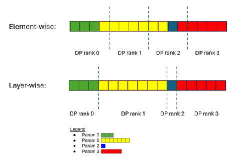

# Spectral Descent: Orthogonalizing Momentum via Newton-Schulz Iteration to Power the Next Generation of LLM Training

## Table of Contents

- [Why Higher-Order Optimizers Matter](#why-higher-order-optimizers-matter)
- [Performance on NVIDIA Platforms](#performance-on-nvidia-platforms)
- [Enabling Technologies for Large-Scale Training](#enabling-technologies-for-large-scale-training)
- [Research Enablement](#research-enablement)
- [Get Started Today](#get-started-today)
- [Conclusion](#conclusion)
- [Resources](#resources)

## Why Higher-Order Optimizers Matter

Higher-order optimizers have delivered strong results in neural network training for years, and they are now showing clear value in large language model (LLM) training as well. Muon, short for Momentum Orthogonalized by Newton-Schulz, has been used to train leading open models such as [Kimi-K2](https://huggingface.co/moonshotai/Kimi-K2-Base) and [GLM 5](https://arxiv.org/pdf/2602.15763).

This discussion summarizes NVIDIA support for Muon and related optimizer work, with a focus on the systems techniques required to make these methods practical at scale.

## Performance on NVIDIA Platforms

Table 1 summarizes training throughput for Kimi-K2 and Qwen3 30B with Muon and AdamW on NVIDIA GB300 systems. With the techniques described below, Muon training throughput remains close to AdamW. If Muon-specific Newton-Schulz matrix multiplications are counted, the measured MFU is higher with Muon.

The measurements below used 256 GB300 GPUs with `PP4DP64EP64` for Kimi-K2 and 8 GB300 GPUs with `DP8EP8` for Qwen3 30B.

| Model | AdamW TFLOPs/s/GPU | Muon TFLOPs/s/GPU |
| :---- | :---: | :---: |
| Kimi-K2 | 1051 | 1080 (1029 model + 51 Muon) |
| Qwen3 30B | 713 | 721 (686 model + 35 Muon) |

Table 1. Training throughput measured with Megatron-Bridge 26.02.

Detailed experimental settings and reproduction steps are included in the [Get Started Today](#get-started-today) section.

## Enabling Technologies for Large-Scale Training

Higher-order optimizers such as Muon improve training efficiency, but deploying them at scale introduces real systems challenges. Preconditioning based on Newton-Schulz iteration or eigen-decomposition increases both compute cost and memory use. Mixed-precision training and gradient accumulation can introduce numerical issues, and scaling synchronized orthogonalized updates across thousands of GPUs can add significant communication overhead.

The techniques below balance generality, throughput, and implementation complexity. They are useful not only for Muon, but also for optimizers such as SOAP and other preconditioner-heavy methods.

## Layerwise Distributed Optimizer

A traditional element-wise distributed optimizer, commonly used for AdamW at scale, typically works as follows:

- Partition optimizer states across data-parallel ranks.
- Reduce-scatter gradients so each rank receives the gradients for its owned parameter shards.
- Apply updates locally on those shards.
- All-gather updated parameters before the next forward pass.

That model works well for element-wise optimizers, but it breaks down for methods such as Muon that need the full layer gradient or momentum tensor to compute an update. If optimizer state and parameters are evenly sharded across data-parallel ranks, no rank has enough information to compute the full layer update without extra communication.

Megatron-Core addresses this with a layer-wise distributed optimizer. Instead of slicing every layer across all data-parallel ranks, full layers are assigned to different ranks so the preconditioner can be computed from complete layer tensors.



Figure 1. Element-wise and layer-wise distributed optimizer layouts.

One consequence of the layer-wise design is variable-sized communication. Different ranks may need to gather different amounts of updated parameter data, which maps naturally to operations such as [all_gatherv](https://www.mpich.org/static/docs/v3.2/www3/MPI_Allgatherv.html). The Megatron-Core implementation lives in [`megatron/core/optimizer/layer_wise_optimizer.py`](https://github.com/NVIDIA/Megatron-LM/blob/dev/megatron/core/optimizer/layer_wise_optimizer.py).

## Distributed Newton-Schulz

Tensor parallelism (TP) introduces an additional challenge. TP shards weight matrices across GPUs, so no single device holds the full tensor. Muon's orthogonalization step, however, requires access to the entire momentum matrix. That means TP-aware handling is required to compute orthogonalized updates correctly and efficiently.

Megatron-Core supports multiple approaches in [`megatron/core/optimizer/muon.py`](https://github.com/NVIDIA/Megatron-LM/blob/dev/megatron/core/optimizer/muon.py):

- `duplicated` mode: momentum tensors are all-gathered across the TP group, each GPU runs the full Newton-Schulz iteration locally, and then applies the slice of the orthogonalized update that it owns. This minimizes communication rounds at the cost of duplicated computation.
- `distributed` mode: Newton-Schulz work is split across TP ranks. Each iteration performs three matrix multiplications, with an all-reduce required after the first multiplication. This reduces duplicated compute but increases communication frequency.
- `blockwise` mode: each GPU orthogonalizes only the local momentum block that it owns. This is the cheapest option and avoids communication, but it is not mathematically equivalent to orthogonalizing the full momentum matrix.

## Further Optimizations

Additional optimizations can improve throughput further and are natural next steps for these optimizer paths.

### Communication Hiding

In the current release, parameter gathering happens immediately after the optimizer step, leaving that communication fully exposed. The same overlap ideas used by element-wise distributed optimizers can be applied here too: parameter gathering can be delayed into the next forward pass and overlapped with computation.

### Load Balancing

Attention and MLP layers have different tensor shapes, so optimizer-side preconditioning cost varies by layer. Perfect balance is not achievable in general. Today, layers are distributed across ranks in round-robin order, but better placement strategies are possible when compute and communication costs are estimated explicitly.

### SYRK and Fused All-Reduce

The first two of the three matrix multiplications in a Newton-Schulz iteration can be mapped to [SYRK](https://docs.nvidia.com/cuda/cublas/index.html?highlight=syrk#cublas-t-syrk), reducing floating-point work substantially. Triton kernels are already provided for this path.

SYRK still produces a full matrix rather than a compact upper- or lower-triangular form, so `distributed` mode still communicates the entire matrix during all-reduce. A more advanced path is to fuse communication directly into the SYRK kernel to reduce bandwidth and hide communication at tile granularity.

## Research Enablement

Muon is only one part of the broader optimizer work. For research use cases, NVIDIA also supports more advanced orthogonalized optimizers such as [MOP](https://github.com/NVIDIA-NeMo/Emerging-Optimizers/blob/main/emerging_optimizers/orthogonalized_optimizers/mop.py), which uses polar decomposition, and [REKLS](https://github.com/NVIDIA-NeMo/Emerging-Optimizers/blob/main/emerging_optimizers/soap/rekls.py), an advanced SOAP variant that updates the eigenbasis at each step with eigen-decomposition and KL correction.

## Get Started Today

### Quickstart

Start with the Megatron Bridge [performance recipes](https://github.com/NVIDIA-NeMo/Megatron-Bridge/tree/main/scripts/performance).

For example, to run Kimi on 256 GB300 GPUs from the Megatron Bridge repository root:

```bash
CONTAINER="nvcr.io/nvidia/nemo:26.02.01"

python scripts/performance/setup_experiment.py \
  --account <slurm_account> \
  -i "${CONTAINER}" \
  --partition <slurm_partition> \
  -m kimi \
  -mr kimi_k2 \
  --log_dir <result_dir> \
  --num_gpus 256 \
  --gpus_per_node 4 \
  -t "00:15:00" \
  -g gb300 \
  -c fp8_mx \
  -hf <HF_TOKEN>
```

### Integrations

Muon is integrated into the Megatron-Core `dev` branch, including the Muon optimizer class and the layer-wise distributed wrapper. This is distinct from `use_distributed_optimizer`: Muon does not use that path and instead relies on the layer-wise wrapper described above.

## Conclusion

Higher-order optimizers such as Muon are becoming increasingly important for efficient LLM training. By combining layer-wise distributed optimization, TP-aware Newton-Schulz execution modes, and additional optimizations such as communication hiding and SYRK-based acceleration, Megatron-Core makes these methods practical at the scale required for next-generation training runs.

## Resources

1. [Megatron-LM](https://github.com/NVIDIA/Megatron-LM)
2. [Emerging-Optimizers](https://github.com/NVIDIA-NeMo/Emerging-Optimizers)
3. [Megatron-Bridge performance scripts](https://github.com/NVIDIA-NeMo/Megatron-Bridge/tree/main/scripts/performance)
4. [Second-order optimization for neural networks: arXiv:1802.09568](https://arxiv.org/abs/1802.09568)
5. [Further higher-order optimization research: arXiv:2309.06497](https://arxiv.org/abs/2309.06497)
