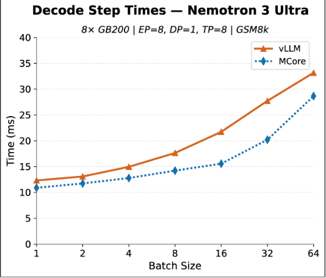
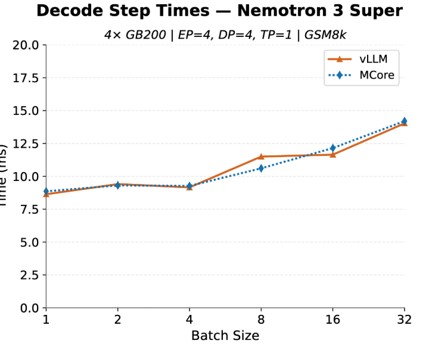

# Megatron Core Inference User Guide

A practical guide to running inference with **Megatron Core (MCore)** using the
**dynamic** inference path. This is the recommended and actively-developed
inference stack in Megatron-LM. The legacy **static** engine is being
deprecated — new work should target the dynamic path described here.

---

## Table of Contents

1. [What Megatron Inference Is For](#1-what-megatron-inference-is-for)
2. [Rollout Performance](#2-rollout-performance)
3. [Supported Features](#3-supported-features)
4. [Basic Usage: The High-Level API](#4-basic-usage-the-high-level-api)
   - [4.1 The two classes](#41-the-two-classes-megatronllm-and-megatronasyncllm)
   - [4.2 Direct mode vs. coordinator (indirect) mode](#42-direct-mode-vs-coordinator-indirect-mode)
   - [4.3 Sync offline batch generation](#43-sync-offline-batch-generation)
   - [4.4 Async generation](#44-async-generation)
   - [4.5 Sampling parameters](#45-sampling-parameters)
   - [4.6 Engine configuration](#46-engine-configuration)
   - [4.7 Reading results](#47-reading-results)
   - [4.8 Lifecycle controls](#48-lifecycle-controls)
5. [Online Serving: OpenAI-Compatible Server](#5-online-serving-openai-compatible-server)
6. [Advanced Usage: Customizing the Pipeline](#6-advanced-usage-customizing-the-pipeline)
   - [6.1 Pipeline anatomy](#61-pipeline-anatomy)
   - [6.2 Customizing the TextGenerationController](#62-customizing-the-textgenerationcontroller)
   - [6.3 Customizing the DynamicInferenceContext](#63-customizing-the-dynamicinferencecontext)
   - [6.4 Driving the engine directly](#64-driving-the-engine-directly)
7. [Examples Directory](#7-examples-directory)
8. [Known Limitations](#8-known-limitations)
9. [Roadmap and Future Work](#9-roadmap-and-future-work)
10. [See Also](#10-see-also)

---

## 1. What Megatron Inference Is For

Megatron Inference is built **primarily as the rollout engine for
reinforcement learning (RL)**, not as a standalone serving engine. While it
*can* be used as a general-purpose inference server (see
[Section 5](#5-online-serving-openai-compatible-server)), its design center is
the RL loop, where a model alternates between **training** and **generation
(rollout)** phases inside the same process.

This focus drives the major design benefits:

- **Consistency between training and inference.** RL is extremely sensitive to
  numerical mismatch between the framework that *trains* the policy and the one
  that *generates* rollouts. Running both in MCore eliminates the
  training–inference software gap and the subtle reward/KL drift it causes.
- **No model conversion.** Because rollouts run on the same MCore model, there
  is **no Hugging Face ↔ MCore conversion** step between training and
  generation, and **day-0 inference** for any model trainable in Megatron Core.
- **Cheap training ↔ inference transitions.** Tight coupling enables
  in-place weight refit and shared memory management, drastically cutting
  re-initialization cost. (For reference, NeMo-RL reported ~22 min reinit cost
  for DSV3 at 1k scale with the previous stack, with the external inference
  engine responsible for >50% of that.)
- **Colocated and non-colocated deployments.** Megatron Inference supports
  **weight refit / resharding between training and inference**, so the same
  weights can be moved between the two phases under different parallelism
  layouts. This covers both **colocated** setups (training and inference share
  the same GPUs) and **non-colocated** setups (training and inference run on
  separate resources), with the engine resharding weights to the inference-time
  parallel configuration during the swap.
- **First-class parallelism reuse.** Rollouts reuse Megatron-LM's existing TP /
  EP / PP / CP parallelism infrastructure and TransformerEngine low-precision
  kernels directly.

This work is developed in tight collaboration with the Megatron-RL team. If you
just need a quick offline generation or an OpenAI-style endpoint, that works too
— but keep in mind the engine's priorities are set by the RL use case.

---

## 2. Rollout Performance

Megatron Inference is optimized for the generation (rollout) phase of the RL
loop. Its rollout performance is **on par with popular inference frameworks**,
so you get the training/inference-consistency benefits of staying in MCore
without giving up generation speed.

The plots below show a sample comparison of decode step times against vLLM
during rollouts (lower is better). The two engines track each other closely
across batch sizes, with MCore comparable or slightly faster at larger batch
sizes:





The takeaway: you are not trading away rollout performance to gain the
training/inference consistency benefits of MCore inference.

---

## 3. Supported Features

| Area | Features |
|---|---|
| **Batching** | Dynamic / in-flight batching with vectorized bookkeeping; dynamic suspend/resume and request eviction for high input-rate regimes |
| **Chunked prefill** | Chunked-prefill scheduling with decode piggybacking, so long prompts don't stall in-flight decodes |
| **Attention / KV cache** | Optimized PagedAttention; prefix caching (with LRU / ref-zero eviction and prefix-aware coordinator routing) |
| **CUDA graphs** | Full-model CUDA graphs for prefill, decode, and mixed batches |
| **Speculative decoding** | MTP-based speculative decoding (with fused MTP bookkeeping + MTP CUDA graphs) |
| **Serving** | OpenAI-compatible HTTP server with chat templates, tool calling, and reasoning parsers |
| **MoE** | Expert model parallelism with full CUDA-graph support, expert router replay, NVLS switch-multicast token dispatcher (notably faster than the all-to-all dispatchers other frameworks use) plus an allgatherv dispatcher optimized for multi-node NVLink, and shared-expert overlap with latent MoEs |
| **Parallelism** | Data-parallel coordinator with full multi-node support; tensor model parallelism with low-latency comm primitives; expert model parallelism |
| **Model families** | GPT-style dense models, MoE models, and Mamba / hybrid (SSM + attention) models |
| **Precision** | Low-precision functionality (e.g. MXFP8); native TransformerEngine quantization kernels |
| **RL** | Weight refit / resharding between training ↔ inference, supporting both colocated (shared GPUs) and non-colocated (separate resources) deployments; batch-invariant kernels for train/inference log-prob consistency |
| **Sampling** | Temperature / top-k / top-p, stop words, log-probs, top-N log-probs; pluggable torch or FlashInfer sampling backend |

> **Batch-invariant kernels (train/inference log-prob consistency).** Standard
> GEMM/attention/norm kernels can produce slightly different numerics depending
> on batch composition, which shows up as log-prob mismatch between training and
> inference — a real source of error and instability in RL. Megatron Inference
> offers **batch-invariant kernels** (enabled via `batch_invariant_mode`) whose
> outputs do not depend on how requests are batched, so per-token log-probs
> match between the training and inference forward passes. **This is currently
> supported only for non-MoE (dense) models.**

Many of these are toggled through `InferenceConfig` — see
[Section 4.6](#46-engine-configuration).

---

## 4. Basic Usage: The High-Level API

The high-level API lives in
[`megatron/core/inference/apis/`](../megatron/core/inference/apis/) and gives
you a **vLLM-style `generate(prompts, sampling_params)` interface**. It hides
the underlying pipeline (`DynamicInferenceContext` → `GPTInferenceWrapper` →
`TextGenerationController` → `DynamicInferenceEngine`) so you do not have to
wire it up by hand.

```python
from megatron.core.inference.apis import (
    MegatronLLM,        # sync
    MegatronAsyncLLM,   # async + HTTP serving
    SamplingParams,
    ServeConfig,
)
```

### 4.1 The two classes: `MegatronLLM` and `MegatronAsyncLLM`

| Class | Use it when | Key methods |
|---|---|---|
| **`MegatronLLM`** | Synchronous offline batch generation (the common RL-rollout case). | `generate`, `pause`/`unpause`/`suspend`/`resume`, `shutdown`/`wait_for_shutdown`; context manager (`with ... as llm:`) |
| **`MegatronAsyncLLM`** | Asyncio-native generation and **HTTP serving** via `serve(...)`. | `async generate`, async lifecycle controls, `serve(serve_config)`; async context manager (`async with ... as llm:`) |

Both expose the underlying building blocks through read-only properties —
`llm.engine`, `llm.context`, `llm.controller`, `llm.is_primary_rank` — which is
the seam used for [advanced customization](#6-advanced-usage-customizing-the-pipeline).

**Caller responsibilities (before construction):**

- Call `initialize_megatron(...)` to perform full Megatron distributed setup.
- Build the model and call **`model.eval()`** — the API does *not* toggle model
  state.
- Have a tokenizer ready.

### 4.2 Direct mode vs. coordinator (indirect) mode

#### Direct mode (`use_coordinator=False`)

- **Every rank is treated as primary** and runs the engine synchronously.
- **You own data sharding** — you decide which prompts go to which
  data-parallel replica and call `generate` on each.
- Simplest path for offline batch generation when you already shard the data
  yourself (typical for many RL rollout setups).
- Lifecycle controls (`pause`/`suspend`/...) are **not available** and raise
  `RuntimeError`.
- **Not allowed with expert parallelism** (`EP > 1`) — EP routing requires the
  coordinator.

```python
with MegatronLLM(
    model=model,
    tokenizer=tokenizer,
    inference_config=inference_config,
    use_coordinator=False,        # direct mode
) as llm:
    results = llm.generate(["Megatron inference is", "Hello, world"],
                           SamplingParams(num_tokens_to_generate=64))
    for r in results:
        print(r.generated_text)
```

#### Coordinator mode (`use_coordinator=True`)

- A background data-parallel **coordinator routes requests across DP
  replicas** for you; an `InferenceClient` on **global rank 0** submits work.
- **Required** for: HTTP serving (`serve`), expert parallelism (`EP > 1`), and
  the lifecycle controls (`pause`/`unpause`/`suspend`/`resume`).
- `generate` may only be called on the **primary rank** (rank 0); worker ranks
  block until shutdown propagates.
- Internally spins up a daemon-thread event loop so the engine's asyncio
  primitives don't collide with your loop.

```python
with MegatronLLM(
    model=model,
    tokenizer=tokenizer,
    inference_config=inference_config,
    use_coordinator=True,         # coordinator mode
) as llm:
    if llm.is_primary_rank:
        results = llm.generate(prompts, SamplingParams(num_tokens_to_generate=64))
```

> **Mode/class compatibility:** `MegatronAsyncLLM` **requires
> `use_coordinator=True`** (direct async is rejected at `__init__`).
> `MegatronLLM` supports both. So the three supported combinations are:
> sync+direct, sync+coordinator, async+coordinator.

| | Direct (`use_coordinator=False`) | Coordinator (`use_coordinator=True`) |
|---|---|---|
| Data sharding | You handle it | Coordinator routes across DP |
| `generate` callable on | Every rank | Primary rank (rank 0) only |
| HTTP `serve()` | ❌ | ✅ |
| Expert parallelism (EP > 1) | ❌ | ✅ |
| `pause`/`suspend`/`resume` | ❌ | ✅ |
| `MegatronAsyncLLM` | ❌ | ✅ |

### 4.3 Sync offline batch generation

The runnable end-to-end script is
[`examples/inference/offline_inference.py`](../examples/inference/offline_inference.py).
A minimal version:

```python
from megatron.core.inference.apis import MegatronLLM, SamplingParams

# Assumes initialize_megatron(...) already ran and model.eval() was called.
with MegatronLLM(
    model=model,
    tokenizer=tokenizer,
    inference_config=inference_config,
    use_coordinator=False,
) as llm:
    results = llm.generate(
        ["The capital of France is", "Write a haiku about GPUs"],
        SamplingParams(num_tokens_to_generate=128, temperature=0.8, top_p=0.95),
    )
    for r in results:
        print(r.generated_text)
```

`generate` accepts a single prompt or a batch, as **strings or pre-tokenized
token-id lists**:

- `"a single string"` → returns a 1-element list
- `["a", "b"]` → returns a list in input order
- `[1, 2, 3]` → a single token-id prompt
- `[[1, 2], [3, 4]]` → a batch of token-id prompts

`MegatronLLM.generate` **always returns a `list[DynamicInferenceRequest]`**,
even for single-prompt input.

### 4.4 Async generation

`MegatronAsyncLLM` mirrors the sync API with `await`. Note the deliberate
asymmetry: async `generate` returns a **single** request for single input and a
**list** for batched input.

```python
import asyncio
from megatron.core.inference.apis import MegatronAsyncLLM, SamplingParams

async def main():
    async with MegatronAsyncLLM(
        model=model,
        tokenizer=tokenizer,
        inference_config=inference_config,
        use_coordinator=True,     # async requires coordinator mode
    ) as llm:
        if llm.is_primary_rank:
            r = await llm.generate("Hello", SamplingParams(num_tokens_to_generate=32))
            print(r.generated_text)            # single input -> single result
            rs = await llm.generate(["a", "b"], SamplingParams(num_tokens_to_generate=32))
            print([x.generated_text for x in rs])  # batch input -> list

asyncio.run(main())
```

### 4.5 Sampling parameters

`SamplingParams` is per-`generate`-call and controls decoding behavior:

| Field | Meaning |
|---|---|
| `num_tokens_to_generate` | Max new tokens to generate |
| `temperature` | Softmax temperature (`1.0` = unmodified) |
| `top_k` | Keep top-k logits (`0` = disabled) |
| `top_p` | Nucleus sampling threshold (`0.0` = disabled) |
| `termination_id` | Token id that stops generation (commonly the EOD token) |
| `stop_words` | List of strings that stop generation when produced |
| `return_log_probs` | Return prompt + generated log-probs |
| `skip_prompt_log_probs` | Skip prompt log-probs (only generated) |
| `top_n_logprobs` | Return top-N log-probs per position |
| `add_BOS` | Prepend BOS when tokenizing |

```python
sp = SamplingParams(
    num_tokens_to_generate=256,
    temperature=0.7,
    top_p=0.9,
    return_log_probs=True,        # needed for RL: importance weights / KL
)
```

> **RL note:** for log-probs to be materialized correctly, set
> `InferenceConfig.materialize_only_last_token_logits=False` when you request
> `return_log_probs`.

### 4.6 Engine configuration

`InferenceConfig` configures the engine/KV-cache/CUDA-graph behavior and is
where most features are turned on. Construct it directly, or derive it from
model + CLI args via
`megatron.inference.utils.get_inference_config_from_model_and_args`. Frequently
used fields:

| Field | Purpose |
|---|---|
| `max_sequence_length` | Max prompt + output length you expect |
| `buffer_size_gb` | GPU memory reserved for the KV cache |
| `block_size_tokens` | KV-cache block (page) size |
| `max_requests` / `max_tokens` | Caps on concurrent requests / tokens per forward pass |
| `enable_chunked_prefill` | Chunked prefill (piggybacking) |
| `enable_prefix_caching` | Prefix caching + `prefix_caching_eviction_policy` / `prefix_caching_coordinator_policy` |
| `num_speculative_tokens` | MTP-based speculative decoding |
| `num_cuda_graphs`, `cuda_graph_*` | CUDA-graph capture controls |
| `sampling_backend` | `'torch'` (default) or `'flashinfer'` |
| `mamba_inference_state_config`, `mamba_memory_ratio` | Hybrid/Mamba model state |
| `kv_cache_management_mode`, `unified_memory_level` | Suspend/resume memory handling (`persist` / `offload` / `recompute`) |

```python
from megatron.core.inference.config import InferenceConfig

inference_config = InferenceConfig(
    max_sequence_length=4096,
    buffer_size_gb=40,
    enable_prefix_caching=True,
    enable_chunked_prefill=True,
)
```

### 4.7 Reading results

`generate` returns `DynamicInferenceRequest` objects. The fields you'll use
most:

| Field | Contents |
|---|---|
| `generated_text` | Decoded output string |
| `generated_tokens` | Output token ids |
| `prompt` / `prompt_tokens` | Echoed prompt text / token ids |
| `prompt_log_probs`, `generated_log_probs` | Log-probs (when requested) |
| `ttft` | Time-to-first-token (seconds) |
| `status` | Terminal request status |

### 4.8 Lifecycle controls

In **coordinator mode**, you can drive the engine's state machine — important
for the RL loop where you alternate generation and training:

- `pause()` / `unpause()` — halt and resume scheduling.
- `suspend()` / `resume()` — offload/reload GPU buffers (KV cache, Mamba
  states). Call `pause()` before `suspend()`.
- `shutdown()` / `wait_for_shutdown()` — tear down or block until the engine
  loop terminates.

These raise `RuntimeError` in direct mode. The context-manager exit calls
`shutdown()` for you.

`suspend()` / `resume()` are also the hook for **weight refit / resharding**
between training and inference: suspend the engine (optionally offloading the
KV cache), refit/reshard the updated weights into the inference parallel layout,
then resume. This is what enables both **colocated** (training and inference on
the same GPUs) and **non-colocated** (separate resources) RL deployments.

---

## 5. Online Serving: OpenAI-Compatible Server

`MegatronAsyncLLM.serve(...)` starts an **OpenAI-compatible HTTP frontend** on
the primary rank (global rank 0), exposing `/v1/completions` and
`/v1/chat/completions`. Serving **requires coordinator mode**.

The runnable script is
[`examples/inference/launch_inference_server.py`](../examples/inference/launch_inference_server.py),
with the shell wrapper
[`examples/inference/run_inference_server.sh`](../examples/inference/run_inference_server.sh)
(packaged for a Nemotron-6 3B hybrid MoE config: TP 2, EP 8, PP 1).

```python
import asyncio
from megatron.core.inference.apis import MegatronAsyncLLM, ServeConfig

async def main():
    async with MegatronAsyncLLM(
        model=model,
        tokenizer=tokenizer,
        inference_config=inference_config,
        use_coordinator=True,
    ) as llm:
        await llm.serve(
            ServeConfig(host="0.0.0.0", port=5000),
            blocking=True,          # blocks until shutdown
        )

asyncio.run(main())
```

`ServeConfig` fields: `host` (`"0.0.0.0"`), `port` (`5000`), `parsers` (`[]` —
response/reasoning/tool parsers), `verbose` (`False` — per-request logging),
`frontend_replicas` (`4` — HTTP frontend processes on the primary rank).

Launch with the wrapper:

```bash
bash examples/inference/run_inference_server.sh \
    --hf-token <HF_TOKEN> \
    --hf-home /path/to/hf_home \
    --checkpoint /path/to/nemotron-3b-hybrid-moe
```

When ready, you'll see:

```
INFO:root:Inference co-ordinator is ready to receive requests!
INFO:hypercorn.error:Running on http://0.0.0.0:5000 (CTRL + C to quit)
```

Then query it with any OpenAI-compatible client. Chat templates, tool calling,
and reasoning parsers are supported.

```bash
# Completions
curl http://localhost:5000/v1/completions \
  -H "Content-Type: application/json" \
  -d '{"model": "EMPTY", "prompt": "The capital of France is", "max_tokens": 32}'

# Chat completions
curl http://localhost:5000/v1/chat/completions \
  -H "Content-Type: application/json" \
  -d '{"model": "EMPTY", "messages": [{"role": "user", "content": "Hi!"}]}'
```

```python
from openai import OpenAI

client = OpenAI(base_url="http://localhost:5000/v1", api_key="EMPTY")
resp = client.chat.completions.create(
    model="EMPTY",                 # model field is not validated; pass anything
    messages=[{"role": "user", "content": "Write a haiku about GPUs"}],
)
print(resp.choices[0].message.content)
```

> The dynamic server currently returns `"model": "EMPTY"` and does **not**
> validate the request `model` field — pass anything you like. See
> [Known Limitations](#8-known-limitations).

---

## 6. Advanced Usage: Customizing the Pipeline

When you need step-level scheduling control, a custom sampling/forward-step
integration, or to migrate an existing pipeline, you can drop below the
high-level API and assemble (or subclass) the components yourself.

### 6.1 Pipeline anatomy

The high-level API builds this pipeline for you:

```
DynamicInferenceContext   # KV cache, paging, scheduling/bookkeeping state
        │
GPTInferenceWrapper       # model forward wrapper for inference
        │
TextGenerationController   # tokenize → forward → sample → detokenize
        │
DynamicInferenceEngine     # add_request / step loop, coordinator integration
```

You can reach any of these from a constructed `llm` via `llm.context`,
`llm.controller`, and `llm.engine`. Or build them explicitly — exactly what the
high-level API does internally:

```python
from megatron.core.inference.contexts.dynamic_context import DynamicInferenceContext
from megatron.core.inference.model_inference_wrappers.gpt.gpt_inference_wrapper import (
    GPTInferenceWrapper,
)
from megatron.core.inference.text_generation_controllers.text_generation_controller import (
    TextGenerationController,
)
from megatron.core.inference.engines import DynamicInferenceEngine

context = DynamicInferenceContext(model.config, inference_config)
wrapped_model = GPTInferenceWrapper(model, context)
controller = TextGenerationController(wrapped_model, tokenizer)
engine = DynamicInferenceEngine(controller, context)
```

### 6.2 Customizing the `TextGenerationController`

The `TextGenerationController` owns the tokenize → forward → **sample** →
detokenize path. Subclass it to inject custom behavior, then pass your instance
to the engine. Useful override points include:

- `sample_from_logits(...)` — custom sampling / logit processing (constrained
  decoding, custom penalties, grammar masks).
- `tokenize_prompt(...)` / `detokenize_generations(...)` — custom
  tokenization / detokenization.
- `generate_output_tokens_dynamic_batch(...)` — custom batch forward-step
  integration.

```python
class MyController(TextGenerationController):
    def sample_from_logits(self, last_token_logits, sampling_params, *args, **kwargs):
        # apply a custom logit bias, then defer to the base sampler
        last_token_logits = last_token_logits + my_logit_bias
        return super().sample_from_logits(last_token_logits, sampling_params, *args, **kwargs)

controller = MyController(wrapped_model, tokenizer)
engine = DynamicInferenceEngine(controller, context)
```

### 6.3 Customizing the `DynamicInferenceContext`

The `DynamicInferenceContext` holds the KV cache, paging, and the
scheduling/bookkeeping state. Configure it through `InferenceConfig`
(buffer size, block size, prefix caching, chunked prefill, CUDA graphs,
suspend/resume memory mode, Mamba state — see
[Section 4.6](#46-engine-configuration)). For deeper changes — custom KV-cache
layouts, eviction, or scheduling — subclass the context and pass it into the
wrapper and engine.

### 6.4 Driving the engine directly

For full step-level control, skip `generate` and drive the engine's
`add_request` / `step_modern` loop yourself. This is how you implement custom
arrival schedules, batch-drain modes, or suspend/resume policies:

```python
engine.add_request(request_id, prompt_text, sampling_params)
while engine.has_unfinished_requests():
    result = engine.step_modern()
    for record in result["finished_request_records"]:
        finished = record.merge()
        print(finished.request_id, finished.generated_text)
```

The fully worked manual-stepping example is
[`examples/inference/advanced/gpt_dynamic_inference.py`](../examples/inference/advanced/gpt_dynamic_inference.py)
(arrival scheduling, batch-drain, suspend/resume, CUDA-graph bucketing,
log-probs, JSON dumping). For explicit coordinator + `InferenceClient`
lifecycle management, see
[`gpt_dynamic_inference_with_coordinator.py`](../examples/inference/advanced/gpt_dynamic_inference_with_coordinator.py).

---

## 7. Examples Directory

Everything above is runnable from
[`examples/inference/`](../examples/inference/):

| Path | What it shows |
|---|---|
| [`offline_inference.py`](../examples/inference/offline_inference.py) | Batched offline generation through the high-level API. Covers all 3 supported mode combos via `--mode sync|async` and `--use-coordinator`. |
| [`run_offline_inference.sh`](../examples/inference/run_offline_inference.sh) | Shell wrapper for a Qwen 2.5-1.5B offline-inference config. |
| [`launch_inference_server.py`](../examples/inference/launch_inference_server.py) | OpenAI-compatible HTTP server via `MegatronAsyncLLM.serve(...)`. |
| [`run_inference_server.sh`](../examples/inference/run_inference_server.sh) | Shell wrapper for a Nemotron-6 3B hybrid-MoE server config. |
| [`utils.py`](../examples/inference/utils.py) | Shared helpers (`Request`, `build_requests`, output formatting, JSON dump). |
| [`advanced/gpt_dynamic_inference.py`](../examples/inference/advanced/gpt_dynamic_inference.py) | Manual `add_request`/`step_modern` stepping. |
| [`advanced/gpt_dynamic_inference_with_coordinator.py`](../examples/inference/advanced/gpt_dynamic_inference_with_coordinator.py) | Explicit coordinator + `InferenceClient` lifecycle. |

Run the offline example across modes:

```bash
# sync + direct (defaults)
bash examples/inference/run_offline_inference.sh \
    --hf-token <HF_TOKEN> --checkpoint /path/to/qwen-1.5b

# sync + coordinator
bash examples/inference/run_offline_inference.sh \
    --hf-token <HF_TOKEN> --checkpoint /path/to/qwen-1.5b --use-coordinator

# async + coordinator
bash examples/inference/run_offline_inference.sh \
    --hf-token <HF_TOKEN> --checkpoint /path/to/qwen-1.5b --mode async --use-coordinator
```

All supported modes produce numerically identical generated text.

---

## 8. Known Limitations

- **`MLA models are not supported`**.
- **`engine.reset()` is unsafe in coordinator mode.** It can deadlock (rebinds
  internal asyncio primitives that suspended waiters still reference) or
  silently re-route to direct-mode branches. The offline example therefore
  blocks `--inference-repeat-n > 1` together with `--use-coordinator`. Direct-mode
  reset is safe.
- **HTTP frontend is fixed to global rank 0.** There is no per-rank `role`
  override on `ServeConfig`; control placement via the launcher (e.g. torchrun
  rank-0 placement).
- **Server returns `"model": "EMPTY"`.** The HTTP frontend doesn't echo or
  validate a configured model name and exposes no `GET /v1/models` endpoint.
  Clients may pass any `model` value; it is ignored.

See [`megatron/core/inference/README.md`](../megatron/core/inference/README.md)
for the detailed root-cause notes behind each limitation.

---

## 9. Roadmap and Future Work

**API and serving:**

- **Dynamic streaming** — offline streaming via `engine.async_step()` and HTTP
  streaming of partial outputs.
- **Weight-update APIs** — `suspend_for_refit()` /
  `update_weights_from_collective()` / `resume_after_refit()` wrapping the
  resharding/refit primitives for RL weight swaps between rollout steps, across
  both colocated and non-colocated deployments.
- **`megatron serve` CLI** — a single-binary launcher mirroring `vllm serve`,
  with single-node and multi-node / headless modes.
- **Config-based model construction** — `MegatronLLM(model="...")` with model
  recipes and checkpoint resolution, removing manual model building.
- **Simplified inference API** overall.

**Models and performance:**

- **Disaggregated inference** (prefill/decode separation).
- **FlashInfer integration** for attention / Mamba kernels (sampling is already
  integrated).
- **Async dynamic context update** — moves bookkeeping off the critical path.
- **All2Allv-based token dispatcher** for MoE.
- **Large-scale inference optimizations** (large models and long sequences).
- **Low-precision numerics** for KV cache and Mamba state.
- **Router-Replay** for reducing mismatch between inference and training for MOE models. 

---

## 10. See Also

- API reference / mental model: [`megatron/core/inference/README.md`](../megatron/core/inference/README.md)
- Examples overview: [`examples/inference/README.md`](../examples/inference/README.md)
- Low-level engine source: [`megatron/core/inference/`](../megatron/core/inference/)
- High-level API source: [`megatron/core/inference/apis/`](../megatron/core/inference/apis/)
- Functional tests: `tests/functional_tests/test_cases/gpt/gpt_offline_inference_*`, `gpt_inference_server_smoke_*`
- Unit tests: `tests/unit_tests/inference/high_level_api/`
