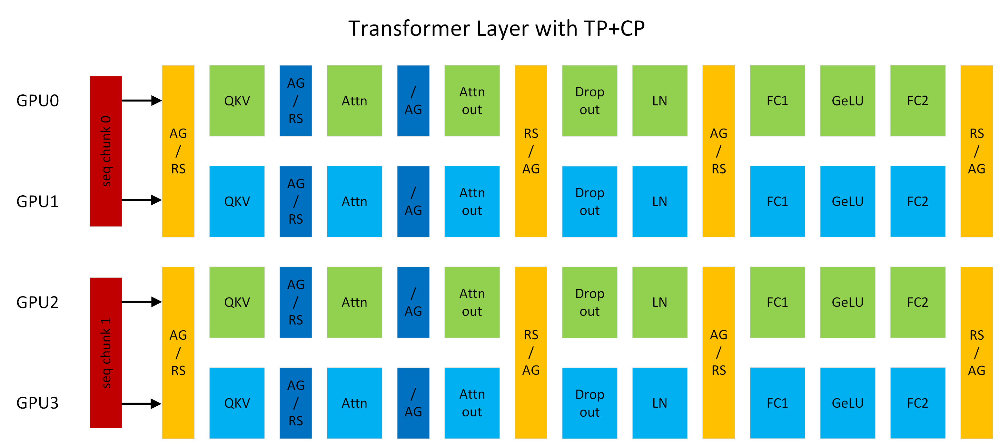
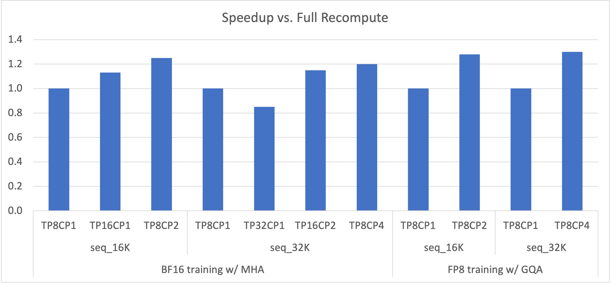

context\_parallel package
=========================

Context parallelism overview 
----------------------------

   
   Figure 1: A transformer layer running with TP2CP2. Communications next to Attention are for CP, others are for TP. (AG/RS: all-gather in forward and reduce-scatter in backward, RS/AG: reduce-scatter in forward and all-gather in backward, /AG: no-op in forward and all-gather in backward).

Context Parallelism ("CP") is a parallelization scheme on the dimension of sequence length. Unlike prior SP (sequence parallelism) which only splits the sequence of Dropout and LayerNorm activations, CP partitions the network inputs and all activations along sequence dimension. With CP, all modules except attention (e.g., Linear, LayerNorm, etc.) can work as usual without any changes, because they do not have inter-token operations. As for attention, the Q (query) of each token needs to compute with the KV (key and value) of all tokens in the same sequence. Hence, CP requires additional all-gather across GPUs to collect the full sequence of KV. Correspondingly, reduce-scatter should be applied to the activation gradients of KV in backward propagation. To reduce activation memory footprint, each GPU only stores the KV of a sequence chunk in forward and gathers KV again in backward. KV communication happens between a GPU and its counterparts in other TP groups. The all-gather and reduce-scatter are transformed to point-to-point communications in ring topology under the hood. Exchanging KV also can leverage MQA/GQA to reduce communication volumes, as they only have one or few attention heads for KV.

For example, in Figure 1, assuming sequence length is 8K, each GPU processes 4K tokens. GPU0 and GPU2 compose a CP group, they exchange KV with each other. Same thing also happens between GPU1 and GPU3. CP is similar to `Ring Attention <https://arxiv.org/abs/2310.01889>`_ but provides better performance by (1) leveraging the latest OSS and cuDNN flash attention kernels; (2) removing unnecessary computation resulted from low-triangle causal masking and achieving optimal load balance among GPUs.

Context parallelism benefits 
----------------------------

   
   Figure 2: Speedup of 175B GPT with various TP+CP combinations vs. full recompute (i.e., TP8CP1).

LLM encounters OOM (out of memory) issue with long context (i.e., long sequence length) because of linearly increasing memory footprint of activations. Recomputing activations in backward can avoid OOM but also introduce significant overheads (~30% with full recompute). Enlarging TP (tensor model parallelism) can fix the OOM issue as well, but it potentially makes compute (e.g., Linear) too short to overlap communication latencies. To be clear, scaling out to more GPUs with bigger TP can hit the overlapping problem no matter if OOM happens.

CP can better address the issues. With CP, each GPU only computes on a part of the sequence, which reduces both computation and communication by CP times. Therefore, there are no concerns about the overlapping between them. The activation memory footprint per GPU is also CP times smaller, hence no OOM issue any more. As Figure 2 shows, the combinations of TP and CP can achieve optimal performance by eliminating recompute overheads and making the best tradeoff between computation and communications.

Enabling context parallelism
----------------------------

CP support has been added to GPT. All models that share GPT code path also should be able to benefit from CP, such as Llama. CP can work with TP (tensor model parallelism), PP (pipeline model parallelism), and DP (data parallelism), where the total number of GPUs equals TPxCPxPPxDP. CP also can work with different attention variants, including MHA/MQA/GQA, uni-directional and bi-directional masking.

CP is enabled by simply setting context_parallel_size=<CP_SIZE> in command line. Default context_parallel_size is 1, which means CP is disabled. Running with CP requires Megatron-Core (>=0.5.0) and Transformer Engine (>=1.1).
