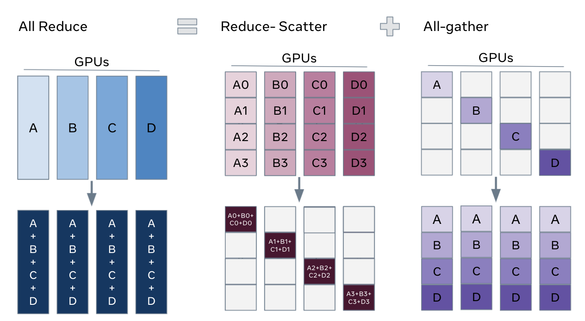
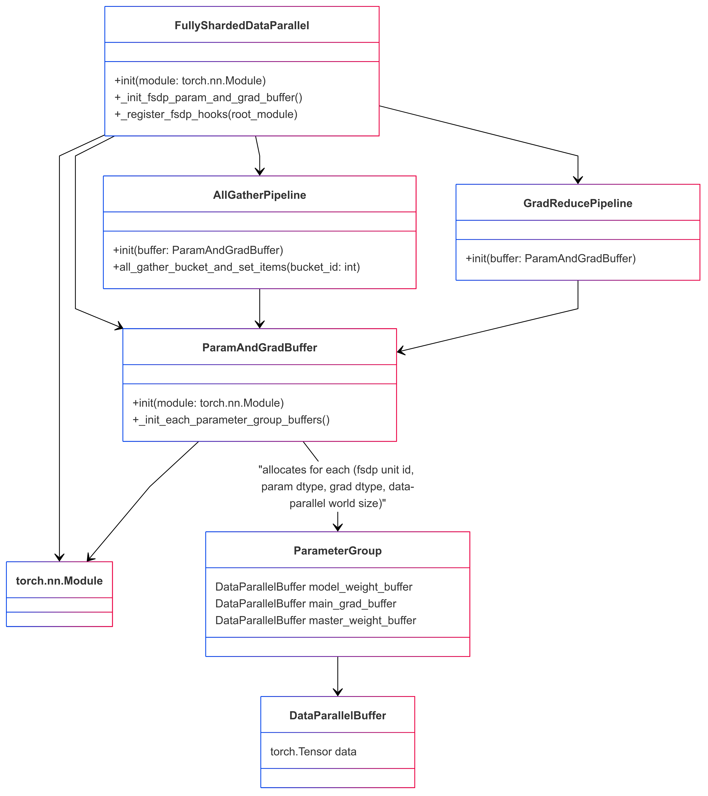

# MCore Custom Fully Sharded Data Parallel (FSDP)

## How to use ?

Add these flag to enable MCore custom FSDP.

```bash
--use-custom-fsdp
--data-parallel-sharding-strategy optim_grads_params
--no-gradient-accumulation-fusion
--use-distributed-optimizer
```

## Key Features

- **Sharding Strategy**: Efficiently shards optimizer states, gradients, and parameters to reduce memory consumption.
- **Communication and Computation Overlap**: Optimized to enable concurrent execution of communication and computation, enhancing overall efficiency.
- **Supports automatic mixed precision training**: Compatible with BF16 O1/O2/O3 recipes, as well as FP8 compute with FP32 parameters and FP8 parameter training, allowing for flexible precision configurations.
- **Tensor Parallelism (TP), Expert Parallelism (EP) and Context Parallelism (CP)**: Compatible with TP, EP and CP configurations, enabling efficient scaling of large language models.
- **Distributed Model Initialization with Meta Device**: Allows model initialization using meta device, followed by layer-by-layer initialization of distributed model weight buffers via the `Module.reset_parameters` API, facilitating the initialization of extremely large models.

## Configuration Recommendations

### 1. Disable `CUDA_MAX_CONNECTIONS`

To ensure full parallelization of FSDP communication and computation, disable the CUDA_MAX_CONNECTIONS environment variable. This step avoids potential bubble in CUDA stream. (But it may slow down TP and CP to some extent.)

```bash
unset CUDA_MAX_CONNECTIONS
```

### 2. Add `--calculate-per-token-loss`

For gradients sharding mode optimization, include the `--calculate-per-token-loss` flag in your training script. This improves performance by reducing the frequency of gradient scaling, which is also a sizable drain on SM resources.

## Design of Custom FSDP

### 1. Overview

The custom Fully Sharded Data Parallelism (FSDP) implementation in Megatron-Core is specifically designed to optimize memory consumption and performance for large language models. The core design principles include:

 - **Optimized for Large Language Models**: This custom FSDP implementation is tailored to efficiently scale with models containing billions of parameters, ensuring seamless execution and training of massive models.
 - **Efficient Memory Consumption**: By strategically sharding optimizer states, gradients, and model parameters, the custom FSDP significantly reduces memory usage. This approach enables the training of models that would otherwise be too large to fit in memory.
 - **Efficient Workflow & Overlapping Communication and Computation**: The implementation is engineered to minimize the number of communication steps required during training. It maximizes the overlap between communication and computation, thereby enhancing overall training efficiency and reducing latency.
 - **Support for MCore's Efficient Training Methods**: The custom FSDP seamlessly integrates with Megatron-Core's advanced parallelism techniques, including tensor parallelism, expert parallelism and context parallelism. Additionally, it supports automatic mixed precision training, further optimizing training performance and efficiency.

The design of Custom FSDP draws inspiration from PyTorch FSDP [Zhao, Yanli, et al.](https://arxiv.org/pdf/2304.11277) and MCore's distributed optimizer. The introduction to PyTorch FSDP is referenced here to clarify the underlying concepts of the custom FSDP design.

> In DistributedDataParallel, (DDP) training, each process/ worker owns a replica of the model and processes a batch of data, finally it uses all-reduce to sum up gradients over different workers. In DDP the model weights and optimizer states are replicated across all workers. FSDP is a type of data parallelism that shards model parameters, optimizer states and gradients across DDP ranks.

> When training with FSDP, the GPU memory footprint is smaller than when training with DDP across all workers. This makes the training of some very large models feasible by allowing larger models or batch sizes to fit on device. This comes with the cost of increased communication volume. The communication overhead is reduced by internal optimizations like overlapping communication and computation.


*Notice that the unit processed in workflow here is the “FSDP instance 1: N layers”, where an FSDP instance is the smallest FSDP processing unit (also a PyTorch module), which means that we can safely release this module weights after using it (executing the forward or backward of this module), and there will be no other computations computations relying on these weights. This capability is the foundation of FSDP's layer-by-layer execution and memory-saving strategy. An FSDP instance is also referred to as an **FSDP Unit**.*

*It is worth noting that an FSDP instance can correspond to multiple FSDP parameter groups. These groups are separated by Data Parallel (DP) communication groups and the data type of the parameter or gradient. Consequently, an FSDP instance may require several parameter-gather tasks before execution (forward or backward). Each **FSDP parameter group** corresponds to one **Data Parallel Buffer** in custom FSDP.*

At a high level FSDP works as follow:

In constructor
 - Shard model parameters and each rank only keeps its own shard

In forward path
 - Run all_gather to collect all shards from all ranks to recover the full parameter in this FSDP unit
 - Run forward computation
 - Discard parameter shards it has just collected

In backward path
 - Run all_gather to collect all shards from all ranks to recover the full parameter in this FSDP unit
 - Run backward computation
 - Run reduce_scatter to sync gradients
 - Discard parameters.

One way to view FSDP’s sharding is to decompose the DDP gradient all-reduce into reduce-scatter and all-gather. Specifically, during the backward pass, FSDP reduces and scatters gradients, ensuring that each rank possesses a shard of the gradients. Then it updates the corresponding shard of the parameters in the optimizer step. Finally, in the subsequent forward pass, it performs an all-gather operation to collect and combine the updated parameter shards.



### 2. Custom FSDP underlying data structure

To implement the FSDP functionality described above, the custom FSDP is designed with the following Python classes and data structure:



### 3. The custom FSDP interface: FullyShardedDataParallel

The custom FSDP provides the same programming interface as PyTorch's DistributedDataParallel (DDP) as FullyShardedDataParallel (FSDP). For example, you can apply FSDP to models as follows:

```python
# Initialize model and optimizer
ddp_config.use_custom_fsdp = True
ddp_config.data_parallel_sharding_strategy = "optim_grads_params"
model = GPTModel(transformer_config)
model = FullyShardedDataParallel(
    transformer_config,
    model,
    ddp_config,
    fsdp_unit_modules = [TransformerLayer, LanguageModelEmbedding],
)
optimizer = torch.optim.AdamW(model.parameters(), lr=lr)
optimizer = DistributedOptimizer(optimizer, [model], [model.param_and_grad_buffer])

# Training loop
def train_step(inputs, labels):
    optimizer.zero_grad()
    for mbs_input, mbs_label in zip(inputs, labels):
        outputs = model(mbs_input)
        loss = loss_fn(outputs, mbs_label)
        loss.backward()
    optimizer.step()

# Save and load model and optimizer state dict
def model_and_optimizer_state_dict():
    state_dict = {
        "model": model.sharded_state_dict(),
        "optimizer": optimizer.sharded_state_dict(),
    }
    return state_dict

def load_model_and_optimizer_state_dict(state_dict):
    model.load_state_dict(state_dict["model"])
    optimizer.load_state_dict(state_dict["optimizer"])
```

**Key Notes:**
 - You can configure which modules should be treated as FSDP units via the `fsdp_unit_modules` argument. This configuration is mandatory.
 - The custom FSDP must be used with a distributed optimizer since it provides distributed checkpointing.
 - The data-parallel communication group for parameters is not explicitly shown. Custom FSDP configures these groups as either DP (data-parallel) or EDP (expert data-parallel) based on parameter markings.

#### 3.1 Initializing Models on the Meta Device

For training particularly large models with FSDP, you can initialize the model on the meta device. Using PyTorch's `reset_parameters` API, you can initialize model weights layer by layer during the construction of the `ParamAndGradBuffer`. Most PyTorch native modules and TransformerEngine modules support this API (e.g., [PyTorch Linear](https://github.com/pytorch/pytorch/blob/v2.6.0/torch/nn/modules/linear.py#L114), [TE LayerNormLinear](https://github.com/NVIDIA/TransformerEngine/blob/release_v2.0/transformer_engine/pytorch/module/layernorm_linear.py#L1107)).

```python
# Initialize model on meta device
with torch.device("meta"):
    model = GPTModel(config)

model = FullyShardedDataParallel(
    transformer_config,
    model,
    ddp_config,
    fsdp_unit_modules=[TransformerLayer, LanguageModelEmbedding],
)
```

**Important Considerations:**
1. *Custom Modules*: If your model contains custom modules, ensure they implement the `reset_parameters` API. Otherwise, you may need to force parameter initialization on a CUDA or CPU device.
2. *Tensor Initialization*: Be cautious of tensors created during model initialization without a specified device—they will default to the meta device. To avoid issues, explicitly specify the device for these tensors to ensure compatibility with this function.

### 4. Interaction between Custom FSDP and Model Forward/Backward Propagation

Custom FSDP implements Fully Sharded Data Parallelism (FSDP) through a series of module hooks, gradient hooks, or by adding functions between modules. This involves inserting communications and manipulating parameters and gradients during PyTorch's module forward or backward propagation.

Module hooks summary:
- Module pre-forward hook(`module.register_forward_pre_hook`): This hook unshards model weights before the forward pass. In the case of an FSDP Unit Module, add a RegisterFSDPBackwardFunction function that will release the module's modes on backward propagation.
- Module post-forward hook(`module.register_forward_hook`): This hook is used to reshard model weights after the forward pass.
- Root module pre-backward hook(`root_module.register_full_backward_pre_hook`): This hook checks that all model parameters are resharded, in order to avoid unnecessary memory spikes. It also marks all modules as being in the `TrainingState.PRE_BACKWARD` state.
- Module pre-backward hook(`module.register_full_backward_pre_hook`): This hook is used to unshard the model weights before the backward pass.
- Gradient accumulation hook(`grad_acc.register_hook`): This hook is used to accumulate gradients and trigger the gradient reduction pipeline. 


The gradient reduction pipeline maintains a map of gradients to FSDP parameter groups. If all gradients in an FSDP parameter group are ready, it launches a gradient reduction. Note that this assumes that the model's gradients are always generated in a certain order (reverse of `module.parameters()`), as otherwise, FSDP would maintain too many parameter group grad buffers, leading to excessive memory usage.

#### 4.1 Optimized for Activation Recompute

Using the activation recompute will cause the same module to execute the forward function first and then the backward function in the backward prop, which will cause model weights unshard twice and model weights reshard twice. If we can tell program that this is a forward + backward operation, we can just call unshard once and reshard once.

To make this determination, we keep track of the model's state with training_state, `FORWARD`, `PRE_BACKWARD`, `POST_BACKWARD`, `IDLE`. It's worth noting that pre-backward hook act before pre-forward hook, and we'll let pre-backward hook execute the model weight unshard, and then mark the model as `PRE_BACKWARD`, and when pre-forward hook sees this marking it will not perform the unshard operation. Similarly, for model weight reshard duplicate, post-forward hook act before post-backward function, and checking for the `PRE_BACKWARD` flag in the post-forward hook will cancel the unshard.

### 5. Memory Mechanisms and Features of Custom FSDP

FSDP can fully distribute the model parameters, gradients, and optimizer states, and for mixed-precision training, it can also fully distribute the high-precision main weights. This is pretty much distributes all the memory except for the activation memory, but FSDP will also face some memory issues.

FSDP frequently unshards and reshards model weights, which can lead to busy memory allocation and deallocation. This results in untimely tensor releases, causing memory spikes (or even out-of-memory errors), crashes of the PyTorch memory allocator cache, and a large number of `cudaMalloc` and `cudaFree` calls. These issues can significantly slow down the system.

The problem of untimely tensor release can generally be addressed using the `tensor._typed_storage(). _resize_(0)` API, which immediately deallocates the storage's memory. Custom FSDP provides interfaces in `AllGatherPipeline` and `GradReducePipeline` to replace the temporary buffer memory allocator used for parameter gathering and gradient reduction with ` StorageResizeBasedBucketAllocator`. This replaces the tensor release operation with the `tensor._typed_storage(). _resize_(0)` API.

The PyTorch memory allocator cache crash is a complex issue that occurs frequently when the actual memory usage approaches the GPU memory limit, leading to poor performance. This problem is challenging and can only be mitigated by avoiding frequent hits on the GPU memory limit. Using a self-managed memory allocator like ` RotaryBucketAllocator` is another potential solution. However, note that `RotaryBucketAllocator` is not yet mature.

## References

- [Getting Started with Fully Sharded Data Parallel (FSDP)](https://pytorch.org/tutorials/intermediate/FSDP_tutorial.html)
