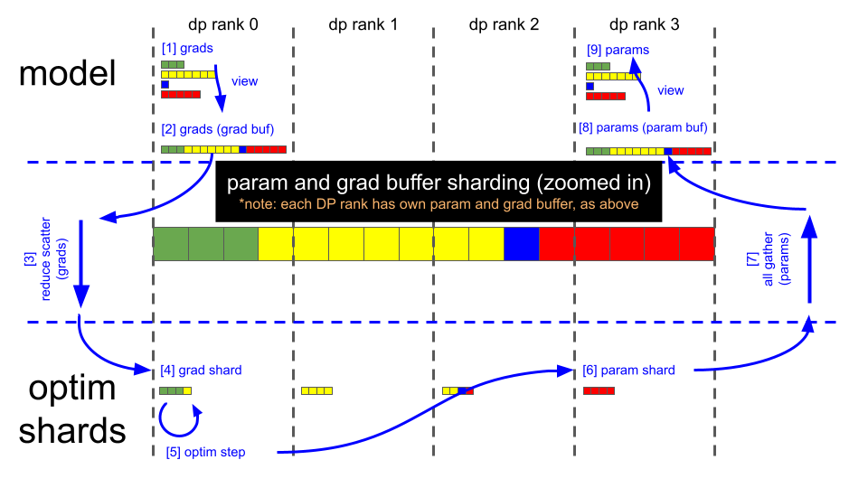
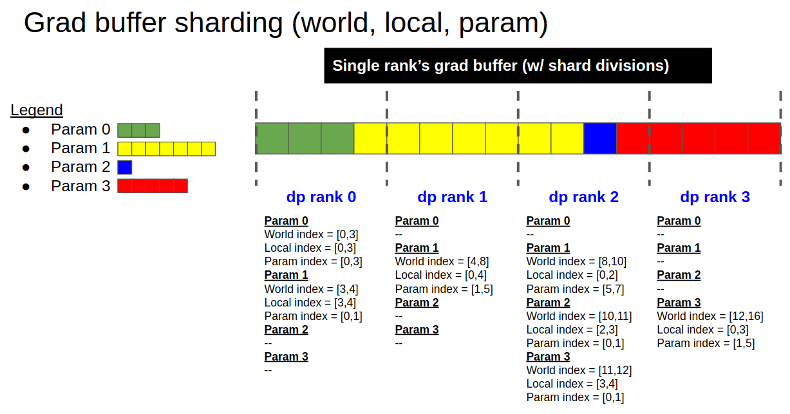

# Distributed Optimizer

The motivation for the distributed optimizer is to save memory by distributing the optimizer state evenly across data parallel ranks, versus the current method of replicating the optimizer state across data parallel ranks. As described in https://arxiv.org/abs/1910.02054, this branch specifically implements the following:

- [yes] distribute all 'non-overlapping' optimizer state (i.e., model params already in fp32 are NOT distributed)
- [no] distribute model gradients
- [no] distribute model parameters

Theoretical memory savings vary depending on the combination of the model's param dtype and grad dtype. In the current implementation, the theoretical number of bytes per parameter is (where 'd' is the data parallel size):

|        | Non-distributed optim | Distributed optim |
| ------ | ------ | ------ |
| float16 param, float16 grads | 20 | 4 + 16/d |
| float16 param, fp32 grads    | 18 | 6 + 12/d |
| fp32 param, fp32 grads       | 16 | 8 + 8/d  |

The implementation of the distributed optimizer is centered on using the contiguous grad buffer for communicating grads & params between the model state and the optimizer state. The grad buffer at any given moment either holds:

1. all model grads
2. a 1/d size _copy_ of the main grads (before copying to the optimizer state)
3. a 1/d size _copy_ of the main params (after copying from the optimizer state)
4. all model params
5. zeros (or None), between iterations

The grad buffer is used for performing reduce-scatter and all-gather operations, for passing grads & params between the model state and optimizer state. With this implementation, no dynamic buffers are allocated.

The figures below illustrate the grad buffer's sharding scheme, and the key steps of the distributed optimizer's param update:

## Data flow

## Sharding scheme

## Key steps

_(note: using illustrations above, and assuming fp16 grads)_

- Backward pass finishes (grad buffer holds 16 fp16 grad elements)
- Call reduce-scatter on each DP rank
- Each DP rank now has 4 elements within the grad buffer that are fully reduced (remaining 12 elements are garbage)
- Each DP rank copies its relevant 4 fp16 grad elements from the grad buffer into 4 fp32 main grad elements (separate buffer, owned by the optimizer); i.e.
  - DP rank 0 copies elements [0:4]
  - DP rank 1 copies elements [4:8]
  - DP rank 2 copies elements [8:12]
  - DP rank 3 copies elements [12:16]
- Optimizer.step()
- Each DP rank copies its 4 fp32 main (/optimizer) param elements into the corresponding 4 fp16 elements in the grad buffer
- Call all-gather on each DP rank
- Grad buffer now contains all 16, fully updated, fp16 model param elements
- Copy updated model params from grad buffer into their respective param tensors
- (At this point, grad buffer is ready to be zero'd for the next iteration)
