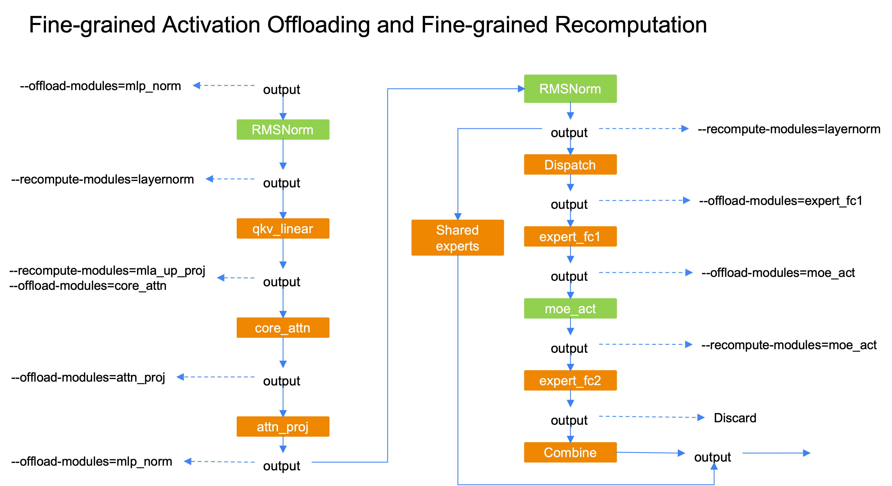

# Fine-grained Activation Offloading (collaborated with rednote)

Memory capacity is more and more important with the rising of extreme sparse MoE models like DeepSeek-V3 and Qwen3-235B. Fine-grained recomputing reduces the memory footprint at the cost of extra recomputation, while offloading could utilize the host-device bandwidth to achieve nearly zero-overhead. Fine-grained Activation Offloading targets at offloading the activation at the granularity of specific modules, so that we can calibrate the amount of offloading activation to maximize the training throughput.

Currently, the supported offloading modules are `"attn_norm", "core_attn", "attn_proj", "mlp_norm", "expert_fc1", "moe_act"`, which could work with fine-grained recomputation to release almost all activations of a transformer layer.

**Features**
* Support PP=1/PP/Interleaved PP
* Compatible with fine-grained recomputation
* Support FP8
* Support MTP
* Support mixed dense & moe layer
* Support A2A Overlap
* Support CUDA Graph
  * (Temporary) cuda graph scope cannot contains the offloading modules

**Usage**
```bash
# Enable fine-grained activation offloading
--fine-grained-activation-offloading

# Specify which modules are going to offload its input
# Choices: "attn_norm", "core_attn", "attn_proj", "mlp_norm", "expert_fc1", "moe_act".
--offload-modules expert_fc1
```
**Compatible with Fine-grained Recomputation**
- For modules with minor perf overhead like layernorm or moe_act, use recomputing to reduce memory footprint;
- For other modules, use offloading to reduce memory footprint;
- Make sure the offloading/reloading could be overlapped with computing;


