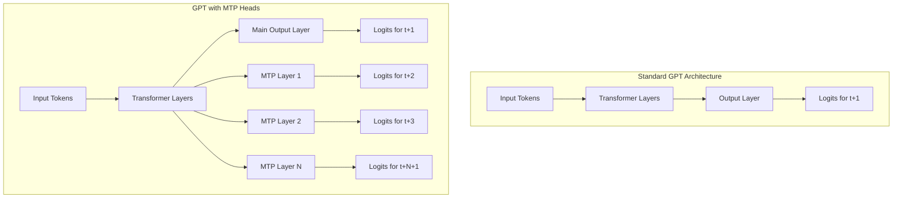
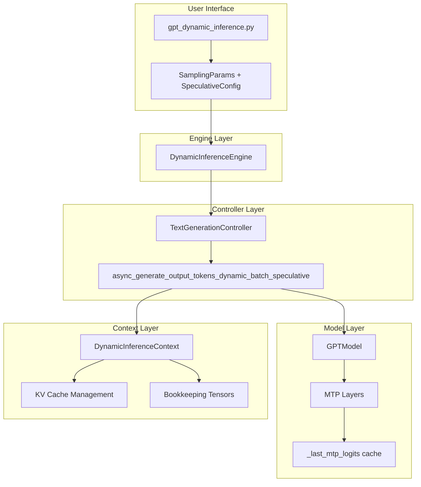
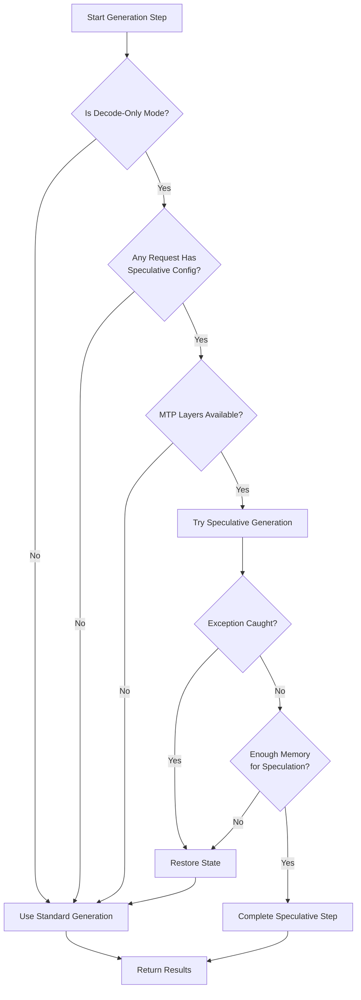
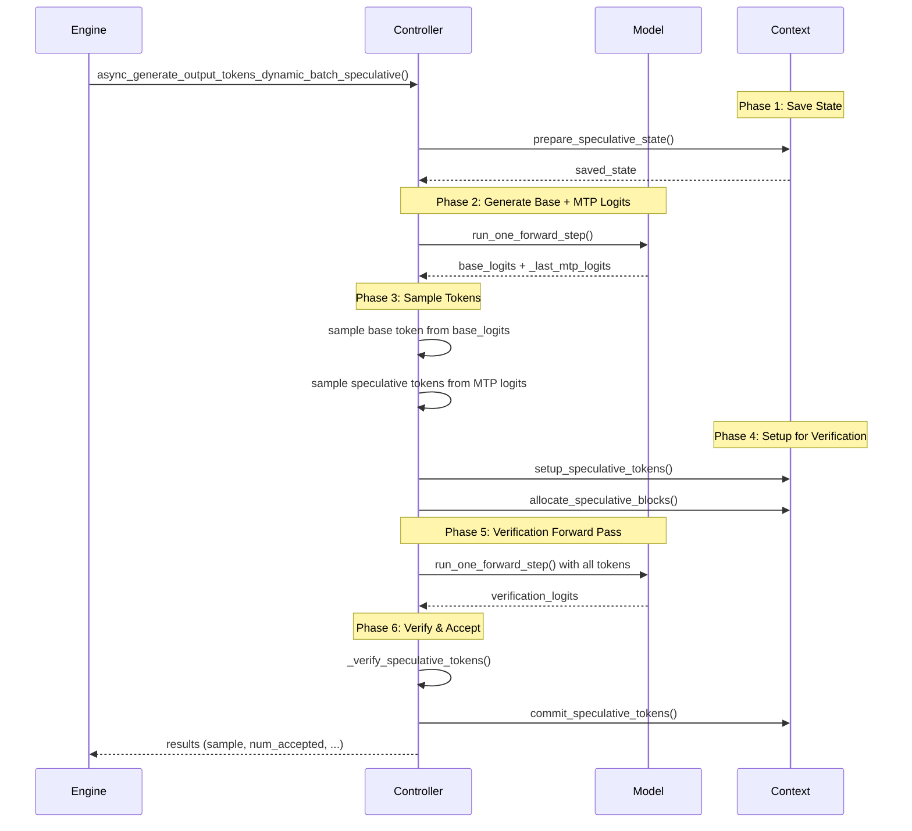

# Speculative Decoding with MTP Heads in Megatron-LM

## Table of Contents
1. [High-Level Overview](#1-high-level-overview)
2. [MTP-Based Speculative Decoding](#2-mtp-based-speculative-decoding)
3. [Implementation Architecture](#3-implementation-architecture)
4. [Design Choices](#4-design-choices)
5. [Implementation Details](#5-implementation-details)
6. [Bookkeeping Tensor Changes](#6-bookkeeping-tensor-changes)
7. [Future TODOs](#7-future-todos)

---

## 1. High-Level Overview

### What is Speculative Decoding?

Speculative decoding is an inference acceleration technique that reduces the number of sequential forward passes needed to generate tokens. Instead of generating one token at a time, we **speculate** multiple future tokens, verify them in parallel, and accept the valid ones.

```
┌─────────────────────────────────────────────────────────────────────────────┐
│                    Traditional Auto-Regressive Decoding                      │
├─────────────────────────────────────────────────────────────────────────────┤
│                                                                             │
│   Step 1      Step 2      Step 3      Step 4      Step 5                    │
│  ┌─────┐     ┌─────┐     ┌─────┐     ┌─────┐     ┌─────┐                    │
│  │ FWD │ ──► │ FWD │ ──► │ FWD │ ──► │ FWD │ ──► │ FWD │  = 5 forward passes│
│  └─────┘     └─────┘     └─────┘     └─────┘     └─────┘                    │
│    ▼           ▼           ▼           ▼           ▼                        │
│   "The"      "quick"     "brown"      "fox"      "jumps"                    │
│                                                                             │
└─────────────────────────────────────────────────────────────────────────────┘

┌─────────────────────────────────────────────────────────────────────────────┐
│                        Speculative Decoding (k=3)                            │
├─────────────────────────────────────────────────────────────────────────────┤
│                                                                             │
│   Step 1: Draft + Verify                    Step 2: Draft + Verify          │
│  ┌──────────────────────┐                  ┌──────────────────────┐         │
│  │  Draft: "quick"      │                  │  Draft: "jumps"      │         │
│  │         "brown"      │                  │         "over"       │         │
│  │         "fox"        │                  │         "the"        │         │
│  │  Verify: ✓ ✓ ✓       │                  │  Verify: ✓ ✓ ✓       │         │
│  └──────────────────────┘                  └──────────────────────┘         │
│    ▼                                          ▼                             │
│   "The" → "quick" "brown" "fox"             "jumps" "over" "the"            │
│                                                                             │
│   = 2 forward passes for 6+ tokens!                                         │
└─────────────────────────────────────────────────────────────────────────────┘
```

### Key Benefits
- **Reduced Latency**: Generate multiple tokens per forward pass
- **Better GPU Utilization**: Verification pass processes multiple tokens in parallel
- **No Quality Loss**: Accepted tokens are mathematically equivalent to sequential generation

---

## 2. MTP-Based Speculative Decoding

### What is MTP (Multi-Token Prediction)?

MTP extends the standard next-token prediction to predict **multiple future tokens** simultaneously. During training, the model learns to predict tokens at positions `t+1`, `t+2`, ..., `t+k` from the hidden state at position `t`.



### MTP Architecture Details

Each MTP layer consists of:
1. **Embedding Normalization** (`enorm`): Normalizes the next token embedding
2. **Hidden State Normalization** (`hnorm`): Normalizes the current hidden state
3. **Projection Layer** (`eh_proj`): Combines embedding and hidden state
4. **Transformer Layer**: Processes the combined representation
5. **Final LayerNorm**: Prepares output for the shared output head

```
┌────────────────────────────────────────────────────────────────┐
│                      MTP Layer Structure                        │
├────────────────────────────────────────────────────────────────┤
│                                                                │
│  Hidden State (t)           Next Token Embedding (t+k)         │
│       │                              │                         │
│       ▼                              ▼                         │
│   ┌───────┐                     ┌───────┐                      │
│   │ hnorm │                     │ enorm │                      │
│   └───┬───┘                     └───┬───┘                      │
│       │                              │                         │
│       └──────────┬───────────────────┘                         │
│                  │ concat                                      │
│                  ▼                                             │
│            ┌──────────┐                                        │
│            │ eh_proj  │  Linear: 2*hidden → hidden             │
│            └────┬─────┘                                        │
│                 │                                              │
│                 ▼                                              │
│        ┌─────────────────┐                                     │
│        │ Transformer Blk │                                     │
│        └────────┬────────┘                                     │
│                 │                                              │
│                 ▼                                              │
│          ┌──────────┐                                          │
│          │ LayerNorm│                                          │
│          └────┬─────┘                                          │
│               │                                                │
│               ▼                                                │
│    Shared Output Layer → Logits (t+k+1)                        │
│                                                                │
└────────────────────────────────────────────────────────────────┘
```

### Why MTP for Speculative Decoding?

| Approach | Draft Model | Advantages | Disadvantages |
|----------|-------------|------------|---------------|
| **Separate Draft Model** | Smaller LLM | Can be very fast | Memory overhead, needs training |
| **MTP Heads** | Built-in | No extra memory, trained jointly | Limited by `mtp_num_layers` |
| **Medusa Heads** | MLPs on hidden states | Lightweight | Separate training needed |

MTP is ideal when:
- Model already has MTP layers trained
- Memory is constrained
- You want seamless integration without additional models

---

## 3. Implementation Architecture

### Component Overview



### Files Modified

| File | Purpose |
|------|---------|
| `megatron/core/inference/sampling_params.py` | `SpeculativeConfig` dataclass |
| `megatron/core/inference/contexts/dynamic_context.py` | KV cache management for speculation |
| `megatron/core/inference/text_generation_controllers/text_generation_controller.py` | Speculative generation loop |
| `megatron/core/models/gpt/gpt_model.py` | MTP logits caching for inference |
| `megatron/core/inference/engines/dynamic_engine.py` | Engine integration |
| `examples/inference/gpt/gpt_dynamic_inference.py` | CLI arguments |

---

## 4. Design Choices

### 4.1 Graceful Degradation (Fault Tolerance)

The implementation is designed to **never break** the inference pipeline:



**Key Principle**: If speculative decoding fails for any reason:
1. State is restored via `restore_speculative_state()`
2. Falls back to standard single-token generation
3. User never sees an error

### 4.2 Zero Impact on Non-Speculative Path

```python
# In DynamicInferenceEngine.step()
if use_speculative and num_speculative_tokens > 0:
    result = await self.controller.async_generate_output_tokens_dynamic_batch_speculative(...)
else:
    result = await self.controller.async_generate_output_tokens_dynamic_batch()  # Original path
```

- **No conditional logic** added to the standard generation path
- Speculative methods are **completely separate**
- Original code paths remain unchanged

### 4.3 Per-Request Configuration

Speculative decoding is configured **per-request** via `SamplingParams`:

```python
sampling_params = SamplingParams(
    temperature=0.7,
    top_k=50,
    speculative_config=SpeculativeConfig(
        method=SpeculativeMethod.MTP,
        num_speculative_tokens=3,
        use_greedy_verification=True
    )
)
```

This allows:
- Mixed batches (some requests with speculation, some without)
- Dynamic adjustment based on request requirements

### 4.4 Lazy MTP Logits Caching

MTP logits are only computed and cached during inference when needed:

```python
# In GPTModel._postprocess()
if in_inference_mode:
    # Compute and cache MTP logits for speculative decoding
    mtp_inference_logits = []
    for mtp_layer_number in range(self.config.mtp_num_layers):
        mtp_logits, _ = self.output_layer(hidden_states_list[mtp_layer_number + 1], ...)
        mtp_inference_logits.append(mtp_logits)
    self._last_mtp_logits = mtp_inference_logits
else:
    # Training: compute losses (original behavior)
    ...
```

---

## 5. Implementation Details

### 5.1 High-Level Flow



### 5.2 Key Methods

#### `TextGenerationController`

| Method | Description |
|--------|-------------|
| `async_generate_output_tokens_dynamic_batch_speculative()` | Main entry point for speculative generation |
| `_dynamic_step_forward_with_mtp()` | Forward pass returning base + MTP logits |
| `_compute_mtp_logits_for_inference()` | Extracts cached MTP logits from model |
| `_sample_speculative_tokens()` | Greedy sampling from MTP logits |
| `_verify_speculative_tokens()` | Compares speculative vs verification logits |

#### `DynamicInferenceContext`

| Method | Description |
|--------|-------------|
| `prepare_speculative_state()` | Snapshot all bookkeeping tensors |
| `restore_speculative_state()` | Rollback to saved state on failure |
| `setup_speculative_tokens()` | Add speculative tokens to bookkeeping |
| `allocate_speculative_blocks()` | Reserve KV cache blocks for speculation |
| `commit_speculative_tokens()` | Finalize accepted tokens |

#### `GPTModel`

| Change | Description |
|--------|-------------|
| `_last_mtp_logits` | New attribute caching MTP logits |
| `_postprocess()` | Modified to compute/cache MTP logits during inference |

---

## 6. Bookkeeping Tensor Changes

### 6.1 Tensor Overview

The `DynamicInferenceContext` maintains several tensors for tracking tokens and KV cache:

| Tensor | Shape | Purpose |
|--------|-------|---------|
| `request_kv_length_offsets` | `[max_requests]` | Current sequence length per request |
| `request_kv_block_counts` | `[max_requests]` | Number of KV blocks per request |
| `request_last_kv_block_id` | `[max_requests]` | ID of last block per request |
| `request_last_kv_block_offset` | `[max_requests]` | Offset within last block |
| `token_to_input_ids` | `[max_tokens]` | Token ID for each position |
| `token_to_pos_ids` | `[max_tokens]` | Sequence position for each token |
| `token_to_request_idx` | `[max_tokens]` | Which request each token belongs to |
| `token_to_block_idx` | `[max_tokens]` | KV block ID for each token |
| `token_to_position_in_request` | `[max_tokens]` | Position within the request |
| `token_to_local_position_within_kv_block` | `[max_tokens]` | Offset within KV block |

### 6.2 State Changes During Speculative Decoding

#### Phase 1: `prepare_speculative_state()` - Snapshot

```
┌─────────────────────────────────────────────────────────────────┐
│                    BEFORE SPECULATION                            │
├─────────────────────────────────────────────────────────────────┤
│                                                                 │
│  Request 0: "The quick brown" (length=3)                        │
│  Request 1: "Hello world" (length=2)                            │
│                                                                 │
│  request_kv_length_offsets: [3, 2, ...]                         │
│  active_token_count: 5                                          │
│                                                                 │
│  token_to_input_ids:    [The, quick, brown, Hello, world, ...]  │
│  token_to_pos_ids:      [0,   1,     2,     0,     1,     ...]  │
│  token_to_request_idx:  [0,   0,     0,     1,     1,     ...]  │
│                                                                 │
│  ─────────────────────────────────────────────────────────────  │
│  SNAPSHOT SAVED ──► saved_state = {...all tensors cloned...}    │
│                                                                 │
└─────────────────────────────────────────────────────────────────┘
```

#### Phase 2: `setup_speculative_tokens()` - Add Draft Tokens

```
┌─────────────────────────────────────────────────────────────────┐
│              AFTER setup_speculative_tokens(k=2)                 │
├─────────────────────────────────────────────────────────────────┤
│                                                                 │
│  Speculative tokens: [[fox, jumps], [!", said]]                 │
│                                                                 │
│  active_token_count: 5 → 9  (+4 speculative tokens)             │
│                                                                 │
│  token_to_input_ids:                                            │
│    [The, quick, brown, Hello, world, fox, jumps, !", said, ...] │
│     ─────────────────────────────  ──────────────────────────   │
│              Original (5)              Speculative (4)          │
│                                                                 │
│  token_to_pos_ids:                                              │
│    [0, 1, 2, 0, 1, 3, 4, 2, 3, ...]                              │
│                    │  │  │  │                                   │
│                    │  │  │  └── Req 1, pos 3                    │
│                    │  │  └───── Req 1, pos 2                    │
│                    │  └──────── Req 0, pos 4                    │
│                    └─────────── Req 0, pos 3                    │
│                                                                 │
│  token_to_request_idx:                                          │
│    [0, 0, 0, 1, 1, 0, 0, 1, 1, ...]                              │
│                                                                 │
└─────────────────────────────────────────────────────────────────┘
```

#### Phase 3: `allocate_speculative_blocks()` - Reserve KV Blocks

```
┌─────────────────────────────────────────────────────────────────┐
│                   KV Block Allocation                            │
├─────────────────────────────────────────────────────────────────┤
│                                                                 │
│  Block size: 16 tokens                                          │
│                                                                 │
│  Request 0: pos 3→4 (stays in block 0)    ✓ No new block        │
│  Request 1: pos 2→3 (stays in block 0)    ✓ No new block        │
│                                                                 │
│  If Request 0 had pos=15 → 16,17:                               │
│    Block 0: [0-15] FULL                                         │
│    Block 1: [16-17] NEW ALLOCATED                               │
│                                                                 │
│  request_to_kv_block_ids updated with new block IDs             │
│                                                                 │
└─────────────────────────────────────────────────────────────────┘
```

#### Phase 4: Verification Forward Pass

The forward pass now processes ALL tokens (original + speculative), computing KV cache entries for each.

#### Phase 5: `commit_speculative_tokens()` - Accept Valid Tokens

```
┌─────────────────────────────────────────────────────────────────┐
│              commit_speculative_tokens()                         │
├─────────────────────────────────────────────────────────────────┤
│                                                                 │
│  Verification results:                                          │
│    Request 0: 2 accepted (fox ✓, jumps ✓)                       │
│    Request 1: 1 accepted (!" ✓, said ✗)                         │
│                                                                 │
│  num_accepted_per_request: [2, 1]                               │
│                                                                 │
│  UPDATES:                                                       │
│  ─────────────────────────────────────────────────────────────  │
│                                                                 │
│  request_kv_length_offsets:                                     │
│    Before: [3, 2]                                               │
│    After:  [3+2=5, 2+1=3]  (+num_accepted)                      │
│                                                                 │
│  request_last_kv_block_offset:                                  │
│    Updated to (new_position - 1) % block_size                   │
│                                                                 │
│  request_kv_block_counts:                                       │
│    Updated if new blocks were crossed                           │
│                                                                 │
│  KV Cache: Entries for accepted tokens are KEPT                 │
│            Entries for rejected tokens are OVERWRITTEN next     │
│                                                                 │
└─────────────────────────────────────────────────────────────────┘
```

#### Failure Path: `restore_speculative_state()`

```
┌─────────────────────────────────────────────────────────────────┐
│                   ON ERROR/FAILURE                               │
├─────────────────────────────────────────────────────────────────┤
│                                                                 │
│  If speculation fails (OOM, exception, etc.):                   │
│                                                                 │
│  1. All scalar values restored:                                 │
│     active_token_count = saved_state["active_token_count"]      │
│     total_request_count = saved_state["total_request_count"]    │
│                                                                 │
│  2. All request tensors restored:                               │
│     request_kv_length_offsets ← saved values                    │
│     request_kv_block_counts ← saved values                      │
│     ...                                                         │
│                                                                 │
│  3. All token tensors restored:                                 │
│     token_to_input_ids ← saved values                           │
│     token_to_pos_ids ← saved values                             │
│     ...                                                         │
│                                                                 │
│  Result: Context is exactly as it was before speculation        │
│          → Fall back to normal single-token generation          │
│                                                                 │
└─────────────────────────────────────────────────────────────────┘
```

---

## 7. Future TODOs

### 7.1 Sampling Strategy Support

| Status | Feature | Description |
|--------|---------|-------------|
| ✅ | Greedy Verification | Currently implemented |
| ❌ | Rejection Sampling | Probabilistic acceptance for non-greedy |
| ❌ | Typical Acceptance | Match sampling distribution exactly |
| ❌ | Temperature-Adjusted | Account for temperature in verification |

**Rejection Sampling** would allow speculative decoding with non-greedy sampling:

```python
# Pseudocode for rejection sampling
def verify_with_rejection_sampling(draft_probs, target_probs, draft_token):
    acceptance_prob = min(1, target_probs[draft_token] / draft_probs[draft_token])
    if random() < acceptance_prob:
        return ACCEPT
    else:
        return REJECT_AND_RESAMPLE
```

### 7.2 Model Parallelism Compatibility

| Parallelism | Status | Notes |
|-------------|--------|-------|
| Tensor Parallel (TP) | ⚠️ Untested | Should work, MTP uses same TP groups |
| Pipeline Parallel (PP) | ⚠️ Untested | MTP layers on last PP stage |
| Expert Parallel (EP) | ⚠️ Untested | Needs investigation |
| Context Parallel (CP) | ⚠️ Untested | MTP has CP support in `roll_tensor` |

**Recommended Testing**:
```bash
# Test with TP
--tensor-model-parallel-size 4 --speculative-decoding

# Test with PP  
--pipeline-model-parallel-size 2 --speculative-decoding

# Test with both
--tensor-model-parallel-size 2 --pipeline-model-parallel-size 2 --speculative-decoding
```

### 7.3 CUDA Graph Integration

Currently, speculative decoding is **not captured in CUDA graphs** because:
- Variable number of speculative tokens per step
- State save/restore operations

**Future Work**:
- [ ] Fixed speculation count CUDA graphs
- [ ] Graph capture for verification pass only
- [ ] Adaptive graph selection based on speculation success rate

### 7.4 Dynamic Speculation Length

```python
# Future: Adaptive speculation based on acceptance rate
class AdaptiveSpeculation:
    def __init__(self, min_k=1, max_k=5):
        self.acceptance_history = []
        
    def get_speculation_count(self):
        avg_acceptance = mean(self.acceptance_history[-100:])
        if avg_acceptance > 0.8:
            return min(self.current_k + 1, self.max_k)
        elif avg_acceptance < 0.5:
            return max(self.current_k - 1, self.min_k)
        return self.current_k
```

### 7.5 Multi-Query Attention (MQA/GQA) Optimization

MTP with grouped-query attention may have optimization opportunities:
- [ ] Verify KV cache sharing works correctly
- [ ] Optimize memory layout for speculative KV entries

### 7.6 Metrics & Observability

Add tracking for:
- [ ] Speculation acceptance rate per request
- [ ] Average tokens generated per forward pass
- [ ] Speculation overhead (time spent on rejected tokens)
- [ ] Memory usage for speculative blocks

### 7.7 Tree-Based Speculation

Instead of linear speculation, use tree structure:

```
          Token 0
         /      \
    Token 1a   Token 1b
       |          |
    Token 2a   Token 2b
```

This increases the chance of finding valid sequences but requires tree attention.

---

## Appendix: Usage

### Command Line

```bash
torchrun --nproc-per-node 1 \
    -m examples.inference.gpt.gpt_dynamic_inference \
    --load /path/to/mtp-trained-checkpoint \
    --bf16 \
    --model-provider gpt \
    --tensor-model-parallel-size 1 \
    --micro-batch-size 64 \
    --num-tokens-to-generate 512 \
    --prompt-file prompts.jsonl \
    --speculative-decoding \
    --num-speculative-tokens 3 \
    --enable-cuda-graph
```

### Programmatic API

```python
from megatron.core.inference.sampling_params import (
    SamplingParams, 
    SpeculativeConfig, 
    SpeculativeMethod
)

# Create speculative config
spec_config = SpeculativeConfig(
    method=SpeculativeMethod.MTP,
    num_speculative_tokens=3,
    use_greedy_verification=True
)

# Create sampling params with speculation
sampling_params = SamplingParams(
    temperature=0.7,
    top_k=50,
    num_tokens_to_generate=256,
    speculative_config=spec_config
)

# Add request to engine
engine.add_request(request_id, prompt, sampling_params)
```

---

*Last Updated: January 2026*

