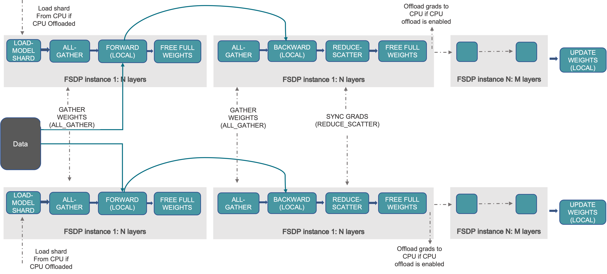
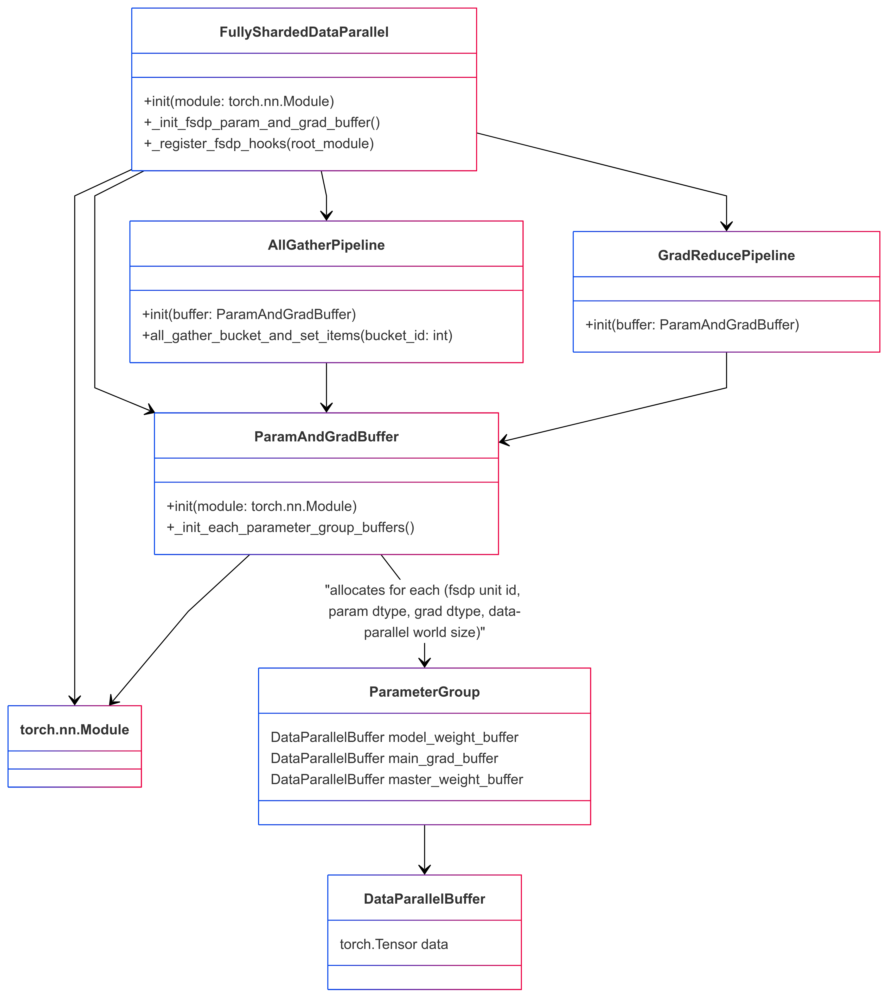

<!---
   Copyright (c) 2022-2026, NVIDIA CORPORATION. All rights reserved.
   NVIDIA CORPORATION and its licensors retain all intellectual property
   and proprietary rights in and to this software, related documentation
   and any modifications thereto. Any use, reproduction, disclosure or
   distribution of this software and related documentation without an express
   license agreement from NVIDIA CORPORATION is strictly prohibited.
-->

# Megatron FSDP

**Note: In M-Core 0.14, the custom FSDP refactored its checkpoint implementation to use DTensor-based PyTorch distributed checkpointing. The custom FSDP was also renamed Megatron FSDP. The relevant sections of this document are no longer applicable.**

## How to Use Megatron FSDP

Add these flags to enable MCore custom FSDP.

```bash
--use-megatron-fsdp
--data-parallel-sharding-strategy optim_grads_params
--no-gradient-accumulation-fusion
--use-distributed-optimizer
```

For a practical guide covering required configurations, checkpoint conversion, and example scripts, refer to the [Megatron-FSDP User Guide](../../discussions/megatron-fsdp-user-guide/megatron-fsdp-user-guide.md).

## Key Features

- **Sharding Strategy**: Shards optimizer states, gradients, and parameters to reduce memory consumption.
- **Communication and Computation Overlap**: Overlaps communication with computation where possible during training.
- **Supports automatic mixed precision training**: Compatible with BF16 O1/O2/O3 recipes, as well as FP8 compute with FP32 parameters and FP8 parameter training, with several precision configuration options.
- **Tensor Parallelism (TP), Expert Parallelism (EP), and Context Parallelism (CP)**: Compatible with TP, EP, and CP configurations for scaling large language models.
- **Distributed Model Initialization with Meta Device**: Allows model initialization using the meta device, then layer-by-layer initialization of distributed model weight buffers through the `Module.reset_parameters` API, which supports very large models.

## Configuration Recommendations

### Disable `CUDA_DEVICE_MAX_CONNECTIONS`

To ensure full parallelization of FSDP communication and computation, disable the CUDA_DEVICE_MAX_CONNECTIONS environment variable. This step avoids potential bubble in CUDA stream. (But it may slow down TP and CP to some extent.)

```bash
unset CUDA_DEVICE_MAX_CONNECTIONS
```

### Add `--calculate-per-token-loss`

For gradients sharding mode optimization, include the `--calculate-per-token-loss` flag in your training script. This improves performance by reducing the frequency of gradient scaling, which is also a sizable drain on SM resources.

## Design of Custom FSDP

### Overview

The custom Fully Sharded Data Parallelism (FSDP) implementation in Megatron Core targets memory use and throughput for large language models. The core design principles include:

 - **Optimized for Large Language Models**: This custom FSDP implementation scales with models containing billions of parameters and supports training at that scale.
 - **Efficient Memory Consumption**: By sharding optimizer states, gradients, and model parameters, the custom FSDP cuts memory use so models that would not fit on device with plain DDP can train.
 - **Efficient Workflow and Overlapping Communication and Computation**: The implementation reduces communication steps during training and overlaps communication with computation where possible to reduce idle time.
 - **Support for MCore's Efficient Training Methods**: The custom FSDP integrates with advanced parallelism in Megatron Core, including tensor parallelism, expert parallelism, and context parallelism. It also supports automatic mixed precision training.

The design of Custom FSDP draws inspiration from PyTorch FSDP [Zhao, Yanli, et al.](https://arxiv.org/pdf/2304.11277) and the MCore distributed optimizer. The following background on PyTorch FSDP clarifies the concepts behind the custom FSDP design.

> In DistributedDataParallel, (DDP) training, each process/ worker owns a replica of the model and processes a batch of data, finally it uses all-reduce to sum up gradients over different workers. In DDP the model weights and optimizer states are replicated across all workers. FSDP is a type of data parallelism that shards model parameters, optimizer states and gradients across DDP ranks.

> When training with FSDP, the GPU memory footprint is smaller than when training with DDP across all workers. This makes the training of some very large models feasible by allowing larger models or batch sizes to fit on device. This comes with the cost of increased communication volume. The communication overhead is reduced by internal optimizations like overlapping communication and computation.



The unit processed in the workflow here is the "FSDP instance 1: N layers", where an FSDP instance is the smallest FSDP processing unit (also a PyTorch module). You can release this module's weights after its forward or backward because no other computation depends on those weights. That behavior supports FSDP's layer-by-layer execution and memory-saving strategy. An FSDP instance is also called an **FSDP Unit**.

An FSDP instance can correspond to multiple FSDP parameter groups. These groups are separated by Data Parallel (DP) communication groups and the data type of the parameter or gradient. Consequently, an FSDP instance may require several parameter-gather tasks before execution (forward or backward). Each **FSDP parameter group** corresponds to one **Data Parallel Buffer** in custom FSDP.

At a high level, FSDP works as follows:

In constructor:
 - Shard model parameters and each rank only keeps its own shard

In forward path:
 - Run all_gather to collect all shards from all ranks to recover the full parameter in this FSDP unit
 - Run forward computation
 - Discard parameter shards it has just collected

In backward path:
 - Run all_gather to collect all shards from all ranks to recover the full parameter in this FSDP unit
 - Run backward computation
 - Run reduce_scatter to sync gradients
 - Discard parameters

One way to view FSDP’s sharding is to decompose the DDP gradient all-reduce into reduce-scatter and all-gather. Specifically, during the backward pass, FSDP reduces and scatters gradients, ensuring that each rank possesses a shard of the gradients. Then it updates the corresponding shard of the parameters in the optimizer step. Finally, in the subsequent forward pass, it performs an all-gather operation to collect and combine the updated parameter shards.


### Custom FSDP Underlying Data Structure

To implement the FSDP functionality described above, the custom FSDP is designed with the following Python classes and data structure:



### The Custom FSDP Interface: FullyShardedDataParallel

The custom FSDP provides the same programming interface as PyTorch's DistributedDataParallel (DDP) as FullyShardedDataParallel (FSDP). For example, you can apply FSDP to models as follows:

```python
# Initialize model and optimizer
ddp_config.use_megatron_fsdp = True
ddp_config.data_parallel_sharding_strategy = "optim_grads_params"
model = GPTModel(transformer_config)
model = FullyShardedDataParallel(
    transformer_config,
    model,
    ddp_config,
    fsdp_unit_modules = [TransformerLayer, LanguageModelEmbedding],
)
optimizer = torch.optim.AdamW(model.parameters(), lr=lr)
optimizer = DistributedOptimizer(optimizer, [model], [model.param_and_grad_buffer])

# Training loop
def train_step(inputs, labels):
    optimizer.zero_grad()
    for mbs_input, mbs_label in zip(inputs, labels):
        outputs = model(mbs_input)
        loss = loss_fn(outputs, mbs_label)
        loss.backward()
    optimizer.step()

# Save and load model and optimizer state dict
def model_and_optimizer_state_dict():
    state_dict = {
        "model": model.sharded_state_dict(),
        "optimizer": optimizer.sharded_state_dict(),
    }
    return state_dict

def load_model_and_optimizer_state_dict(state_dict):
    model.load_state_dict(state_dict["model"])
    optimizer.load_state_dict(state_dict["optimizer"])
```

Key notes:

 - You can configure which modules should be treated as FSDP units through the `fsdp_unit_modules` argument. This configuration is mandatory.
 - The custom FSDP must be used with a distributed optimizer since it provides distributed checkpointing.
 - The data-parallel communication group for parameters is not explicitly shown. Custom FSDP configures these groups as either DP (data-parallel) or EDP (expert data-parallel) based on parameter markings.

#### Initializing Models on the Meta Device

For training particularly large models with FSDP, you can initialize the model on the meta device. Using PyTorch's `reset_parameters` API, you can initialize model weights layer by layer during the construction of the `ParamAndGradBuffer`. Most PyTorch native modules and TransformerEngine modules support this API (for example, [PyTorch Linear](https://github.com/pytorch/pytorch/blob/v2.6.0/torch/nn/modules/linear.py#L114), [TE LayerNormLinear](https://github.com/NVIDIA/TransformerEngine/blob/release_v2.0/transformer_engine/pytorch/module/layernorm_linear.py#L1107)).

```python
# Initialize model on meta device
with torch.device("meta"):
    model = GPTModel(config)

model = FullyShardedDataParallel(
    transformer_config,
    model,
    ddp_config,
    fsdp_unit_modules=[TransformerLayer, LanguageModelEmbedding],
)
```

**Important Considerations:**
- *Custom Modules*: If your model contains custom modules, ensure they implement the `reset_parameters` API. Otherwise, you may need to force parameter initialization on a CUDA or CPU device.
- *Tensor Initialization*: Be cautious of tensors created during model initialization without a specified device; they default to the meta device. To avoid issues, explicitly specify the device for these tensors to ensure compatibility with this function.

### Interaction Between Custom FSDP and Model Forward/Backward Propagation

Custom FSDP implements Fully Sharded Data Parallelism (FSDP) through a series of module hooks, gradient hooks, or by adding functions between modules. This involves inserting communications and manipulating parameters and gradients during PyTorch's module forward or backward propagation.

Module hooks summary:
- Module pre-forward hook(`module.register_forward_pre_hook`): This hook unshards model weights before the forward pass. In the case of an FSDP Unit Module, add a RegisterFSDPBackwardFunction function that will reshard model weights and reduce gradients after module backward propagation.
- Module post-forward hook(`module.register_forward_hook`): This hook is used to reshard model weights after the forward pass.
- Root module pre-backward hook(`root_module.register_full_backward_pre_hook`): This hook checks that all model parameters are resharded, in order to avoid unnecessary memory spikes. It also marks all modules as being in the `TrainingState.PRE_BACKWARD` state.
- Module pre-backward hook(`module.register_full_backward_pre_hook`): This hook is used to unshard the model weights before the backward pass.
- Root module post-backward hook(`torch.autograd.Variable._execution_engine.queue_callback`): This hook is used to make sure all gradients in the backprop are properly handled / available.

The gradient reduction pipeline maintains a map of gradients to FSDP parameter groups. If all gradients in an FSDP parameter group are ready, it launches a gradient reduction. Note that this assumes that the model's gradients are always generated in a certain order (reverse of `module.parameters()`), as otherwise, FSDP would maintain too many parameter group grad buffers, leading to excessive memory usage.

#### Optimized for Activation Recompute

Using activation recomputation runs the same module forward first and then its backward during backprop, which can unshard and reshard model weights twice. If the runtime can treat that as one forward-plus-backward region, it can unshard once and reshard once.

To make this determination, the implementation tracks the model state with `training_state`: `FORWARD`, `PRE_BACKWARD`, `POST_BACKWARD`, `IDLE`. It is worth noting that the pre-backward hook runs before the pre-forward hook: the pre-backward hook performs the model weight unshard, then marks the model as `PRE_BACKWARD`, and when the pre-forward hook observes that mark it skips unshard. Similarly, for duplicate reshard logic, the post-forward hook runs before the post-backward path, and checking for the `PRE_BACKWARD` flag in the post-forward hook can cancel unshard.

### Memory Mechanisms and Features of Custom FSDP

FSDP can distribute model parameters, gradients, optimizer states, and (for mixed-precision training) high-precision main weights. That covers most memory outside activations, but FSDP can still hit allocator and spike issues.

FSDP frequently unshards and reshards model weights, which can lead to busy memory allocation and deallocation. This results in untimely tensor releases, causing memory spikes (or even out-of-memory errors), crashes of the PyTorch memory allocator cache, and many `cudaMalloc` and `cudaFree` calls. These issues can slow the system noticeably.

You can often address untimely tensor release with the `tensor._typed_storage()._resize_(0)` API, which deallocates storage immediately. Custom FSDP exposes hooks in `AllGatherPipeline` and `GradReducePipeline` to swap the temporary buffer allocator used for parameter gathering and gradient reduction with `StorageResizeBasedBucketAllocator`, using that `_resize_(0)` path for releases.

The PyTorch memory allocator cache can fail when real usage nears GPU capacity, which hurts performance. Mitigation is limited; avoiding repeated pressure at the memory limit helps. A self-managed allocator such as `RotaryBucketAllocator` is another option, though it is not yet mature.

## References

- [Getting Started with Fully Sharded Data Parallel (FSDP)](https://pytorch.org/tutorials/intermediate/FSDP_tutorial.html)
