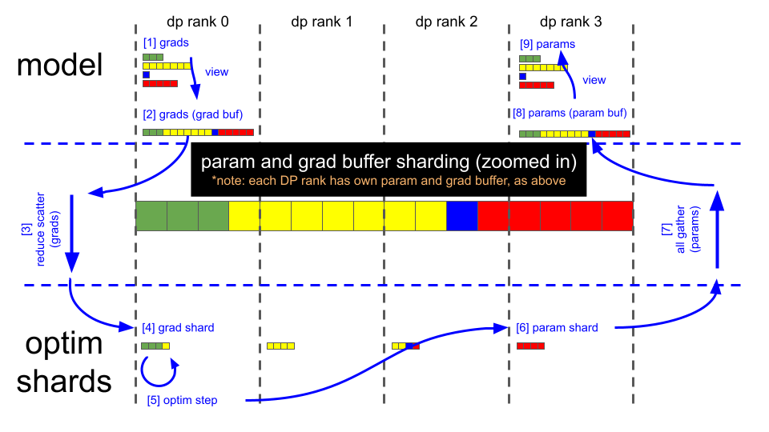
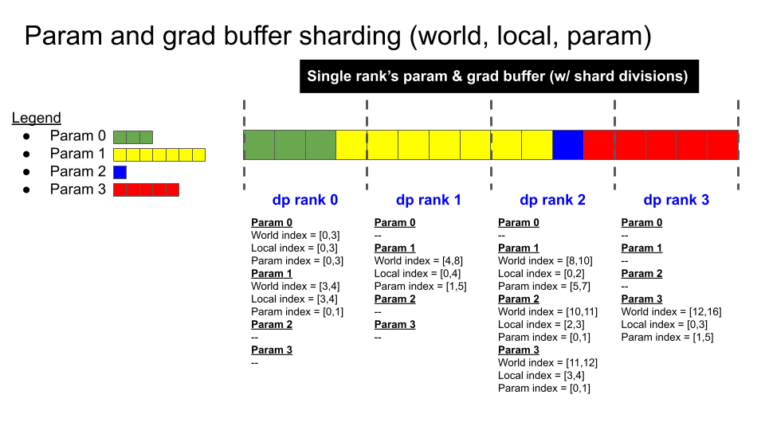

<!---
   Copyright (c) 2022-2026, NVIDIA CORPORATION. All rights reserved.
   NVIDIA CORPORATION and its licensors retain all intellectual property
   and proprietary rights in and to this software, related documentation
   and any modifications thereto. Any use, reproduction, disclosure or
   distribution of this software and related documentation without an express
   license agreement from NVIDIA CORPORATION is strictly prohibited.
-->

# Distributed Optimizer

The distributed optimizer saves memory by sharding optimizer state across data parallel ranks instead of replicating it on every rank, as described in the [ZeRO paper](https://arxiv.org/abs/1910.02054).

Theoretical memory savings depend on the data types of the model parameters (`param_dtype`) and of the main gradients accumulated across data-parallel replicas (`grad_dtype`). Optimizer steps always use `fp32` main parameters. In the current implementation, the theoretical number of bytes per parameter is as follows (where *d* is the data parallel size):

|        | Non-distributed optim | Distributed optim |
| ------ | ------ | ------ |
| `fp16` parameters, `fp16` gradients | 20 | 4 + 16/d |
| `bf16` parameters, `fp32` gradients    | 18 | 6 + 12/d |
| `fp32` parameters, `fp32` gradients       | 16 | 8 + 8/d  |

This distributed optimizer uses contiguous buffers for parameters and main gradients. Model gradients copy into the main gradients as soon as they finish computing.

The following figures show the sharding scheme and the main steps of the parameter update.

## Data Flow

## Sharding Scheme

## Key Steps

**Note:** The following steps match the illustrations above. They assume `bf16` model weights, `bf16` model gradients from the backward pass, and `fp32` main gradients for optimizer steps. Optimizer steps use `fp32` main weights.

- Backward pass finishes (gradient buffer holds 16 `fp32` gradient elements).
- Call reduce-scatter on each DP rank.
- Each DP rank now has four elements within the gradient buffer that are fully reduced (remaining 12 elements are garbage).
  - DP rank 0 has gradient values for elements [0:4].
  - DP rank 1 has gradient values for elements [4:8].
  - DP rank 2 has gradient values for elements [8:12].
  - DP rank 3 has gradient values for elements [12:16].
- Optimizer.step().
- Each DP rank copies its four `fp32` main parameter elements into the corresponding `bf16` parameter buffer (each element is cast from `fp32` to `bf16`).
- Call all-gather on each DP rank.
- The parameter buffer now contains all 16 updated `bf16` model parameter elements. Parameters in PyTorch modules already point to the correct views in this buffer, so forward passes can start after the all-gather completes.
- At this point, you can zero the gradient buffer for the next iteration.
