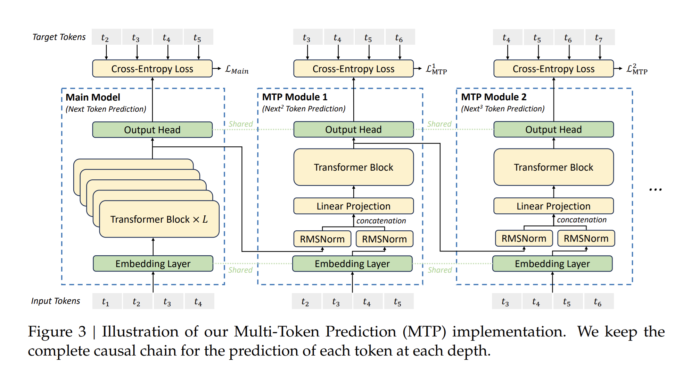

<!---
   Copyright (c) 2022-2026, NVIDIA CORPORATION. All rights reserved.
   NVIDIA CORPORATION and its licensors retain all intellectual property
   and proprietary rights in and to this software, related documentation
   and any modifications thereto. Any use, reproduction, disclosure or
   distribution of this software and related documentation without an express
   license agreement from NVIDIA CORPORATION is strictly prohibited.
-->

# Multi-Token Prediction (MTP)

Multi-Token Prediction (MTP) extends the prediction scope to several future tokens at each position. An MTP objective adds extra prediction targets, which can improve data efficiency. It may also encourage representations that anticipate later tokens. This implementation predicts additional tokens in sequence and preserves the causal dependency chain at each depth. The following figure illustrates MTP as used in [DeepSeek-V3](https://github.com/deepseek-ai/DeepSeek-V3/).

The *k*-th MTP module includes a shared embedding layer, a projection matrix, a Transformer block, and a shared output head. For the *i*-th input token at depth *k - 1*, the implementation combines the representation of the *i*-th token and the embedding of the *(i + K)*-th token with a linear projection. That combined representation is the input to the Transformer block at depth *k*, which produces the output representation.

For more detail, refer to the [DeepSeek-V3 technical report](https://arxiv.org/pdf/2412.19437.pdf).

## Related Arguments

Train `GPTModel`-style models with MTP by setting `mtp_num_layers` to a positive integer.

The following table summarizes MTP configuration fields:

| Item | Description |
| --- | --- |
| `mtp_num_layers` | Number of MTP layers. MTP extends prediction to multiple future tokens at each position. This stack uses `mtp_num_layers` sequential modules to predict that many additional tokens per position. Default: `None`. |
| `mtp_loss_scaling_factor` | Weight for the MTP loss term. The implementation averages MTP losses across depths, multiplies by this factor, and adds the result to the training objective. Default: `0.1`. |
| `mtp_use_repeated_layer` | Reuse one physical MTP layer for every prediction depth. Parameters are shared, while the hidden state, shifted token input, and query are recomputed at each iteration. Default: `False`. |
| `dsa_mtp_index_kv_share` | For repeated-layer DSA MTP, compute latent KV and indexer top-k at iteration 0 and reuse them at later iterations. Queries and sparse attention are still evaluated at every iteration. Default: `False`. |

## Repeated DSA MTP IndexShare and KVShare

Set `mtp_use_repeated_layer: true`, choose more than one MTP iteration, and enable `dsa_mtp_index_kv_share` to use GLM-5.2-style sharing across MTP iterations. The physical MTP layer must be a DSA indexer-compute layer under the model's `dsa_indexer_topk_freq` and `dsa_indexer_skip_topk_offset` schedule.

Iteration 0 produces the post-RoPE, post-TP/CP-gather latent key and top-k indices. Later iterations reuse those tensors while recomputing the query and running sparse attention. The shared key remains attached to autograd. Under full activation recomputation it is an explicit checkpoint output from iteration 0 and an explicit checkpoint input to later iterations, so gradients from all sparse-attention consumers accumulate into the iteration-0 KV projection. Under selective `mla_up_proj` recompute, only the query up-projection is checkpointed; the source key is constructed outside that checkpoint and stays available to every consumer iteration.

The current implementation uses the split indexer-top-k and sparse-attention path because the combined DSA kernel does not expose top-k for reuse. Fused top-k and fused sparse-attention kernels remain available independently. Per-layer CUDA graph scopes that capture attention are not supported with MTP iteration sharing because they split the producer-consumer lifetime across separate graphs. MoE-only scopes and graph scopes that contain the complete MTP producer-consumer chain are compatible, subject to the prerequisites of the selected CUDA graph implementation.

## Pipeline Parallel Layout for MTP

MTP supports user-defined placement of MTP layers across pipeline stages through `pipeline_model_parallel_layout`. By default, all MTP layers sit on the last pipeline stage; you can override placement in the layout string.

### MTP Standalone Mode

When MTP layers are placed in a separate virtual pipeline (VPP) stage that is not on the last pipeline rank, the `mtp_standalone` flag is automatically set to `True`. MTP then runs in its own pipeline stage.

### Layout Format

Use `m` for MTP layers in the pipeline layout string. For example:
- `"E|t*3|(t|)*5mL"` - MTP in the last stage
- `"E|t*3|(t|)*4tm|L"` - MTP in the second-to-last stage with a decoder layer
- `"E|t*3|(t|)*3tt|m|L"` - MTP in a standalone stage (second-to-last) with no other layers

### Constraints

- Place all MTP layers in the same virtual pipeline stage.
- Do not place MTP layers on the first pipeline rank.

## Implementation Notes

- For models with MTP layers, the final LayerNorm sits in the stage that contains the last decoder layer, not in the post-process stage. That can change gradient norm reduction slightly in deterministic mode when LayerNorm would otherwise live in another stage. For bitwise alignment, disable gradient norm clipping.
- MTP loss is computed in the post-processing stage.

## Unsupported Combinations

Arbitrary `AttnMaskType` and learned absolute position embeddings are not supported with MTP. MTP supports Context Parallel execution for attention implementations that provide a compatible CP path; repeated DSA sharing requires DSA all-gather CP and reuses the iteration-0 global latent key within the same microbatch CP group.
