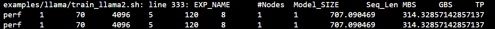
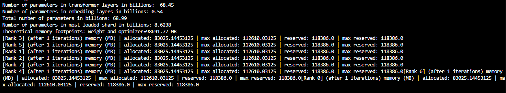
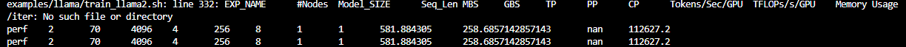

# Llama2/Llama3 Model Pretraining Instructions

This guide will walk you through setting up and running pretraining for Llama2 and Llama3 models using Docker, including single-node and multi-node setups.

## 1. Environment Setup

### Download Docker Image
Download the necessary Docker image for the Llama2/Llama3 pretraining:

```bash
docker pull <image-name>
```

### Launch Docker Container
Launch the Docker container using the following command:

```bash
docker run --gpus all --rm -it <image-name> bash
```

## 2. Configurations in the Training Script

The training script is located in the `Megatron/examples/llama` directory. Below are the key configurations you need to adjust for your system:

### Network Interface
Update the network interface configuration to match your system's settings.

- First, run `ip a` to identify your network interface.
- Then, set the environment variables as follows:

```bash
export NCCL_SOCKET_IFNAME=ens50f0np0
export GLOO_SOCKET_IFNAME=ens50f0np0
```

Replace `ens50f0np0` with your system's actual network interface.

### Dataset Configuration
You can choose between mock data or real data for training.

#### For Mock Data:
Replace the `--data-path $DATA_PATH` argument with `--mock-data` in the script.

```bash
--mock-data
```

#### For Real Data:
Set the correct path to the dataset. Update the following environment variables in the script:

```bash
DATA_DIR="/root/.cache/data"  # change to where your dataset is stored
DATA_PATH=${DATA_DIR}/bookcorpus_text_sentence
```

### Tokenizer
- For **Llama2 training**, use `Llama2Tokenizer`.
- For **Llama3 training**, use `HuggingFaceTokenizer`.

Set the `TOKENIZER_MODEL` for Llama3 as shown below:

```bash
TOKENIZER_MODEL=meta-llama/Llama-3.1-8B  # for Llama3
```

### Multi-node Training Configuration
If you are running multi-node training, set the following parameters:

- `MASTER_ADDR`: Change `localhost` to the master node's hostname.
- `NNODES`: Set the number of nodes you want to train on (e.g., 2, 4, 8, etc.).
- `NODE_RANK`: Set the rank of each node (from 0 to NNODES-1).

```bash
MASTER_ADDR="${MASTER_ADDR:-localhost}"
NNODES="${NNODES:-1}"
NODE_RANK="${NODE_RANK:-0}"
```

## 3. How to Run

### Single Node Training
To run training on a single node, execute the following command:

```bash
TEE_OUTPUT=1 MBS=5 BS=120 TP=8 TE_FP8=0 NO_TORCH_COMPILE=1 SEQ_LENGTH=4096 bash train_llama2.sh
```

Sample output:


### Multi-node Training
For multi-node training, launch the same Docker container on each node (2, 4, etc.). Then, run the training script on each node:

1. **Master Node**:
   ```bash
   TEE_OUTPUT=1 MBS=4 BS=64 TP=8 TE_FP8=0 NO_TORCH_COMPILE=1 SEQ_LENGTH=4096 bash train_llama2.sh
   ```

2. **Slave Node**:
   ```bash
   TEE_OUTPUT=1 MBS=4 BS=64 TP=8 TE_FP8=0 NO_TORCH_COMPILE=1 SEQ_LENGTH=4096 bash train_llama2.sh
   ```

Sample output for a 2-node setup:

- **Master Node**:
  

- **Slave Node**:
  

## 4. Key Variables to Pay Attention To

Here are some important variables to configure during training:

- `TE_FP8`:  
  `0` - Use BP16,  
  `1` - Use FP8

- `GEMM_TUNING`:  
  `1` - Enable GEMM tuning to boost performance by leveraging the best GEMM kernels.

- `USE_FLASH_ATTN`:  
  `1` - Enable Flash Attention for faster computation.

- `ENABLE_PROFILING`:  
  `1` - Enable PyTorch profiling for performance analysis.

- `transformer-impl`:  
  Set this to `transformer_engine` to use the Transformer Engine (TE), or `local` to disable TE.

- `MODEL_SIZE`:  
  Set to `7B`, `70B` for Llama2 models, or `8B`, `70B` for Llama3 models.

- `TOTAL_ITERS`:  
  Set the total number of iterations (e.g., `10`).

---

### Notes:

- Make sure that all the required Docker and hardware configurations (e.g., GPU setup, NCCL, etc.) are properly set up before starting the training process.
- Monitor resource utilization closely when training across multiple nodes to ensure optimal performance.

---

### Conclusion

You should now be ready to pretrain Llama2 or Llama3 models either on a single node or across multiple nodes. Make sure to carefully configure your environment and script settings to match your hardware and dataset.
