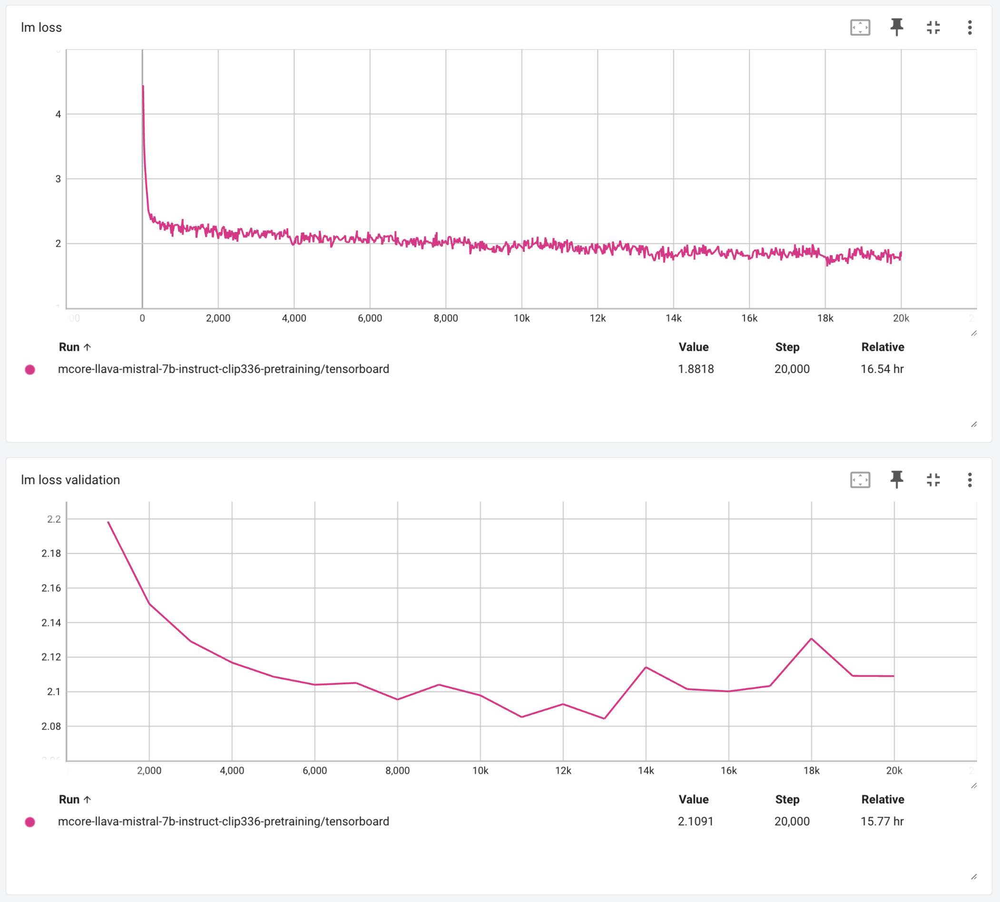

# Multimodal Example

*NOTE: This example is under active development and is expected change.*

The following walks through all the steps required to pretrain and instruction tune a llava architecture vision-language model (VLM). It is important to precisely follow all steps to obtain the benchmark scores at the end.

This example has been tested on an A100 based DGX cluster. Pretraining and instruction tuning took approximately 1 day and 11 hours respectively on 64 GPUs using four way tensor parallelism (tp=4). Training speed will scale approximately linearly with number of GPUs available.

Multimodal support in megatron is still under active development. This example is not intended to produce state-of-the-art model quality (that would require more data and model refinements), it is merely intended to demonstrate the multimodal functionality in megatron. If you hit any problems, please open a github issue.

## Setup

### Docker container

You can build a docker container using `examples/multimodal/Dockerfile` to run this example.

### Language model

Follow the instructions in `megatron-lm/docs/llama_mistral.md` to download weights for Mistral-7B-Instruct-v0.3 and convert to mcore format with tensor parallel size 4

### Vision model

This example uses the OpenAI CLIP `ViT-L/14@336px` Vision model. To download the weights from OpenAI and convert them to a format that can be loaded in megatron, please run the following:

```
python examples/multimodal/clip_converter.py --download-root /some/download/folder --output /some/output/folder --tensor-parallel-size 4 --use-te-layernorm-linear
```

### Combined model checkpoint

Update the paths to point to the mcore converted CLIP and Mistral models and run the following script to combine the Mistral and CLIP models into a single multimodal checkpoint folder:

```
examples/multimodal/combine_mistral_clip.sh
```

## Training

### Pretraining

1. Download the LLavA-Pretrain dataset from Hugging Face and unzip the images folder (NOTE: 79GB of disk space required):

    ```
    git clone https://huggingface.co/datasets/liuhaotian/LLaVA-Pretrain
    cd LLaVA-Pretrain
    unzip images.zip
    ```

3. Run the following script to convert the data to webdataset format:

    ```
    cd <megatron-lm dir>
    python examples/multimodal/convert_llava_pretrain_to_wds.py
    ```

4. Run the following command to convert to megatron-energon format:

    ```
    cd <LLaVA-Pretrain dir>/wds
    energon ./
    ```

    select the following values for the presented options:

    ```
    > Please enter a desired train/val/test split like "0.5, 0.2, 0.3" or "8,1,1": 9,1,0
    > Do you want to create a dataset.yaml interactively? [Y/n]: Y
    > Please enter a number to choose a class: 10 (VQAWebdataset)
    > Do you want to set a simple field_map[Y] (or write your own sample_loader [n])? [Y/n]: Y
    > Please enter a webdataset field name for 'image' (<class 'torch.Tensor'>): jpg
    > Please enter a webdataset field name for 'context' (<class 'str'>): json[0][value]
    > Please enter a webdataset field name for 'answers' (typing.Optional[typing.List[str]], default: None): json[1][value]
    > Please enter a webdataset field name for 'answer_weights' (typing.Optional[torch.Tensor], default: None):
    ```

5. Update `pretrain_dataset.yaml` so that both `path` variables point to `LLaVA-Pretrain/wds`

6. Run the following script to pretrain a llava model for image captioning:

    ```
    cd <megatron-lm dir>
    examples/multimodal/pretrain_mistral_clip.sh
    ```

All being well you should observe training and validation loss curves similar to the following:



These curves were obtained with global batch size of 256. Changing this value will likely change the curves. For pretraining and instruction tuning llava models we have found that loss curves are an unreliable predictor of downstream task performance. Therefore it is necessary to run test generation and evaluation on a range of metrics to understand model quality. We intend to add training time zero-shot evaluation in a future update.

You can execute the pretraining script multiple times to resume training. On resuming, the latest model, optimizer, and dataloader state are loaded.

### SFT

1. Prepare an instruction tuning dataset such in [megatron-energon format](https://nvidia.github.io/Megatron-Energon/data_prep.html#). NOTE: we do not provide instructions for this.

2. Update `sft_dataset.yaml` so that both `path` variables point to the train and val splits of your instruction tuning dataset.

Run the following script to instruction tune the pre-trained llava model:

    ```
    examples/multimodal/sft_mistral_clip.sh
    ```

You can execute the SFT script multiple times to resume training. On resuming, the latest model, optimizer, and dataloader state are loaded.

## Evaluation

### Generation

Run the following script:

```
examples/multimodal/text_generation_mistral_clip.sh --input-image-path /path/to/input/images --output-path /some/output/directory \
    --model-path /path/to/model.pt --tokenizer-path /path/to/tokenizer.model --gt-path /path/to/groundtruth/file --task generation-task-name
```

### After pretraining

#### COCO captioning

1. Download the COCO 2014 test image set:

    ```wget http://images.cocodataset.org/zips/test2014.zip```

2. Download COCO test image annotations:

    ```https://storage.googleapis.com/sfr-vision-language-research/datasets/coco_karpathy_test.json```

3. First, run text generation using `--task captioning`.

4. Run the following command:

    ```
    python examples/multimodal/evaluate_coco.py --input-path /output/directory/from/generation --groundtruth-path /path/to/groundtruth/file
    ```

For the mistral-7b-instruct plus clip llava model you should obtain a COCO CIDer score of approximately 94.

### After SFT

#### MMMU

The official MMMU repository is not pip installable currently so please clone their code in `examples/multimodal` by running `git clone https://github.com/MMMU-Benchmark/MMMU.git`.

The MMMU dataset is loaded from HuggingFace automatically as part of the code.

Run text generation using `--task MMMU`. Then, run the following command:

```
python examples/multimodal/evaluate_mmmu.py --input-path /output/directory/from/generation
```

For the mistral-7b-instruct plus clip instruction tuned llava model you should obtain a MMMU score of approximately 38.
