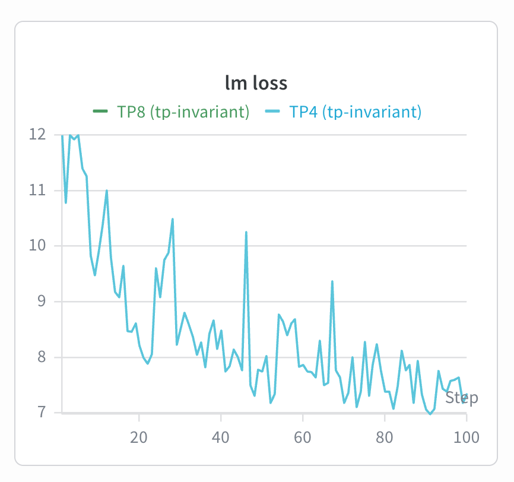
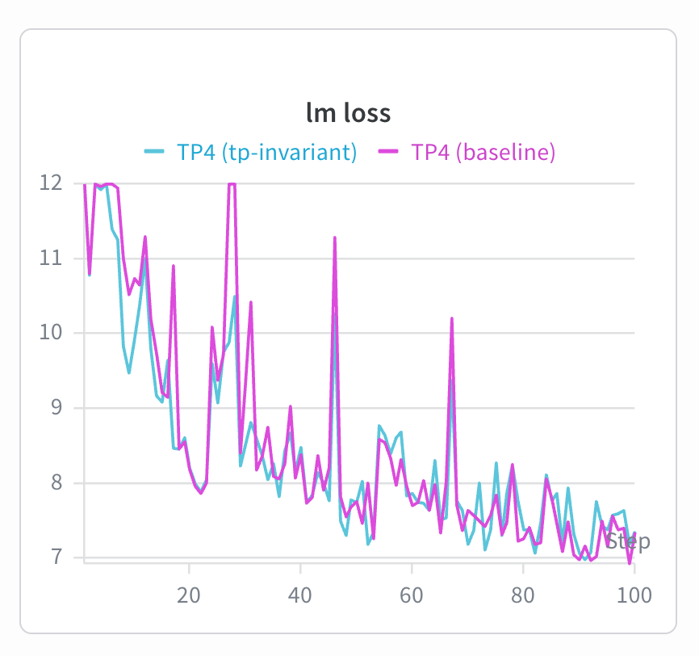
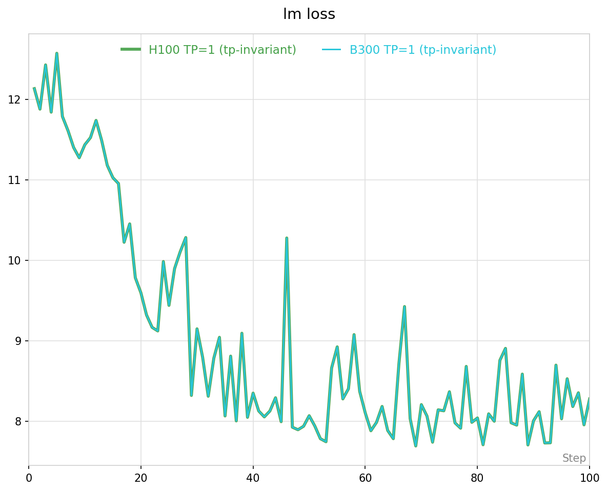

# TP-Invariant Numerics: Bitwise Identical Training Across TP Degrees

Bitwise identical forward, backward, and E2E training for Megatron-Core TransformerBlocks
regardless of Tensor Parallelism (TP) degree — TP=1, 2, 4, 8 produce the same result.

**Source branches** (view diffs):
- [Megatron-LM](https://github.com/jinzex/Megatron-LM/tree/jinzex/tp-invariant-numerics) — MCore changes (clip_grads, batch_invariant_kernels, etc.)
- [TransformerEngine](https://github.com/jinzex/TransformerEngine/tree/jinzex/tp-invariant-numerics) — TE changes (layernorm_linear, linear, etc.)

## Status

| Model | Unit Test (single fwd+bwd) | E2E Training |
|-------|-----------|--------------|
| **Dense** | TP=1/2/4/8 bitwise identical | TP=1/2/4 bitwise identical loss+grad_norm, **100 iters** |
| **MoE** | TP=1/2/4/8 bitwise identical (BIK) | Pending |

Config: `BIK=1 NVTE_TP_INVARIANT_MODE=1` | TE 2.9 | Qwen3-0.6B / 8B | H100, B300

**Cross-architecture:** B300 ≡ H100 bitwise (Qwen3-0.6B TP=1, Qwen3-8B TP=4, 100 iters). See [Cross-Architecture Validation](#cross-architecture-validation-b300-vs-h100).

## Baseline vs TP-Invariant (Qwen3-0.6B)

Without TP-invariant mode, loss diverges from iteration 1:

| Iter | Baseline TP=1 | Baseline TP=2 (diverges) | Baseline TP=4 (diverges) | TP-Inv TP=1/2/4 (all identical) |
|------|--------------|--------------------------|--------------------------|-------------------------------|
| 1 | 1.213320E+01 | 1.213298E+01 | 1.213321E+01 | **1.213320E+01** |
| 2 | 1.187939E+01 | 1.188345E+01 | 1.188395E+01 | **1.187872E+01** |
| 5 | 1.252811E+01 | 1.253201E+01 | 1.253240E+01 | **1.257282E+01** |
| 10 | 1.165137E+01 | 1.164608E+01 | 1.164373E+01 | **1.143649E+01** |
| 100 | 8.277067E+00 | - | - | **8.277067E+00** |

## Components & Patches

All fixes are required together. TE patches must be copied into the container at runtime
(TE is a site-package). MCore changes are committed directly to this branch.

TE-side patches live in the companion TE branch
[`jinzex/tp-invariant-numerics`](https://github.com/jinzex/TransformerEngine/tree/jinzex/tp-invariant-numerics);
MCore changes are committed in this branch.

| Component | Fix | Location |
|-----------|-----|----------|
| **TP-Invariant GEMM** (fwd+bwd) | All-gather sharded weight, full-K GEMM | TE `transformer_engine/pytorch/module/{layernorm_linear,linear}.py` |
| **Gated deinterleave** (bwd) | Reorder via `partition_stride` after all-gather | TE `transformer_engine/pytorch/module/layernorm_linear.py` |
| **Cross-entropy** (fwd) | All-gather exp_logits, local sum | `megatron/core/tensor_parallel/cross_entropy.py` |
| **Output projection** (bwd) | All-gather weight+grad, full dgrad GEMM | `megatron/core/tensor_parallel/layers.py` |
| **Gradient clipping** | Float64 norm + pow2 clip_coeff rounding | `megatron/core/optimizer/clip_grads.py` |
| **RMSNorm dgamma** (bwd) | All-gather tokens + rank-0-only reduction | `megatron/core/transformer/custom_layers/batch_invariant_kernels.py` |
| **BIK** (fwd+bwd) | M-invariant Triton matmul_persistent | `megatron/core/transformer/custom_layers/batch_invariant_kernels.py` |

### Gradient Clipping Fix

`multi_tensor_l2norm` (Apex CUDA) reduces over different-shaped TP shards → different
FP32 partial sums → different clip_factor. Fix: float64 norm computation + pow2 rounding
of clip_coeff. Mismatch rate: 40.3% (float32) → 0.000% (pow2).

## Quick Start

**Prerequisites:** TE 2.9, 1+ GPU (1 for 0.6B-TP1, 4 for 8B-TP4, 8 for MoE-toy), this Megatron-LM branch on PYTHONPATH. **No Bridge dependency** — dense scripts use raw MLM `pretrain_gpt.py` directly.

### TE patches

Submit scripts install the matching TE patches into the container at launch
(squashfs containers are read-only per-srun, so patches reapply each run).
Version-pinned snapshots live under `patches/v<TE_VERSION>/` mirroring the TE
source tree — see [`patches/README.md`](patches/README.md) for the supported
versions and how to refresh from the companion
[TE branch](https://github.com/jinzex/TransformerEngine/tree/jinzex/tp-invariant-numerics).
No matching version → submit script fails fast.

### Run tests

```bash
cd $PROJ  # this Megatron-LM branch

# Unit test: TP=1 ≡ TP=2 ≡ TP=4 bitwise on a small TransformerBlock
NVTE_TP_INVARIANT_MODE=1 \
torchrun --nproc_per_node=4 -m pytest \
    tests/unit_tests/transformer/test_tp_invariant.py -v -s

# E2E: Qwen3-0.6B (100 iters, TP=1; 1 GPU)
bash examples/tp-numerics/submit_qwen3_0.6b_tp_invariant.sh

# E2E: Qwen3-8B (100 iters, TP=4; 4 GPUs)
bash examples/tp-numerics/submit_qwen3_8b_tp_invariant.sh

# Smoke test: toy MoE (Qwen3-30B-A3B 4L 8E top-2, 10 iters, 1 GPU)
bash examples/tp-numerics/submit_qwen3_moe_toy_tp_invariant.sh

# Override TP / iters via env:
# TP_SIZE=2 TRAIN_ITERS=10 bash submit_qwen3_0.6b_tp_invariant.sh
# Each script also runs as `sbatch <script>` for SLURM batch.
```

**Expected iter 1** (Qwen3-0.6B TP=1): `lm loss: 1.213320E+01 | grad norm: 18.259`.

## Validation Results

| Model | Backend | TP | Iters | Result |
|-------|---------|-----|-------|--------|
| Qwen3-0.6B | unfused | 1/2/4 | 100 | Bitwise identical |
| Qwen3-0.6B | auto (cuDNN) | 1/2 | 100 | Bitwise identical |
| Qwen3-0.6B | flash (FA3) | 1/2 | 100 | Bitwise identical |
| Qwen3-8B | unfused | 4/8 | 10 | Bitwise identical |
| Qwen3-8B | auto (cuDNN) | 4/8 | 100 | Bitwise identical |
| Qwen3-8B | — | 1/2 | — | OOM (all-gather doubles peak memory) |

All three attention backends (unfused, auto/cuDNN, flash/FA3) achieve TP-invariance —
attention is intra-rank with no cross-rank reduction. Recommended: **unfused** (no extra setup).

### Qwen3-8B: TP=4 vs TP=8 (bitwise identical, 100 iters)



### Qwen3-8B: TP-invariant vs baseline (TP=4)



## Cross-Architecture Validation (B300 vs H100)

Bitwise identical training across NVIDIA SM_90 (H100) and SM_100 (B300) with
the same patch stack. Loss + grad_norm + validation match every iter.

| Model      | TP | Iters | Result |
|------------|----|-------|--------|
| Qwen3-0.6B | 1  | 100   | Bitwise identical |
| Qwen3-8B   | 4  | 100   | Bitwise identical |



Reproduce by running the Quick Start commands on each GPU and diffing
the per-iter lm loss + grad norm streams:

```bash
diff <(grep -oP "lm loss: \S+|grad norm: \S+" b300_run.log) \
     <(grep -oP "lm loss: \S+|grad norm: \S+" h100_run.log)
# Empty output = bitwise identical.
```

## Performance Overhead (Qwen3-8B, 4x H100, TP=4, auto/cuDNN)

| Mode | Avg step (ms) | Overhead | What changes |
|------|-------------|----------|-------------|
| Baseline | 227.5 | — | Standard training |
| **TP-invariant fwd** | 386.7 | **+70%** | 2/4 fwd GEMMs all-gather + cross-entropy |
| TP-invariant E2E | 598.2 | +163% | All 7 components (fwd+bwd) |

Fwd-only overhead (+70%) is the relevant cost for RL training where only forward logits need TP-invariance. Full E2E (+163%) is for debugging/validation only.

## MoE E2E

Unit tests: **bitwise identical** fwd+bwd across TP=1/2/4/8 (with BIK=1).
E2E training: **pending**.

Forward is bitwise identical (iter 1 loss matches across TP). Backward diverges
because expert wgrad accumulates over different token subsets per TP rank (partial-K).
At DP=1: expert wgrads are unsynchronized. At DP>1: synced via all-reduce, but
sum(partial wgrads) ≠ full wgrad due to FP32 accumulation order. Same class as
the Dense partial-K issue, but expert weights are replicated (not TP-sharded),
so the Dense all-gather-weight fix doesn't apply directly.

## Known Limitations

- **PP**: Megatron seeds each PP stage differently → can't compare across PP configs. All validation uses PP=1.
- **DP>1**: Different DP means different gradient accumulation order. DP-invariance is a separate problem.
- **8B OOM at TP≤2**: TP-invariant all-gather doubles peak weight memory. Validation-mode tradeoff.
