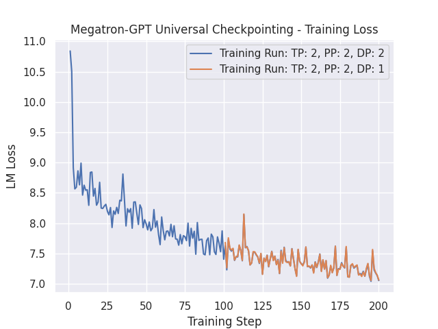
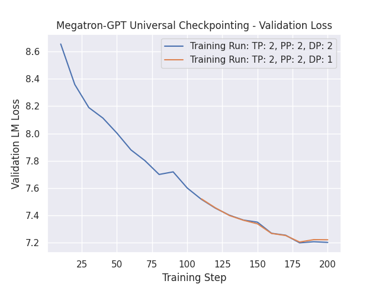
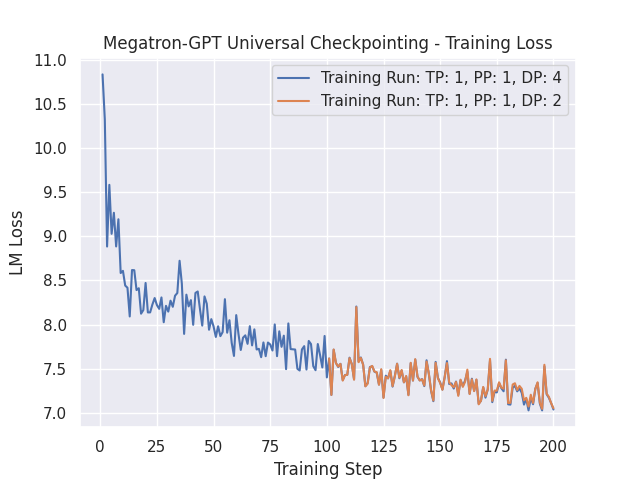
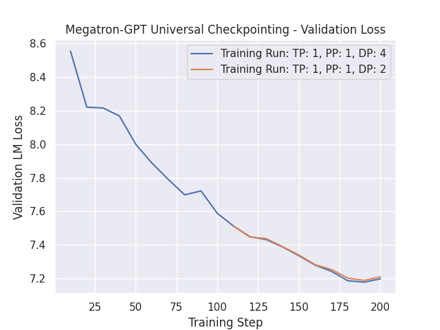

# Universal Checkpoint examples

This folder contains example scripts that demonstrate how to use Universal Checkpoints to change the number of GPUs when training with ZeRO. With Universal Checkpoints, training can be resumed with a different parallelism degree on any of tensor slicing (TP), pipeline parallelism (PP), sequence parallelism (SP) and data parallelism (DP). Using universal checkpoints involves the following three steps:

1. ZeRO-based training run, optionally combining TP and PP or SP, that creates normal ZeRO checkpoints.
2. Converting ZeRO checkpoint into the universal format using `ds_to_universal.py` utility of DeepSpeed.
3. Resuming training with the universal checkpoint, on a different number of GPUs.

## ZeRO stage 1 training
For ZeRO stage 1, we provide bash scripts for bf16 and fp16 training examples corresponding to the steps 1 and 3 above. The step 1 scripts launch a training run of TP=PP=DP=2 of 200 iterations that creates a checkpoint every 100 iterations. The step 3 scripts load a universal checkpoint of iteration 100 and resume training with TP=PP=2 and DP=1 for an additional 100 iterations. Users can modify these scripts to try out other save and resume 3D combinations (e.g., save TP=PP=DP=1 and resume TP=PP=DP=2). Tensorboard logs are created by both step 1 and 3 scripts to enable visual inspection of how well the loss curves of the initial and resumed training runs match, especially at iteration 101.

1.  bf16:
    * run_bf16.sh: step 1
    * run_universal_bf16.sh: step 3

2. fp16:
    * run_fp16.sh: step 1
    * run_universal_fp16.sh: step 3

Please note that these scripts should be run from the root folder of the repo (i.e., two levels above this README). For illustration, here are the commands for running the bf16 example.

### Download and Pre-process Training Dataset
Before executing the steps below, you can download and pre-process the training set using the following commands (see [here](https://github.com/bigscience-workshop/Megatron-DeepSpeed?tab=readme-ov-file#quick-pre-processing-to-start-training-with) for more details):
```bash
wget https://huggingface.co/bigscience/misc-test-data/resolve/main/stas/oscar-1GB.jsonl.xz
wget https://s3.amazonaws.com/models.huggingface.co/bert/gpt2-vocab.json
wget https://s3.amazonaws.com/models.huggingface.co/bert/gpt2-merges.txt
xz -d oscar-1GB.jsonl.xz
python tools/preprocess_data.py \
    --input oscar-1GB.jsonl \
    --output-prefix my-gpt2 \
    --vocab-file gpt2-vocab.json \
    --dataset-impl mmap \
    --tokenizer-type GPT2BPETokenizer \
    --merge-file gpt2-merges.txt \
    --append-eod \
    --workers 8
```

NOTE: Make sure to update your `BASE_DATA_PATH` path in the `run_[bf16/fp16].sh` and `run_universal_[bf16/fp16].sh` scripts to point to the pre-processed data.

### Step 1: Create ZeRO checkpoint
```bash
  bash examples_deepspeed/universal_checkpointing/run_bf16.sh
```
By default the script will create the checkpoints in folder `z1_uni_ckpt/checkpoints/gpt2/z1/bf16/tp2_pp2_dp2_toy`

### Step 2: Convert ZeRO checkpoint of iteration 100 to Universal format
Assuming the DeepSpeed source code is cloned into the home folder, the following command will generate universal checkpoint for iteration 100.

```bash
python ${HOME}/DeepSpeed/deepspeed/checkpoint/ds_to_universal.py \
    --input_folder z1_uni_ckpt/checkpoints/gpt2/z1/bf16/tp2_pp2_dp2_toy/global_step100 \
    --output_folder z1_uni_ckpt/checkpoints/gpt2/z1/bf16/tp2_pp2_dp2_toy/global_step100_universal
```
Note that we chose to create the universal checkpoint in the same checkpoint folder as the ZeRO checkpoint. This maintains the normal checkpoint folder structure expected by the Megatron-DeepSpeed code, which makes it easy to load universal checkpoints with little/no script or code changes. For clarity, we show below the contents of the checkpoint folder after creation of the universal checkpoint. Note that the conversion script creates `global_step100_universal` folder and `latest_universal` file.

```bash
ls -l z1_uni_ckpt/checkpoints/gpt2/z1/bf16/tp2_pp2_dp2_toy/
total 48
drwxr-xr-x 2 user group  4096 Oct 21 08:51 global_step100
drwxr-xr-x 3 user group  4096 Oct 21 09:28 global_step100_universal
drwxr-xr-x 2 user group  4096 Oct 21 09:01 global_step200
-rw-r--r-- 1 user group    14 Oct 21 09:50 latest
-rw-r--r-- 1 user group     3 Oct 21 09:50 latest_checkpointed_iteration.txt
-rw-r--r-- 1 user group    24 Oct 21 09:28 latest_universal
-rwxr--r-- 1 user group 24177 Oct 21 09:50 zero_to_fp32.py
```

### Step 3: Resume training with Universal checkpoint of iteration 100
```bash
bash examples_deepspeed/universal_checkpointing/run_universal_bf16.sh
```
This resumption script effects the loading of universal checkpoint rather than the ZeRO checkpoint in the folder by passing `--universal-checkpoint` command line flag to the main training script (i.e., `pretrain_gpt.py`).

Please see the corresponding [pull request](https://github.com/deepspeedai/Megatron-DeepSpeed/pull/276) for visualizations of matching loss values between original and universal checkpoint runs for bf16 and fp16 examples.

Combining sequence parallelism with data parallelism is another good use case for universal checkpointing, see [sp pull request](https://github.com/deepspeedai/DeepSpeed/pull/4752) for example and visualization of matching loss values.

Notes: The model weights using the ```--no-pipeline-parallel``` parameter and the model weights not using the ```--no-pipeline-parallel``` parameter are currently not supported for mutual conversion.

### TensorBoard Log Analysis

The Universal Checkpointing example includes a TensorBoard analysis script that will generate `csv` files and `png` plots across the unviersal checkpointing training steps for comparison of training and validation loss curves.

After Step 3 is completed, the script may be executed as follows:
```bash
bash examples_deepspeed/universal_checkpointing/run_tb_analysis.sh z1_uni_ckpt
```

The script will output the following `csv` files:
  - uc_out_tp_2_pp_2_dp_2_sp_1.csv
  - uc_out_tp_2_pp_2_dp_1_sp_1.csv
  - val_uc_out_tp_2_pp_2_dp_2_sp_1.csv
  - val_uc_out_tp_2_pp_2_dp_1_sp_1.csv

The script will also output the following `png` files:
  - uc_char_training_loss.png
  - uc_char_validation_loss.png

Below is the visualization of the `png` files generated from this example.

<div align="center">
  

  *Figure 1: Training LM loss curve for first 200 training steps of Step 1 (TP=2, PP=2, DP=2) and training steps 101 to 200 of Step 3 (TP=2, PP=2, DP=1), which was loaded using the Universal Checkpoint.*
</div>

<div align="center">
  

  *Figure 2: Validation LM loss curve for first 200 training steps of Step 1 (TP=2, PP=2, DP=2) and training steps 101 to 200 of Step 3 (TP=2, PP=2, DP=1), which was loaded using the Universal Checkpoint.*
</div>


## ZeRO stage 2 training
Repeat steps in ZeRO stage 1 training above with the following modifications to your job batch scripts:
* Set ZERO_STAGE=2
* Add `--no-pipeline-parallel` flag to deepspeed options

## ZeRO stage 3 training
Repeat steps in ZeRO stage 1 training above with the following modifications to your job batch scripts:
* Set ZERO_STAGE=3
* Add `--no-pipeline-parallel` flag to deepspeed options

> **Note:** that the stage 3 universal checkpoint currently supports Data parallelism.

Below is the visualization of the `png` files generated from ZeRO stage 3.

<div align="center">
  

  *Figure 1: Training LM loss curve for first 200 training steps of Step 1 (TP=1, PP=1, DP=4) and training steps 101 to 200 of Step 3 (TP=1, PP=1, DP=2), which was loaded using the Universal Checkpoint.*
</div>

<div align="center">
  

  *Figure 2: Validation LM loss curve for first 200 training steps of Step 1 (TP=1, PP=1, DP=4) and training steps 101 to 200 of Step 3 (TP=1, PP=1, DP=2), which was loaded using the Universal Checkpoint.*
</div>
