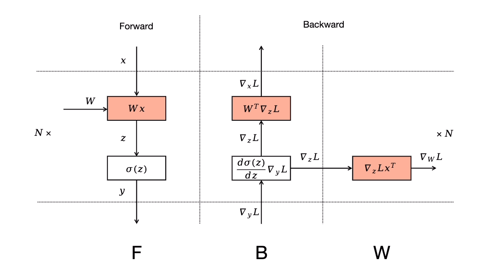
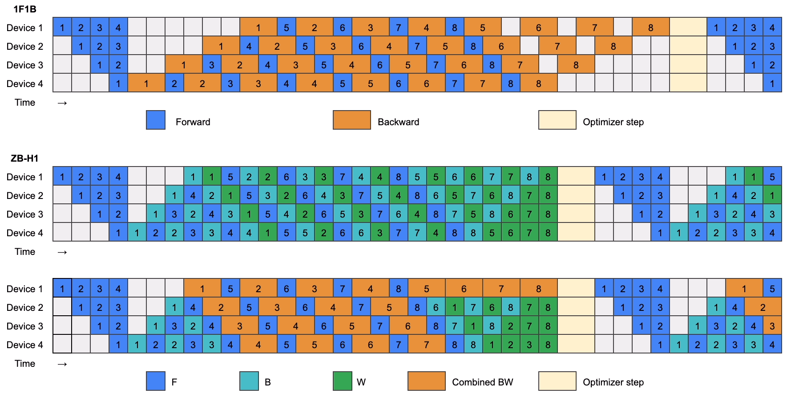
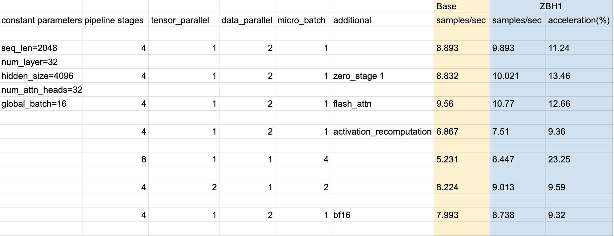

# Zero Bubble Pipeline Parallelism Tutorials

This folder contains examples and tutorials to enable Zero Bubble Pipeline Parallelism ([Paper Link](https://arxiv.org/abs/2401.10241)). The key idea is to breaking a backward pass into a $B$ pass and $W$ pass. $B$ on one stage will only depend on the $B$ on its next stage, compared to depending on both $B$ and $W$ of in 1F1B.



Currently supported zero bubble schedules:
* ZB-H1

## ZB-H1



As shown in the above image, the ZB-H1 schedule cuts pipeline buble of 1F1B to 1/3.

### ZB-H1 and Its Variation
There're two versions of ZB-H1 implemented in Megatron-Deepspeed: an official version (the 2nd schedule in the  above image) which does a uniform B-W split, and another variation (the 3rd schedule in image) that does B-W split only when necessary. We provide the variation version as the default implementation. 

In practice the variation version is more friendly to a synchonized communication implementation and combined usage with tensor parallelism. However it changes the ordering of applying weight update of different microbatches (E.g. for Device 4 in the image above, the ordering of applying weight update is 4->5->6->7->1->2->3->8), hence might result in slightly different loss curve.


### How to use

Simply add the following flag to the options to enable ZB-H1:

```
--enable-zbh1-pipeline
```
The default implementation is the variation version of ZB-H1 mentioned in [Previous Section](#zb-h1).

If you want the bit-to-bit exact semantics when compared to 1F1B, you can use the following flag. It might be a bit slower than the default implementation.

```
--enable-zbh1-exact-semantics
```

### ZB-H1 Toy Example

Here is a toy example for using **ZB-H1** inside DeepSpeed repo. 

Firstly you'll need to prepare some sample training data and change the `data_path` in `zbh1_pretrain_gpt_1.3b.sh`. Then under this folder, Run 

```
bash zbh1_pretrain_gpt_1.3b.sh
```

## Benchmarks

The implementation has been checked and verified on various setups such as ZeRO Stage 1, activation recomputation, flash attention, tensor parallel, data parallel and bf16. By approximate measure, ~10% acceleration was observed when microbatch count is twice the number of pipeline stages:

