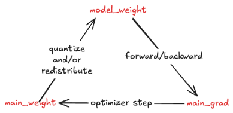

<!---
   Copyright (c) 2026, NVIDIA CORPORATION. All rights reserved.
   NVIDIA CORPORATION and its licensors retain all intellectual property
   and proprietary rights in and to this software, related documentation
   and any modifications thereto. Any use, reproduction, disclosure or
   distribution of this software and related documentation without an express
   license agreement from NVIDIA CORPORATION is strictly prohibited.
-->

# MFSDP Optimizer

## Proposal

- Standalone `megatron_fsdp`: do not depend on any optimizer or optimizer wrapper
  in Megatron Core (MCore).
- MFSDP v1 in MCore: continue using `DistributedOptimizer`.
- MFSDP v2 in MCore: prefer a narrow `FullyShardedOptimizer` subclass of
  `MixedPrecisionOptimizer` instead of adding MFSDP v2 branches throughout
  `DistributedOptimizer`.

PR [#5865](https://github.com/NVIDIA/Megatron-LM/pull/5865) is the current
reference point for the MFSDP v2 direction in MCore.

## Background



FSDP needs custom optimizers because:

- Lower-precision model weights than main weights: after `optimizer.step()`, the
  updated main weights must be synchronized back to the lower-precision compute
  weights.
- Lower-precision main gradients than main weights: before `optimizer.step()`,
  the optimizer must either be precision-aware about the gradient dtype or
  explicitly upcast the gradients into the dtype expected by the main weights
  and optimizer state.
- Matrix optimizers: optimizer state derived from `main_grad` may need a
  different shape (e.g. SOAP) and sharding layout (e.g. SOAP and Muon) than
  `main_weight`. That can require redistributing optimizer inputs before
  `optimizer.step()` and redistributing updates back into the `main_weight`
  layout afterward.
- Performance optimizations such as offloading: when parameters, gradients, or
  optimizer state move across devices or memory tiers, the optimizer path needs
  explicit coordination beyond a plain `torch.optim.Optimizer.step()` call.

MFSDP supports two integration modes. Standalone `megatron_fsdp` owns its
FSDP-specific optimizer behavior. Within MCore, MFSDP must integrate with the
existing optimizer, scheduler, checkpoint, and training-loop contracts. Both
modes need to handle the optimizer cases above, but under different dependency
and feature constraints.

## Alternatives Considered

### Reuse `DistributedOptimizer` in Standalone `megatron_fsdp`

`megatron_fsdp` as a standalone package should not depend on MCore optimizer code
just to get FSDP-specific optimizer behavior. Open-source users of standalone
MFSDP [should not need][standalone-dependency] to pull in Megatron-Core's
optimizer stack, DDP assumptions, or training loop contracts.

For the standalone package, the optimizer should stay local to `megatron_fsdp`
and only solve the FSDP-specific cases that plain `torch.optim` does not handle
out of the box.

### Reuse `DistributedOptimizer` in MCore for MFSDP

PR [#5813](https://github.com/NVIDIA/Megatron-LM/pull/5813) is the reference
prototype for this direction.

`DistributedOptimizer` is an approximately 3k-line MCore class with strong
assumptions about DDP API/classes such as `DistributedDataParallel` and
`ParamAndGradBuffer`. While MFSDP v1 reuses `DistributedOptimizer`, that reuse is
shallow: most of the DDP-specific implementation is bypassed via the
`if use_megatron_fsdp` branches, creating unnecessary mental burden for readers
trying to understand which code paths are enabled for MFSDP and which are not.

Instead, it makes more sense for MFSDP to depend on the more general and
lightweight `MixedPrecisionOptimizer`.

## Implementation Details

There are several ways to wrap an optimizer for standalone MFSDP:

1. Hooks. This is the direction in PR
   [#5411](https://github.com/NVIDIA/Megatron-LM/pull/5411). It is simple and
   updates the optimizer object in place, but it is naturally limited to
   pre-step and post-step customization points.

2. Subclassing. Subclassing can override any optimizer method as needed. It can
   be applied to one specific optimizer with optimizer-specific logic. It can
   also be applied generically to many optimizers, as in the following example.

   ```py
   @functools.lru_cache(maxsize=None)
   def _make_fsdp_optimizer_cls(base: Type[optim.Optimizer]) -> Type[optim.Optimizer]:
       class FsdpOptimizer(base):  # type: ignore[valid-type, misc]
           def __init__(self, params, module: nn.Module, *args, **kwargs):
               super().__init__(params, *args, **kwargs)
               self.module = module

           def step(self, closure: Optional[Callable[[], float]] = None):
               loss = super().step(closure)
               self._post_step()
               return loss

           def _post_step(self) -> None:
               # Can use self.module, which is passed in through the constructor.
               pass

       FsdpOptimizer.__name__ = f"Fsdp{base.__name__}"
       FsdpOptimizer.__qualname__ = FsdpOptimizer.__name__
       return FsdpOptimizer


   def fully_shard_optimizer(
       optimizer_class: Type[optim.Optimizer],
       model: nn.Module,
       *args: Any,
       **kwargs: Any,
   ) -> optim.Optimizer:
       cls = _make_fsdp_optimizer_cls(optimizer_class)
       return cls(model.parameters(), model, *args, **kwargs)
   ```

3. Composition. This uses a dedicated wrapper around one or more underlying
   optimizers. `MixedPrecisionOptimizer` in MCore takes this approach.

The recommendation is:

- For elementwise optimizers, use hooks. They are simple and match the current
  customization needs.
- For matrix optimizers, use composition. For Muon, one important performance
  optimization is to overlap optimization of fully owned parameters with
  redistribution of partially owned parameters. That scheduling cannot be
  expressed cleanly with only pre-step and post-step hooks, but it can be done
  by wrapping [`OrthogonalizedOptimizer`][orthogonalized-optimizer].
- Use subclassing with caution because it increases coupling to inherited
  optimizer behavior. See Dave Thomas and Andy Hunt, "Inheritance Tax" from
  [The Pragmatic Programmer][inheritance-tax].

## Future Direction

The likely near-term end state is three optimizer implementations:

- standalone MFSDP optimizer in `megatron_fsdp.experimental`
- MCore `DistributedOptimizer` for DDP and MFSDP v1
- MCore `FullyShardedOptimizer` for MFSDP v2

This looks awkward, but it's still acceptable because they serve three separate
responsibilities.

When MFSDP v1 is later deprecated, the MFSDP-specific branches in
`DistributedOptimizer` should be removed so it returns to supporting only DDP.

`DistributedOptimizer` and `FullyShardedOptimizer` could be further unified.
However, that would require a significant refactor to create better code
abstractions that both DDP and FSDP can fit in.

[inheritance-tax]:
  https://media.pragprog.com/titles/tpp20/inheritance-tax.pdf
[orthogonalized-optimizer]:
  https://github.com/NVIDIA-NeMo/Emerging-Optimizers/blob/d44aefbc1a2b6da771268e7ba35d2ec7f678e9ad/emerging_optimizers/orthogonalized_optimizers/orthogonalized_optimizer.py#L43
[standalone-dependency]:
  https://docs.google.com/document/d/1FIM7LKD1AvY-DdPjCu1KgvWmyhgOW7iZB5N6FQj6O3E/edit?tab=t.0#heading=h.guildfshf6dn
