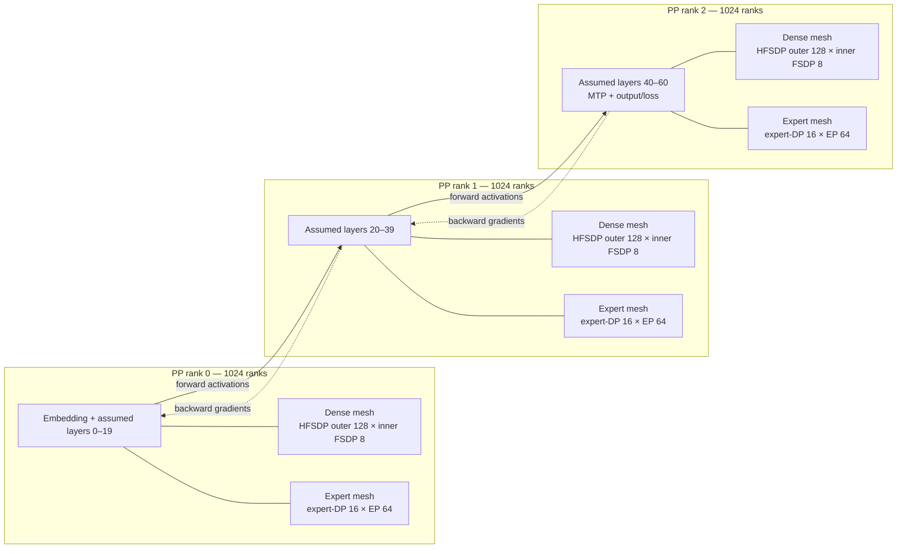
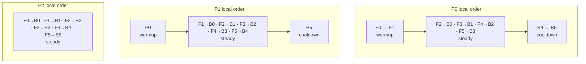
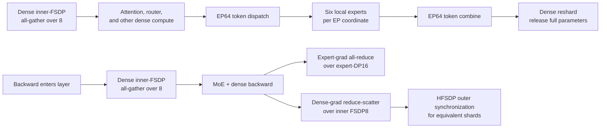

# DeepSeek V4 Pro: PP3 + dense HFSDP8 + EP64 schedule

This document derives the logical training schedule and process-group topology
for the following configuration:

```text
world size            = 3072
pipeline parallel     = 3
expert parallel       = 64
dense parallelism     = HFSDP, inner FSDP size 8
expert parallelism    = pure data parallel outside EP
```

## Assumptions and scope

The local DeepSeek V4 Pro configuration defines 61 transformer layers, 384
experts, and one MTP layer. The requested topology does not specify TP, CP,
ETP, VPP, microbatch size, or global batch size, so this document assumes:

- TP = CP = ETP = 1.
- VPP = 1: one model chunk on each physical PP rank.
- Standard non-interleaved pipeline 1F1B.
- The number of microbatches per iteration is `M`; `M=6` is used only for the
  concrete schedule illustration.
- The 61 transformer layers use an illustrative balanced `20 / 20 / 21`
  placement. A production `pipeline_model_parallel_layout` may move layers to
  account for embedding, output, MTP, or heterogeneous layer costs.
- "Expert pure DP" means expert parameters are not FSDP-sharded across their
  expert-DP group. Each EP-owned expert set is replicated across expert-DP and
  its gradients are all-reduced.

The diagrams describe dependencies and collective scopes. They do not claim
that pipeline P2P or data-parallel collectives overlap asynchronously unless
the corresponding runtime overlap options are enabled.

## Topology derivation

Each physical PP stage contains:

```text
ranks per PP stage = world size / PP = 3072 / 3 = 1024
```

Those same 1,024 ranks are viewed through two different meshes:

```text
dense mesh:   HFSDP outer 128 × inner FSDP 8 = 1024
expert mesh:  expert-DP 16 × EP 64           = 1024
```

Since DeepSeek V4 Pro has 384 experts:

```text
experts per EP coordinate = 384 / 64 = 6
microbatches M = global batch size / (microbatch size × 1024)
```



### Process-group inventory

The following counts are per physical PP stage unless stated otherwise:

| Group | Size | Number | Fixed coordinate | Purpose |
|---|---:|---:|---|---|
| Pipeline group | 3 | 1024 globally | Dense/DP lane | Activation send forward and activation-gradient send backward |
| Dense inner FSDP | 8 | 128 | HFSDP outer coordinate | All-gather dense parameters; reduce-scatter dense gradients |
| Dense HFSDP outer | 128 | 8 | Inner-FSDP shard coordinate | Replicate inner parameter shards while sharding optimizer state in HFSDP mode |
| Expert parallel | 64 | 16 | Expert-DP replica | Dispatch/combine tokens; each coordinate owns six experts |
| Expert data parallel | 16 | 64 | EP coordinate | Replicate the same six experts and all-reduce their gradients |

The exact global-rank ordering depends on process-group construction. The mesh
coordinates above are logical and do not assume that PP stages or mesh rows
are contiguous in global rank order.

## Dense and expert meshes within one PP stage

### Dense HFSDP mesh

```text
                         inner FSDP shard coordinate
                       0    1    2   ...   7
HFSDP outer replica 0  ●────●────●────────●   inner group: size 8
                    1  ●────●────●────────●
                    2  ●────●────●────────●
                    ⋮  ⋮    ⋮    ⋮        ⋮
                  127  ●────●────●────────●
                       │    │    │        │
                       └ outer groups: eight groups of size 128
```

For dense parameters:

1. The inner group of eight all-gathers parameter shards before forward or
   backward compute.
2. After backward, dense gradients are reduce-scattered over the inner group.
3. The outer dimension synchronizes equivalent inner shards. In HFSDP mode,
   optimizer state is additionally sharded across this outer dimension rather
   than fully replicated as in ordinary HSDP.

### Expert EP × DP mesh

```text
                            EP owner coordinate
                       0    1    2   ...   63
expert-DP replica 0    ●────●────●────────●   EP group: size 64
                  1    ●────●────●────────●
                  ⋮    ⋮    ⋮    ⋮        ⋮
                 15    ●────●────●────────●
                       │    │    │        │
                       └ expert-DP groups: 64 groups of size 16
```

For expert parameters:

1. Tokens are dispatched and combined across an EP group of 64.
2. Each EP coordinate computes six local experts.
3. The same six experts are replicated across 16 expert-DP ranks.
4. Expert gradients are all-reduced over those 16 ranks. There is no expert
   parameter all-gather or gradient reduce-scatter in the pure-DP assumption.

## PP3 1F1B phases

Warmup, steady state, and cooldown are local phases on each PP rank:

| PP rank | Warmup forwards | Steady 1F1B turns | Cooldown backwards |
|---|---:|---:|---:|
| P0 | `min(2, M)` | `max(M - 2, 0)` | `min(2, M)` |
| P1 | `min(1, M)` | `max(M - 1, 0)` | `min(1, M)` |
| P2 | 0 | `M` | 0 |

- **Warmup:** forward-only work fills the pipeline and accumulates activations.
- **Steady 1F1B:** a new forward is followed by an older backward on the same
  PP rank. Standard 1F1B does not imply simultaneous execution of the two.
- **Cooldown:** backward-only work drains activations left by warmup.

P0 has the longest fill/drain distance. P2 can backpropagate a microbatch as
soon as its loss is available, so it has no separate warmup or cooldown loop.

## Concrete local schedule for M = 6

Legend:

```text
Fm       = forward for microbatch m
Bm       = backward for microbatch m
Fm → Bn  = one standard 1F1B turn; operations are dependency-ordered, not concurrent
```

| PP rank | Warmup | Steady 1F1B | Cooldown |
|---|---|---|---|
| P0 | `F0, F1` | `F2 → B0, F3 → B1, F4 → B2, F5 → B3` | `B4, B5` |
| P1 | `F0` | `F1 → B0, F2 → B1, F3 → B2, F4 → B3, F5 → B4` | `B5` |
| P2 | — | `F0 → B0, F1 → B1, F2 → B2, F3 → B3, F4 → B4, F5 → B5` | — |

These rows show exact local scheduler order but are not a shared wall-clock
axis. Pipeline sends/receives align the ranks and determine bubbles.



## One microbatch through a MoE layer

The pipeline schedule nests dense HFSDP and expert collectives inside each
layer execution:



The expert-gradient all-reduce and dense-gradient reduction are separate
collective domains even though they use the same 1,024 physical ranks in
different mesh factorizations.

## Iteration boundary

After all `M` microbatches complete:

1. Any deferred dense and expert gradient collectives are finalized.
2. Dense HFSDP optimizer state is updated according to the outer sharding
   strategy.
3. Pure-DP expert replicas apply the same update after their gradient
   all-reduce.
4. The next iteration begins with P0 filling the PP3 pipeline again.

## Parameters needed for an exact production diagram

Replace the assumptions above with the production values for:

- `pipeline_model_parallel_layout` or exact per-stage layer placement;
- VPP size, if virtual stages are used;
- global batch size and microbatch size, which determine `M`;
- TP, CP, and ETP if they are not one;
- P2P, parameter-gather, gradient-reduction, or expert-communication overlap
  flags.

With those values, the symbolic PP3 schedule can be expanded into the exact
warmup/steady/cooldown sequence for every physical and virtual stage.

## Local implementation references

- `agentic-mcore-dev/agentic-mcore-dev/configs/benchmarking/models/deepseek_v4_pro.yaml`:
  local DeepSeek V4 Pro architecture definition (61 transformer layers, 384
  experts, one MTP layer).
- `megatron/core/distributed/fsdp/src/README.md`: HSDP/HFSDP sharding semantics.
- `megatron/core/pipeline_parallel/schedules.py`: PP 1F1B warmup, steady-state,
  and cooldown implementation.
