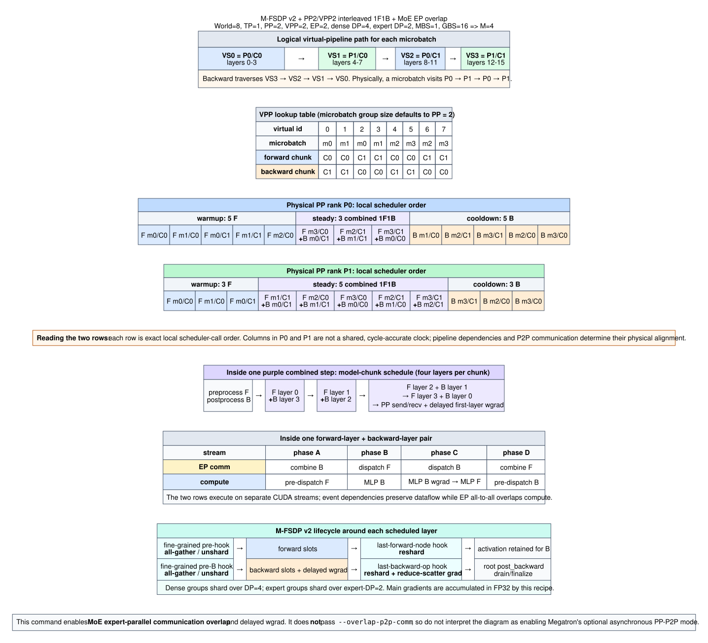

# M-FSDP v2 + VPP2 + interleaved 1F1B schedule

This diagram is derived from `run_mfsdp_v2_vpp2_overlap_8xh100.sh` and the
current `jianbinc/mfsdp_v2_dev` scheduling implementation.



## Derived topology

| Item | Value |
|---|---:|
| World size | 8 |
| TP / PP / VPP / EP / CP / ETP | 1 / 2 / 2 / 2 / 1 / 1 |
| Dense data parallel size | 4 |
| Expert data parallel size | 2 |
| Microbatches per iteration per dense-DP replica | `GBS / (MBS * DP) = 16 / (1 * 4) = 4` |
| Transformer layers per virtual chunk | `16 / (PP * VPP) = 4` |

The script header's `DP=2` describes the expert-DP dimension, not the dense-DP
dimension used to derive the number of microbatches. Dense DP is 4.

The default `microbatch_group_size_per_vp_stage` is PP size 2, so the VPP
forward lookup is:

```text
virtual id:    0     1     2     3     4     5     6     7
microbatch:    m0    m1    m0    m1    m2    m3    m2    m3
forward:       C0    C0    C1    C1    C0    C0    C1    C1
backward:      C1    C1    C0    C0    C1    C1    C0    C0
```

## Pipeline phases

Warmup, steady state, and cooldown are native parts of Megatron's interleaved
VPP 1F1B schedule; they are not introduced by M-FSDP v2.

| Phase | Scheduled work | Pipeline state |
|---|---|---|
| Warmup | Forward only | Fills the pipeline and accumulates activations needed by backward. Earlier PP ranks require more warmup work. |
| Steady 1F1B | A new forward plus an older backward | Keeps the activation queue roughly stable and provides the main high-throughput region. |
| Cooldown | Backward only | Drains the remaining activations after all forwards have been launched. |

These phases are local to each physical PP rank, so their columns are not a
shared wall-clock axis. VPP reduces the fill/drain bubble by interleaving model
chunks, but it does not eliminate the warmup or cooldown phases.

Because `--overlap-moe-expert-parallel-comm` is enabled, the interleaved
scheduler adds one extra forward warmup operation. This makes every steady
1F1B pair's forward and backward computations independent. The added warmup
forward also produces one additional cooldown backward and one fewer steady
pair:

- P0: 5 warmup forwards, 3 combined 1F1B calls, 5 cooldown backwards.
- P1: 3 warmup forwards, 5 combined 1F1B calls, 3 cooldown backwards.

The two physical-rank rows in the SVG show exact *local scheduler order*.
Their columns are not a common wall-clock axis. A cycle-accurate trace would
also need measured kernel and collective durations plus P2P dependency timing.

## What overlaps

There are two nesting levels:

1. The VPP scheduler pairs a new forward model chunk with an older backward
   model chunk during steady state.
2. Within that pair, the model-chunk schedule pairs forward layers in ascending
   order with backward layers in descending order. Each layer pair overlaps MoE
   dispatch/combine communication with attention/MLP computation on separate
   CUDA streams.

The command does not include `--overlap-p2p-comm`. It therefore uses
interleaved 1F1B and fine-grained EP overlap, but not Megatron's optional
asynchronous PP-P2P mode.

## M-FSDP v2 boundary

The fine-grained schedule calls transformer submodules directly, so M-FSDP v2
uses fine-grained hooks to unshard parameters before forward/backward compute.
The last forward node reshards the layer. With delayed wgrad, the explicit
post-backward release runs only after the delayed weight-gradient work; it then
reshards parameters and starts gradient reduction. The root `post_backward`
drains and finalizes pending work.

Dense parameter groups use DP=4, while expert parameter groups use expert-DP=2.
This recipe requests FP32 M-FSDP main gradients.

## Sources in the current checkout

- `megatron/core/pipeline_parallel/schedules.py`: VPP lookup, warmup/steady/cooldown, and combined-call selection.
- `megatron/core/pipeline_parallel/combined_1f1b.py`: combined forward/backward entry and M-FSDP callbacks.
- `megatron/core/models/common/model_chunk_schedule_plan.py`: chunk-level and layer-level stream schedule.
- `megatron/core/distributed/fsdp/mcore_fsdp_adapter.py`: M-FSDP v2 combined-1F1B interface.
- `megatron/core/distributed/fsdp/src/megatron_fsdp/experimental/module.py`: fine-grained unshard and release/reduction lifecycle.

The editable graph source is `mfsdp_v2_vpp2_1f1b_schedule.dot`.
