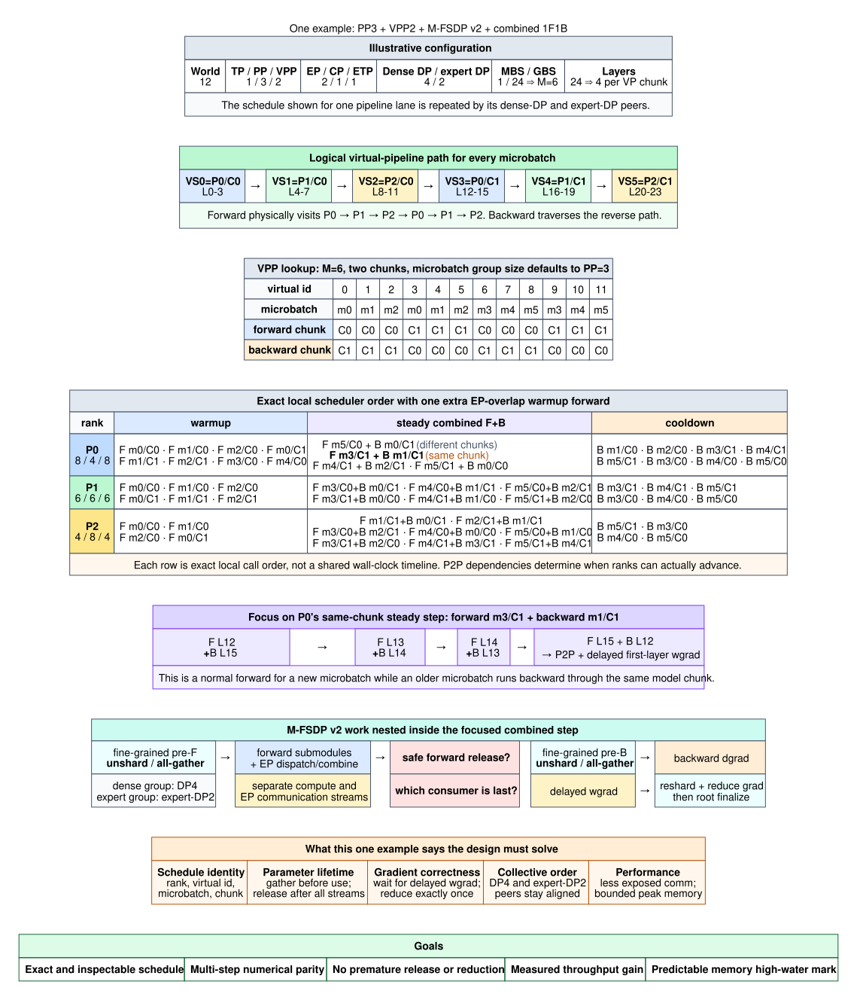

# VPP + M-FSDP v2 + Combined 1F1B Design

**Status:** Concept proposal for discussion — not an implementation
specification.

**Audience:** Distributed-training developers familiar with pipeline, expert,
context, and data parallelism.

## Executive summary

VPP and combined 1F1B determine which forward and backward work can run on a
rank. M-FSDP v2 must then make parameters ready for that actual execution path.
At the same time, EP, CP, PP, and FSDP communication compete for the same GPU
and network resources. Optimizing any one domain in isolation can expose or
delay another domain's critical communication.

This document proposes two cooperating abstractions:

1. A per-root `FsdpExecutionRunner` records forward/backward parameter demand,
   compiles a reusable parameter-lifetime plan, and guides unshard, prefetch,
   reuse, and reshard decisions.
2. A rank-local `CommunicationCoordinator` observes communication requests
   from EP, CP, PP, and FSDP and provides a safe place to make bounded,
   cross-domain admission decisions.

The outer VPP/1F1B scheduler remains the semantic authority. The coordinator
does not invent compute order, dynamically reorder a communicator, or begin as
a universal network scheduler. The first useful policy is much narrower:
observe all domains, then delay or suppress only speculative FSDP work when it
would compete with communication required by current compute.

The questions for review are whether this ownership split is correct, whether
the proposed observation boundary is sufficient, and which scheduling policy
is safe and valuable enough to implement first.

Two correctness problems are explicitly on the design agenda but are not yet
resolved here: activation recomputation must be represented in the learned
FSDP execution path, and any active communication policy must come with a
distributed progress and deadlock-avoidance argument.

## 1. Why subsystem-local scheduling is no longer enough

Combined 1F1B advances forward and backward through different microbatches and
often different model chunks. The runtime path is occurrence-based rather than
a single traversal of the module tree.

The production-shaped DSv4 Pro example contains this P2/C1 transition:

```text
F L55 + B L57
F L56 + B L56       # same FSDP unit, different microbatches
F L57 + B L55
```

The center operation may need two parameter representations for L56 while
also executing EP dispatch/combine and endpoint PP work. If CP is enabled, its
attention communication becomes another competing domain. Around chunk
boundaries, PP sends/receives add further readiness constraints.



This exposes three coupled decisions:

- **Readiness:** which current or next parameter representation must be
  gathered before compute blocks?
- **Residency:** which full parameter may remain resident for a near reuse,
  and which must be released to respect memory?
- **Communication pressure:** will another gather or reduction overlap useful
  compute, or contend with critical EP, CP, or PP communication?

Separate CUDA streams make concurrency possible, but they do not isolate
communicators, links, copy engines, SM resources, launch capacity, or memory.
The design therefore needs semantic path knowledge and cross-domain visibility;
neither one is sufficient alone.

## 2. Design thesis and ownership

```text
                 VPP / combined 1F1B scheduler
                    semantic order and dependencies
                                |
                    CombinedStep / ScheduleStep
                                |
       +----------------+-------+-------+----------------+
       |                |               |                |
      EP               CP              PP       FsdpExecutionRunner
       |                |               |          per FSDP root
       +----------------+-------+-------+----------------+
                                |
                    CommunicationRequest
                                |
                                v
                   CommunicationCoordinator
                    observe, account, admit
                                |
             fixed adapter-owned communicators/streams
```

| Component | Responsibility |
|---|---|
| VPP/1F1B scheduler | Defines forward/backward pairing, phase, chunk/microbatch order, and PP matching |
| Combined-step executor | Defines the intra-step dependency graph and completion fences |
| `FsdpExecutionRunner` | Learns parameter demand and proposes legal parameter actions |
| EP/CP/PP/FSDP adapters | Construct operations, bind communicator/stream, preserve buffers, report completion |
| `CommunicationCoordinator` | Provides rank-wide visibility, resource accounting, and bounded admission |

The runner belongs to an FSDP root because parameter lifetime is an FSDP
concern. The coordinator is shared by the schedule/device runtime because
multiple FSDP roots and non-FSDP domains compete for the same rank resources.
Process groups are passed explicitly rather than rediscovered through new
global lookups.

## 3. FSDP execution path

The current static notion of “next module” cannot represent repeated module
uses, opposing forward/backward traversal, two roots, or an unequal tail. The
runner replaces that assumption with an observed execution path.

### 3.1 Trace and compile

During the first global batch, record only semantic parameter demand:

```text
forward_path  = [(chunk, module, representation), ...]
backward_path = [(chunk, module, representation), ...]
```

Path position identifies an occurrence. The outer scheduler supplies the
forward/backward `ScheduleStep` pairing, so the compiler can reconstruct the
combined interleaving without putting EP, CP, or PP operations into the FSDP
trace.

At the batch boundary, compile an immutable plan that answers:

- what representation is required now;
- the next forward and backward parameter demands;
- whether a compatible full parameter should be kept or resharded; and
- which gather is a legal prefetch candidate.

For fine-grained use such as:

```text
L56.attn -> L56.moe -> L56.shared
```

the plan should produce one `ensure_unsharded(L56)` before the first consumer
and one release after the real last consumer, rather than repeating the
unshard/reshard cycle for every submodule.

### 3.2 Replay and fallback

From the second global batch, the runner validates each occurrence and follows
the compiled plan. It proposes prefetch/keep actions to the coordinator; if a
speculative residency or communication reservation is denied, the semantic
plan remains valid and the later consumer gathers on demand.

Reuse requires a compatible representation and parameter version. An optimizer
update invalidates resident full parameters but need not invalidate an
unchanged path. A schedule-signature change selects demand-only execution and
triggers retracing. An unexpected mid-batch mismatch must not independently
skip a collective; the conservative first implementation fails the step after
draining already committed work.

The runner is intentionally narrow: it optimizes the FSDP parameter lifecycle;
it does not become the EP/CP/PP scheduler.

### 3.3 Open problem: activation recomputation

Activation recomputation is part of the real backward execution path, not an
implementation detail outside this design. A recomputed forward may require
the same unsharded parameters as the original forward, while running at a
different schedule occurrence and under a different activation-memory state.
The trace and compiled plan must distinguish original forward, recomputed
forward, and backward parameter demand so that reuse and release decisions are
based on the actual last GPU consumer. This does not require a third top-level
path: recomputation demand can remain an annotated occurrence on the recorded
backward path.

The initial design discussion needs to settle:

- how recomputation occurrences appear on the backward path without turning
  it into a trace of every operator;
- when the plan may reuse a compatible full parameter across recompute and
  backward work; and
- which completion fence proves that a parameter can be resharded safely.

## 4. CommunicationCoordinator

The runner can identify useful FSDP work, but it cannot know whether the rank
is already busy with communication that is more urgent. The coordinator
provides that missing visibility.

Here, **capture** means recording logical communication intent at enqueue and
completion boundaries. It does not mean CUDA graph capture, and it does not
attempt to infer a dependency graph from profiler traces.

The coordinator observes requests from:

| Domain | Representative communication |
|---|---|
| EP | Token dispatch/combine all-to-all |
| CP | Attention communication, whose collective/P2P form depends on the CP implementation |
| PP | Activation and gradient P2P |
| FSDP parameter | Demand and speculative parameter all-gather |
| FSDP gradient | Reduce-scatter/all-reduce and final drain |

The current DSv4 working case assumes CP=1, but CP belongs in the contract so
the abstraction remains valid for CP-enabled target configurations.

A logical request needs enough information to reason safely:

```text
domain, actual communicator or P2P peer, communicator ordinal,
producer dependencies, bytes/memory effect, mandatory or speculative,
consumer deadline, fixed stream binding, completion object
```

The schedule/domain adapter assigns the communicator ordinal and fixed stream
binding. The coordinator preserves them; it does not dynamically migrate work
between streams or choose a different collective order from local timing.

### 4.1 Staged responsibility

The coordinator should evolve in measured steps:

1. **Observe:** record domain, communicator, ordinal, bytes, enqueue/completion,
   exposed wait, and managed memory without delaying operations.
2. **Expose lanes:** test explicit EP/PP lanes while retaining each FSDP root's
   existing all-gather and reduce-scatter streams.
3. **Control speculation:** admit FSDP prefetch only at compiled safe points and
   only when rank-wide residency and speculative-communication budgets allow.
4. **Broaden carefully:** consider reduction aging or additional cross-domain
   policies only after communicator ordering and multi-rank liveness are
   demonstrated.

Mandatory PP, current-layer EP/CP, and demand all-gather remain outside
rank-local gating initially. A generic `max_active_communications=1` semaphore
is unsafe because different ranks can admit different domains and wait on one
another.

### 4.2 Open problem: distributed progress and deadlock avoidance

EP, CP, PP, and FSDP use different, partially overlapping participant sets.
Even when every communicator preserves its own ordinal order, independent
rank-local admission decisions can create a wait cycle across communicators or
PP peers. Stream priority and request urgency do not establish distributed
progress.

Before the coordinator delays any mandatory operation or reorders operations
across domains, the design must define and review:

- which requests always have a progress path and therefore bypass admission;
- which decisions are identical for all participants and which require an
  explicit distributed agreement;
- how cross-communicator dependencies and PP peer matching are represented;
  and
- what invariants, diagnostics, and timeout evidence distinguish slow
  progress from an ordering bug.

The first active policy remains deliberately safer: the coordinator may deny
speculative FSDP prefetch, but it does not gate mandatory communication. Any
broader policy requires a multi-rank liveness argument and adversarial schedule
validation before it becomes part of the design.

## 5. Key design considerations

| Concern | Design position |
|---|---|
| Semantic ownership | The VPP/1F1B schedule is authoritative; coordinator decisions cannot reorder compute |
| Communicator order | All participants preserve a deterministic ordinal; PP peers match peer, direction, and sequence |
| Streams | Streams are fixed execution lanes, not resource isolation or scheduling policy |
| Progress | Mandatory work bypasses or reserves progress capacity; speculative work may be denied |
| Memory | Temporary communication buffers and resident full parameters use separate credits under one rank-wide budget |
| Lifetime | Adapters own `Work`, fences, and buffer release; the coordinator accounts but does not free storage |
| Activation recomputation | Treat recomputed forward as explicit parameter demand in the backward path; release after the actual final consumer |
| Phase awareness | Warmup, combined steady state, cooldown, and final drain have different useful overlap windows |
| Distributed liveness | Per-communicator ordering is necessary but insufficient; mandatory work retains a proven progress path |
| Failure | Boundary mismatch falls back to demand execution; backend errors are fail-stop, not locally cancellable |
| CUDA graphs | Request count, order, stream bindings, dependencies, and buffer addresses must be stable during replay |

Within-batch admission that affects a collective must be deterministic from
the semantic occurrence and communicator ordinal, or coordinated among the
exact participants. Rank-local queue length or completion timing cannot choose
collective order.

## 6. Performance questions and evidence

The architecture is motivated by hypotheses, not measured conclusions:

| Question | Evidence needed |
|---|---|
| Are EP/CP/PP/FSDP communications contending on the critical path? | Per-domain enqueue, completion, exposed wait, communicator, and stream timeline |
| Does path-guided reuse remove meaningful FSDP traffic? | Gather/release count and bytes, readiness wait, live-parameter bytes |
| Is the combined steady-state window large enough? | Warmup/steady/cooldown duration by PP rank and microbatch configuration |
| Does fine granularity cost more than it hides? | Collective sizes, launch/event/wait count, host gaps, iteration time |
| Does routed-token or stage imbalance erase overlap? | Tokens per expert, EP latency, PP wait, rank-idle median/p95 |

Use one model, sharding layout, precision, batch, recompute policy, and code
path for a 2 x 2 comparison:

1. Regular VPP 1F1B + demand-only M-FSDP.
2. Combined EP/1F1B + demand-only M-FSDP.
3. Regular VPP 1F1B + trace/compiled M-FSDP.
4. Combined EP/1F1B + trace/compiled M-FSDP.

Report first-batch trace/compile cost separately from optimized replay. A
policy succeeds only if replay median/p95 iteration time and final drain
improve within the peak-memory budget, with numerical parity and no liveness
regression.

## 7. Proposed path to implementation

### Phase 0 — contracts and observation

- Define schedule occurrence, parameter demand, communication intent, and
  completion contracts.
- Define how recomputation demand and cross-communicator dependencies appear
  in those contracts.
- Instrument EP, CP, PP, FSDP parameter, and FSDP gradient communication.
- Establish numerical, memory, communicator-order, and iteration-time
  baselines.

### Phase 1 — FSDP trace and replay

- Add the runner to each root `FsdpContext`.
- Record one global batch and compile next-use/reuse/reshard guidance.
- Validate repeated and recomputation occurrences, representation
  compatibility, optimizer invalidation, unequal paths, and demand-only
  fallback.

### Phase 2 — observe-only coordination

- Inject a shared coordinator without changing enqueue order.
- Measure overhead, confirm communicator/P2P order parity, and reconstruct the
  distributed wait graph from observations.
- Evaluate an EP/PP stream split as a separate flagged experiment.

### Phase 3 — one active policy

- Permit at most one speculative FSDP gather at deterministic, compiled safe
  points when the residency reservation fits.
- Compare against observe-only and demand-only baselines before adding another
  policy.

### Phase 4 — broader validation

- Test the center crossing, same-root/two-root traversal, unequal tail, final
  drain, endpoint, and PP wraparound cases.
- Run microbatch, VP-group, FSDP-unit, precision, CP, and token-skew sweeps.
- Validate supported proxies first; target HFSDP validation follows M-FSDP v2
  HSDP support.

## 8. Feedback requested

1. Is the split between a per-root FSDP runner and a shared rank coordinator
   the right ownership boundary?
2. Should the coordinator observe logical requests at adapter enqueue sites,
   or should the combined scheduler publish a richer dependency plan?
3. Which CP operations and implementation variants must be represented in the
   first communication-intent contract?
4. Is suppressing speculative FSDP prefetch the right first active policy?
5. What rank-wide memory and progress budgets are practical to expose without
   coupling the coordinator to allocator or backend internals?
6. What is the smallest recomputation-aware execution-path representation that
   still identifies the true last parameter consumer?
7. What progress invariants must be proven before the coordinator can gate any
   communication beyond speculative FSDP prefetch?

## Appendix A. DSv4 Pro working case

The case is production-shaped, not an already demonstrated end-to-end recipe.
The target has 61 transformer layers, one MTP layer, PP3/EP64, dense HFSDP
outer128 x inner8, and replicated expert parameters over expert-DP16. VPP2,
six microbatches, VP group size three, CP1, and one FSDP unit per layer are
working assumptions. Current M-FSDP v2 rejects HSDP in the runnable PP3 proxy.

The provisional six virtual stages are:

```text
P0/C0: embedding + L0-L9
P1/C0:             L10-L19
P2/C0:             L20-L29
P0/C1:             L30-L39
P1/C1:             L40-L50
P2/C1:             L51-L60 + MTP + loss
```

The layout is not assumed compute-balanced; embedding, MTP/loss,
hybrid-attention mix, and token routing can change stage time.

### Warmup formula

For the current interleaved Megatron schedule:

```text
P = physical pipeline size       r = physical pipeline rank
C = model chunks per rank        M = data microbatches
G = microbatch group per VP      E = 1 for combined EP overlap, else 0

T   = M * C
W_r = min(T, 2 * (P - r - 1) + (C - 1) * G + E)
```

For `P=3`, `C=2`, `M=6`, `G=3`, and `E=1`, `T=12`:

| Rank | Warmup | Combined pairs | Cooldown |
|---|---:|---:|---:|
| P0 | 8 | 4 | 8 |
| P1 | 6 | 6 | 6 |
| P2 | 4 | 8 | 4 |

These are virtual forward operations, not distinct data microbatches. Without
the extra EP-overlap forward, warmup is `7/5/3`. For non-interleaved PP it is
`min(M, P-r-1)`.

## Appendix B. Scenario checklist

| Case | Design pressure |
|---|---|
| R3 center crossing | Same FSDP unit in forward/backward, endpoint semantics, heterogeneous MTP pairing |
| R1 same-root traversal | Opposing directions and near parameter reuse |
| R1 two-root traversal | Shared rank-wide communication and residency budgets |
| R2 unequal tail | One direction continues after the paired path ends |
| R4 final drain | Delayed wgrad, gradient reductions, and optimizer finalization without forward cover |

## Supporting documents

- [DSv4 Pro PP3/VPP2 scheduling scenarios](dsv4_pro_pp3_vpp2_scheduling_scenarios.md)
- [Compute and communication scheduling scenarios](vpp_mfsdp_compute_communication_scenarios.md)
- [Performance investigation](vpp_mfsdp_performance_investigation.md) — issue
  history incorporated here
- [M-FSDP v2 VPP2 1F1B schedule](mfsdp_v2_vpp2_1f1b_schedule.md)
