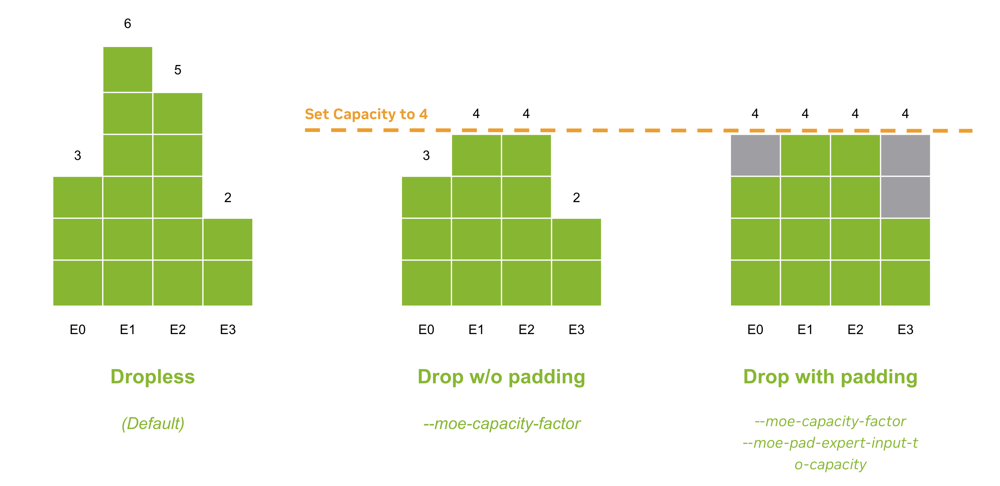

# Megatron Core MoE Key Features

Megatron-Core offers rich parallelism mappings, combining Expert Parallelism with tensor, data, sequence, and pipeline parallelism. This boosts Mixtral 8X7B bf16 training to achieve **438 TFLOPS** as of MCore v0.8.


### Parallelism
- **Expert Parallelism**
    - A specific method of parallelism for MoE models, where experts are partitioned onto different workers and each worker processes a different batch of training samples, each worker process one or more experts for each MoE layer.
- **3D Parallelism**: Data Parallelism, Tensor Parallelism, Pipeline Parallelism
    - Note: When using MoE with expert parallelism and tensor parallelism, sequence parallelism must be enabled.
- **Context Parallelism**:
    - Split the sequence dimension to support long context training.
- **Richer parallel mappings**: EP can be combined with DP/TP/PP/CP for handling larger MoE variants.
- **Full distributed optimizer support.**

### Router and Load Balancing
- Router type:
    - Top-K MLP router
- Load Balancing algorithms:
    - Sinkhorn (S-BASE)
    - Aux loss / Load balancing loss

### Performance Optimizations
- GroupedGEMM when num local experts > 1
    - Supported dtype: bf16
    - Performance improvements for larger MoE models
- Enable `--tp-comm-overlap` for MoE

### Token Dispatch Mechanism
- Dropless / No token drop
- Token drop, with or without padding to capacity

### Ease of use
- Checkpoint converter for Mixtral models, see the [example](https://github.com/NVIDIA/Megatron-LM/tree/main/examples/mixtral) for details.
- Distributed checkpoining
- Per-layer logging

## Upcoming features
- Token permutation / unpermutation fusion
- Fused Sinkhorn Kernel
- FP8 training support

# User Guide

### MoE Related Arguments

| Item | Description |
| --- | --- |
| --num-experts | Number of Experts in MoE (None means no MoE) |
| --expert-model-parallel-size | Degree of expert model parallelism. Default is 1. |
| --moe-grouped-gemm | When there are multiple experts per rank, launch multiple local GEMM kernels in multiple streams to improve the utilization and performance with GroupedLinear in TransformerEngine. |
| --moe-router-load-balancing-type | Determines the load balancing strategy for the router. "aux_loss" corresponds to the load balancing loss used in GShard and SwitchTransformer, "sinkhorn" corresponds to the balancing algorithm used in S-BASE, and "none" implies no load balancing. The default is "aux_loss". |
| --moe-router-topk | Number of experts to route to for each token. The default is 2. |  
| --moe-aux-loss-coeff | Scaling coefficient for the aux loss: a starting value of 1e-2 is recommended. Default is 0.0. |
| --moe-z-loss-coeff | Scaling coefficient for the z-loss: a starting value of 1e-3 is recommended. Default is None. |
| --moe-input-jitter-eps | Add noise to the input tensor by applying jitter with a specified epsilon value. Default is None. |
| --moe-token-dispatcher-type | Determines the token dispatcher type. Choices are "allgather" and "alltoall". Default is "allgather". |
| --moe-per-layer-logging | Enable per-layer logging for MoE, currently supports auxiliary loss and z loss. |
| --moe-expert-capacity-factor | The capacity factor for each expert, None means no token will be dropped. Default is None. |
| --moe-pad-expert-input-to-capacity | Pads the input for each expert to match the expert capacity length, effective only after the --moe-expert-capacity-factor is set. |
| --moe-token-drop-policy | The policy to drop tokens. Can be either "probs" or "position". If "probs", the tokens with the lowest probabilities will be dropped. If "position", tokens at the end of each batch will be dropped. |
| --moe-layer-recompute | Enable activation checkpointing for moe_layer, should be used when memory is not sufficient. |
| --moe-extended-tp | (Experimental) Alternative parallelization strategy for expert parallelism. Instead of distributing experts across *expert_model_parallel_size*, each expert is sharded along extendended tensor parallel domain (tensor_model_paralle_size * expert_model_parallel_size). It avoids the load balancing problem with MOE training. Only avaiable with `--moe-token-dispatcher-type allgather`. |


## Usage

### Quick Start
To train a top-2 MoE model with 8 experts and auxiliary loss, include the following arguments:

```bash
--num-experts 8
--expert-model-parallel-size 8
--moe-grouped-gemm
--moe-router-load-balancing-type aux_loss # options: aux_loss, sinkhorn, none. Default is aux_loss.
--moe-router-topk 2
--moe-aux-loss-coeff 1e-2
--use-distributed-optimizer
--moe-token-dispatcher-type alltoall
```

To enable the token drop mechanism, such as GShard and SwitchTransformer, include the following arguments:

```bash
--moe-expert-capacity-factor 1.0
--moe-pad-expert-input-to-capacity # Optional
```

The following figure illustrates differenting dropping strategies in MCore:


1. The default dropless strategy will not drop or pad any token.
2. By setting `--moe-expert-capacity-factor`, the tokens exceed the capcacity of expert will be dropped based on their selected probabilities. 
   The dropping is performed before the token exchange operation between EP ranks when EP > 1. 
   The formula of capacity is `capacity = num_tokens_per_rank * topk * capacity_factor / num_experts`.
3. By setting `--moe-pad-expert-input-to-capacity`, the experts with tokens less than capacity will be padded to the capacity.

### Fine-tuning Mixtral Models
Megatron-Core has full support for Mixtral MoE models, and we provide the checkpoint converter for Mixtral models from huggingface format to MCore format. 
See more details in the [mixtral example](../../../../examples/mixtral/README.md).

### Distributed Checkpointing
MCore v0.7 introduced fully parallel and asynchronous saving capabilities to distributed checkpointing, 
which addresses the issues of low efficiency in the traditional checkpoint saving methods. 
It also solved the problem of incompatibility between checkpoints of differnt parallel mappings in the traditional format.
With the new distributed checkpointing solution, MCore can achieve flexible parallelism configurations by saving and loading the unified format checkpoints.
Compared to native PyTorch solution, MCore achieves up to 50x reduction in checkpointing overhead.

With MCore v0.8, MoE supports Distributed Checkpointing, which means users can save and load with any combination of parallelism and it is currently available, including expert parallel.
1. Loading weight and distributed optimizer states with TPxPPxEP resharding is supported in version 0.8.
2. GroupedMLP is also supported, including the ability to switch between GroupedMLP/SequentialMLP when loading and saving.
    - When switching between GroupedMLP and SequentialMLP, loading distributed optimizer states is currently unsupported; this feature will be added in version 0.9.
Besides these limitations, Distributed Checkpointing is fully functional.

Usage
- `--use-dist-ckpt` The main argument, it will attempt to save and load using distributed checkpointing.
- `--auto-detect-ckpt-format` With this, it can load both distributed checkpointing and legacy checkpointing.

## Dropless MoE training script example:
<details>
<summary>Click here. </summary>

```bash
#!/bin/bash

# Runs Mixtral 8x7B model on 32 H100/A100 GPUs
# The Dropless MoE suffers from an imbalanced token distribution at the early stage of training (the first few hundred iterations), which may lead to poor performance and out-of-memory (OOM) issues.
# To check the performance of a Dropless MoE model, we should run the model for at least 500 iterations or resume from trained checkpoints.

export CUDA_DEVICE_MAX_CONNECTIONS=1

GPUS_PER_NODE=8
# Change for multinode config
MASTER_ADDR=${MASTER_ADDR:-"localhost"}
MASTER_PORT=${MASTER_PORT:-"6000"}
NNODES=${NNODES:-"1"}
NODE_RANK=${RANK:-"0"}
WORLD_SIZE=$(($GPUS_PER_NODE*$NNODES))

CHECKPOINT_PATH=$1
TOKENIZER_MODEL=$2
DATA_PATH=$3

DISTRIBUTED_ARGS=(
    --nproc_per_node $GPUS_PER_NODE
    --nnodes $NNODES
    --node_rank $NODE_RANK
    --master_addr $MASTER_ADDR
    --master_port $MASTER_PORT
)

MODEL_ARGS=(
    --disable-bias-linear
    --seq-length 4096
    --max-position-embeddings 32768
    --num-layers 32
    --hidden-size 4096
    --ffn-hidden-size 14336
    --num-attention-heads 32
    --init-method-std 0.01
    --attention-dropout 0.0
    --hidden-dropout 0.0
    --normalization RMSNorm
    --position-embedding-type rope
    --swiglu
    --untie-embeddings-and-output-weights
    --group-query-attention
    --num-query-groups 8
    --no-masked-softmax-fusion
    --no-position-embedding
)

MOE_ARGS=(
    --num-experts 8
    --expert-model-parallel-size 8
    --moe-router-load-balancing-type aux_loss # options: aux_loss, sinkhorn, None. Default is aux_loss.
    --moe-router-topk 2
    --moe-aux-loss-coeff 1e-2
    --moe-grouped-gemm
)

DATA_ARGS=(
    --tokenizer-type Llama2Tokenizer
    --tokenizer-model ${TOKENIZER_MODEL}
    --data-path $DATA_PATH
    --split 99990,8,2
)

TRAINING_ARGS=(
    --micro-batch-size 1
    --global-batch-size 128
    --lr 1e-4
    --train-iters 500000
    --lr-decay-iters 320000
    --lr-decay-style cosine
    --min-lr 1.0e-5
    --weight-decay 0.1
    --lr-warmup-iters 500
    --clip-grad 1.0
    --bf16
    --overlap-grad-reduce
    --overlap-param-gather
)

MODEL_PARALLEL_ARGS=(
    --tensor-model-parallel-size 2
    --pipeline-model-parallel-size 1
    --sequence-parallel
    --use-distributed-optimizer
)

LOGGING_ARGS=(
    --log-interval 1 \
    --save-interval 10000 \
    --eval-interval 1000 \
    --eval-iters 10 \
    --save $CHECKPOINT_PATH \
    --load $CHECKPOINT_PATH \
    --tensorboard-dir "${CHECKPOINT_PATH}/tensorboard" \
    --no-load-optim \
    --no-load-rng
)

if [ -n "${WANDB_API_KEY}" ]; then
    LOGGING_ARGS+=(
        --wandb-project ${WANDB_PROJECT:-"Mixtral-Finetuning"}
        --wandb-exp-name ${WANDB_NAME:-"Mixtral_8x7B"} 
    )
fi

torchrun ${DISTRIBUTED_ARGS[@]} pretrain_gpt.py \
    ${MODEL_ARGS[@]} \
    ${MOE_ARGS[@]} \
    ${DATA_ARGS[@]} \
    ${TRAINING_ARGS[@]} \
    ${MODEL_PARALLEL_ARGS[@]} \
    ${LOGGING_ARGS[@]}
```
</details>

# Performance Best Practice

### Tuning Guide of Paralell Mappings

To find a good parallel mapping that help you achieve a high throughput of a new model, there are some general rule that could help. Here is an overview of properties in different aspects for each parallel strategy.

| Parallel Strategy | Peak Activation Memory          | Weight Memory  | Optimizer states                  | Communication (Per-Layer) |
|:-----------------:|:-------------------------------:|:--------------:|:---------------------------------:|:-------------------------:|
| TP                | 1/N (with SP on)                | 1/N            | 1/N                               |        High               |
| EP                | 1                               | 1/N in MoELayer| 1/N                               |       Medium              |
| PP                | 1 (>1 with virtual pipeline)    | 1/N            | 1/N                               |       Medium              |
| CP                | 1/N                             | 1              | 1/N (with distributed optimizer)  |       Medium              |
| DP                | 1                               | 1              | 1/N (with distributed optimizer)  |        Low                |

For a specific model, the best parallel mapping varies based on the model architecture, trained sequence length and the hardware platform.
Here we provide some general rules to get better performance:
1. Keep the model parallism size as small as possible. 
    - For the large language models, model parallism is often required to prevent OOM, but it will bring communication overhead and hurt performance. 
    - With distributed optimizer, master weights and optimizer states will be sharded across all DP ranks with slight communication overhead.
    So try to reduce the model parallism size and increase data parallism size when there are lots of free GPU memory during training.
2. Ensure the EPxTP communication winthin the NVLink domain.
    - Communications of EP and TP should remain within the NVLink domain as much as possible, as both are communication-intensive.
    - If the model is too large and requires scaling across multiple nodes, consider PP before TP and EP. See item 3 for details.
3. Use Pipeline Parallelism to scale the model further.
    - Enable Virtual Pipeline Parallelism(VPP) to reduce pp bubbles when PP_size >= 2 by setting `num_layers_per_virtual_pipeline_stage`.
    - VPP_size tuning: the legal values of vpp_size are all common divisors of num_layers/pp_size, E.g., num_layers=24, pp_size=4, then we can pick vpp_size from {1, 2, 3, 6}. The larger the vpp_size, the lower the pipeline bubbles, while the larger number of P2P communications between each PP stages. Empirically a value in the middle often gives the best trade-off. `VPP_size=num_layers / PP_size / num_layers_per_virtual_pipeline_stage`
4. Prefer EP over TP for the expert layer when possible:
    - TP saves more memory than EP, but EP can achieve better GEMM efficiency and less communication overhead than TP.
    - If EP size increased to the number of expert, the local token permutation/un-permutation for experts computation are omitted.
    - Simplify the computation graph of moe layers, more convenient for performing potential comm-computation overlapping.
    - In practice, EP8TP1 is better than EP4TP2 for 8x7B.
5. Enable Context Parallelism for long context training.
    - The efficiency of CP largely depends on whether its communication can be overlapped with computation. 
    - Emperically, use CP when sequence length >= 8K.


### End-to-End Training Practice
**Use the latest NVIDIA PyTorch or NeMo Docker Image**
- [NGC PyTorch Image](https://catalog.ngc.nvidia.com/orgs/nvidia/containers/pytorch)
- [NGC NeMo Image](https://catalog.ngc.nvidia.com/orgs/nvidia/containers/nemo)

**OOM Caused by Token Distribution Imbalance when Training From Scratch**  
MoE suffers from a severe load imbalance issue when the router is under-trained, leading to the model easily running out of memory (OOM), which typically occurs in the first 100~300 steps when training from scratch. 
Therefore, there are two recommended ways during the first 200 steps to avoid the OOM problem, which can be removed after the token distribution is more stable:
1. Use Extended-TP(`-moe-extended-tp`) to replace EP with TP in MoELayer, this can prevent the load imbalancing between EP ranks. Since current ETP implementation has some memeory overhead, you can further enable activation recomputation only for MoE Layer by adding `--moe-layer-recompute`.
2. Setting capacity factor to a relatively small number like 1.0 by adding `--moe-token-capacity-factor 1.0`.

**Enable Communication Overlap**
- Enable `--overlap-param-gather` and `--overlap-grad-reduce` with distributed optimizer.
- Enable `--tp-comm-overlap` when TP>1.
- Enable p2p comm overlap when PP > 1 by setting `num_layers_per_virtual_pipeline_stage`.

**Enable GroupedGEMM when num_local_experts>1 with `--moe-grouped-gemm`**
- GroupedGEMM has higher efficiency than vanilla sequential GEMMs for each expert.
- Recommend to use the TE version of Grouped GEMM (by upgrading to MCore v0.8 and TE v1.9), which support Gradient Accumulation Fusion and FP8 Training.

### Reference Best Parallel Mapping

Here are the reference parallel mappings of MCore v0.8 for Mixtral 8x7B and 8x22B models:
|        Model            | Vocab Size| Dispatcher | Precision | #GPUs | SEQ LEN | TP | EP | PP | VP | MBS | GBS |
|:-----------------------:|:---------:|:----------:|:---------:|:-----:|:-------:|:--:|:--:|:--:|:--:|:---:|:---:|
| Mixtral 8x7B(Dropless)  |   32K     | All-to-All | BF16      | 64    | 4096    | 1  | 8  | 4  | 8  | 1   | 256 |
| Mixtral 8x22B(Dropless) |   32K     | All-to-All | BF16      | 128   | 4096    | 4  | 2  | 8  | 7  | 1   | 256 |

Detailed Benchmark Information:  
Server:
- 8xH100 80GB HBM3 
- NVLink 4th Generation
- InfiniBand 8x400 Gbit/s

Docker Image:
- PyTorch 24.04 with TransformerEngine v1.9