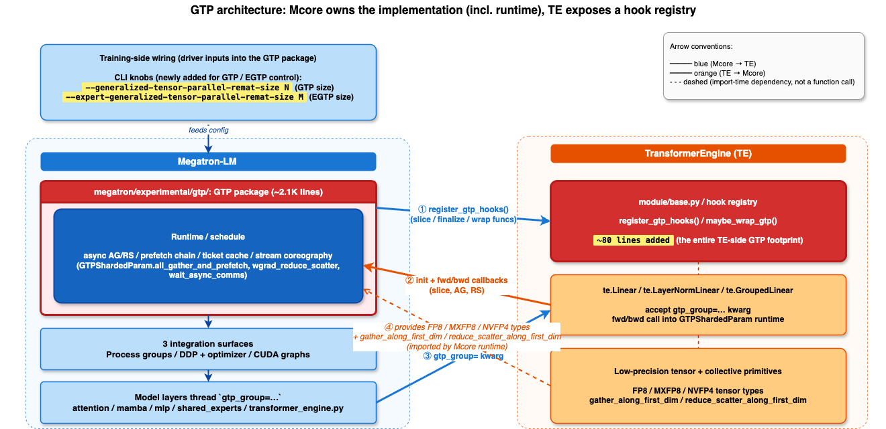
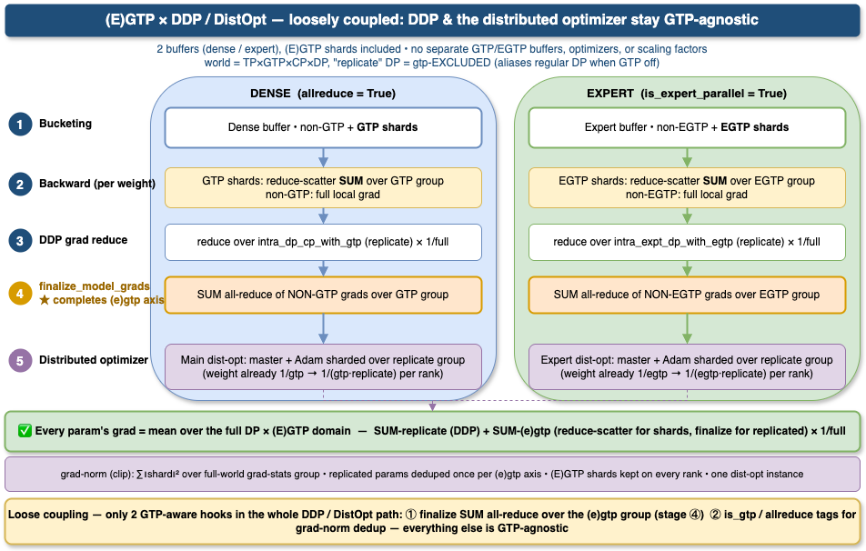

# Generalized Tensor Parallelism (GTP)

> ⚠️ **Experimental.** GTP is an experimental feature and its API, configuration, and behavior may change in future versions without notice.

**At a glance.** GTP shards every linear weight 1/N along `out_features` across a dedicated GTP process group. The full weight is rematerialized on the fly via an asynchronous all-gather that overlaps with the previous layer's compute on every forward AND backward pass; the wgrad is reduce-scattered the same way on the way back. Effective per-GPU weight memory shrinks by `1/N`, and the design composes orthogonally with TP / SP / EP / DDP / CUDA Graphs.

**Scope**: a high-level summary of GTP — design intent, public CLI surface, and Megatron-LM ↔ TransformerEngine integration touchpoints.

Core implementation: `megatron/experimental/gtp/generalized_tensor_parallelism.py`. The public surface is re-exported from `megatron/experimental/gtp/__init__.py`. Low-precision tensor primitives (FP8 / MXFP8 / NVFP4) remain in TransformerEngine and are imported by `generalized_tensor_parallelism.py`.

**Outline:**

1. [Features](#1-features)
2. [Usage](#2-usage)
3. [Implementation details](#3-implementation-details)
   - 3.1 [GTP architecture (Mcore ↔ TE integration)](#31-gtp-architecture-mcore--te-integration)
   - 3.2 [DDP buckets with (E)GTP](#32-ddp-buckets-with-egtp)

---

## 1. Features

### 1.1 Fine-grained, per-weight materialization & gradient reduction

Each weight is sharded 1/N across a GTP group along `out_features`, stored as a `GTPShardedParam` subclass of `nn.Parameter`. Materialization and gradient reduction are both **per-weight, per-call** — not per-model or per-module:

- **Independent state per param**: each has its own AG state (`state`) and RS state (`rs_state`) machines, both cycling `NONE → ASYNC_WAIT → DATA_READY → NONE` and tracked separately so fwd and bwd async ops don't interfere.
- **Prefetch chain for AG** (doubly-linked `prev_w` / `next_w`): during fwd, each weight's `all_gather_and_prefetch` issues async AG for `next_w`; during bwd, `all_gather_and_prefetch_bwd` issues async AG for `prev_w`. Layer *i*'s AG overlaps with layer *i−1*'s GEMM. For an L-layer model, L−1 all-gathers are fully hidden behind compute. When activation recompute is enabled, a **third** chain prefetches the recompute-forward gathers during backward — see §3.1 *Recompute-forward prefetch chain*.
- **Deferred RS finalize for wgrad**: `wgrad_reduce_scatter` on param *i* launches an **async** reduce-scatter (handle stashed in `_wgrad_rs_handle`) and returns `None` to autograd — the wgrad is NOT finalized into `main_grad` yet. Finalization is **deferred one step**: the next bwd step (param *i−1*'s `wgrad_reduce_scatter`) calls `self.next_w._wait_reduce_scatter()` + `_finalize_wgrad()`, which waits on the stashed handle, accumulates the reduced wgrad into `main_grad`, and fires the DDP `register_grad_ready` hook. The chain's head (first-in-fwd, last-in-bwd) uses a synchronous RS since nothing follows it. This one-step deferral is what lets layer *i*'s RS overlap with layer *i−1*'s bwd GEMMs.
- **Cold start only**: every weight's very first AG is synchronous (`DATA_READY_SYNC`, no prefetch has run yet); the async prefetch chain kicks in from the second forward onward.

Contrast with FSDP: FSDP gathers at module-group granularity in full precision with PyTorch-managed lifecycle. GTP works at individual-weight granularity, in quantized form, with its own explicit ticket-based buffer pool and a one-step-deferred RS finalizer.

> **FSDP can't shrink into GTP because FSDP's overlap is bucket-grained by design** — bucket granularity exists *to avoid* paying NCCL launch latency on tiny params (LayerNorm γ/β, biases, Mamba `dt_bias`/`D`/`A_log`) and *to avoid* the per-weight scheduling state that GTP relies on (per-param prefetch chain, ticket-based buffer cache, stream choreography). Removing buckets doesn't make FSDP faster; it makes FSDP into GTP, with all the engineering that entails — selective wrapping (only large GEMM weights), per-weight prefetch chain, per-param buffer ticket, and explicit AG/RS stream choreography on a side stream so external drains have something meaningful to wait on.

### 1.2 CUDA graph compatibility

CG compatibility is designed-in from day one, not retrofitted. The entire sync / buffer / chain architecture is shaped around making **captured fwd/bwd replays produce identical bit-for-bit behavior** — without the usual capture-vs-eager pitfalls that force other weight-sharding schemes to either disable CG or require special handling.

- **Two chains, never cross-linked** (`GTPChain.GRAPHED` / `GTPChain.UNGRAPHED`). `prev_w` / `next_w` only connect same-chain params, so a captured traversal never reaches into eager Python and vice-versa.
- **`torch.cuda.Event(external=True)`** for `ag_event` / `rs_event` — the events survive CG capture boundaries and can be waited on from replay-time streams.
- **Idempotent ticket cache**: `GTPWeightCache.get(ticket)` keeps `slot.buf` set even after `release()`, so replays read the same buffer address as capture. `clear()` drops buffers while keeping tickets valid → supports CG re-capture with lazy re-allocation.
- **Allocate-in-pool at creation** (`set_cuda_graph_mempool` + `_graphed_alloc`): GRAPHED-chain AG/RS buffers and quantized weight storage are allocated **directly into the CG memory pool** at first creation (during warmup, before capture), so no CUDA allocations happen inside the captured graph — and no post-hoc reallocation/clone is needed. UNGRAPHED buffers stay in regular allocator memory.
- **Lazy, one-shot chain linking**: `prefetch_initialized` is flipped during the first fwd (warmup), so the chain-construction Python side-effects never execute inside a captured graph. The link table is buffered and flushed atomically at the second forward.
- **DDP hook manual triggering**: `register_grad_accum_hook` stores the DDP hook on the param; `_CudagraphReplayNode.backward` calls it manually after replay (since `AccumulateGrad` hooks are silenced by replay). This is also how the `assert self.grad_reduce_handle is not None` failure from partial-CG + overlap-grad-reduce is resolved.
- **Drains at CG / eager boundary**: `_drain_gtp_side_streams()` before eager MoE expert compute. Inside bwd capture, two-phase drain: Phase 1 joins the within-graph cascade and records `bwd_completion_event` (next runner unblocks); Phase 2 calls `wait_async_comms(GRAPHED)` to drain the chain-tail handle and re-joins side streams (queued after the event so it doesn't delay the next runner).
- **Side-stream registration**: the `(GRAPHED, gtp_group)` ag/rs streams are materialized at runner init (`_register_gtp_side_streams`) so they are captured before the first forward.

### 1.3 Low-precision quantize-then-gather

Wire bandwidth scales with the **quantized** size, not BF16 size — GTP composes with low-precision training rather than fighting it.

- **FP8 / MXFP8**: quantize kernel runs per microbatch on the local shard with no GTP-group amax reduction (FP8 amax allreduce is the standard DP-group one in `reduce_and_update_fp8_tensors`, unchanged by GTP). On subsequent microbatches, `skip_weight_cast=True` reuses the quantized buffer.
- **NVFP4** (4-bit, block-scaled): amax reduced across the GTP group before scaling so ranks share a consistent scale for the full weight; custom `_all_gather_nvfp4` handles rowwise + columnwise views and interleaved layout. Post-processing (re-assemble interleaved data, re-pad `scale_inv`, transition to `GEMM_READY`) is deferred into `_NVFP4AllGatherAsyncHandle.wait()` so it stays off the critical path.
- **Coalesced NCCL**: `grouped_gather_along_first_dim` uses `torch.distributed._coalescing_manager` to batch E experts' AGs into a single NCCL op. `BatchedNVFP4AllGatherAsyncHandle` wraps per-expert post-processing.
- **Padding**: at construction the **full tensor** is padded along dim0 to a multiple of `pad_for_alignment × gtp_size`, then sharded equally across the group. After all-gather, the padding ends up contiguous at the tail, so stripping is a single trailing slice (`tensor[:-pad_length]`) — no per-shard reshuffle, and the design naturally supports `pad_length` large enough to span multiple ranks' shards when the unpadded dim0 is small.

#### Per-microbatch schedule

```
Steady-state fwd (NVFP4):
    default: ──GEMM(W_0)──quant+amax(W_1)──GEMM(W_1)──quant+amax(W_2)──GEMM(W_2)──...
    ag_str:                       [AG_issue W_1]            [AG_issue W_2]

Steady-state fwd (FP8 / MXFP8):
    default: ──GEMM(W_0)────quant(W_1)─────GEMM(W_1)────quant(W_2)─────GEMM(W_2)──...
    ag_str:                       [AG_issue W_1]            [AG_issue W_2]
                              (no GTP-group amax allreduce)

Steady-state bwd (all recipes):
    default: ──bwd GEMMs(W_i)──...
    ag_str:               [AG_issue W_{i-1}]
                          (bwd reuses fwd's quantized buffer; no quant, no amax)
```

quant+amax run sequentially with surrounding compute on the default stream; only the `dist.all_gather` issue is wrapped in `with torch.cuda.stream(ag_stream)`. The NCCL kernel runs on c10d's private ncclStream and overlaps with the next GEMM until it reaches its wait.

For NVFP4 the per-microbatch prefetch cost is **two** NCCL ops on the GTP ncclStream (amax allreduce + AG) serialized on the same communicator. FP8 and MXFP8 incur only the AG; their standard DP-group amax allreduce in `reduce_and_update_fp8_tensors` is unchanged by GTP. BF16 skips quant entirely.

#### Communication volume breakdown

Per-microbatch per-weight comm budget (assuming bf16 wgrad reduce-scatter):

| Format | Block | Data B/elem | Scale_inv B/elem | Per-elem | Fwd AR(amax)                   | Fwd AG | Bwd AG | Wgrad RS (bf16) | Total B/elem | vs BF16        |
|--------|-------|-------------|------------------|----------|--------------------------------|--------|--------|-----------------|--------------|----------------|
| BF16   | n/a   | 2.0000      | —                | 2.0000   | —                              | 2.0000 | 2.0000 | 2.0000          | 6.0000       | 1.00× (baseline) |
| MXFP8  | 32    | 1.0000      | 1/32 = 0.0313    | 1.0313   | — (microscale, no global amax) | 1.0313 | 1.0313 | 2.0000          | 4.0626       | 0.68× (–32%)   |
| NVFP4  | 16    | 0.5000      | 1/16 = 0.0625    | 0.5625   | ≈0 in volume (latency-bound)   | 0.5625 | 0.5625 | 2.0000          | 3.1250       | 0.52× (–48%)   |

How to read the columns:
- `Per-elem` = `Data B/elem + Scale_inv B/elem` — wire cost of one quantized weight buffer (data + scale_inv together).
- `Fwd AG` and `Bwd AG` each carry the quantized buffer once, so they equal `Per-elem`. Bwd reuses fwd's `self.quantized` buffer — no re-quantize, no AR(amax).
- `Wgrad RS (bf16)` = 2.0 B/elem — gradient is reduce-scattered in bf16 regardless of weight precision.
- `Fwd AR(amax)` is a separate NCCL collective: NVFP4 needs it (one fp32 scalar per tensor → ~0 B/elem volume but a fixed launch latency); MXFP8 doesn't (microscale-only).
- `Total B/elem` = `Fwd AG + Bwd AG + Wgrad RS` — amax AR is omitted because its volume is essentially 0.

Quantize-then-gather attacks AG only: AG portion shrinks ~72% from BF16 → NVFP4, but RS is untouched, so the wgrad RS becomes the dominant comm path in NVFP4 (~64% of the budget at bf16 RS, ~78% at fp32 RS).

### 1.4 Composability with TP / SP / EP / DDP

- **TP** (intra-layer): orthogonal axis — GTP shards `out_features` regardless of TP's parallel mode (column or row). 2D grid naturally formed via `tp_group × gtp_group`.
- **SP** (sequence-parallel): transparent — GTP operates at weight dim, SP at sequence dim.
- **EP** (MoE): `GroupedLinear` with GTP → each routed expert sharded across `EXPERT_GENERALIZED_TENSOR_PARALLEL_REMAT_GROUP`, independent of EP. MoE AllToAll (HybridEP/NVLink) runs independently of GTP AG/RS (NCCL/IB).
- **DDP**: GTP bypasses autograd's grad accumulator (async RS returns `None`; `_finalize_wgrad` accumulates directly into `main_grad`). `register_grad_accum_hook` + manual invocation from `_finalize_wgrad` (eager path) and `_CudagraphReplayNode.backward` (captured path) serializes DDP RS strictly after GTP RS — critical at IB scale to avoid deadlock between DDP and GTP on the same NIC.

### 1.5 Opt-in, minimally invasive integration

- Drop-in `gtp_group` kwarg on `Linear` / `LayerNormLinear` / `LayerNormMLP` / `GroupedLinear`; no framework-level refactor required.
- **Per-weight opt-in.** GTP wraps only weights threaded with the `gtp_group=` kwarg — typically the heavy GEMM linears (`Linear` / `LayerNormLinear` / `LayerNormMLP` / `GroupedLinear`). Small replicated tensors (LayerNorm γ/β, biases, Mamba `dt_bias`/`A_log`/`D`/`conv1d`, MoE router, latent-proj MLPs) stay full — no NCCL launch latency for params where the all-gather wouldn't amortize. The split is visible in §3.2's *dense non-GTP* vs *dense GTP* membership.
- `classify_gtp_chains(model)` walks `named_parameters()` once at init and sets `chain_id` on every `GTPShardedParam` based on the current `cuda_graph_modules`.
- Turning it off is a no-op: when `gtp_group.size() == 1`, `wrap_module_params_gtp` short-circuits; when `generalized_tensor_parallel_remat_size == 1`, the GTP path in `layers.py` is skipped entirely.
- User-tunable knobs (`GTPConfig.pad_for_alignment`, `weight_prefetch`, `check_param_states`) plus a debug-name tagger (`tag_gtp_params_with_names`) for readable link-table output.

### 1.6 Scaling

Effective per-GPU weight size = `W / (TP × GTP)`. Example: TP=4 + GTP=8 with NVFP4 → 32× weight-memory reduction and 128× wire-bandwidth reduction vs full BF16 replication, before data parallelism.

---

## 2. Usage

GTP is enabled through two CLI flags on Megatron's training launcher; everything else (process-group construction, parameter slicing, prefetch chain wiring, optimizer routing) is automatic once the flags are set.

### Required flags

```bash
# Shard dense weights (attention, mamba, MLP linears) 1/N along out_features.
--generalized-tensor-parallel-remat-size <N>

# Shard MoE routed-expert weights 1/M along out_features. Independent from
# `--generalized-tensor-parallel-remat-size`; can be 1 for non-MoE models.
--expert-generalized-tensor-parallel-remat-size <M>
```

### High-priority streams (Blackwell and later)

Required on GB200 / GB300 so the GTP comm streams get the SM priority needed for AG/RS overlap with compute:

```bash
--high-priority-stream-groups ep gtp expt_gtp tp
```

The launcher also exports `CUDA_GRAPHS_USE_NODE_PRIORITY=1` so captured CUDA graphs respect the inherited stream priority.

### Minimal end-to-end example

```bash
# 4 ranks, GTP=2 across out_features, no TP, BF16 weights.
torchrun --nproc-per-node 4 pretrain_gpt.py \
    --tensor-model-parallel-size 1 \
    --pipeline-model-parallel-size 1 \
    --generalized-tensor-parallel-remat-size 2 \
    --expert-generalized-tensor-parallel-remat-size 1 \
    --high-priority-stream-groups ep gtp expt_gtp \
    --bf16 \
    --num-layers 12 --hidden-size 1024 --num-attention-heads 16 \
    --seq-length 1024 --max-position-embeddings 1024 \
    --micro-batch-size 1 --global-batch-size 4 \
    --train-iters 10 \
    --use-mcore-models \
    --transformer-impl transformer_engine \
    --tokenizer-type NullTokenizer --vocab-size 32000 \
    --data-path <data> --split 99,1,0
```

At iter-0 you'll see one rank-0 log line confirming the active config:

```
GTP enabled. GTPConfig(pad_for_alignment=16, check_param_states=False,
  weight_prefetch=True, async_reduction=True, wgrad_before_dgrad=False,
  fp8_param_gather=False, coalesce_amax_allreduce=False)
```

### Tuning knobs

Set via `from megatron.experimental.gtp import GTP_CONFIG, update_gtp_config`:

```python
update_gtp_config(
    pad_for_alignment=16,         # NVFP4: 16, MXFP8: 32, BF16: any; auto-set in training.py
    weight_prefetch=True,         # Disable to debug the cold-start path
    async_reduction=True,         # Whether to perform GTP gradient reduction asynchronously
    # wgrad_before_dgrad: deferred — setting True currently raises NotImplementedError
    fp8_param_gather=False,       # Companion to Megatron's --fp8-param-gather; currently asserted off
    # coalesce_amax_allreduce: deferred — setting True logs an info and falls back to per-weight
)
```

`training.py` auto-tunes `pad_for_alignment` based on the quantization recipe (`--fp4`, `--fp8-recipe=mxfp8`, etc.) before model construction. The other knobs are usually left at defaults.

---

## 3. Implementation details

### 3.1 GTP architecture (Mcore ↔ TE integration)



TransformerEngine owns the linear primitives (`Linear` / `LayerNormLinear` / `LayerNormMLP` / `GroupedLinear`) and the low-precision tensor types (FP8 / MXFP8 / NVFP4). Megatron-LM owns the GTP scheduling state — the prefetch chain, the ticket-based buffer cache, the per-param AG/RS state machines, the GRAPHED/UNGRAPHED chain split, and the DDP integration. The two are bridged by:

1. The `gtp_group` kwarg that Mcore's `extensions/transformer_engine.py` threads into the TE constructors when `is_te_min_version("2.17.0")`.
2. The hook registry (`register_gtp_hooks`), called by TE's `module/base.py` at `reset_parameters` time to slice each weight into a `GTPShardedParam` along `out_features`.
3. The `_register_gtp_side_streams` / drain calls that synchronize TE's quantize + GEMM kernels with the side stream that owns the AG/RS NCCL ops.

#### What the flags do under the hood

1. `parallel_state.initialize_model_parallel(...)` treats GTP/EGTP as **first-class orthogonal axes** (`world_size = TP*GTP*CP*DP`, and the expert grid `= ETP*EP*PP*EGTP*expert_dp`). It builds the shard groups `_GENERALIZED_TENSOR_PARALLEL_REMAT_GROUP` (size = `--generalized-tensor-parallel-remat-size`) and `_EXPERT_GENERALIZED_TENSOR_PARALLEL_REMAT_GROUP` (size = `--expert-generalized-tensor-parallel-remat-size`), plus the gtp/egtp-EXCLUDED replicate DP groups (`_DATA_PARALLEL_GROUP_WITH_GTP`, `_EXPERT_DATA_PARALLEL_GROUP_WITH_GTP`) that DDP and the optimizer shard over. These `*_with_gtp` groups alias the regular DP groups when GTP is inactive (remat size 1).
2. Megatron's `extensions/transformer_engine.py` reads `pg_collection.gtp` / `pg_collection.expt_gtp` and forwards them as the `gtp_group=` kwarg to `te.Linear` / `te.LayerNormLinear` / `te.GroupedLinear`. TE's `module/base.py` calls back into `megatron.experimental.gtp` via the hook registry (`register_gtp_hooks`) to slice each weight at `reset_parameters` time.
3. DDP treats GTP shards as ordinary params: they go into the same dense / expert buffers as everything else, reduced over the gtp/egtp-EXCLUDED replicate group (`intra_dp_cp_with_gtp_group` / `intra_expt_dp_with_egtp_group`) with the standard `1/full` scaling. The gtp axis is completed elsewhere — GTP shards by their reduce-scatter sum, replicated (non-GTP) params by a SUM all-reduce in `finalize_model_grads`. See §3.2.
4. Optimizer state is sharded over the same replicate group; clip-by-global-norm reduces squared norms over the dist-opt grad-stats group, which spans the full world (including the gtp/egtp axis), with replicated non-GTP params counted once per gtp/egtp axis to avoid over-counting.
5. `classify_gtp_chains(model)` runs once after model build (in `training.py`'s `get_model`) and wires each `GTPShardedParam` into a `GRAPHED` or `UNGRAPHED` prefetch chain based on the active `cuda_graph_modules`.

#### Buffer / memory management

Two distinct pools with explicit lifecycle rules:

- **`GTPWeightCache`** (AG/RS output buffers) — ticket-based, keyed on `(shape, dtype, fwd, expert_idx, reduce_scatter)`. Same-shape buffers across layers are shared. Tickets persistent; buffer allocated lazily on first `get()`; addresses stable across iterations for CG replay.
- **`_wgrad_buf_pool`** (UNGRAPHED wgrad input recycling) — tagged with `_from_gtp_wgrad_pool=True` at `_wgrad_pool_get`. `_wgrad_pool_put` no-ops on foreign buffers (fresh allocs from Megatron `layers.py` or aten F.embedding bwd) → caching allocator handles those. Prevents the pool from accumulating untagged buffers each iter.

#### Overlap design summary

```
fwd:  AG(W_{i+1}) ∥ GEMM(W_i)                              ∥ CG replay of captured layers
bwd:  AG(W_{i-1}) ∥ dgrad(W_i) → wgrad(W_i) ∥ RS(wgrad_i)  ∥ [finalize wgrad_{i+1} + DDP hook]
```

GTP runs up to **three** independent prefetch chains, all following one rule — *prefetch the weight the next consume will need*:

| # | when | consume | prefetch (overlap) | AG direction | slot |
|---|------|---------|--------------------|--------------|------|
| 1 | fwd | weight `i` | `next_w` = i+1 ‖ `GEMM_i` | rowwise (`fwd=True`) | `_prefetch_handle` |
| 2 | bwd dgrad | weight `i` | `prev_w` = i−1 ‖ `Dgrad_i` | columnwise (`fwd=False`) | `_prefetch_handle` |
| 3 | bwd recompute | weight `i` | `_recompute_next` = i+1 ‖ `recompute_GEMM_i` | rowwise (`fwd=True`) | `_recompute_prefetch_handle` (separate) |

Chain 3 exists only when activation recompute is on. It mirrors chain 1 (rowwise, prefetch `next`) but runs *during* backward, so it overlaps chain 2 in time on the same weight — hence its **own** slot. fwd (1) and bwd-dgrad (2) never overlap in time, so they safely share `_prefetch_handle`. See *Recompute-forward prefetch chain* below.

At bwd step *i* the step is launching *RS of wgrad_i* while finalizing the *previous* iter's wgrad (`wgrad_{i+1}` in bwd order = the next-one-over in fwd order). That one-step deferral is what makes the RS run concurrent with the next layer's dgrad/wgrad GEMMs instead of blocking after every layer.

Communication never blocks compute except at the very first layer of each direction (cold start) and at enforced serialization points (CG/eager drains, finalize-grads barrier).

##### wgrad-before-dgrad schedule  *(deferred to a follow-up MR)*

Current behavior: backward always runs dgrad GEMM, then wgrad GEMM, then issues the GTP wgrad RS — the RS overlaps with the *next* layer's bwd GEMMs (the one-step deferral above).

A future MR will add an opt-in wgrad-before-dgrad schedule on `_Linear` / `_LayerNormLinear` so the GTP wgrad RS NCCL overlaps with the dgrad GEMM of the **same** layer (best for the GTP + no-TP case). Until that MR lands, attempting to set `GTPConfig.wgrad_before_dgrad = True` raises `NotImplementedError`.

##### Recompute-forward prefetch chain  *(GTP + activation recompute)*

When a GTP-sharded module is in `--recompute-modules` (e.g. `shared_experts`), its forward is **re-run during backward** to regenerate activations. That recompute-forward must all-gather each weight **rowwise** again — a *third* gather lifecycle, concurrent with the in-flight **columnwise** dgrad gather of the *same* weight. Since both share one `GTPShardedParam`, the recompute path gets its **own** prefetch slot (`_recompute_prefetch_handle` / `_recompute_ag_event`, reusing the `_ag_ticket_fwd` rowwise buffer) so it never clobbers the dgrad lifecycle's `state` / `_prefetch_handle` / `ag_event`.

The recompute weights form a **separate** linked list (`_recompute_next`), **self-populated** on the first backward from the weights actually re-gathered while `in_fp8_activation_recompute_phase()` is true — membership is *observed*, not configured (no tagging, so it tracks exactly what each checkpointed module re-gathers). Each recompute-forward consume prefetches the next recompute weight, so every gather **except the global-first** overlaps preceding recompute / dgrad / wgrad compute:

```
recompute-fwd of shared_experts  (per layer: GEMM fc1 → SReLU → GEMM fc2, then dgrad+wgrad)

  Before (on-demand):
    default: AG(fc1)─GEMM fc1─SReLU─AG(fc2)─GEMM fc2─dgrad─wgrad─...   every AG exposed
  After (recompute chain):
    default:         GEMM fc1─SReLU─GEMM fc2─dgrad─wgrad─GEMM fc1'─... back-to-back
    ag_str:  AG(fc1)        [AG fc2]        [AG fc1' (next layer)]     only AG(fc1) exposed
```

`AG(fc2)` is issued at `fc1`'s consume (overlaps GEMM fc1 + SReLU); `AG(fc1')` for the next layer is issued at `fc2`'s consume, so it overlaps the **whole** layer's `dgrad + wgrad` window. The cross-layer link is what hides every region head except the very first.

Under **full-iteration CUDA graphs** the recompute-forward is captured; `wait_async_comms(GRAPHED)` drains the recompute handle too (sets `_recompute_already_drained`) so the captured consumer skips its cross-graph wait — the same producer-drain pattern as the fwd/bwd chains.

> **When *not* to recompute a GTP weight.** Recompute on a GTP-sharded weight adds this extra rowwise gather. For MLP-like blocks at short context (`SeqLen ≤ 2 × HiddenSize`), GTP-sharding the weight saves *more* memory than recomputing its activations, so the better trade is to keep such modules GTP-sharded and **out** of `--recompute-modules` (offload their activations if needed) — avoiding the third gather entirely. Build the recompute chain only for modules that genuinely need both.

### 3.2 DDP buckets with (E)GTP



<!-- Editable source: diagrams/0611_ddp_egtp_orthogonal_bucketing.drawio
     Export to images/0611_ddp_egtp_orthogonal_bucketing.png via the draw.io desktop CLI:
       drawio -x -f png -e -b 10 -o megatron/experimental/gtp/images/0611_ddp_egtp_orthogonal_bucketing.png \
              diagrams/0611_ddp_egtp_orthogonal_bucketing.drawio -->

**(E)GTP is *super loosely coupled* to DDP and the distributed optimizer — they stay completely GTP-agnostic.** GTP is just another sub-axis of the rank grid (`world = TP×GTP×CP×DP`); a GTP-sharded weight rides the *exact same* code path as an ordinary param. There are **no** GTP/EGTP-specific buffers, optimizers, gradient-scaling factors, or bucket groups. The entire DDP/DistOpt stack touches GTP in only **two** narrow places:

1. **finalize SUM all-reduce** (`_allreduce_replicated_grads_over_gtp_group`) — completes the gtp axis for *replicated* (non-GTP) params; a no-op when GTP is inactive.
2. **`is_gtp` / `allreduce` tags** propagated onto the optimizer's master shards — consumed only by the grad-norm dedup filter.

Everything else — bucketing, the reduce-scatter/all-reduce schedule and its overlap, master-state sharding, grad clipping, the checkpoint format — is unchanged and unaware of GTP.

**Why this matters:**

- **Free reuse of a mature stack.** GTP inherits DDP's bucketing + comm/compute overlap, the distributed optimizer's fp32-master + Adam-moment sharding, grad-norm/clip, and the existing checkpoint format — no parallel re-implementation to write or maintain (contrast FSDP, which replaces all of these).
- **Orthogonal composability.** Because GTP is a rank-grid sub-axis cut like TP (along `out_features`), it composes with TP/EP/CP/PP and the DistOpt the same way TP does — no special nesting logic.
- **Zero-cost when off.** With GTP disabled the `*_with_gtp` groups alias the regular DP groups and both hooks become no-ops, so non-GTP runs hit byte-identical behavior — GTP can be toggled without forking the DDP/optimizer code paths.
- **Small, auditable surface.** Two hooks is the whole integration contract, which is what makes the correctness argument below tractable.

DDP groups parameters into **two buffers** by `is_expert_parallel` (MoE tag) — a dense buffer and an expert buffer. GTP/EGTP shards are **merged into** these buffers like ordinary params (no separate GTP/EGTP buckets): they reduce over the gtp/egtp-EXCLUDED replicate group (`intra_dp_cp_with_gtp_group` for dense, `intra_expt_dp_with_egtp_group` for expert) with the standard `1/full = 1/(replicate*gtp)` scaling.

Why this is correct — the gtp axis is completed in two complementary ways, so it is summed exactly once:

- **GTP-sharded weights**: each rank already holds the gtp-summed shard via the (E)GTP wgrad reduce-scatter, then DDP sums over the replicate group → `sum-over-(gtp×replicate) / full = mean`.
- **Replicated (non-GTP) params** (LayerNorm γ/β, biases, router, …): DDP sums only over the replicate group, leaving them `1/gtp` short; `finalize_model_grads._allreduce_replicated_grads_over_gtp_group` then does a SUM all-reduce over the gtp (dense) / egtp (expert) group to recover the full mean. SUM (not AVG) because the `1/full` DDP scaling already applied.

**`broadcast_params`** (the one-shot init/load param sync) selects the group by `is_gtp`: GTP shards broadcast over the gtp-excluded `*_with_gtp` group (`dp_cp_with_gtp_group` / `expt_dp_with_egtp_group`), everything else over the regular DP group (`dp_cp_group` / `expt_dp_group`). Excluding (E)GTP peers is essential — each peer holds a distinct 1/N shard of the same `GTPShardedParam`, so a shared group would let rank-0's shard clobber the others. The non-`intra_` ("full") groups are used here so the sync reaches every distopt instance.

**Buffer caching.** The per-buffer lists are concatenated once at init into a single flat view for fast iteration in the grad-reduction hot path.

> **Single distopt instance with GTP.** GTP currently requires `num_distributed_optimizer_instances == 1` (asserted in `parallel_state.py`): partial-distopt sharding of the data domain would need gtp-aware sizing. The dist-opt grad-stats group is therefore the full world.

## 4. Testing

**Whenever you add or change a GTP/EGTP feature, run the GTP unit-test suite below as a sanity check before opening a PR.** These tests exercise the full TE↔Mcore path (weight gather/RS, DDP, distributed optimizer, finalize, grad-norm) and catch silent-correctness regressions that don't surface as crashes.

```bash
# 4 GPUs; uses the custom TransformerEngine and force-enables GTP.
export MEGATRON_GTP_FORCE_ENABLE=1
export TE_PATH=/path/to/TransformerEngine        # the GTP-enabled TE build
export PYTHONPATH="${TE_PATH}:${PYTHONPATH}"
torchrun --nproc-per-node 4 -m pytest tests/unit_tests/generalized_tensor_parallel/ -v
```

| Test file | What it guards |
|-----------|----------------|
| `test_gtp.py` | Core GTP shard/gather + DDP bucket alignment. |
| `test_attention_gtp.py` | GTP on attention linears, loss parity vs no-GTP. |
| `test_mamba_gtp.py` | GTP on Mamba projection weights. |
| `test_tp_gtp.py` | GTP composed with tensor parallelism (`tp_group × gtp_group`). |
| `test_moe_egtp.py` | EGTP on MoE routed-expert weights. |
| `test_gtp_loss_correctness.py` | End-to-end: GTP per-step loss trajectory matches a no-GTP baseline. |
| `test_gtp_grad_correctness.py` | Gradient + dist-opt + grad-norm numeric parity vs a DP baseline at replicate (DP) > 1. |

All tests require ≥ 4 GPUs and the GTP-enabled TransformerEngine; they self-skip when those are unavailable. A green run (skips for unmet hardware/config are acceptable) is the minimum bar for any GTP change.
