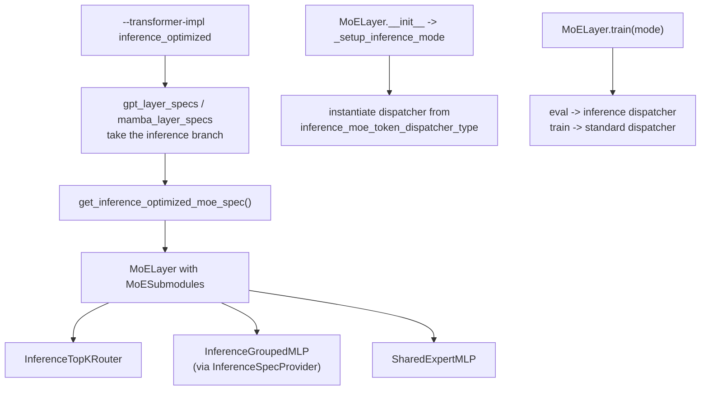

# MoE Inference: the `inference_optimized` Stack

The training MoE path is unusable for low-latency decode. Its AlltoAll dispatcher
does host synchronizations (`.item()`, `.tolist()`, `.cpu()`) that make CUDA-graph
capture impossible; the router computes z-loss, aux-loss, token-drop, and
expert-bias updates that are pure training overhead; and TE GroupedGEMM needs a
host-resident `tokens_per_expert`.

Rather than branch the training code, Siddharth forked a parallel inference
module hierarchy. Understanding that structure is most of what you need.

Source commits: `7d1c0168` (#3496, foundational), `905c0e38` (#3851),
`589cd9e1` (#3858), `bfd45740` (#4258, architectural rewrite), `442a936a` (#4570),
`20f09364` (#4603), `c817dad2` (#4587), `3a253ac5` (#4922).

## How the backend is selected



The load-bearing detail: **`MoELayer.train()` performs the swap.** Eval mode means
the inference stack is live. There is no per-iteration flag to set — the original
`set_inference_cuda_graphed_iteration` mechanism from #3496 was removed in #4258
precisely because manual plumbing was error-prone.

Relevant files: [backends.py](megatron/core/models/backends.py)
(`InferenceSpecProvider.grouped_mlp_modules`),
[moe_module_specs.py](megatron/core/models/gpt/moe_module_specs.py),
[moe_layer.py](megatron/core/transformer/moe/moe_layer.py).

### `--inference-grouped-gemm-backend vllm` is not the kernel vLLM runs

The flag name invites the wrong conclusion. The mapping is:

| value | kernel |
|---|---|
| `vllm` | vLLM's **Triton** `_fused_moe_kernel` |
| `flashinfer` | FlashInfer **`cutlass_fused_moe`** |
| `torch` | `torch._grouped_mm` |

vLLM itself, on a BS256 MoE decode step, does **not** dispatch to its Triton
kernel — it runs CUTLASS/TRT-LLM `bmm_Bfloat16_..._t128x8x128...`, whose N-tile
of **8** is shaped for the handful of tokens each expert sees during decode. So
selecting `vllm` reproduces vLLM's *slower* path while believing you matched it.
On one matched pair this cost **25.2 vs 10.7 µs/kernel at identical launch
counts** — 2.35×, the single largest row in the gap table.

Two consequences worth internalizing:

- **Identical launch counts with a large Δ means kernel selection, not fusion.**
  Check the kernel *names* on both sides before reaching for a fusion lever;
  `forward_pass.py`'s `µs/kernel` column versus `#` column is the tell.
- **The CUTLASS path is gated shut for gated activations.**
  `transformer_config.py` rejects `flashinfer` whenever `gated_linear_unit` is
  set, so every SwiGLU/GeGLU model — Qwen3 included — is excluded from it *by
  validation, not by kernel capability*. That same restriction is why mcore pays
  a standalone `_silu_mul_bounded_kernel` per layer while vLLM shows **zero**
  activation kernels (its CUTLASS epilogue fuses SwiGLU). Treat the GEMM and the
  activation as **one** lever: measured together they were 3137 vs 1026 µs/step,
  3.06×, 35% of the whole engine gap.

## What each replaced component does differently

### `InferenceTopKRouter`

In [router.py](megatron/core/transformer/moe/router.py). Strips z-loss,
aux/load-balance loss, token drop, and expert-bias updates. It is
`@torch.compile`d, and it returns **dense** `[num_tokens, topk]` tensors rather
than sparse `[num_tokens, num_experts]`, which is what the fused GEMM kernels
want.

`moe_router_dtype` must be `fp32` — enforced as a hard config error specifically
to avoid a dtype conversion on every decode step.

### `InferenceGroupedMLP`

In [experts.py](megatron/core/transformer/moe/experts.py). Three things matter:

**Stacked contiguous weights.** TE stores per-expert `weight0..weightN`; grouped
GEMM wants one `[num_experts, out, in]` tensor. Built lazily on first forward and
shared by pointer, never by replacing the `Parameter` — see hard rule 7 in
[SKILL.md](../SKILL.md).

**GPU-resident expert offsets.** Grouped GEMM needs to know where each expert's
token block starts and ends. The training path gets that from a host-resident
`tokens_per_expert`; the inference path computes it entirely on device. Commit
#3496 used `tokens_per_expert.cumsum(0)`; it is now a Triton prefix-sum kernel in
[permute.py](megatron/core/inference/moe/permute.py) that also folds in the
per-expert alignment rounding:

```python
h = tl.load(tokens_per_expert_ptr + r, mask=mask, other=0)
# Round up non-zero counts to alignment boundary
if alignment > 1:
    h = tl.where(h > 0, ((h + alignment - 1) // alignment) * alignment, h)
inc = tl.cumsum(h, axis=0)
tl.store(exclusive_offsets_ptr + r, inc - h, mask=mask)
tl.store(inclusive_offsets_ptr + r, inc, mask=mask)
```

The inclusive offsets are passed straight through as `offs` to `grouped_mm` /
`scaled_grouped_mm`, so no expert boundary ever touches the host.

**Backend dispatch** on `inference_grouped_gemm_backend`: `vllm` (default),
`flashinfer`, or `torch`. MXFP8 requires `torch`, because
`scaled_grouped_mm` is the only path supporting blockwise 1x32 scaling. Note the
alignment constraint that falls out of combining requirements:

```python
# scaled_grouped_mm requires each expert's token count aligned to 32,
# but swizzled MXFP8 scales require alignment to 128. Use 128 to
# satisfy both constraints.
expert_alignment = 128
```

For BF16 decode on GB200, all three backends were measured against each other and
**`vllm` won**, so the default is also the fast path — but the two rejections are
informative rather than obvious:

- **`torch`** (`grouped_mm`, cuBLAS) measured **0.82×**. Reach for it only when
  MXFP8 forces it.
- **`flashinfer`** (`cutlass_fused_moe`) measured **90.81 µs against 83.63 µs** for
  the retuned Triton path — 8% slower. Getting to that number first required fixing
  two independent wiring bugs: an `ActivationType` mis-map that hard-fails, and a
  gate/up ordering mismatch that **silently corrupts numerics**. Note the shape of
  that second one — a backend can be wired wrongly and still run.
- **`trtllm_bf16_routed_moe`**, the TRT-LLM-Gen kernel vLLM actually wins with,
  cannot currently be dropped in at all: `weight_layout=MajorK` is rejected
  (`BF16 Moe: weight_layout must be BlockMajorK`) and `BlockMajorK` indexes
  `size(3)`, i.e. it requires **4-D pre-shuffled block-major** weights against
  mcore's 3-D `[E, 2*ffn, H]`. The blocker is the weight-preparation pipeline, not
  the kernel or the EP contract.

## Dispatchers: NCCL AllGather vs NVLS AllGather-V

Both live in
[token_dispatcher_inference.py](megatron/core/transformer/moe/token_dispatcher_inference.py)
under `InferenceAllGatherDispatcherBase`. Selected by
`inference_moe_token_dispatcher_type`.

The progression is worth understanding because it explains why the default is
what it is. AlltoAll was replaced by AllGather/ReduceScatter for graph
friendliness. But a fixed AllGather requires every EP rank to contribute the same
token count, so ranks pad to the global max — wasted compute and communication —
and the original version only worked with decode-only graphs, forcing prefill to
run eager. AllGather-V removes the equal-count requirement.

| | `nccl` | `nvls` (default) |
|---|---|---|
| Token counts across EP | Must be equal on the graph path | Variable per rank |
| Non-decode CUDA graphs | Disabled | Supported |
| Padding | Pads to max, then compacts | None |
| Requires | Nothing special | Hopper+, NVLink, bf16, 16-byte-aligned |

Choose `nccl` only when NVLS is unavailable. It is the correctness fallback, not a
tuning option.

### NVLS eligibility

Checked centrally so the conditions live in one place:

```python
# megatron/core/inference/communication/torch_symm_triton/utils.py
def are_tensors_nvls_eligible(*tensors: torch.Tensor) -> bool:
    """
    Requirements:
    - Hopper+ GPU (SM >= 9)
    - All tensor byte sizes are divisible by 16 (128-bit), since NVLS
      kernels process data in 128-bit chunks.
    """
    if not tensors:
        return False
    return is_device_nvls_capable(tensors[0].device) and all(
        t.element_size() * t.numel() % 16 == 0 for t in tensors
    )
```

If you add a collective, call this rather than re-deriving
`dtype == bf16 and device.major >= 9`. Centralizing it was part of #3496.

### Why symmetric memory and multimem win

`multimem.st` / `.ld` / `.red` operate on a symmetric-memory buffer mapped across
NVLink. For the small, latency-bound messages of decode:

- A multicast store *is* the all-gather — one kernel, one end barrier, versus
  NCCL's multi-step algorithm.
- Multiple tensors fuse into one kernel and one barrier. The dispatch of
  `routing_map`, `probs`, and `hidden` went from 3 collectives to 1.
- Reduce-scatter accumulates in fp32 then casts, so results are *exactly*
  reproducible — the unit tests assert `atol=0, rtol=0`. **But the fp32 *buffer* is
  not part of that guarantee, and it is expensive** — see below.
- Buffers are fixed-address, hence graph-safe.
- CTA count is tunable, so the collective can be throttled to share the GPU with
  overlapped compute.

Buffers come from `SymmetricMemoryManager` in
[symmetric_memory.py](megatron/core/inference/symmetric_memory.py), a lazy
registry keyed by string (`"tp"`, `"ep"`). Lazy specifically so there is no
init-ordering coupling with the context — the eager version broke the RL
integration.

### Audit the dtype of every symmetric buffer: the combine buffer was fp32

The `ep_rsv` reduce-scatter buffer was allocated fp32 while the tensor it carries is
bf16 everywhere on both sides of the collective. That single dtype **cost 2.5%
end-to-end** (measured, `MCORE_NVLS_RS_BF16=1`, Qwen3-30B-A3B EP4 / 4×GB200,
2026-08), in two ways at once:

- It doubled the NVLink bytes of the largest collective in the step.
- It forced a bf16 cast on the output, one per layer — 23.9 launches/step of
  otherwise unattributed `elementwise_kernel`, on the serial chain.

The precision argument for fp32 here is weaker than it looks: `multimem.ld_reduce`
**accumulates in f32 internally even with bf16 operands**, so the reduction order and
accumulator width are unchanged by the buffer dtype. What changes is only the width of
the operands crossing the wire, and vLLM crosses that same wire in bf16. The
`atol=0, rtol=0` unit-test guarantee is about the fp32 *accumulator*, and it survives.

**Generalizable:** a collective's buffer dtype is a per-step bandwidth decision, not a
numerics decision, and it is easy to over-specify at allocation time where nobody
re-reads it. Audit every symmetric and collective buffer against the dtype of the
tensor actually being moved, and against what the reference implementation moves. A
cast kernel sitting immediately after a collective is the tell — see *Name a kernel by
its neighbours* in [measuring.md](measuring.md).

## Fusing the metadata update

Per-step metadata (`valid_tokens`, `rank_token_offset`, `ep_max_tokens`) used to
take five kernels plus a NCCL all-gather. `fused_metadata_update` in
[metadata.py](megatron/core/inference/moe/metadata.py) does it in one Triton
kernel that multicast-stores the local count, barriers, then computes all three
in place. From its docstring:

```
Replaces the multi-kernel sequence:
    dist.all_gather_into_tensor(...)   # NCCL
    local_tokens_per_rank.sum()        # kernel
    local_tokens_per_rank[:rank].sum() # kernel
    local_tokens_per_rank.max()        # kernel
    _step_metadata.copy_(...)          # kernel
with a single Triton kernel ...
```

**Generalizable:** a chain of tiny reductions over a handful of values is all
launch overhead. If you see several sub-microsecond kernels in sequence, they are
one kernel.

## Buffers are allocated once, at model init

`allocate_buffers()` is a classmethod called at model init from the dynamic
context, never inside a captured graph. Everything downstream operates on
max-sized buffers and gates work by a single fixed-address scalar
`_valid_tokens_tensor`. Expert output is written *directly* into the
reduce-scatter symmetric buffer via `out=`, avoiding a copy before the collective.

## Padding must not reach an expert

CUDA-graph replay pads the token dimension to the captured size. Those rows carry
garbage routing indices, and before `3a253ac5` they were dispatched to real
experts — wasted GEMM work and potentially corrupted reductions.

The fix publishes a fixed-address GPU scalar `real_token_count` each step, and a
Triton kernel writes `-1` into every topk slot of the padded rows:

```python
# Mask out CUDA-graph padding rows of the local routing map so the AGV
# propagates -1 into agv_r for those slots; padding tokens then route
# to no expert.
if self.__class__._real_token_count_tensor is not None:
    mask_routing_padding(
        self.routing_map, self.__class__._real_token_count_tensor, self.sp_rank
    )
```

Two subtleties: the count is in the *global* frame, so `sp_rank` shifts local rows
for the comparison; and on capture or dummy steps `real_token_count` is set to 0
so *all* rows are masked.

The complementary rule is in the activation and reduction kernels — skip rows
where `permutation_map == -1`, and do not *zero* rows past `valid_tokens`, since
downstream only reads the valid prefix. Commit `20f09364` removed exactly such a
zeroing pass from `moe_sum`.

## Tune for the typical batch, not the buffer

The vLLM-derived grouped GEMM originally used `@triton.autotune` over 25 configs.
That meant long compile times and, worse, tile choices made for the wrong batch
size. It was replaced with vLLM's host-side heuristic:

```python
# megatron/core/inference/moe/vllm_fused_moe.py
def _get_default_config(M: int, E: int, top_k: int) -> dict:
    """
    M here is the host-side token-count hint (``num_tokens_hint`` in
    ``vllm_fused_moe``), NOT ``hidden_states.size(0)``. The hint is the
    expected per-step token count; the worst-case buffer size would over-tune
    for prefill on every decode step.
    """
    # BLOCK_SIZE_M: shrink at small M to limit per-expert padding waste.
    if M <= 32:
        block_m = 16
    elif M <= 96:
        block_m = 32
    elif M <= 512:
        block_m = 64
    else:
        block_m = 128
```

The grid is sized from the same hint; on rare prefill spikes each CTA strides over
extra tiles via `tl.range` — correct, with reduced parallelism, which is the right
trade for a rare case.

**Generalizable:** buffers are sized for the worst case, but kernels should be
*tuned* for the common case. Pass an explicit `num_tokens_hint` rather than
inferring from `tensor.size(0)`.

### One shared config cannot serve both expert GEMMs

vLLM's heuristic is the right starting point, not the end of the tuning. It returns
**one** config, but FC1 and FC2 have different output widths — on Qwen3-30B-A3B,
N=768 for FC1 against N=2048 for FC2 — and they want *opposite* `BLOCK_SIZE_N`. A
single shared config cannot express that, so one of the two GEMMs is always
mistiled.

Splitting into per-GEMM decode-tuned configs (`config_fc1` / `config_fc2`) took
expert-GEMM device time from 77.65 to 61.89 µs (**1.255×**), the whole MoE call from
100.64 to 84.31 µs, and delivered **+4.32% end-to-end** — the largest single win of
that campaign, from tuning alone, after a roofline gate had shown a hand-written
CUTLASS kernel could not beat it (see
[decision-gates.md](decision-gates.md)).

Two details worth copying:

**It can be bit-exact.** Changing `BLOCK_SIZE_M` / `BLOCK_SIZE_N` while leaving
`BLOCK_SIZE_K` **unchanged** preserves the fp32 K-reduction order, so the output is
bit-identical (max abs diff 0.0). Retuning K would not be. This makes tile tuning
the cheapest possible optimization to validate — reach for it first.

**Tuned tiles have a range, so gate them.** The tuned configs measured
1.289× / 1.197× / 1.120× / **0.952×** at 128 / 256 / 384 / 512 tokens — a 5%
*regression* at the top of the intended range. Fall back to the default heuristic
above the token count you actually tuned for (384 here, not 512). Always measure the
upper edge of a tuned range; a win at the decode point can hide a loss just past it.

### Two built-in fusion flags do not work on this path

`--moe-router-fusion` and `--moe-permute-fusion` look like free wins and are the
first thing anyone tries. Under `--transformer-impl inference_optimized` both crash:

```
AssertionError: hidden_size mismatch: 128 vs 8
```

TE's fused router emits a **dense `num_experts`-wide routing map** (128), while
`InferenceTopKRouter` produces the **dense top-k** contract (8) that the vLLM/NVLS
dispatcher consumes. The built-in fusions are wired to the training MoE path only. A
hand-written fused softmax+top-k that honors the top-k contract *is* worth building
— doing so collapsed four kernels into one, 16.41 → 4.10 µs under replay, for
**+3.89% end-to-end**, with bit-exact probabilities and identical expert sets.

## Overlapping the shared expert

The shared expert (a dense FFN over every token) is independent of the routed
path, so it can run concurrently with dispatch, expert GEMMs, and combine. Launch
it on a side stream in `dispatch_preprocess` and join in `combine_postprocess`:

```python
if self.shared_experts is not None and not self._external_shared_expert_launch:
    stream = SharedExpertMLP.stream
    stream.wait_stream(torch.cuda.current_stream())
    with torch.cuda.stream(stream):
        self._shared_expert_output = apply_module(self.shared_experts)(hidden_states)
```

Only enabled for `nvls` plus `use_shared_expert` plus `moe_shared_expert_overlap`.

**Latent MoEs** (SuperV3, UltraV3) run experts in a projected latent dimension,
but the shared expert needs full hidden dim, so it sits outside the dispatcher's
view. There, `MoELayer.preprocess`/`postprocess` own the launch and the add, and
the dispatcher is told `_external_shared_expert_launch = True`.

### A cautionary tale on overlap tuning

Commit `442a936a` capped the AllGather-V to 16 CTAs when overlapping, so the
collective would not starve the shared-expert GEMMs on the side stream. Commit
`9b4074b` **removed that cap** — on Nemotron it measured net worse.

Overlap tuning is model- and shape-specific. Re-measure per model; do not copy a
CTA cap forward on the assumption it generalizes.

## Reduce how often you synchronize

`ep_consensus_interval` (default 20) skips EP consensus all-reduces while the
engine is busy, running them immediately only when idle so new arrivals are still
picked up promptly. Same instinct as everything else here: the collective was not
slow, it was just happening more often than the semantics required.

## Exposed comm is partly skew, and skew is a routing problem

Before optimizing an exposed collective, split its cost into what the collective
intrinsically costs and what is **other ranks arriving late**. On Qwen3-30B, of
1060 µs/step of exposed EP communication, 632 µs was intrinsic and **428 µs was
inter-rank skew** — ranks blocked at the barrier waiting on the slowest rank's
expert GEMM.

That 428 µs is not addressable by any change to the collective. It is expert load
imbalance, surfacing at the one place in the step where ranks must agree. The
diagnostic is `moe_enable_routing_replay` plus a histogram over
`DynamicInferenceRequest.routing_indices` (see [measuring.md](measuring.md)) — if a
few experts are hot, the fix is on the routing side.

Full decomposition method, including why the barrier itself is a hardware floor, is
in [decision-gates.md](decision-gates.md).

## Correctness guards

- Assert the inference router selects the **same experts** as the training router.
- Capture dispatch and combine in a real CUDA graph and compare against the
  global buffer with `atol=0, rtol=0` — NVLS results are bit-exact, so any
  tolerance would hide a bug.
- Config-rejection tests for unsupported combinations (expert-TP, non-fp32 router
  dtype, capacity factor, GLU, FlashInfer + MXFP8).
- `TestMaskRoutingPadding` covers the padding mask including SP-rank offset and
  the fully-masked rank.

Tests live in `tests/unit_tests/inference/test_moe_dispatching_and_routing.py`,
`test_moe_permute.py`, `test_vllm_fused_moe.py`, `test_hybrid_moe.py`.
